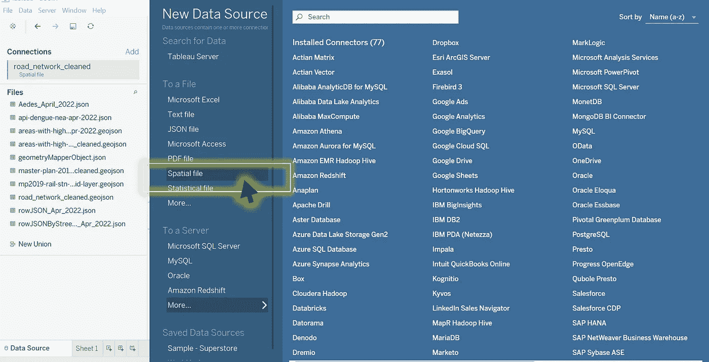
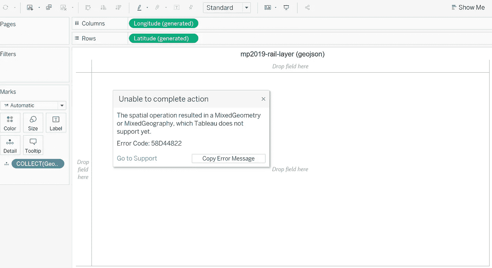
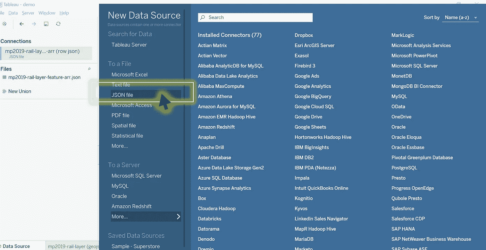
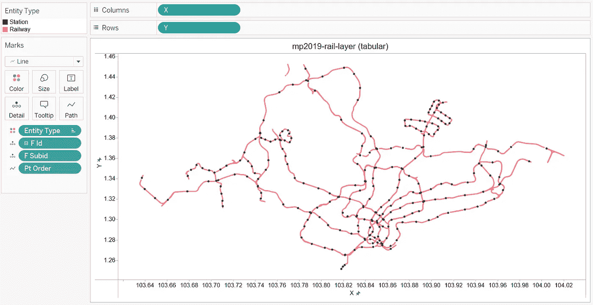

# 如何在 2 个简单的步骤中在 Tableau 中渲染混合几何类型

> 原文：<https://towardsdatascience.com/how-to-render-mixed-geometry-types-in-tableau-in-2-simple-steps-27b56a2153c4>

## 没有 LOD 计算。用 JavaScript 将空间数据集转换成表格格式。包括完整的代码片段。

近年来， [Tableau](https://www.tableau.com/learn/whitepapers/wisdom-crowds-business-intelligence-market-study) 凭借其在市场上的高采用率，一直是顶尖的数据分析工具之一。毫无疑问，其商业成功的一个显著原因是其为用户无缝集成多种数据格式的多功能性。



作者截图|浏览 Tableau 的数据源选择页面|注意“空间文件”在这里被突出显示(稍后将详细说明)

例如，Tableau 广泛的数据选择菜单包括一个名为**“空间文件”**的选项，其中所述文件类型通常作为地图可视化显示在仪表板中。一个典型的例子是作为包含地理信息的 [JSON](https://www.json.org/json-en.html) 对象存储在文本文件中的[geo JSON](https://geojson.org/)feature collection。

*(注意:所有 GeoJSON 对象都遵循以下约定。)*

```
{ 
   "type": "FeatureCollection",
   "features": [
      { 
         "type": "Feature",
         "geometry": {...},
         "properties": {...}
      }
   ]
}
```

> 尽管 Tableau 能够读取地图数据集，但一个明显的限制是它无法从单个空间数据源呈现多种几何对象类型— `Polygon` `MultiPolygon` `Point` `MultiPoint` `LineString` `MultiLineString` `GeometryCollection`。

相反，Tableau 用户通常会遇到以下错误消息:



Image by Author |导入同时具有线串和点几何类型的空间文件时，Tableau 显示错误

# 用例:新加坡国家铁路的地理空间可视化

**注:**触发上述错误的完全相同的 GeoJSON 文件将用于后续演示。

原始文件可在[SG-rail-layer . geojson](https://gist.githubusercontent.com/incubated-geek-cc/913233128d13e34263dbb2077149d5b6/raw/42f921b06fbd896215b6e75046349caef58bdf13/sg-rail-layer.geojson)|以上 geo JSON 输出由从[https://data.gov.sg/](https://data.gov.sg/)提取的两个特定原始数据源**【1】**和**【2】**合并而成(参见以下引用)

## 原始数据源:

**【1】**从[总体规划-2019-铁路线层](https://data.gov.sg/dataset/master-plan-2019-rail-line-layer)(上传于 2020 年)中检索，并于 2022 年 6 月 6 日访问，根据[新加坡开放数据许可证](https://data.gov.sg/open-data-licence)的条款提供

**【2】**从[总体规划-2019-铁路-车站-图层](https://data.gov.sg/dataset/master-plan-2019-rail-station-layer)(上传于 2020 年)中检索，并于 2022 年 6 月 6 日访问，根据[新加坡开放数据许可证](https://data.gov.sg/open-data-licence)的条款提供

# 实施细节

> 实质上，为了绕过上述问题，另一种方法是将地理空间信息作为单一记录(即表格格式)输入 Tableau，以取代其原始格式。

将行记录导入 Tableau 不仅可以消除任何类似或相关的错误，还可以按预期有效地读取和呈现。

*(注意在本文中，表格数据格式的选择应为* ***基于行的 JSON*** *)。其他表格格式，如 excel 或 CSV 格式也可以。)*

> *数据转换过程总共有* ***2 个步骤*** *。*

## 第一步。提取所有嵌套的几何体对象

如前所述，存在的各种类型的几何体对象有— `Polygon` `MultiPolygon` `Point` `MultiPoint` `LineString` `MultiLineString` `GeometryCollection`

因此，该步骤的主要目标是分解这些嵌套几何图形的粒度，使得 GeoJSON 对象中只存在`Polygon` `Point` `LineString`。完成这项工作的 JavaScript 代码片段如下(`uncombineGeometriesInFeatureCollection(geojsonObj)`):

**参考消息:**输出的 GeoJSON 原始数据文件可从[SG-rail-layer-un combined . geo JSON](https://gist.githubusercontent.com/incubated-geek-cc/cd6e5a291c32c7a017d14e0a9582e762/raw/ea709042f8310bb9ff2a31180d75c3f2cce59068/sg-rail-layer-uncombined.geojson)中检索

## 第二步。将所有要素对象转换为对象数组

此后，`transformFeatureCollectionToRowJSONObj(inputGeojsonObj)`下面的 JavaScript 代码片段遍历每个 feature 对象并生成相应的行记录:

## 解释:

*   字段`F_ID`被附加到每个特征，以便将其“父特征”标识为单个行记录
*   因此，当在 Tableau 中读取时，每个未合并的要素(例如，多面到面)被标记为字段`F_SUBID`作为其单独的标识符
*   每个几何体对象都包含一个深度不同的坐标数组(取决于几何体类型)
*   因此，每个坐标对必须作为单行记录输出**，以便以表格格式正确解释(1 个坐标对= 1 行记录)**
*   对于每个特征对象，除了 **6 个字段** — `F_ID` `F_SUBID` `Geometry Type` `PT_ORDER` `X` `Y`之外，生成`properties`对象中的字段，并作为每个坐标对的 JSON 对象输出

```
var obj = {
  "F_ID":0, // Parent feature ID
  "F_SUBID":0, // Nested Geometry ID (before being unmerged)
  "Geometry Type":"", // Point,Polygon or LineString
  "PT_ORDER":0, // Position in array of Geometry Coordinates
  "X": 0, // longitude
  "Y": 0 // latitude
};
var rowObj = {
  ...JSON.parse(JSON.stringify( <properties obj> )), // deep copy
  ...obj
};
```

代码成功运行后，产生的输出将是一个`rowObj`数组，该数组随后可以用**存储在一个单独的文件中。json** 文件扩展名。

# 概念验证—展示 Tableau 输出

为了测试空间数据是否被正确转换，在 Tableau 数据选择菜单上，将文件作为**“JSON 文件”**导入:



作者截图|“JSON 文件”选项在菜单选项列表中被选中，而不是“空间文件”

如下图所示放置每个尺寸后，所有几何对象(即线串和点)将继续渲染**新加坡的火车站和铁路网**:



作者截图| Tableau 中 JSON 输出的显示。请注意，在“标记”面板中，选择了“线条”而不是“地图”

## **参考消息:**以上 Tableau 文件可以从 Tableau Public 的链接下载🔗[表格中混合几何类型的演示](https://public.tableau.com/views/DemonstrationofMixedGeometryTypesinTableau/mp2019-rail-layertabular?:language=en-US&:display_count=n&:origin=viz_share_link)(最好在桌面/PC 监视器设备上观看)

## 请随意调整它或使用您自己的用例的所有代码片段！🙃

现在你知道了！非常感谢你坚持到这篇文章的结尾！❤希望你觉得这篇文章有用，如果你想了解更多地理信息系统(GIS)、数据分析&网络应用相关的内容，请随时[关注我的媒体](https://medium.com/@geek-cc)。会非常感激—😀

— 🌮[请给我买个玉米卷](https://www.buymeacoffee.com/geekcc) ξ(🎀˶❛◡❛)

<https://geek-cc.medium.com/membership>  

## 要了解更多 Tableau 技巧和变通方法，请随意查看下面的文章列表:

</how-to-plot-a-custom-map-image-on-tableau-dashboard-in-just-3-easy-steps-no-calculations-required-8db0d41680c4>  </leverage-on-d3-js-v4-to-build-a-network-graph-for-tableau-with-ease-cc274cba69ce>  </selective-formatting-of-numbers-in-tableau-f5035cc64b68>  </5-lesser-known-tableau-tips-tricks-hacks-with-use-case-demo-463f98fbdc7e>  </superscript-and-subscript-in-tableau-why-and-how-you-can-implement-it-764caf0cc932>  </underrated-combined-functionalities-of-tableau-point-linestring-polygon-mapping-b4c0568a4de2> 