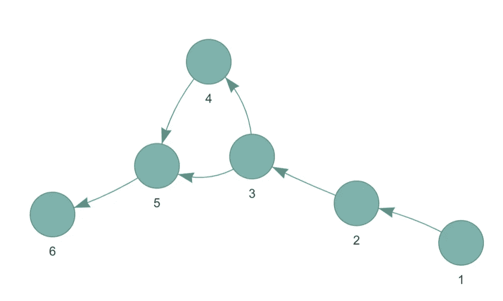
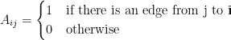
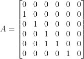
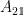
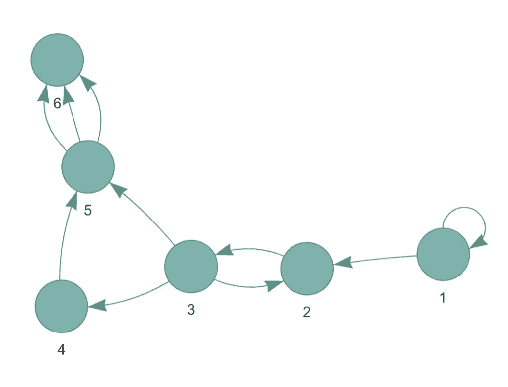
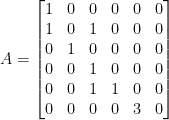
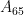

# 如何将有向图表示为邻接矩阵

> 原文：<https://towardsdatascience.com/how-to-represent-a-directed-graph-as-an-adjacency-matrix-d4e8135c2fe4>

## R 中的示例


照片由艾丽西娅鲍威尔，Pixistock。

图表是以直观的方式展示高维数据的绝佳方式。但是当涉及到用矩阵来表示图形时，可能就不那么直观了。在前面的中，我们看到了如何将一个*无向图表示为一个邻接矩阵。在本教程中，我们将着眼于把*有向图*表示为邻接矩阵。*

与无向图不同，有向图具有方向性。这通常由从一个节点到另一个节点的箭头表示，表示关系的方向。Twitter 和 Instagram 是有向图的极好例子，因为你可以跟踪一个人，而他们不会跟踪你。现在，让我们开始看看*如何用邻接矩阵来表示有向图。对于本教程，我们将使用 **visNetwork** 包，我们将从查看一个没有回路或自边的有向图开始。*

# 示例 1:没有回路的小型有向图

首先，我们将为 **visNetwork** 创建一个*节点*数据帧来初始化我们的网络节点。我们的网络将由 6 个节点组成，标记为 1 到 6。然后，我们将创建一个 *edges* 数据框来添加节点之间的关系。为了确保网络是定向的，*边*数据帧将有一个*箭头*列表示关系的方向。在本例中，所有关系都将从*的*列流向*的*列。最后，我们将使用 **visNetwork()** 绘制我们的网络。

```
library(visNetwork) # Create nodes dataframe for visNetwork. 
nodes <- data.frame (id = 1:6, label = 1:6, 
                     color = rep('#8BB1AB', 6)) # Create edges dataframe for visNetwork. 
edges <- data.frame(from = c(1, 2, 3, 3, 4, 5), 
                    to = c(2, 3, 4, 5, 5, 6), arrows = 'to') # Plot network using visNetwork. 
visNetwork(nodes, edges) %>% visOptions(highlightNearest = TRUE, 
           nodesIdSelection = TRUE)
```



作者图。

类似于我们对无向图所做的，我们让邻接矩阵的行和列代表节点或顶点。这将产生一个正方形矩阵。然而，与无向图不同的是，1 表示从列 j *到*行 I 的箭头。注意:你可以反过来看，箭头从列 I 到行 j。确保你知道使用的是哪个版本。



对于上图，邻接矩阵如下所示:



由于从节点 1 到节点 2 有一条边，我们在中看到 1



(第 2 行，第 1 列)。这种方向性经常导致不对称矩阵。此外，我们可以看到对角线完全由零组成，因为从任何节点到其自身都没有边。现在，让我们看一个例子，我们有循环和多边。

# 示例 2:带有回路和多边的小型有向图

在本例中，我们将保留上面的*节点*数据框，但指定一个新的边数据框。因为我们想要循环，我们将有一个从 2 到 3 的关系*和从 3 到 2 的关系*，给我们一个循环。我们将创建的第二种循环是自我边缘，其中关系循环回到自身。我们将通过使关系从 1 *到*1*来建立与节点 1 的自边。最后，我们将把所有新的关系存储在一个名为 *edgesMessy* 的数据帧中。*

```
# Create new edges dataframe for visNetwork. 
edgesMessy <- data.frame(from = c(1, 2, 3, 3, 4, 5, 1, 3, 5, 5), 
                         to = c(2, 3, 4, 5, 5, 6, 1, 2, 6, 6),
                         arrows = 'to') # Plot network using visNetwork. 
visNetwork(nodes, edgesMessy) %>% 
      visOptions(highlightNearest = TRUE, nodesIdSelection = TRUE)
```



作者图。

这里，邻接矩阵如下所示:



请注意，循环表示为 1。对于有向图来说，每一个有向关系都是计数的，并且回路只有一个有向关系。(如果节点 1 有两个环路，条目将是 2。)我们还可以看到，节点 5 和 6 之间有三条边。因此，



现在用 3 表示。

概括一下:

*   邻接矩阵总是正方形的
*   有向图的邻接矩阵并不总是对称的
*   没有回路的有向图在对角线上会有零点
*   无向图中的每个循环都用 1 表示
*   邻接矩阵可以解释多条边

*原载于 2022 年 2 月 16 日 https://thatdarndata.com*<https://thatdarndata.com/how-to-represent-a-directed-graph-as-an-adjacency-matrix/>**。**