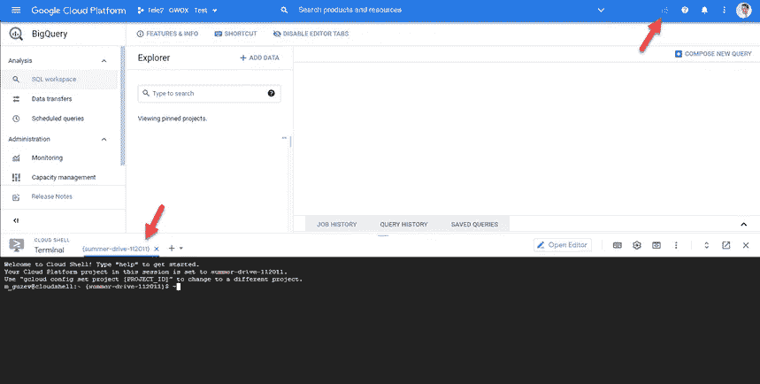
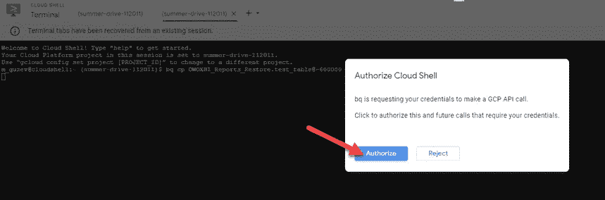
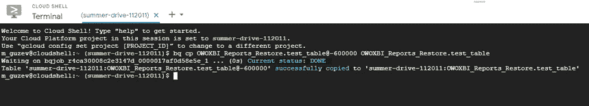
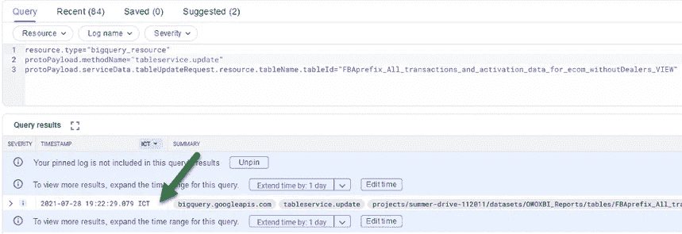
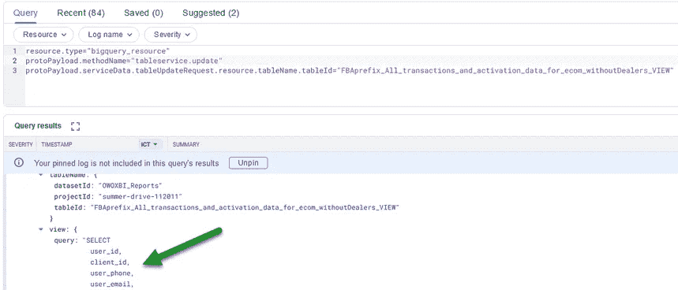
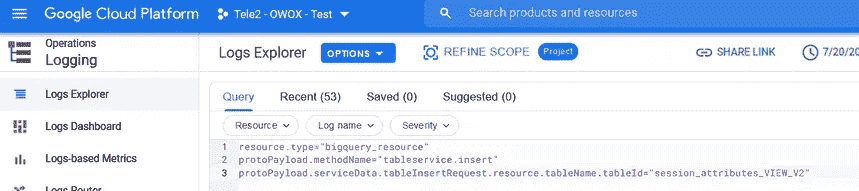
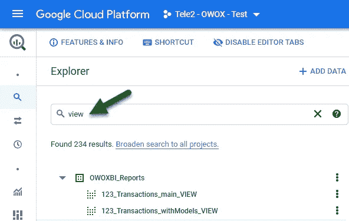

# 如何恢复 Google BigQuery 意外删除的数据

> 原文：<https://towardsdatascience.com/how-to-restore-data-accidentally-deleted-from-google-bigquery-1ec2a621149f>

## 详细说明，以帮助您恢复意外删除的数据，而不是提前获得任何白发

你有没有在 Google BigQuery 中不小心删除了一个重要的表、视图或者整个数据集？如果有，您知道您不能继续使用包含已删除数据的表和查询。

[OWOX 团队](https://www.owox.com)已经创建了一个详细的分步说明来恢复被删除的数据，以及一些步骤来防止将来出现类似的问题。

如果已删除的表自删除以来未超过七天，并且您知道其名称和从中删除该表的数据集的名称，则可以恢复该表。

要恢复表，请在 Google BigQuery 界面中打开云 Shell 命令行:



作者图片

输入以下命令:

```
bq cp mydataset.mytable@-3600000 mydataset.newtable
```

带有表名和数据集名的相同命令示例:

```
bq cp OWOXBI_Reports.123_Transactions_withModels@-13600000 OWOXBI_Reports_Restore.123_Transactions_withModels
```

其中:

*   owo xbi _ reports . 123 _ Transactions _ with models-是已删除的数据集和表。
*   owo xbi _ Reports _ restore . 123 _ Transactions _ with models-数据集以及要在其中还原数据的表的名称。
*   @-13600000 —过去的一段距离(13，600，000 毫秒前)，此时您要查找的表仍然存在。例如，如果一个表在 30 分钟前被删除，那么设置时间间隔@ -3600000 就足够了，这是一个小时前(60 秒×60 分钟× 1000)。

输入请求后，需要授权。单击授权按钮:



作者图片

该命令成功运行后，该表将被恢复:



作者图片

您将看到类似以下内容的文本:

```
Waiting on bqjob_r4ca30008c2e3147d_0000017af0d58e5e_1 ... (0s) Current status: DONE Table 'summer-drive-112011:OWOXBI_Reports_Restore.test_table@-600000' successfully copied to 'summer-drive-112011:OWOXBI_Reports_Restore.test_table'
```

# 如何恢复已删除的视图

您不能以上述方式恢复远程视图。那种方法只适用于表。

Google 支持建议使用日志浏览器来恢复已删除的视图。

要查找更新远程视图的查询，请在[谷歌云平台日志](https://console.cloud.google.com/logs/query)中运行以下查询:

```
resource.type="bigquery_resource" protoPayload.methodName="tableservice.update" protoPayload.serviceData.tableUpdateRequest.resource.tableName.tableId="custom_events_attribution_VIEW"
```

其中:

*   tableservice.update —是在日志中显示视图更新的命令
*   custom _ events _ attribution _ VIEW 视图的名称

在选择时间范围设置中，设置可对视图进行更改的时间段(例如，一年):


作者图片

执行该命令时，将显示更新了您正在查找的视图的所有查询。选择最后一个时间戳查询:



作者图片

从日志中复制查询并重新创建视图。



作者图片

此外，您可以找到创建您正在寻找的视图的查询(在此之前，我们搜索更新视图的查询)。为此，请使用以下命令:

```
resource.type="bigquery_resource" protoPayload.methodName="tableservice.insert" protoPayload.serviceData.tableInsertRequest.resource.tableName.tableId="query_name_VIEW"
```



作者图片

我们建议您设置尽可能长的时间来搜索日志中所需的条目。

如果视图是在开始记录日志之前创建的，则无法恢复。在这种情况下，我们上面描述的 tableservice.update 命令会有所帮助。

# 如何恢复已删除的数据集

如果您删除数据集，您将无法恢复它。您必须创建一个同名的新数据集，还原已删除数据集中的表和视图，并将它们移动到新的数据集中。

在删除数据集后的前 24 小时内，不能创建同名的新数据集，但仍可以找到属于已删除数据集的表和视图的名称。但是，表和视图本身将不再可见。

通过在 BigQuery 中搜索，可以按名称从已删除的数据集中查找视图:



作者图片

无法通过搜索找到表的列表，因为表的名称中没有公共组件。

若要从已删除的数据集中查找表名，请使用以下 SQL 查询。在查询中，指定可以修改表的时间段(creation_time BETWEEN)。因此，该查询将返回在哪个时间段内对其进行了更改的表。这些将是已删除数据集中的表。

```
SELECT 
  * 
FROM ( 
  SELECT 
    query, 
    user_email,         CONCAT(destination_table.project_id,".",destination_table.dataset_id,".",destination_table.table_id) AS destination_table, 
COUNT(job_id) AS job_ids, 
MAX(creation_time) AS lastUpdateDate 
FROM 
  region-us.INFORMATION_SCHEMA.JOBS_BY_PROJECT 
WHERE 
  creation_time BETWEEN TIMESTAMP_SUB(CURRENT_TIMESTAMP(), INTERVAL 180 DAY) 
  AND TIMESTAMP_SUB(CURRENT_TIMESTAMP(), INTERVAL 0 DAY) 
  AND state = 'DONE' 
AND CONCAT(destination_table.project_id,".",destination_table.dataset_id,".",destination_table.table_id) LIKE "%OWOXBI_Reports.%" 
GROUP BY 
  1, 
  2, 
  3 
ORDER BY 
  5 DESC)
```

作为请求的结果，您将收到以下信息:

*   查询-对 destination_table 进行更改的查询的文本
*   用户电子邮件—启动目标表更新请求的用户
*   destination _ table 已更新的表
*   job_ids —在指定的时间间隔内开始查询的次数(创建时间介于…)
*   last updatedate-查询的上次启动时间(MAX(creation _ time)AS last updatedate)

删除数据集 24 小时后，您可以创建一个同名的新数据集，并开始恢复表和视图。

# 如何防止将来出现类似问题

1.  当您开始使用项目时，在 Google BigQuery 项目中打开日志收集。
2.  不要将表命名为数据集，也不要将其视为数据集。
3.  仔细检查您想要从 Google BigQuery 中删除的任何表的名称。
4.  通过查询删除表，而不是通过用户界面。
5.  将实体类型添加到数据集、表和视图名称中。例如:

*   OWOXBI _ 报表 _ 数据集
*   OWOXBI_report_table
*   OWOXBI_report_view

您可以使用查询[删除表](https://cloud.google.com/bigquery/docs/managing-tables#deleting_a_table):

```
DROP TABLE `summer-drive-112011.OWOXBI_Reports_Restore.test_table`
```

您还可以使用查询[删除视图](https://cloud.google.com/bigquery/docs/managing-views#sql):

```
DROP VIEW `summer-drive-112011.OWOXBI_Reports_Restore.test_VIEW`
```

# 如果问题再次发生，如何缩小问题的规模

*   不要更改计划和 Google Apps 脚本中的查询；第二天，恢复所有视图和表，之后 Schedule 和 Google Apps 脚本将正常工作。
*   如果视图或表参与了属性模型的设置，您需要在将数据恢复到其先前位置后重新开始属性计算。

## 关于该主题的有用链接:

[恢复删除的表格](https://cloud.google.com/bigquery/docs/managing-tables#undeletetable)

[删除表格](https://cloud.google.com/bigquery/docs/managing-tables#deleting_a_table)

[管理观点](https://cloud.google.com/bigquery/docs/managing-views#sql)

[如何在 Google BigQuery 中即时恢复一个表](https://medium.com/@dhafnar/how-to-instantly-recover-a-table-in-google-bigquery-544a9b7e7a8d)