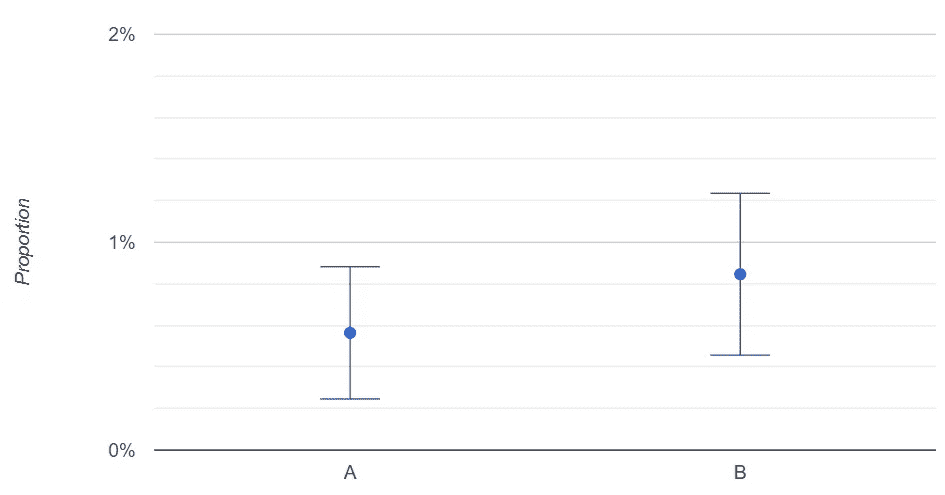
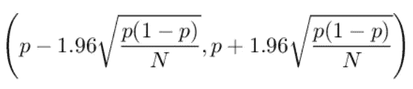
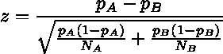

# 如何运行 A/B 测试

> 原文：<https://towardsdatascience.com/how-to-run-a-b-tests-709d73a5347a>

## 如何使用统计数据对比例进行 A/B 测试的简单指南

作者图片

如果你能不断测试不同的想法，在线营销和创业成长会更好。当我们必须进行 A/B 测试时，这个统计数字就派上用场了。通过适当的分析，你可能获得的结果会给你的项目带来巨大的推动。

# 什么是 A/B 测试？

公司经常需要将某项行动的结果与另一项行动的结果进行比较，以确定表现最好的行动。一般来说，经常需要检查一组可能的解决方案中哪一个是最佳解决方案。例如，如果您运行一份新闻稿，您可能希望测试同一封电子邮件的不同主题，然后选择打开率最高的主题。这就是 A/B 测试的总体思路。你把你的听众分成两个相等的部分:A 和 c。然后，你根据你要测试的项目(例如，你要测试的对象的数量)把 A 分成两个同样大小的子集。你得到了 A 和 B 子集。重要的是，所有这些集合不要重叠，并且它们必须在统计上相似(即，不能有任何特定的规则来区分彼此)。

然后，您将主题为 1 的电子邮件发送给 A，主题为 2 的电子邮件发送给 b。

一段时间后，您测量 A 和 b 的表现。表现最好的一组将会告诉您哪个选择是成功的。最后，您可以将带有获奖主题的电子邮件发送给受众 c。

# 如何比较 A/B 测试的结果

假设您的 A/B 测试给出了以下结果:

**数据集 A**

*   尺寸:2128
*   开口:12

**数据集 B**

*   尺寸:2128
*   开口:18

数据集 B 给出了比数据集 A 更多的正面事件，所以人们可以认为 B 是赢家。实际上 A 的开放率是 0.56%，B 的开放率是 0.85%。

我们应该选择 B 吗？嗯，当我们处理样品时，事情就不那么容易了。大数定律确保开盘价向其“真实”值收敛，但这些估计值来自样本，因此它们受到有限规模效应的影响。因此，它们的差异可能是由于随机效应，而不是 B 对 a 的真实有效性。

为了解决这个问题，我们必须进行统计分析。

为了统计比较这些数字，我们首先需要计算它们的置信区间，例如 95%的置信度。

我已经讲过比例的[置信区间的计算。总的想法是使用正态近似来计算我们估计的置信区间。](https://www.yourdatateacher.com/2021/05/31/how-accurate-is-your-accuracy/)

对于相当大的 *N* (通常大于 30)值，比例 *p* 的 95%置信区间为:

如果我们在数据集上进行这样的计算，我们得到 A 的置信区间是(0.25%，0.88%)，而 B 的置信区间是(0.46%，1.23%)。

让我们画出这些间隔，看看会发生什么。

置信区间对比图。图片作者。

正如我们所看到的，虽然 B 的平均值比 A 高，但置信区间彼此重叠。这是典型的有限尺寸效应，因为我们的样本当然是有限尺寸的。

这个图告诉我们，这两个度量在统计上是相似的，因为它们的置信区间重叠。所以，我们不能说 B 比 a 表现得更好。

为了达到显著性水平，我们可以使用正态近似法计算双尾 p 值。

首先，我们计算一个 *z* 变量的值。

在我们的例子中， *z* = -1.10

然后，我们计算双边 *z* 测试的 p 值，其零假设是比例相等。我们得到的值是 13.6%。所以我们可以说，如果比例相等，我们只能在 13.6%的实验中得到这样的极值。如果我们拒绝 p 值小于 5%的零假设，我们不能拒绝本例中的零假设。

我不喜欢使用 p 值，因为它们不能给我们一个明确的答案。相反，我更喜欢可视化置信区间，看看它们是否重叠。然而，如果你在一个广泛使用 p 值的环境中工作，你可以使用一个 *z* 测试来计算你的 p 值。

# A/B 测试清单

因此，这里有一个通用的 A/B 测试方法:

*   计算 A 和 B 的比例
*   根据以下公式计算置信区间
*   将它们可视化并验证它们是否重叠。如果置信区间重叠，你不能说比例在统计学上有差异。如果它们没有重叠，你可以有 95%的把握说它们是不同的

# 一个方便的网络应用程序

可以在 Python、R 甚至 Excel 中执行 A/B 测试。但是，如果您需要快速的结果，并且不想自己开发应用程序，我已经创建了一个简单的 [web 应用程序](https://www.yourdatateacher.com/a-b-tester/)，它将为您计算置信区间和 p 值。您可以在所有测试中随意使用它。

# 结论

A/B 测试是初创企业成长的标准方法。他们真的能够让一家初创公司迅速扩大规模，因为他们能够快速、成功地验证任何可能的想法。然而，为了从 A/B 测试中提取最大值，您必须始终使用正确的统计数据。

*原载于 2022 年 5 月 20 日 https://www.yourdatateacher.com***。**