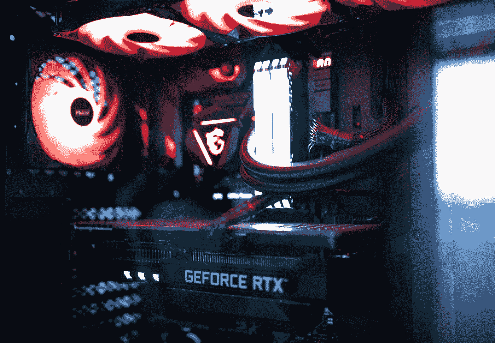
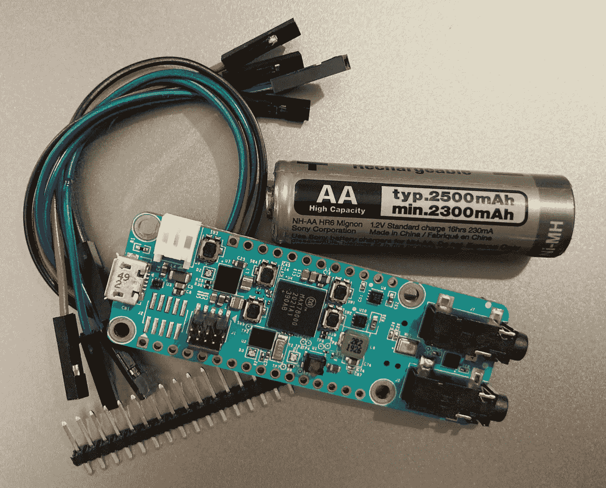

# 如何在 AA 电池上运行深度神经网络一周

> 原文：<https://towardsdatascience.com/how-to-run-a-deep-neural-network-on-a-aa-battery-for-a-week-75ac6247198e>

## 极限边缘深度学习的新硬件平台

当我们谈论深度学习和神经网络时，我们经常会想到谷歌 Colab 或最新的 Nvidia GPUs，它们可以兼作空间加热器。但与训练不同，深度学习推理可以发生在更简陋的平台上。有些卑微到甚至被认为是'[边缘计算](https://medium.com/swlh/what-is-edge-computing-d27d15f843e)'。

照片由[卡斯帕·卡米尔·鲁宾](https://unsplash.com/@casparrubin?utm_source=medium&utm_medium=referral)在 [Unsplash](https://unsplash.com?utm_source=medium&utm_medium=referral) 上拍摄

不，我们不是在这里谈论谷歌珊瑚边缘 TPU 板或英伟达杰特森纳米开发板。功耗在 5-10 瓦之间，与我们讨论的主题相比，它们仍然是耗电大户。但是如果你还想了解他们，你可以看看 Manu 的这个[详细对比。](/google-coral-edge-tpu-board-vs-nvidia-jetson-nano-dev-board-hardware-comparison-31660a8bda88)

我们正在谈论一个真正的极限边缘人工智能计算平台，它可以进行关键字检测和 [FaceID](https://www.youtube.com/watch?v=z2Gnyxs8kUk) ，同时消耗几毫瓦的功率。最接近的竞争对手将是低功耗的 ARM Cortex-M4 或 M7，它的速度要慢几个数量级，因此对于给定的任务，它需要更多数量级的能量。我们说的是 MAX7800x 系列的 AI 微控制器，在运行深度神经网络时，它的名字几乎和它的核心温度一样酷。

肯尼斯·乔尔的照片

先说 MAX78000 里的秘制酱。除了 ARM Cortex M4 主 MCU 和基于 RISC-V 的智能 DMA 之外，它还有一个由 64 个并行处理器组成的专用 CNN 加速器。是的，64。它还有一个基于 SRAM 的 432kB 重量存储器，可存储多达 350 万个重量(假设 1 位重量)，因此重量即使在部署后也可以更改。该加速器可用于实现多达 64 层的神经网络，每隔一层进行池化，或 32 层，每层最多 1024 个输入或输出。

这意味着，前向传播不是像在传统硬件上那样在三重嵌套矩阵乘法循环中串行运行，而是可以使用 CNN 加速器以更高的并行度运行。此外，虽然主要是一个 CNN 加速器，但它也可以用来实现传统的神经网络以及 RNNs。

深度学习工程师可能会将 64 层、40-350 万 param 神经网络描述为与其他现代网络相比*微小*，但在这些约束条件下仍然可以做很多事情。看看深度学习社区如何利用受约束的超参数进行创新将是一件有趣的事情。

最近推出的 MAX78002 更进了一步，几乎将 CNN 加速器的大部分规格增加了一倍。在不久的将来，我们只能期待持续的改进和更强大的加速器。

  

## 何时使用“人工智能微处理器”

*   确定性的低延迟性能是一个优先事项—完全离线实施不仅比需要网络连接的实施更快，而且更具确定性，因为它只取决于固定的硬件性能，而不是可能随带宽变化或有时完全失败的网络速度。
*   隐私和数据安全至关重要——如果您家中的音频和视频记录被实时传输到云端，您会有什么感受？当数据从未离开源时，它是最安全的。
*   *【金发女孩】*问题陈述——这个问题复杂到需要一个神经网络，但又简单到可以用一个相对简单的小网络来解决。

以下是一些符合上述标准的用例，大致分为三类:

**演讲和其他音频**

*   [关键词](https://www.maximintegrated.com/en/design/technical-documents/app-notes/7/7359.html) /不同域的安全词检测。使用 MAX78000 构建了能够识别多达 20 个独特单词的 CNN。
*   工业应用中基于音频的故障检测。机器运行时独特的声音信号可以传达很多关于其健康状况的信息，并证明对预测性维护非常有用。尤其是在像海上石油钻塔这样的偏远地区。

**计算机视觉**

*   远程视觉——在网络不可用的情况下的计算机视觉，例如在野生动物保护中——特别是动物跟踪和监视。一个仅在检测到特定动物时锁定的“[相机陷阱](https://github.com/MaximIntegratedAI/refdes/tree/main/maxrefdes178-WildLife)”将是一个有趣的解决方案，可以用 MAX78000 来构建。
*   制造—解决一个非常特殊的故障检测问题，在这种情况下，由于网络问题导致的停机是不可容忍的。
*   [视觉唤醒词](https://blog.tensorflow.org/2019/10/visual-wake-words-with-tensorflow-lite_30.html)’—人类存在检测已经在一些功能较弱的微处理器上实现，这可以扩展到包括凝视检测，这在家庭自动化中可能特别有用。
*   [FaceID](https://www.youtube.com/watch?v=z2Gnyxs8kUk)——使用 MAX78000，一个网络可以被训练为完全离线的 FaceID 系统识别多达 20 张人脸。

**其他传感器**

*   惯性传感器——实时活动识别和姿态检测问题变得越来越复杂，需要更强大的技术来提供见解。基于 LSTM 和 CNN 的 IMU 传感器融合算法就是这样一个例子
*   生物医学传感器——可以使用离线神经网络来检测来自可穿戴式心电图贴片或动态心电图监护仪的心电图信号中的心房颤动或其他异常。它还可以连接到多参数患者监护仪，并结合来自多个来源的数据，用于对患者病情恶化的早期洞察[。](https://www.nature.com/articles/s41598-019-51219-4)

借助 ADI 公司的这个 [Github 库](https://github.com/MaximIntegratedAI)，MAX7800x 系列的入门变得非常简单，该库包含 MCU 的 SDK 以及用于训练和综合您自己的定制模型的所有必要工具。

  

MAX78000 是一款真正独一无二的微控制器，将彻底改变我们所知的深度学习。随着 [ARM 宣布 ARM v9 将优先于 DSP 和 ML 硬件加速器](https://www.arm.com/company/news/2021/03/arms-answer-to-the-future-of-ai-armv9-architecture)，我们可以期待更多超低功耗深度学习技术。与 Ethos-U55 神经处理单元配对的新 ARM Cortex-M55 有望在基于现有 Cortex-M 的系统上实现 480 倍的 ML 性能提升。

  

深度学习已经是一个令人兴奋的领域，随着这些最新的硬件创新，我们可以期待它随着更广泛的应用而达到更高的高度。敬请关注 EdgeAI 和深度学习的更多思考！

**参考文献&链接**

https://www.youtube.com/watch?v=K-J-HAh4I5Q
Face ID 演示

参考设计(Camera Cube)[https://www . electronics weekly . com/news/products/bus-systems-sbcs/ai-Camera-reference-Design-runs-battery-includes-ai-hearing-2021-07/](https://www.electronicsweekly.com/news/products/bus-systems-sbcs/ai-camera-reference-design-runs-battery-includes-ai-hearing-2021-07/)
[https://www . mouser . in/new/maxim-integrated/maxim-maxref des 178-ai-reference-Design/](https://www.mouser.in/new/maxim-integrated/maxim-maxrefdes178-ai-reference-design/)

2020 年边缘计算公告[https://www . allaboutcircuits . com/news/2020-year-of-edge-ai-Compute/](https://www.allaboutcircuits.com/news/2020-year-of-edge-ai-compute/)

ARM v9 公告[https://www . ARM . com/company/news/2021/03/arms-answer-to-the-future-of-ai-ARM v9-architecture](https://www.arm.com/company/news/2021/03/arms-answer-to-the-future-of-ai-armv9-architecture)

cortex-M55+Ethos U55
[https://www.arm.com/products/silicon-ip-cpu/ethos/ethos-u55](https://www.arm.com/products/silicon-ip-cpu/ethos/ethos-u55)
[https://armkeil . blob . core . windows . net/developer/Files/pdf/product-brief/arm-Ethos-U55-product-brief . pdf](https://armkeil.blob.core.windows.net/developer/Files/pdf/product-brief/arm-ethos-u55-product-brief.pdf)