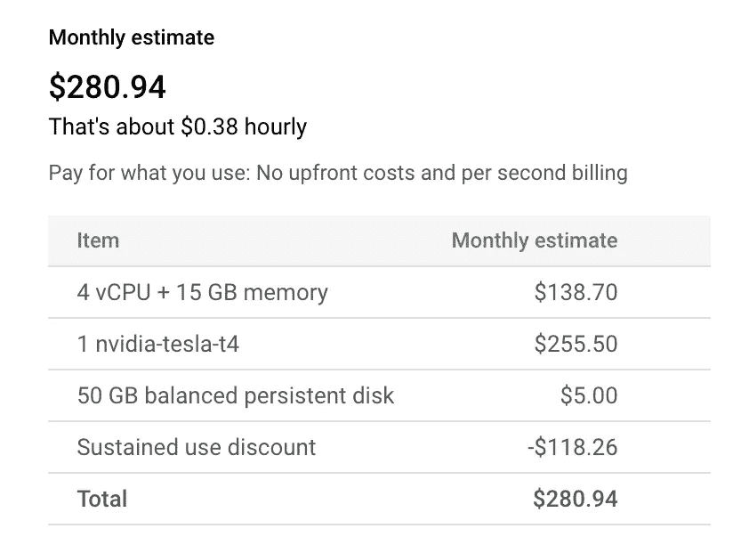
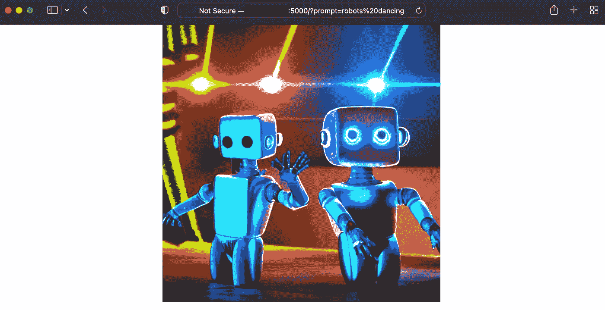

# 如何在谷歌云平台(GCP)上运行稳定的扩散服务器

> 原文：<https://towardsdatascience.com/how-to-run-a-stable-diffusion-server-on-google-cloud-platform-gcp-c879357808bf>

## 构建和部署 Flask 应用程序的分步指南

自从 [Stability.ai](http://Stability.ai) 在短短几周前发布了 stability Diffusion(他们的开源文本到图像模型)以来，ML 社区已经为它打开的大门而疯狂。作为 OpenAI 的门控 [DALL E 2](https://openai.com/dall-e-2/) 的开源替代品，稳定扩散为每个人提供了一些东西:最终用户可以几乎免费地生成图像，开发者可以将模型嵌入到他们的服务中，ML 工程师可以调查和修改代码，研究人员有充分的回旋余地来进一步推动最先进的技术。

尽管有大量关于如何利用稳定扩散的教程，但我自己找不到一个验证过的托管模型的方法。我的目标是从我的浏览器舒适地向我自己的服务发出 HTTP 请求。没有信用额度，没有登录的麻烦，没有人偷看我的照片。因此，我开始了为期一天的探索，在谷歌云上构建和部署一个稳定的扩散网络服务器。


人工智能生成的图像。左:[稳定扩散](https://stability.ai/blog/stable-diffusion-announcement)。右:[中途](http://midjourney.com)。通过[生成的提示简洁 AI](https://huggingface.co/succinctly/text2image-prompt-generator) :“棉花糖做的火在雨中跳舞的机器人，超逼真，真实感，4k，精致，辛烷渲染”。

这篇文章包括了我必须弄清楚的所有痛苦的小细节，希望它能节省你的时间。以下是一些高级步骤(我们将在下面更深入地探讨每一个步骤):

1.  确保你有足够的 GPU 配额
2.  创建一个连接了 GPU 的虚拟机
3.  下载稳定扩散和测试推断
4.  捆绑稳定扩散到烧瓶应用程序
5.  部署您的 web 服务器并使其可公开访问

# 1.确保你有足够的 GPU 配额

由于 GPU 仍然不便宜，谷歌对其 GPU 车队实行严格的管理，将有限的供应提供给最需要它的人，以及那些愿意付费的人。默认情况下，免费试用帐户没有 GPU 配额。要检查您的 GPU 配额:

`Navigation (hamburger menu) > IAM & Admin > Quotas`和`CTRL+F`表示“GPU(所有地区)”。如果您的限额为 0 或您当前的使用率为 100%，您将需要请求额外的配额。否则，您可以跳到下面的步骤 2。

要增加您的配额，请选择“GPU(所有区域)”行，然后单击`EDIT QUOTAS`按钮(控制台的右上角)。对于本教程，您将需要一个单一的 GPU，所以增加您的配额 1。请注意，您必须在您的请求中包含一个理由— **确保您提供了一个 CPU 不能满足您需求的解释**。我最初的请求被拒绝了，因为它只包含了一个空洞的便条。在我的第二次(也是成功的)尝试中，我明确表示我正在处理一个需要 GPU 的大型 ML 模型。请注意，如果您的请求由人工审核，可能需要 2-3 个工作日；如果你跟进并解释你的紧急情况，他们可能会更快回复。

# 2.创建一个连接了 GPU 的虚拟机

一旦有了 GPU 配额，现在就可以创建一个连接了 GPU 的虚拟机(VM)实例。

从导航(汉堡菜单):`Compute Engine > VM instances`。然后点击`CREATE INSTANCE`(控制台左上角)。关于如何填写此表格的一般说明，您可以[遵循此官方指南](https://cloud.google.com/compute/docs/gpus/create-vm-with-gpus#create-new-gpu-vm)；这里，我将重点介绍与运行稳定扩散特别相关的设置:

*   **系列**:选择`N1`
*   **机器类型:**选择`n1-standard-4`。这是最便宜的选择，有足够的内存(15GB)来加载稳定的扩散。不幸的是，下一个最便宜的选项(7.5GB)不够用，当加载模型并将其传输到 GPU 时，您将耗尽内存。
*   **GPU 类型:**展开`CPU PLATFORM AND GPU`，点击`ADD GPU`按钮。选择`NVIDIA Tesla T4` —这是最便宜的 GPU，它完成了这项工作(它有 16GB 的 VRAM，符合稳定扩散的 10GB 要求)。如果好奇，可以看看[对比图](https://cloud.google.com/compute/docs/gpus#general_comparison_chart)和[定价图](https://cloud.google.com/compute/gpus-pricing#gpus)。请注意，您可以让 GPU 抢占以获得更好的价格(例如，谷歌将在需要它用于更高优先级的工作时收回它)，但我个人认为即使只是玩玩也令人沮丧。
*   **图片:**向下滚动到`Boot disk`，点击`SWITCH IMAGE`。对于操作系统，选择`Deep Learning on Linux`；对于版本，选择`Debian 10 based Deep Learning VM with CUDA 11.0 M95`。
*   **访问**:假设你想要公开你的服务器:(a)在`Identity and API access`下，选择`Allow default access`；以及(b)在`Firewall`下，选择`Allow HTTP traffic`和`Allow HTTPS traffic`。

最后，点击`CREATE`按钮。请注意，这可能会相当昂贵(在撰写本文时，每月估计约为 281 美元)。



在 Google Cloud 上安装了 GPU 的虚拟机的月成本明细(来自 GCP 控制台的截图)。

# 3.下载稳定扩散和测试推断

一旦创建了 VM 实例，就可以通过 SSH 访问它。您可以从控制台选择“SSH-in-browser”选项，或者从终端运行以下命令:

```
gcloud compute ssh --zone <zone-name> <machine-name> --project <project-name>
```

在你第一次登录的时候，你可以选择安装必要的 GPU 驱动程序。确保通过键入“y”来接受:

```
Would you like to install the Nvidia driver? [y/n]
```

接下来，让我们验证一下，你可以在本地运行稳定扩散推断。首先，下载必要的工件:

```
# Clone the public Github repository.
git clone [https://github.com/CompVis/stable-diffusion.git](https://github.com/CompVis/stable-diffusion.git)# Create a Python virtual environment.
cd stable-diffusion
conda env create -f environment.yaml
conda activate ldm
```

我们将使用 HuggingFace 的`diffusers`库来测试推论。创建一个名为`inference.py`的新文件，内容如下:

```
import torch
from torch import autocast
from diffusers import StableDiffusionPipelineassert torch.cuda.is_available()pipe = StableDiffusionPipeline.from_pretrained(
    "CompVis/stable-diffusion-v1-4",
    use_auth_token=True
).to("cuda")

prompt = "a photo of an astronaut riding a horse on mars"
with autocast("cuda"):
    image = pipe(prompt)["sample"][0]  

image.save("astronaut_rides_horse.png")
```

接下来，通过控制台登录 HuggingFace，然后运行推理脚本:

```
huggingface-cli login
# Enter the access token from your HuggingFace account.python inference.py
```

这种调用可能会失败，并把你导向一个 HuggingFace 链接，在那里你被期望接受使用稳定扩散的条款和条件(他们只是想让你承认你不是邪恶的)。选中该框后，重新运行推理代码(大约需要 15 秒)，并确保可以在`austronaut_rides_horse.png`下找到生成的图像。要将其下载到您的机器上进行查看，您可以使用`gcloud compute scp`。

# 4.捆绑稳定扩散到烧瓶应用程序

既然您已经验证了推理的正确性，我们将构建一个 web 服务器作为 Flask 应用程序。在每次查询时，服务器将读取`prompt`参数，使用稳定扩散模型运行推理，并返回生成的图像。首先，安装 Flask 并为应用程序创建一个目录:

```
pip install Flask
cd ~; mkdir flask_app
```

将这个简单的 Flask 应用程序粘贴到一个名为`app.py`的文件中:

```
from flask import Flask, request, send_file
import io
import torch
from torch import autocast
from diffusers import StableDiffusionPipelineapp = Flask(__name__)
assert torch.cuda.is_available()pipe = StableDiffusionPipeline.from_pretrained(
        "CompVis/stable-diffusion-v1-4", 
        use_auth_token=True
).to("cuda")def run_inference(prompt):
  with autocast("cuda"):
      image = pipe(prompt)["sample"][0]  
  img_data = io.BytesIO()
  image.save(img_data, "PNG")
  img_data.seek(0)
  return img_data[@app](http://twitter.com/app).route('/')
def myapp():
    if "prompt" not in request.args:
        return "Please specify a prompt parameter", 400 prompt = request.args["prompt"]
    img_data = run_inference(prompt)
    return send_file(img_data, mimetype='image/png')
```

请注意，这个应用程序非常简单，它只是返回原始图像。一个更实用的应用程序将返回一个 HTML 表单，其中有一个提示输入字段，可能还有其他旋钮(如所需的图像尺寸)。GradIO 和 [Streamlit](https://streamlit.io/) 是构建更复杂应用的优秀库。

现在验证 Flask 应用程序运行无误:

```
export FLASK_APP=app
export FLASK_DEBUG=true
flask run
```

这应该会在端口 5000 上启动本地主机上的服务器。您还不能从浏览器访问此服务器，因为默认情况下端口 5000 不可访问。

# 5.部署并使您的服务器可公开访问

虽然 Flask 的默认服务器很适合开发，但在生产中使用 [gunicorn](https://gunicorn.org/) 部署 Flask 应用程序是标准做法。我不会在这里涵盖原因，但你可以阅读[这篇伟大的解释](https://blog.ironboundsoftware.com/2016/06/27/faster-flask-need-gunicorn/)为什么 gunicorn 是首选。要安装它，只需运行`pip install gunicorn`。要启动 web 服务器，请运行以下命令:

```
gunicorn -b :5000 --timeout=20 app:app
```

`-b`参数正在设置所需的端口。您可以将其更改为任何其他未使用的端口。`--timeout`参数设置 gunicorn 重置其工人之前的秒数，假设出现了错误。由于在稳定扩散模型中运行正向传递平均需要 15 秒，因此将超时设置为至少 20 秒。

如果您想让服务器在您退出 VM 实例后继续运行，那么您可以使用`nohup` Linux 实用程序(即“no hick-ups”):

```
nohup gunicorn -b :5000 --timeout=20 app:app &
```

最后一个&符号将进程发送到后台运行(因此您重新获得了对命令行的控制)。日志将被导出到一个名为`nohup.out`的文件中，该文件通常位于您运行命令的目录中。

## 创建防火墙规则以使端口可访问

最后一步是从浏览器向该服务器发出请求。为此，我们需要让您的端口可以访问。

从导航(汉堡菜单):`VPC Network > Firewall`。从顶部菜单中，点击`CREATE FIREWALL RULE`。在表单中，设置以下内容:

*   **名称**:允许-稳定-扩散-访问(或您喜欢的名称)
*   **日志**:开
*   **交通方向**:入口
*   **匹配动作**:允许
*   **目标**:指定的目标标签
*   **目标标签** : deeplearning-vm(当你选择“Linux 上的深度学习”镜像时，这个标签会自动添加到你的 vm 中。您可以手动向 VM 添加另一个标记，并在这里引用它。)
*   **协议和端口:**TCP-5000 或您选择的端口。

表格完成后，点击`CREATE`。

## 从浏览器向 web 服务器发送查询

最后，找到您的虚拟机的 IP 地址(从导航菜单，`COMPUTE ENGINE > VM INSTANCES`)并查看您的虚拟机的“外部 IP”列。如果 IP 地址是 12.34.56.789，那么您的网络服务器可以通过[http://12 . 34 . 56 . 789:5000](http://12.34.56.789:5000)访问。

记住，服务器需要一个名为`prompt`的参数，我们可以将它作为 HTTP 参数发送。对于提示“机器人跳舞”，下面是网址的样子:

> [http://12.34.56.789:5000？prompt=robots%20dancing](http://12.34.56.789:5000?prompt=robots%20%dancing)

确保浏览器不会自动默认为`https`(而不是`http`，因为我们没有设置 SSL 证书)。



从浏览器访问您的稳定扩散网络服务。(图片由作者提供)

# 免责声明:该服务器尚未投入生产

这个 webserver 没有做好生产使用的准备有很多原因，但最大的瓶颈是它的单个 GPU 设备。考虑到运行推理需要 10GB 的 VRAM(而我们的 GPU 只有 15 GB 的内存)，gunicorn 无法提供一个以上的工作人员。换句话说，服务器一次只能处理一个查询(解决这个问题需要 15 秒)。

对于计算强度较低的任务，标准解决方案是“无服务器的容器化微服务”平台，如[谷歌云运行](https://cloud.google.com/run)(GCR)；AWS 和 Azure 也有类似的产品。开发人员将他们的网络应用捆绑在*容器*(独立的计算环境，包含运行应用所需的所有依赖关系，如 [Docker](https://www.docker.com/) )中，并将它们交给云。GCR 将这些容器部署在实际的机器上，并根据需求(每秒的请求数)扩展部署；如果有必要，GCR 可以为您的服务分配数万个 CPU，从而使其高度可用。您不需要担心自己关闭服务器，或者在服务器死机时重启它们。这种计费模式对用户来说也很方便，用户最终要为每次使用付费(而不是永久保持固定数量的机器)。

然而，截至 2022 年 9 月，谷歌云运行不支持 GPU。鉴于 GPU 的购买和运营成本仍然相当高，谷歌仍然保护 GPU 的使用并不令人惊讶。人们只能假设 GCR 的自动缩放算法无法防止设备长时间闲置；虽然闲置的 CPU 不是大损失，但闲置 GPU 是更大的机会成本。此外，他们可能希望防止人们盲目扩大规模，并在月底面临巨额账单的情况。

顺便提一下， [Google Cloud Run for Anthos](https://cloud.google.com/anthos/run/docs/configuring/compute-power-gpu) 开始提供 GPU，但这是一项面向需要多个云和内部环境之间互操作性的高级用户/高端客户的服务。它绝对不适合那些想要自带稳定扩散 web 服务器的 ML 发烧友。

# 运行自己的服务器的替代方案

虽然研究通过谷歌云提供稳定传播的最佳方式很有趣，但这不一定是生成人工智能图像的最有效方式。根据您的需要，以下工作流程可能更合适:

1.  **对于非技术用户**:前往 [Dreamstudio](https://beta.dreamstudio.ai/dream) ，Stability.ai 的官方服务，在那里你可以获得一些免费积分。
2.  **对于只想玩玩**的 ML 爱好者:使用 [Google Colab](https://colab.research.google.com/github/huggingface/notebooks/blob/main/diffusers/stable_diffusion.ipynb) 。借助免费层，您可以随时访问 GPU。10 美元/月，你可以升级到 [Colab Pro](https://colab.research.google.com/signup) ，它承诺“更快的 GPU 和更多的内存”。
3.  **对于寻求将稳定扩散嵌入其服务的开发者**:从[调用 API 复制](http://replicate.com)，费用为 0.0023 美元/秒。他们保证 80%的呼叫在 15 秒内结束，因此一幅图像的第 80 个成本百分位数约为 0.0345 美元。 [Replicate](http://replicate.com) 类似于更广为人知的 [HuggingFace](http://huggingface.co) ，但是更侧重于计算机视觉而不是自然语言处理。目前，HuggingFace 还没有为稳定扩散提供他们的标准“加速推理”API，但它很可能正在工作中。