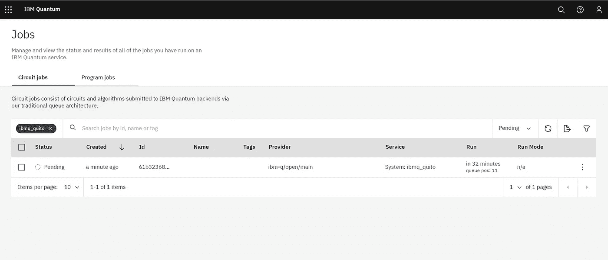

# 如何在真正的量子计算机上运行代码

> 原文：<https://towardsdatascience.com/how-to-run-code-on-a-real-quantum-computer-c1fc61ff5b4>

## IBM Quantum 入门

量子机器学习要不要入门？看看 [**动手量子机器学习用 Python**](https://www.pyqml.com/page?ref=medium_realqc&dest=/) **。**

量子计算机不再是科幻小说了。他们存在。我们可以免费使用它们。例如，IBM 提供对他们基于云的量子计算机的访问。

首先，我们需要[为 IBM 的量子计算服务注册](https://quantum-computing.ibm.com/)。点击“创建一个 IBMid 账户”并提供您的详细信息。一旦您验证了您的电子邮件地址，您就可以开始了！


作者图片，摘自 IBM 量子计算服务

仪表板提供了您预订的 IBM Quantum 服务的概览。最重要的是，它描述了“您的系统”单击“查看全部”,然后在搜索栏右侧的过滤器下拉列表中选择“您的系统”。

您将大致了解您可以访问的系统。这是几个有少量量子位的系统。但这些足以入门。


作者图片，摘自 IBM 量子计算服务

当您单击一个系统时，您将获得其体系结构和配置的更详细视图。例如，右下角的图形显示了系统的量子位是如何连接的。当使用真正的量子计算机时，你必须应对的一个限制是，我们只能使连接的量子比特相互纠缠。


作者图片，摘自 IBM 量子计算服务

所以，假设我们想在 5 量子比特的基多设备上运行我们的量子电路。

当然，我们需要首先创建我们的电路。通常，我们在 Jupyter 笔记本上这样做。如果你还没有安装并运行 Jupyter，这篇文章解释了如何安装 JuypterLab。

所以，我们打开一个新的 Jupyter 笔记本。

我们从一些输入开始，然后定义电路。

如你所见，我们只纠缠相连的量子位(第 14 和 15 行)。

在执行代码之前，我们需要连接到 Quito 设备。因此，我们需要使用您的令牌加载我们的帐户。您可以从 IBM Quantum dashboard 获得您的 API 令牌。这是一根很长的绳子。确保它的安全。

接下来，我们连接到提供商并获得 Quito 后端。如果您想要连接到其他后端，您可能需要选择另一个中心、组和项目。但是 IBM 会让您知道他们何时允许您访问任何其他提供商。

然后，我们需要传送电路。在这一步中，Qiskit 重写您的代码以满足设备的要求。例如，如果我们纠缠两个没有物理连接的量子位，Qiskit 会重写电路以符合硬件要求。

最后，我们组装电路并将其发送到返回一个`job`对象的后端。

作业对象允许您管理您的请求。例如，您可以获取它的状态

最有可能的是，该作业将在队列中等待相当长的时间。

```
<JobStatus.QUEUED: 'job is queued'>
```

让我们再来看看 IBM 量子仪表板。您现在应该在“最近的工作”列表中有一个条目。当你点击它的时候，你会看到细节。在那里，你还可以看到你的赛道计划何时运行。在我的情况下，它需要大约半小时。



作者图片，摘自 IBM 量子计算服务

另一个重要的信息是作业 id。您也可以通过编程方式获得它。

```
'61b32368e4d3eb10e15c8b0e'
```

当然，我们对工作完成后的结果感兴趣。但也许你不想等那么久。因此，您可能希望稍后检索作业。

如果您保持笔记本打开或稍后检索作业，作业对象将在完成后返回结果。

```
{
  '00000': 25,
  '00001': 50,
  '10001': 2,
  '10010': 2,
  '10100': 1,
  '10101': 4,
  '11101': 1,
  '00010': 36,
  '00011': 26,
  '00100': 204,
  '00101': 601,
  '00110': 28,
  '00111': 39,
  '01001': 1,
  '01010': 1,
	'01100': 1,
  '01101': 2
}
```

位串表示量子位的测量值(从右向左读取)。我们可以看到，位置 4 和位置 5 的上量子位并不总是 0。这可能看起来很奇怪，因为我们没有对它们做任何事情。因此，它们应该保持默认状态 0。不幸的是，量子位对噪音非常敏感。

# 结论

噪音和错误是我们今天在量子计算中必须应对的最大问题之一。例如，IBM 最近宣布了一项总额为 10 万美元的奖金，用于在 IBM Quantum 的 7 量子位 Jakarta 系统上使用 Trotterization 模拟三粒子系统的海森堡模型哈密顿量。完成这项挑战的主要问题是应对噪音。

量子机器学习要不要入门？看看 [**动手量子机器学习用 Python**](https://www.pyqml.com/page?ref=medium_realqc&dest=/) **。**


在这里免费获得前三章。