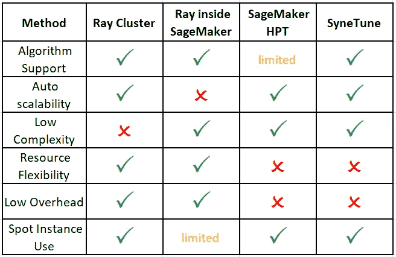

# 如何在云中运行机器学习超参数优化—第 1 部分

> 原文：<https://towardsdatascience.com/how-to-run-machine-learning-hyperparameter-optimization-in-the-cloud-part-1-7877cdd6e879>

## 基于云的调优的四种备选方案


照片由[丹尼斯·莱昂](https://unsplash.com/@denisseleon?utm_source=medium&utm_medium=referral)在 [Unsplash](https://unsplash.com?utm_source=medium&utm_medium=referral) 上拍摄

# 介绍

这是三篇文章中的第一篇，在这篇文章中，我们将探索在云机器学习(ML)环境中执行超参数优化的一些方法。

**超参数调整(HPT)** : HPT 或超参数优化(HPO)指的是找到一组最优超参数(例如学习率、动量、辍学等)的艺术。)对于你的机器学习模型。HPT 是任何机器学习项目的重要组成部分；恰当地应用它可以决定你的项目是成功还是失败。关于 HPT 的艺术已经写了很多，例如，见[这里](https://en.wikipedia.org/wiki/Hyperparameter_optimization)关于执行 HPT 的一些方法的简要调查，见[这里](https://neptune.ai/blog/best-tools-for-model-tuning-and-hyperparameter-optimization)关于支持 HPT 的一些现有框架的调查。加速 HPT 的一种常用方法是增加主机数量，以增加并行运行的实验数量。

**云中的 HPT**:在之前的文章中(例如[这里](/6-steps-to-migrating-your-machine-learning-project-to-the-cloud-6d9b6e4f18e0))，我们已经阐述了在云中执行机器学习的优势。特别是，我们已经注意到基于云的 ML 的几乎无限的扩展能力。这个属性通过使我们能够启动尽可能多的训练实例和尽可能多的并行实验，极大地加速了我们的 ML 项目。*可伸缩性*属性使得云成为我们的 ML 模型的 HPT 的理想场所。

在本帖中，我们回顾了在云中运行 HPT 的一些方法。做到这一点的方法并不总是显而易见的。这是因为 HPT 通常涉及进行必须协调的多个试验。需要从所有试验中收集进展报告，并且需要根据选择的 HPT 算法采取适当的行动。当在本地环境中运行时，这样的协调是非常琐碎的，在本地环境中，您可以完全控制您的训练实例，并且可以很容易地设置它们来相互通信。但是在云中就不那么明显了，尤其是当使用托管培训服务时，比如 [Amazon SageMaker](https://aws.amazon.com/sagemaker/) ，底层实例设置和配置被委托给服务。

## 基于云的 HPT 的不同方法

在以前的帖子中(例如这里的)，我们已经注意到了开发者必须从中选择的基于云的机器学习解决方案的广泛范围。云服务提供商(CSP)如 GCP、AWS 和 Azure，在不同的抽象层次提供了各种 ML 培训选项。一方面，开发人员可以请求一个“裸机”GPU 云实例，并自行处理设置、配置和应用流程的所有元素。另一方面，您拥有高度专业化、全面管理、基于云的培训框架。自然，过多的基于云的培训选项扩展到了执行基于云的 HPT 的多种方式。在本帖中，我们将回顾并演示四个选项:

1.  **云实例集群上的 HPT**—在这个场景中，我们为 HPT 围绕云计算实例的实验设计了一个定制的解决方案。该选项通常需要最多的设置和维护，但支持最多的定制。
2.  **托管培训环境中的 HPT**—在这里，我们依靠托管培训服务来构建一个实例集群，并在该集群中运行 HPT。
3.  **托管 HPT 服务** —一些 CSP 提供专用于 HPT 实验的 API。
4.  **用 HPT 包装管理的训练实验** —在这种情况下，HPT 算法在本地运行(或在云笔记本实例上)，每个 HPT 实验都是独立产生的基于云的训练作业。

## 比较点

有许多特性可用作 HPT 解之间的比较基础。在本帖中，我们只选择了几个属性来突出我们将要讨论的基于云的解决方案的优缺点。其中包括:

1.  **算法支持:**深度学习的 HPT 算法开发是一个活跃的研究领域，新算法不断涌现。HPT 算法通常有两个部分:**参数搜索算法**和**调度算法**。**搜索算法**确定如何从预定义的搜索空间中为参数集赋值。搜索算法的例子包括普通方法，如**网格搜索**和**随机搜索**，以及更复杂的(如贝叶斯)方法，包括某种形式的**利用**，即从以前的结果中学习。调度算法控制如何以及何时运行实验、并行运行多少个实验、如何确定提前终止哪些实验等。理想情况下，我们将完全自由地选择我们的 HPT 算法。在实践中，某些解决方案可以明确地(例如，通过它们的 API)或隐含地(例如，通过对并行实验的数量的限制)限制一些算法的使用。
2.  **自动可伸缩性:**根据您选择的 HPT 算法，您可能会发现在不同的调优阶段会使用不同数量的实例。对于这样的场景，最理想的是有一个 HPT 解决方案，它支持根据调度算法规定的需求自动扩展计算实例。替代方案可能需要维护(并支付)空闲的计算实例。
3.  **复杂性**:不同的 HPT 解决方案在配置和维护的复杂性上有所不同。基于不受管理的云服务产品的解决方案通常需要更多的努力。
4.  **资源灵活性** : HPT 框架通常包括在单个计算实例上运行多个实验的选项。然而，一些云 HPT 解决方案将每个计算实例的实验次数限制为一次。
5.  **实验初始化的开销**:每个新实验的启动时间会根据选择的 HPT 解决方案而有所不同。如果您的实验相对较短，这一开销将影响 HPT 的总持续时间(和总成本)。
6.  **Spot 实例用法**:使用 [**spot**](https://aws.amazon.com/ec2/spot/) 或 [**可抢占的**](https://cloud.google.com/compute/docs/instances/preemptible) 实例来训练 ML 模型，使我们能够以显著的折扣率利用未使用的云计算能力。一些 HPT 解决方案比其他解决方案更适合现场，因此对降低成本具有重要影响。

同样重要的其他考虑因素包括:再现性、[热启动调优](https://docs.aws.amazon.com/sagemaker/latest/dg/automatic-model-tuning-warm-start.html)、[检查点](https://docs.ray.io/en/latest/tune/tutorials/tune-checkpoints.html)、[容错](https://docs.ray.io/en/latest/ray-core/actors/fault-tolerance.html#fault-tolerance)、[分布式训练](https://horovod.readthedocs.io/en/stable/hyperparameter_search_include.html)(其中每个实验在多个 GPU 或多个实例上运行)、成本等等。

对于我们不耐烦的读者来说，这里有一个表格，总结了我们个人对本帖将要涉及的四个选项的看法。



基于云的 HPT 期权属性的主观总结(作者)

## 放弃

本帖将包括我们讨论的一些方法的简要演示，以突出它们的一些特性。这些演示将包括一些服务和框架选择，包括[亚马逊 SageMaker](https://aws.amazon.com/pm/sagemaker/?trk=ps_a134p000007BxdvAAC&trkCampaign=acq_paid_search_brand&sc_channel=PS&sc_campaign=acquisition_IL&sc_publisher=Google&sc_category=Machine%20Learning&sc_country=IL&sc_geo=EMEA&sc_outcome=acq&sc_detail=amazon%20sagemaker&sc_content=Sagemaker_e&sc_matchtype=e&sc_segment=532435490322&sc_medium=ACQ-P|PS-GO|Brand|Desktop|SU|Machine%20Learning|Sagemaker|IL|EN|Text&s_kwcid=AL!4422!3!532435490322!e!!g!!amazon%20sagemaker&ef_id=Cj0KCQiAhMOMBhDhARIsAPVml-HxIwfeABmnxXbZ9ia_5DV_TckDGpMSH2mFhSpu8jrCgntII8hcHB4aAuhfEALw_wcB:G:s&s_kwcid=AL!4422!3!532435490322!e!!g!!amazon%20sagemaker) 、 [PyTorch](https://pytorch.org/) (1.12)、 [Ray Tune](https://docs.ray.io/en/latest/tune/index.html) (2.0)，以及 [Syne Tune](https://github.com/awslabs/syne-tune) (0.12)。请不要将这些选择视为对其他选项的认可。对您来说，最佳选择可能取决于许多因素，包括项目细节、云服务成本等等。此外，请记住，在您阅读本文时，这些框架的特定 API 和用法可能会发生变化。

我要感谢艾萨克·杰马尔对《邮报》的贡献。

# 玩具示例—使用视觉转换器进行图像分类

在这一节中，我们将描述我们将在 HPT 演示中使用的玩具模型。该部分的输出是一个训练函数，我们将在 HPT 期间用优化器*学习率*超参数的不同初始化来调用它。如果你渴望直接了解 HPT 的东西，请随意跳到下一部分。

我们将在实验中使用的模型是一个带有[视觉转换器](https://en.wikipedia.org/wiki/Vision_transformer) (ViT)主干的图像分类模型。下面的代码块演示了如何使用 Python *transformers* 包(版本 4.23.1)的 [HuggingFace ViT](https://huggingface.co/docs/transformers/model_doc/vit) API 构建一个视觉转换器模型。

```
def build_model():
  from transformers import (
    ViTForImageClassification,
    ViTConfig
  )
  **model = ViTForImageClassification(ViTConfig(num_labels=3))**
  return model
```

请注意，在实践中，我们将实际调整使用[最大更新参数化(μP)](http://arxiv.org/abs/2011.14522) 的稍微修改版本的 ViT 模型。这种方法能够在相对较窄版本的 ViT 模型上进行调优，并将结果应用于更大的版本。详见本帖底部附录。

以下代码块(受[本教程](https://huggingface.co/blog/fine-tune-vit)的启发)演示了如何使用 [HuggingFace 训练器 API](https://huggingface.co/docs/transformers/main_classes/trainer) 和[hugging face bean 数据集](https://huggingface.co/blog/fine-tune-vit)来训练我们的 ViT 模型。

```
def **train**(config):
  import torch

 **# 1\. build ViT model**   
  model = build_model()
  model.to(torch.cuda.current_device())
```

```
 **# 2\. load and configure beans dataset**  from datasets import load_dataset
  ds = load_dataset('beans')
```

```
 from transformers import ViTFeatureExtractor
  feature_extractor = ViTFeatureExtractor()
```

```
 def transform(example_batch):
    inputs = feature_extractor([x for x in example_batch['image']], 
                               return_tensors='pt')
    inputs['labels'] = example_batch['labels']
    return inputs
```

```
 prepared_ds = ds.with_transform(transform)
```

```
 def collate_fn(batch):
    return {
     'pixel_values':torch.stack([x['pixel_values'] for x in batch]),
     'labels': torch.tensor([x['labels'] for x in batch])
    }
```

```
 **# 3\. load metric**  from evaluate import load as load_metric
  metric = load_metric("accuracy")
  def compute_metrics(p):
    import numpy as np
    return metric.compute(predictions=np.argmax(p.predictions, 
                                                axis=1),
                          references=p.label_ids)
```

```
 **# 4\. define optimizer with the configured lr value**  from torch.optim import AdamW
  optim=AdamW(model.parameters(), lr=**config['lr']**)
  scheduler=None
```

```
 **# 5\. define Trainer**
  from transformers import TrainingArguments
  training_args = TrainingArguments(
    output_dir="/tmp/vit-base-beans",
    per_device_train_batch_size=16,
    per_device_eval_batch_size=16,
    evaluation_strategy="epoch",
    logging_strategy="epoch",
    disable_tqdm=True,
    do_train=True,
    do_eval=True,
    num_train_epochs=8,
    remove_unused_columns=False,
    report_to='none'
  )
```

```
 from transformers import Trainer
  trainer = Trainer(
    model=model,
    optimizers=(optim,scheduler),
    args=training_args,
    data_collator=collate_fn,
    compute_metrics=compute_metrics,
    train_dataset=prepared_ds["train"],
    eval_dataset=prepared_ds["validation"],
    tokenizer=feature_extractor,
 **callbacks=[] # we will use callbacks for HPT reporting**  )
```

```
 **# 6\. train**  trainer.train()
```

优化器*学习率*通过配置字典传递给训练函数。这是我们将在 HPT 演示中调整的超参数。

# 下一个

在接下来的三篇文章中，我们将展示四种不同的 HPT 表演方式。在每种情况下，我们将使用上面的训练函数，为*学习率*超参数运行不同配置的多个训练实验。

[本文的第 2 部分](/how-to-run-machine-learning-hyperparameter-optimization-in-the-cloud-part-2-23b1dac5ebed)将介绍在基于云的专用调优集群上运行 HPT 的两种方式。在[第 3 部分](/how-to-run-machine-learning-hyperparameter-optimization-in-the-cloud-part-3-f66dddbe1415)中，我们将展示两种使用并行管理培训作业进行调优的方法。

# 附录:具有最大更新参数化的视觉转换器

我们在实验中使用的玩具模型遵循微软和 OpenAI 的研究人员开发的[超参数转移](https://github.com/microsoft/mup)(μ转移)解决方案 <https://arxiv.org/pdf/2203.03466.pdf> 。μTransfer 旨在解决在特别大的模型——具有数十亿参数的模型——上执行 HPT 的独特挑战。考虑到每次单独试验所需的机器数量和时间，在这种模型上进行 HPT 可能是极其昂贵的。[研究](https://www.microsoft.com/en-us/research/uploads/prod/2021/11/TP5.pdf)表明，当采用[最大更新参数化(μP)](http://arxiv.org/abs/2011.14522) 时，许多在架构的较小版本上最优的超参数在较大版本上仍然是最优的。因此，提出的策略是对在 [μP](http://arxiv.org/abs/2011.14522) 中参数化的小版本模型执行传统的 HPT，然后将学习到的超参数转移到大模型。在这篇文章中，我们在基于视觉转换器(ViT)的分类模型上演示了这一过程的第一步:我们使用在 [mup](https://pypi.org/project/mup/) Python 包中定义的专用实用程序，为在 [μP](http://arxiv.org/abs/2011.14522) 中参数化的相对较小的 ViT 调整*学习率* 。下面的代码块演示了如何在 [μP](http://arxiv.org/abs/2011.14522) 中参数化 [HuggingFace ViT](https://huggingface.co/docs/transformers/model_doc/vit) 模型。代码遵循 [mup 代码库](https://github.com/microsoft/mup)中的指南以及[该代码库](https://github.com/microsoft/mutransformers)中提供的指针，专用于 HuggingFace transformer 模型的 [μP](http://arxiv.org/abs/2011.14522) 。我们突出显示了 [μP](http://arxiv.org/abs/2011.14522) 特有的代码行。代码使用了 1.0.0 版本的 *mup* Python 包和 4.23.1 版本的*变形金刚*包。注意，为了完整起见，我们包含了代码；该职位不要求完全理解该准则。

```
def build_model():
  from typing import Optional, Tuple, Union
  import torch
  from torch import nn
  from transformers import (
    ViTForImageClassification,
    ViTModel,
    ViTConfig
  )
  from transformers.models.vit.modeling_vit import ViTSelfAttention
  from mup import (
    MuSGD, get_shapes, set_base_shapes,
    make_base_shapes, MuReadout, normal_
  )
```

```
 def mup_forward(
        self, hidden_states,
        head_mask: Optional[torch.Tensor] = None,
        output_attentions: bool = False
    ):
    mixed_query_layer=self.query(hidden_states)
    key_layer=self.transpose_for_scores(self.key(hidden_states))
    value_layer=self.transpose_for_scores(self.value(hidden_states))
    query_layer=self.transpose_for_scores(mixed_query_layer)  
    attention_scores=torch.matmul(query_layer,
                                  key_layer.transpose(-1, -2))
```

```
 **### muP: 1/d attention
    attention_scores = attention_scores / self.attention_head_size**
```

```
 attention_probs=nn.functional.softmax(attention_scores, dim=-1)
    attention_probs=self.dropout(attention_probs)
```

```
 # Mask heads if we want to
    if head_mask is not None:
      attention_probs=attention_probs * head_mask
```

```
 context_layer=torch.matmul(attention_probs, value_layer)
    context_layer=context_layer.permute(0, 2, 1, 3).contiguous()
    new_cxt_layer_sh=context_layer.size()[:-2]+(self.all_head_size,)
    context_layer=context_layer.view(new_cxt_layer_sh)
    if output_attentions:
      outputs=(context_layer, attention_probs)
    else:
      outputs=(context_layer,)
    return outputs
```

```
 **# override forward function with mup_forward**
  **ViTSelfAttention.forward = mup_forward**
```

```
 class **MupViTForImageClassification**(ViTForImageClassification):
    def __init__(self, config: ViTConfig) -> None:
      super(ViTForImageClassification, self).__init__(config)
      self.num_labels = config.num_labels
      self.vit = ViTModel(config, add_pooling_layer=False)
```

```
 **### muP: Classifier head - replace nn.Linear with MuReadout
      if config.num_labels > 0:
        self.classifier=MuReadout(config.hidden_size,
                                  config.num_labels)** else:
        self.classifier=nn.Identity()
```

```
 # Initialize weights and apply final processing
      self.post_init()
```

```
 def _init_weights(
            self,
            module: Union[nn.Linear, nn.Conv2d, nn.LayerNorm],
            readout_zero_init: bool = False,
            query_zero_init: bool = False) -> None:
      """Initialize the weights"""
      if isinstance(module, (nn.Linear, nn.Conv2d)):
 **### muP: swap std normal init with normal_ from mup.init
        if isinstance(module, MuReadout) and readout_zero_init:
          module.weight.data.zero_()
        else:
          if hasattr(module.weight, 'infshape'):
            normal_(module.weight, mean=0.0, 
                    std=self.config.initializer_range)
          else:
            module.weight.data.normal_(mean=0.0, 
                    std=self.config.initializer_range)
        ### End muP**        if module.bias is not None:
            module.bias.data.zero_()
      elif isinstance(module, nn.LayerNorm):
          module.bias.data.zero_()
          module.weight.data.fill_(1.0)
 **### muP
      if isinstance(module, ViTSelfAttention):
        if query_zero_init:
          module.query.weight.data[:] = 0**
```

```
 base_config = ViTConfig(
    hidden_size=768,
    intermediate_size=4 * 768,
    num_labels=3,
  )
  delta_config = ViTConfig(
    intermediate_size=2 * 768,
    hidden_size=4 * 2 * 768,
    num_labels=3,
  )
  base_model = MupViTForImageClassification(config=base_config)
  delta_model = MupViTForImageClassification(config=delta_config)
  base_shapes = make_base_shapes(base_model, delta_model)
```

```
 **model = MupViTForImageClassification(ViTConfig(num_labels=3))**
  set_base_shapes(model, base_shapes)
  model.apply(model._init_weights)
  return model
```

训练函数中的优化器应替换为:

```
**# 4\. define optimizer with the configured lr value
**  from mup.optim import MuAdamW
  optim=MuAdamW(model.parameters(), lr=**config['lr']**)
```

[1]:杨、Greg &胡、Edward & Babuschkin、Igor & Sidor、Szymon & Liu、晓东& Farhi、David & Ryder、Nick & Pachocki、Jakub & Chen、& Gao、剑锋。(2022).张量程序 V:通过零触发超参数转移调整大型神经网络。