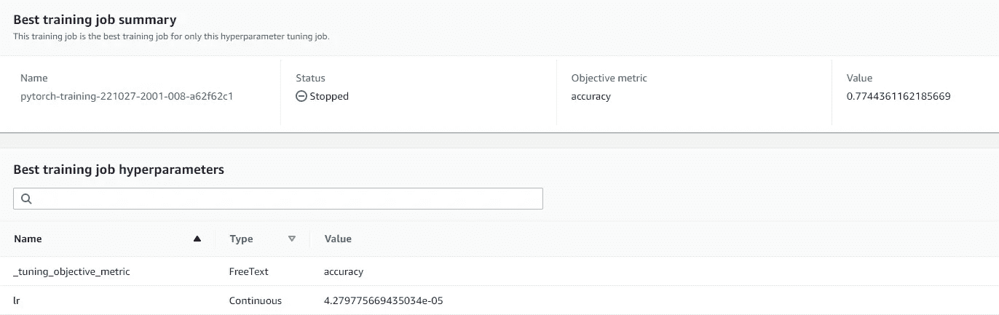

# 如何在云中运行机器学习超参数优化—第 3 部分

> 原文：<https://towardsdatascience.com/how-to-run-machine-learning-hyperparameter-optimization-in-the-cloud-part-3-f66dddbe1415>

## 通过并行化受管培训作业进行云调优


肯尼·埃利亚松在 [Unsplash](https://unsplash.com?utm_source=medium&utm_medium=referral) 上的照片

这是关于云中的超参数调整(HPT)机器学习模型的三部分帖子的最后一部分。在[第一部分](/how-to-run-machine-learning-hyperparameter-optimization-in-the-cloud-part-1-7877cdd6e879)中，我们通过引入问题并为我们的调优演示定义一个玩具模型和一个训练函数来搭建舞台。在[第二部分](/how-to-run-machine-learning-hyperparameter-optimization-in-the-cloud-part-2-23b1dac5ebed)中，我们回顾了两个基于云的优化选项，这两个选项都涉及在专用调优集群上的并行实验。在这一部分中，我们将介绍另外两种方法，使用托管调优 API 进行优化，以及构建一个 HPT 解决方案，其中每个实验都是一个单独的托管培训工作。

# 选项 3:托管 HPT 服务

一些电信运营商将包括专门的 HPT API，作为其托管培训服务的一部分。亚马逊 SageMaker 通过其[自动模型调整](https://docs.aws.amazon.com/sagemaker/latest/dg/automatic-model-tuning.html)API 支持 HPT。为了采用我们的 SageMaker HPT 调优脚本，我们需要修改我们的训练脚本(train.py)的入口点，如下所示:

```
if __name__ == "__main__":
  import argparse, os
  parser = argparse.ArgumentParser()
  parser.add_argument("--lr", type=float, default=0.01)
  parser.add_argument("--model-dir", type=str,
                      default=os.environ["SM_MODEL_DIR"])
  args, _ = parser.parse_known_args()
  **train({'lr':args.lr})**
```

在下面的代码块中，我们展示了如何配置和运行 SageMaker HPT 作业。为了使 HPT 运行与我们之前的示例保持一致，我们将使用[最近宣布的](https://aws.amazon.com/blogs/machine-learning/amazon-sagemaker-automatic-model-tuning-now-provides-up-to-three-times-faster-hyperparameter-tuning-with-hyperband/) SageMaker HPT 对具有类似配置的 [HyperBand](https://docs.aws.amazon.com/sagemaker/latest/dg/automatic-model-tuning-how-it-works.html) 算法的支持。遗憾的是，在撰写本文时，SageMaker SDK(版本 2.114.0)不包含运行 HyperBand 调优作业的内置支持。在下面的代码块中，我们展示了如何通过扩展 [SageMaker Session](https://sagemaker.readthedocs.io/en/stable/api/utility/session.html) 类来解决这个限制。

```
from sagemaker.session import Session
class HyperBandSession(Session):
  def _map_tuning_config(
                    self,
                    strategy,
                    max_jobs,
                    max_parallel_jobs,
                    early_stopping_type="Off",
                    objective_type=None,
                    objective_metric_name=None,
                    parameter_ranges=None,
            ):
    tuning_config = super()._map_tuning_config(
                    strategy, max_jobs, max_parallel_jobs, 
                    early_stopping_type, objective_type, 
                    objective_metric_name, parameter_ranges)
 **tuning_config["StrategyConfig"] = {
                        "HyperbandStrategyConfig": {
                          "MinResource": 1,
                          "MaxResource": 8}
                        }**    return tuning_config**# 1\. define estimator (reused for each experiment)**
from sagemaker.pytorch import PyTorch 
estimator=PyTorch(
           entry_point='train.py',
           source_dir='./' #contains train.py and requirements file
           role=<role>,     instance_type='ml.g4dn.xlarge',
           instance_count=1,
           py_version='py38',
           pytorch_version='1.12',
           **sagemaker_session=HyperBandSession()**
)from sagemaker.tuner import (
      ContinuousParameter,
      HyperparameterTuner,
    )**# 2\. define search space** hyperparameter_ranges = {
        "lr": ContinuousParameter(1e-6, 1e-1, 
                                  scaling_type='Logarithmic'),
    }**# 3\. define metric**
objective_metric_name = "accuracy"
objective_type = "Maximize"
metric_definitions = [{"Name": "accuracy",
                       "Regex": "'eval_accuracy': ([0-9\\.]+)"}]**# 4\. define algorithm strategy**
algo_strategy = 'Hyperband'
max_jobs=32
max_parallel_jobs=8**# 5\. define tuner**
tuner = HyperparameterTuner(
      estimator,
      objective_metric_name,
      hyperparameter_ranges,
      metric_definitions,
      strategy=algo_strategy,
      max_jobs=max_jobs,
      max_parallel_jobs=max_parallel_jobs,
      objective_type=objective_type,
    )**# 6\. tune**
tuner.fit(wait=False)
```

## 利弊

这种方法的主要优点是方便。如果您已经在使用 Amazon SageMaker 进行培训，那么只需一些额外的 SageMaker APIs，就可以增强您的代码以支持超参数调优。特别是，您不需要采用和集成专用的 HPT 框架(如 Ray Tune)。

主要缺点是它对 HPT 算法的支持有限。SageMaker HPT API 定义了一个封闭的算法集，您可以从中进行选择。这些不一定包括你的问题的最佳(SOTA)或最理想的算法(见[这里](https://aws.amazon.com/blogs/machine-learning/bring-your-own-hyperparameter-optimization-algorithm-on-amazon-sagemaker/)的一些例子)。

请注意，与我们之前看到的 HPT 方法相反，顺序试验可以在同一节点上运行，几乎没有时间延迟，在 SageMaker HPT 的顺序运行可能包括一些启动时间开销。最近，这种开销大幅减少，由[高达 20 倍](https://aws.amazon.com/about-aws/whats-new/2022/08/amazon-sagemaker-automatic-model-tuning-reuses-sagemaker-training-instances-reduce-start-up-overheads/)(!！)，通过为随后的试验集成使用相同的(温暖的)训练实例。这消除了请求(和等待)一个可用实例(来自 Amazon EC2)的开销，以及提取所需 docker 图像的开销。然而，仍然有一些启动步骤需要在每次试验中重复，比如下载源代码和输入数据。

关于 SageMaker HPT 的更多细节，请参见 [API 文档](https://sagemaker.readthedocs.io/en/stable/api/training/tuner.html)以及这篇[酷帖](https://aws.amazon.com/blogs/machine-learning/running-multiple-hpo-jobs-in-parallel-on-amazon-sagemaker/)，它展示了如何克服每个 HPT 作业的实例数量的潜在限制，以便运行多达 10，000 次试验。

## 结果

我们的 SageMaker HPT 作业运行了大约 37 分钟，并从 SageMaker 控制台生成了以下屏幕截图中总结的结果:



SageMaker 控制台的屏幕截图(作者提供)

# 选项 4:用 HPT 包装管理培训实验

在这最后一种方法中，我们的 HPT 算法在本地运行(或在基于云的笔记本实例上)，每个实验都是独立产生的基于云的训练工作。这种解决方案的关键要素是一种报告机制，该机制使 HPT 算法能够跟踪每个基于云的训练作业的进度。我们将提供一个简单的例子，说明如何使用 [SageMaker 培训指标](https://docs.aws.amazon.com/sagemaker/latest/dg/training-metrics.html#define-train-metrics)来做到这一点。随后，我们将使用 [Syne Tune](https://github.com/awslabs/syne-tune) 库演示这种方法的完整示例。

在下面的代码块中，我们定义了一个 launch_experiment 函数，并用一个简单的光线调节实验来包装它。启动的作业由 HPT 算法选择的*学习率*值和 SageMaker*metric _ definitions*定义，SageMaker*metric _ definitions*用于从 HuggingFace Trainer API 收集评估精度输出打印。当训练作业完成时，将提取收集的指标并报告给 Ray Tune 会话。SageMaker 会话还配置有*keep _ alive _ period _ in _ seconds*标志，以利用新的 [SageMaker 对热实例池](https://docs.aws.amazon.com/sagemaker/latest/dg/train-warm-pools.html)的支持。

```
def launch_experiment(config):
 **# define estimator**  from sagemaker.pytorch import PyTorch 
  estimator=PyTorch(
           entry_point='train.py',
           source_dir='./' #contains train.py and requirements file
           role=<role>,
           instance_type='ml.g4dn.xlarge',
           instance_count=1,
           py_version='py38',
           pytorch_version='1.12',
 **hyperparameters={"lr": config['lr']}**
           **keep_alive_period_in_seconds=240,
           metric_definitions=[
                        {
                         "Name": "accuracy",                                                                
                         "Regex": "'eval_accuracy': ([0-9\\.]+)"
                        }]**
           )
 **# train**  job_name = 'tune_model'
  estimator.fit(job_name=job_name) **# use boto3 to access job**
  import boto3
  search_params = {
        "MaxResults": 1,
        "Resource": "TrainingJob",
        "SearchExpression": {
            "Filters": [
                {"Name": "TrainingJobName", 
                 "Operator": "Equals", 
                 "Value": job_name},
            ]
        },
  }
  smclient=boto3.client(service_name="sagemaker")
  res=smclient.search(**search_params) **# extract final metric** metrics=res["Results"][0]["TrainingJob"]["FinalMetricDataList"]
  accuracy=metrics[[x["MetricName"]
                 for x in metrics].index("accuracy")]["Value"] **# report metric to ray** from ray.air import session
  session.report({"accuracy": accuracy})**# configure a local Ray Tune HPT job** from ray import tune
from ray.tune.search.bayesopt import BayesOptSearch
config = {
  "lr": tune.uniform(1e-6, 1e-1),
}
bayesopt = BayesOptSearch(
  metric="accuracy",
  mode="max")tuner = tune.Tuner(
  tune.with_resources(
      tune.with_parameters(launch_experiment),
      resources={"cpu": 1}),
  tune_config=tune.TuneConfig(num_samples=2,
                              max_concurrent_trials=1,
                              search_alg=bayesopt,
                              ),
  param_space=config,
)
results = tuner.fit()
best_result = results.get_best_result("accuracy", "max")
print("Best trial config: {}".format(best_result.config))
print("Best final validation accuracy: {}".format(
                        best_result.metrics["accuracy"]))
```

在这个简单的例子中，我们只收集了最终报告的指标值。在实践中，我们希望在每个实验中监控指标，以终止表现不佳的实验。这需要一个更复杂的解决方案，能够收集和比较多个作业的指标，及早停止失败的作业，并在释放的实例上启动新的作业。为此，我们采用了 [Syne Tune](https://github.com/awslabs/syne-tune) ，这是一个 Python 库，支持大规模分布式超参数优化，实验可以在本地和云中运行。Syne Tune 内置了对使用 Amazon SageMaker 进行培训的支持，并且可以进行增强以支持其他管理培训环境。Syne Tune 支持多种流行的 HPT 算法，并且可以轻松扩展以支持其他算法。更多详情请见 [Syne Tune 公告](https://aws.amazon.com/blogs/machine-learning/run-distributed-hyperparameter-and-neural-architecture-tuning-jobs-with-syne-tune/)。

下面的代码块包含一个 HuggingFace TrainerCallback，它实现了 Syne Tune 所需的指标报告。这个回调必须添加到 train 函数中 HuggingFace Trainer 对象的*回调列表*中。

```
from transformers import TrainerCallback
class SyneReport(TrainerCallback):
  def __init__(self) -> None:
    from syne_tune.report import Reporter
    super().__init__()
    self.reporter = Reporter() def on_evaluate(self, args, state, control, metrics, **kwargs):
    self.reporter(epoch=int(state.epoch),
                  loss=metrics['eval_loss'],
                  accuracy=metrics['eval_accuracy'])
```

下面的代码块演示了如何使用 HyperBand 算法运行我们的玩具示例的 HPT，其设置与前面的部分相同。我们再次定义了*keep _ alive _ period _ in _ seconds*标志，以利用[热实例池](https://docs.aws.amazon.com/sagemaker/latest/dg/train-warm-pools.html)。

```
**# define the estimator** from sagemaker.pytorch import PyTorch 
estimator=PyTorch(
           entry_point='train.py',
           source_dir='./' #contains train.py and requirements file
           role=<role>,
           instance_type='ml.g4dn.xlarge',
           instance_count=1,
           py_version='py38',
           pytorch_version='1.12',
           **keep_alive_period_in_seconds=240,
**           )from syne_tune.search_space import loguniform, uniform
max_epochs = 8
config = {
  "lr": loguniform(1e-6, 1e-1),
}
from syne_tune.optimizer.schedulers.hyperband import (  
   HyperbandScheduler
)scheduler = HyperbandScheduler(
    config,
    max_t=8,
    resource_attr='epoch',
    searcher='random',
    metric="accuracy",
    mode="max",
    reduction_factor=2
)

from syne_tune.tuner import Tuner
from syne_tune.stopping_criterion import StoppingCriterion
from syne_tune.backend.sagemaker_backend.sagemaker_backend import (
  SagemakerBackend
)tuner = Tuner(
    backend=SagemakerBackend(sm_estimator=est),
    scheduler=scheduler,
    **stop_criterion=StoppingCriterion(max_num_trials_started=32),**
    n_workers=8,
    tuner_name="synetune"
)tuner.run()
```

请注意，与我们以前的方法相反，Syne Tune(在撰写本文时，据我们所知)不包括固定总实验数量的选项。使用[停止标准](https://github.com/awslabs/syne-tune/blob/main/syne_tune/stopping_criterion.py#L25)停止 Syne Tune 作业，该标准可由已过去的时间、已开始的实验数量、已完成的实验数量等确定。使用 [StoppingCriterion](https://github.com/awslabs/syne-tune/blob/main/syne_tune/stopping_criterion.py#L25) 我们可以将调优作业配置为在 32 个实验完成后退出，但是只要不满足这个标准，Syne Tune 就会继续产生额外的(浪费的)作业。

## 利弊

用诸如 Syne Tune 的 HPT 解决方案包装 SageMaker 实验在算法选择方面提供了很大的自由度。这与萨格马克·HPT 方法相反。因为每个实验都是一个单独的训练任务，所以它支持自动缩放，并且有助于使用 spot 实例。

不利的一面是，与萨格马克·HPT 相比，这种方法需要学习和采用 HPT 框架。在萨格马克 HPT 方法的情况下，有一个关于新试验启动时间的问题，但这些问题通过我们使用温暖的实例池得到缓解。

## 结果

我们的 Syne Tune 作业运行了大约半个小时，并输出了以下结果:

```
accuracy: best 0.7969924812030075 for trial-id 7 (lr=0.000027)
```

# 摘要

下表总结了我们对所涉及的不同方法的主观体验:


基于云的 HPT 期权属性的主观总结(作者)

注意，在这个总结中，我们将 SageMaker HPT 和 Syne Tune 方法标记为高开销。在实践中，对热实例使用的新支持将开销减少到可以忽略不计的程度。然而，我们选择强调与基于集群的解决方案的区别，在基于集群的解决方案中，连续实验在同一个实例会话中运行。

## 如何选择 HPT 期权

最佳选择可能取决于你项目的细节和你自己的个人偏好。例如，如果您已经有了一个支持培训的可靠的编排解决方案，您可以选择扩展它以支持 HPT(选项 1)。如果您不喜欢基于编排的解决方案，并且不关心实例空闲的可能性，您可能更喜欢在 SageMaker 实例集群中运行 HPT(选项 2)。如果你的首要任务是降低成本，并且你对有限的 HPT 算法非常满意，那么你可能应该在 spot 实例上运行 SageMaker HPT(选项 3)。如果您想要运行一个高级调度算法，并且并行试验的数量有很大的差异，Syne Tune(选项 4)可能是您的最佳选择。当然，对你来说最好的选择也可能是这篇文章中没有提到的。

请随时提出意见、问题和更正。同时…祝你调音愉快！！