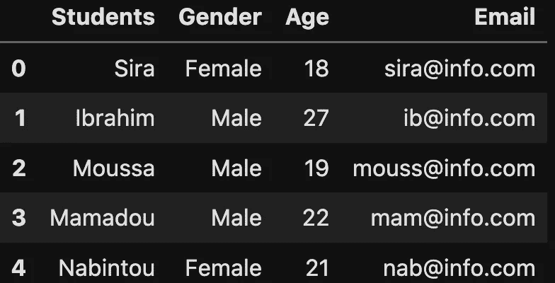
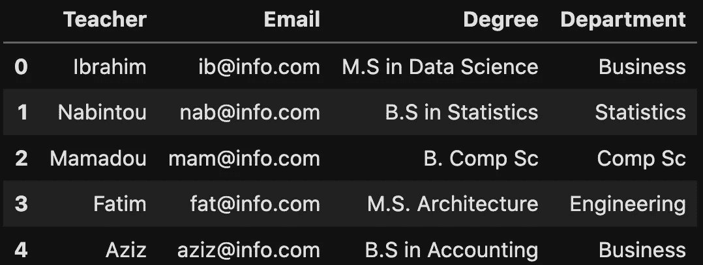
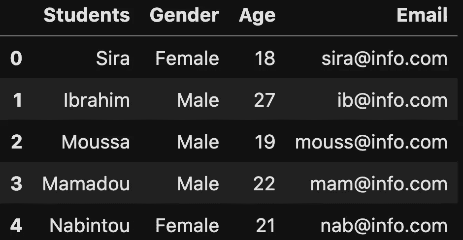
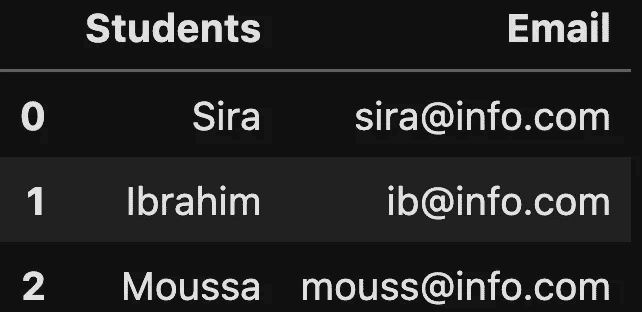
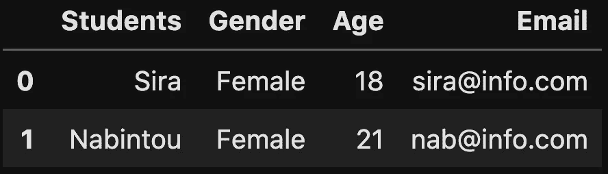
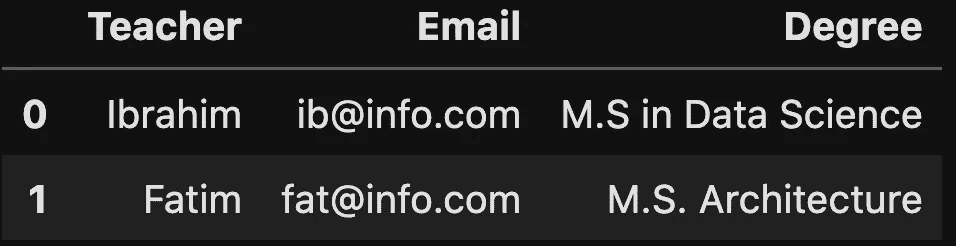
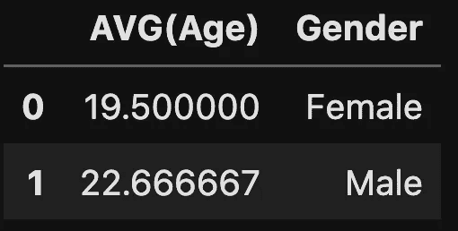
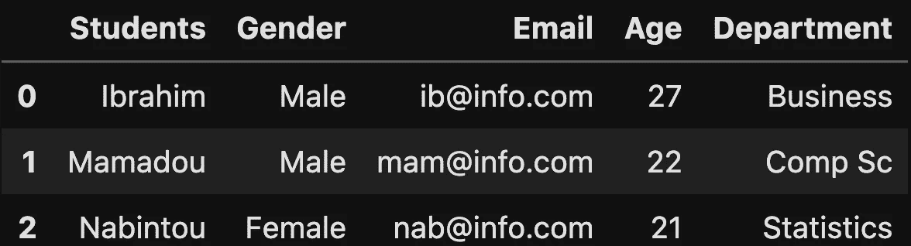

# 如何用 Python 在熊猫数据帧上运行 SQL 查询

> 原文：<https://towardsdatascience.com/how-to-run-sql-queries-on-your-pandas-dataframes-with-python-4237ffecc43b>

## 在 Python Pandas 数据框架中运行 SQL 查询

在 YouTube 上关注我

# 动机

数据科学家和数据分析师越来越多地使用 Pandas 进行数据分析，它的优势在于它是更广泛的 Python 世界的一部分，使许多人都可以访问它。另一方面，SQL 以其性能著称，易于阅读，即使是非技术人员也能很容易理解。

如果我们能找到一种方法将 Pandas 和 SQL 语句的优点结合起来会怎么样？这就是`**pandasql**`派上用场的地方。

通过这篇概念性的博客，您将在深入实践之前理解什么是`**pandasql**`,如果您已经熟悉 SQL，这将更加容易。

请记住，table 和 dataframe 可以互换使用，表示同一件事。

> 那么，pandasql 是什么？

它主要用于使用 SQL 语法查询`**pandas**`数据帧。使用 [sqldf](https://medium.com/towards-data-science/when-r-meets-sql-to-query-data-frames-a94d9d92b0f2) 与 R 数据帧交互，可以执行相同的过程。

# 先决条件

根据您的环境，使用以下语法进行安装非常简单:

在安装之前，需要注意的是使用 [conda](https://docs.conda.io/en/latest/) 安装库时，有必要指定`--yes`标志，这样就不会卡在(Proceed ([y]/n)？)提示。

*   使用 Python 控制台

```
pip install pandasql 
```

*   使用 Jupyter 笔记本

```
!conda install --yes pandasql
```

成功安装库之后，您应该能够使用以下语句导入库。

```
from pandasql import sqldf
```

# 我们开始吧

在深入研究之前，让我们首先创建将用于实践的数据集`**StudentTable**`和`**TeachingAssistantTable**`。

```
# Import the pandas library for creating the dataframes
import pandas as pd
```

```
# Create the Student Data Frame

students= {
    'Students':["Sira","Ibrahim","Moussa","Mamadou","Nabintou"],
    'Gender':['Female','Male','Male', "Male", "Female"],
    'Age':[18, 27, 19, 22, 21],
    'Email': ["sira@info.com", "ib@info.com", "mouss@info.com", 
             "mam@info.com", "nab@info.com"]
          }
students_df = pd.DataFrame(students)

students_df
```



学生数据框(图片由作者提供)

```
# Create the Teaching Assistant Data Frame

teaching_assistant= {
    'Teacher':["Ibrahim","Nabintou","Mamadou","Fatim","Aziz"],
    'Email':['ib@info.com','nab@info.com','mam@info.com', 
             "fat@info.com", "aziz@info.com"],
    'Degree':["M.S in Data Science", "B.S in Statistics", 
              "B. Comp Sc", "M.S. Architecture", "B.S in Accounting"],
    'Department': ["Business", "Statistics", "Comp Sc", 
             "Engineering", "Business"]
          }
teaching_assistant_df = pd.DataFrame(teaching_assistant)

teaching_assistant_df
```



助教数据框(图片由作者提供)

这是本节将涉及的主要概念:(1)列部分，(2)数据过滤，(3)数据聚合，最后，(4)数据连接。

## 单列选择

这相当于选择数据库/数据框的部分或全部列。使用关键字`SELECT col_1, col_2,... col_X FROM tableName`执行

→ `1, 2, ...X`对应最终结果中你感兴趣的列。

→ `tableName`是数据帧/表格的名称。

以下代码的结果包括 student dataframe 的所有列。

```
all_students = sqldf("SELECT * FROM students_df")
all_students
```



SELECT *语句结果(图片由作者提供)

*   `all_students`也是一个 DataFrame，如果您想执行快速的 Pandas 任务(如列类型),它会很有帮助。下面是一个插图。

```
# Check the type of all_students
print(type(all_students))

# Run Pandas Statement to show the type of the columns
print("---"*10)
print(all_students.dtypes)
```


all_students 类型和列类型(图片由作者提供)

有时，当您有复杂的查询时，您可以按如下步骤进行:

*   将查询定义为字符串。这样做的时候，确保使用三重引号`”””`，这样就可以在多行中编写查询。
*   将`sqldf`函数应用于查询以获得结果。

假设我们需要学生的姓名、电子邮件，并将结果限制在前 3 个。

```
# Query definition
query = """ SELECT Students, Email 
            FROM students_df 
            LIMIT 3
        """
# Query execution
name_email = sqldf(query)
name_email
```



学生姓名和电子邮件限于前 3 行(图片由作者提供)

## 2-数据过滤

数据过滤是指`WHERE`语句进入等式，对`SELECT`语句的结果进行自定义过滤。

假设我们想要所有的女学生。

```
# Define the query
query = """SELECT * 
           FROM students_df 
           WHERE Gender = 'Female'
        """

# Execute the query
female_student = sqldf(query)
female_student
```



女学生(作者图片)

让我们看一下这个查询，它的目的是检索所有拥有硕士学位的助教的姓名、电子邮件和学位。

```
query = """ SELECT Teacher, Email, Degree 
            FROM teaching_assistant_df 
            WHERE Degree LIKE 'M.S%'
            """
ms_students = sqldf(query)
ms_students
```



拥有硕士学位的助教(图片由作者提供)

我决定执行相同的请求，这次使用 Pandas 语句，这就是它的样子！

```
cols_to_get = ['Teacher', 'Email', 'Degree']
teaching_assistant_df[teaching_assistant_df.Degree.str.startswith('M.S')][cols_to_get]
```

这看起来像。可怕的声明🥺.让我们了解一下发生了什么:

*   `cols_to_get`对应于我们在最终数据帧中想要的列。它基本上等同于我们在使用`SELECT`语句时指定的列。
*   `teaching_assistant_df.Degree.str.startswith('M.S')`返回`True`是以`'M.S'`开始的`Degree`列中的值。`False`否则。
*   最后，这些布尔值被传输到起始的`teaching_assistant_df`以获得结果为`True.`的行

但是…我们用`SQL`查询执行了相同的任务，并且简单易懂。没有过多的比较分析，只是想强调一些简单的查询在`SQL.`中可以有多复杂

## 3-数据聚合

SQL 中的聚合是在聚合函数的帮助下执行的，下面是一些最常用的函数:`COUNT`、`SUM`、`MAX & MIN`和`AVG`。例如，你可以根据学生的性别得到他们的年龄。

```
query = """ SELECT AVG(Age), Gender 
            FROM students_df 
            GROUP BY Gender
        """
avg_age = sqldf(query)
avg_age
```



不同性别学生的平均年龄(图片由作者提供)

## 4-数据连接

当我们想要组合至少两个表中的数据时，联接概念就变得很有用。这一部分直接指向只有一种类型的连接。您可以从我的文章《每个数据科学家都应该知道的 4 种 SQL 连接类型》中了解更多关于所有连接概念的信息。

假设你想知道谁既是学生又是助教。这个问题的答案需要使用一个`INNER JOIN`将我们的两个表连接起来，最终结果包含以下信息:

*   来自`students_df`表的学生姓名、性别、电子邮件和年龄。
*   来自`teaching_assistant_df`数据框的部门。

```
query = """ SELECT st.Students, st.Gender, st.Email, st.Age, tat.Department
            FROM students_df st INNER JOIN teaching_assistant_df tat 
            ON st.Email = tat.Email;
            """

result = sqldf(query)
result
```



兼任助教的学生(图片由作者提供)

# 结论

恭喜你！🎉🍾您刚刚学习了如何利用`pandasql`的强大功能，这是一个很棒的工具，允许您在数据帧上应用 SQL 和 Pandas 查询。

如果你喜欢阅读我的故事，并希望支持我的写作，考虑[成为一个媒体成员](https://zoumanakeita.medium.com/membership)。每月支付 5 美元，你就可以无限制地阅读媒体上的故事。

欢迎在[媒体](https://zoumanakeita.medium.com/)、[推特](https://twitter.com/zoumana_keita_)和 [YouTube](https://www.youtube.com/channel/UC9xKdy8cz6ZuJU5FTNtM_pQ) 上关注我，或者在 [LinkedIn](https://www.linkedin.com/in/zoumana-keita/) 上打招呼。讨论人工智能、人工智能、数据科学、自然语言处理和人工智能是一种乐趣！