# 如何在 Amazon EC2 实例中运行 Python 脚本(演示)

> 原文：<https://towardsdatascience.com/how-to-run-your-python-scripts-in-amazon-ec2-instances-demo-8e56e76a6d24>

## 带演示的循序渐进教程


panumas nikhomkhai 的照片:[https://www . pexels . com/photo/close-up-photo-of-mining-rig-1148820/](https://www.pexels.com/photo/close-up-photo-of-mining-rig-1148820/)

您很可能习惯于在本地机器上运行 Python 脚本。但是，机器可能无法满足运行某些操作所需计算或存储要求。

对于这些情况，人们可以利用虚拟实例来满足任何无法在本地满足的需求。

在这里，我们执行一个快速演示来展示 Python 脚本如何在 Amazon 的 EC2 实例中运行。

## 演示

有什么比演示更好的方法来解释如何做某事呢？

作为指南的一部分，我们将致力于在 EC2 实例中运行一个名为“random_number_generator.py”的 Python 脚本。


代码输出(由作者创建)

很简单，对吧？该脚本只是使用 Numpy 包打印出一个随机数。

记住 Python 的版本以及成功运行代码所需的包的版本很重要(我当前的环境使用 Python 3.9.13，只使用 Numpy 模块)。

要获得在机器上使用的 Python 版本，只需在命令行中输入以下命令:

```
python --version
```

要获得随 pip 一起安装的软件包及其版本的列表，请在命令行中使用以下命令。

```
pip list
```

您可以在实例中一个接一个地安装软件包，但是这可能很耗时。你也有可能得到错误版本的包。因此，建议将所有包存储在一个“requirements.txt”文件中，这可以用下面的命令来完成。

```
pip freeze > requirements.txt
```

## 步骤 1:启动 EC2 实例

首先，需要启动将运行脚本的 EC2 实例。

我不会过多地研究这一步，因为关于如何在 AWS 上创建 EC2 实例的教程不计其数(而且一开始就没有设计得很难)。

请随意选择适合您的使用情形的定价和安全配置。由于这只是一个简单的演示，我们将使用一个没有额外安全措施的自由层实例。

配置实例时更重要的细节如下:

**1。选择亚马逊机器镜像(AMI)**

当启动一个实例时，要求您做的第一件事是选择 AMI。

您选择的 AMI 将决定实例的用户名，您需要知道该用户名以便稍后连接到您的实例。对于那些不确定其实例的用户名是什么的人来说， [AWS 文档](https://docs.aws.amazon.com/AWSEC2/latest/UserGuide/connection-prereqs.html)涵盖了分配给每个 AMI 启动的实例的默认用户名。

对于我们的例子，我们将使用 Amazon Linux AMI 启动一个实例。这种类型的实例的用户名是“ec2-user”。

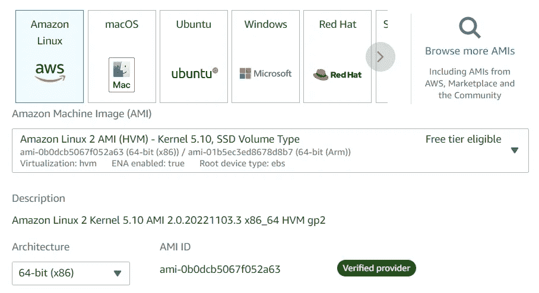

AMI(作者图片)

AMI 的选择还会影响到简化命令行操作所需的命令。例如，用于 Amazon Linux AMI 启动的实例的命令可能与 Ubuntu AMI 启动的实例不匹配。

**2。密钥对**

您还需要创建一个密钥对或使用现有密钥(作为. pem 文件)来访问您的实例。

对于我们的示例，我们将创建一个名为“test_key.pem”的私钥


密钥对(图片由作者提供)

完成所有部分后，单击“启动实例”。

## 步骤 2:连接到实例

AWS 允许您使用安全外壳(SSH)连接到您的实例。

要找到连接到实例所需的`ssh`命令，请在 EC2 控制台中选择您的实例，然后单击顶部的“connect”选项卡。之后，选择“SSH 客户端”选项卡。

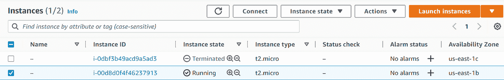

选择“连接”选项卡(按作者排列的图像)

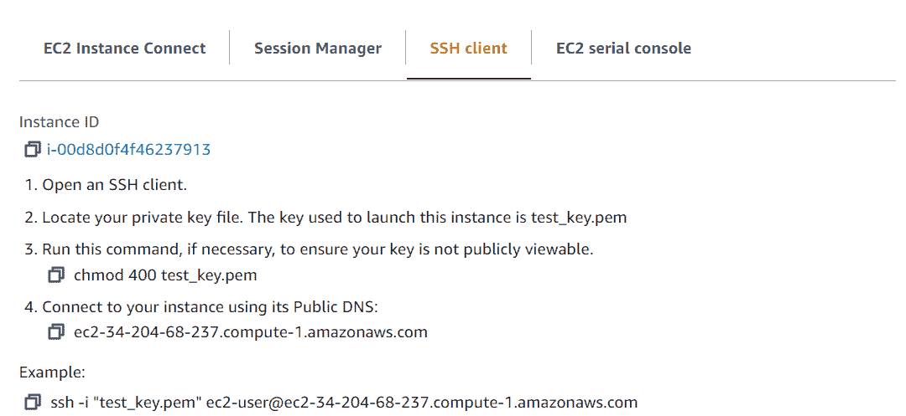

选择 SSH 客户端选项卡(按作者排序的图片)

您将看到连接到实例所需的命令。您还会看到您的实例的公共 DNS(您稍后会需要它，所以请记住这一点)。

在这种情况下，连接到该实例的命令是:

```
ssh -i "test_key.pem" ec2-user@ec2-34-204-68-237.compute-1.amazonaws.com
```

用于连接到实例的`ssh`命令必须从您的密钥文件的位置执行。在终端窗口中，将目录切换到包含私钥的文件夹，并输入提供的命令。出现提示时，选择“是”。如果成功，输出应该如下所示:

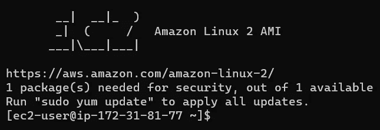

命令输出(由作者创建)

瞧啊。您现在已经连接到您的实例！

## 步骤 3:安装 Python(可选)

您的 EC2 实例应该已经提供了 Python3 的一个版本，您可以用`python3 --version`命令来验证它。

如果您正在寻找 Python 的特定版本，您可以自己安装(如果这不适用于您，请跳过这一步)。

Amazon Linux 实例提供了 Python 3.7。出于演示的目的，我们假设需要匹配我们的本地机器并安装 Python 3.9.13。

> **注意**:以下命令适用于 Amazon Linux AMI 启动的实例。它们可能不适合用其他 AMI(例如 Ubuntu)启动的实例。

首先，我们安装 Python 的依赖项。

```
sudo yum -y groupinstall "Development Tools"
sudo yum -y install openssl-devel bzip2-devel libffi-devel
```

接下来，我们用`wget`命令下载感兴趣的 Python 版本。

```
sudo yum -y install wget
wget https://www.python.org/ftp/python/3.9.13/Python-3.9.13.tgz
```

该实例现在应该有一个名为“Python-3.9.13.tgz”的文件。

> **注意**:这些命令用于下载 Python 3 . 9 . 13 版本。要获得您选择的 Python 版本，只需用您选择的版本号替换命令中的版本号。

下载文件后，将其解压缩。

```
tar xvf Python-3.9.13.tgz
```

提取的 Python 文件夹现在应该在 EC2 实例中(您可以使用`ls`命令确认这一点)。

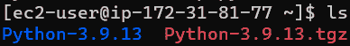

移动到创建的 Python 文件夹并执行安装。

```
cd Python-*/
./configure --enable-optimizations
sudo make altinstall
```

这样，Python 的新版本就应该安装成功了！为了测试这一点，我们可以输入`Python3.9 --version`命令。

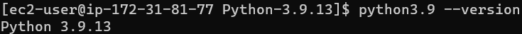

命令输出(由作者创建)

## 步骤 4:将文件复制到 EC2 实例

现在我们有了 Python 的正确版本，我们可以将所有文件复制到实例中。在我们的例子中，被复制的文件是“random_number_generator.py”和“requirements.txt”文件。

我们将离开 Python 文件夹，创建一个名为“project”的新文件夹，其中将包含这两个文件。这一步是可选的；您可以将文件放在实例中您想要的任何位置。

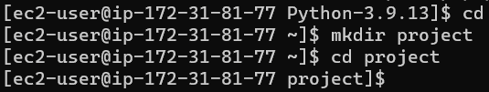

命令输出(由作者创建)

现在，打开一个新的终端窗口(姑且称之为终端 2)。终端 2 将用于将本地机器中的文件复制到 EC2 实例。

可以使用`scp`(安全复制)命令将文件从一个位置复制到另一个位置。用于将文件从本地计算机复制到 EC2 实例的命令具有以下格式:

```
scp -i </path/key-pair-name.pem> </path/file_to_copy> <username>@<instance_public_dns>:<destination_path>
```

> **注意**:要获取 EC2 实例的公共 DNS，请转到 AWS EC2 控制台中的 SSH 客户端选项卡(参见步骤 2)。

可以使用以下命令将“random_number_generator.py”和“requirements.txt”文件复制到实例中的“项目文件夹”中:

```
scp -i test_key.pem random_number_generator.py ec2-user@ec2-34-204-68-237.compute-1.amazonaws.com:/home/ec2-user/project

scp -i test_key.pem requirements.txt ec2-user@ec2-34-204-68-237.compute-1.amazonaws.com:/home/ec2-user/project
```

如果没有问题，该命令应该会产生以下输出:

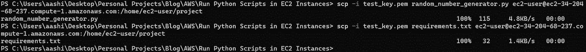

命令输出(由作者创建)

当您返回到终端 1(即带有 EC2 实例的终端)时，您应该能够看到您在`scp`命令中指定的目标路径中的文件。

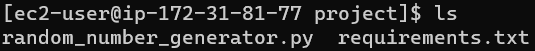

命令输出(由作者创建)

## 步骤 5:创建虚拟环境

在这个阶段，您可能想安装您的包，以便可以立即运行您的代码。但是，全局安装软件包可能会导致与系统软件包管理器的行为冲突。

所以，还是在虚拟环境下工作比较好。

我们将创建一个名为“test_venv”的虚拟环境，然后进入该环境。

```
Python3.9 -m venv test_env
source test_env/bin/activate
```

激活虚拟环境后，您应该能够在当前目录左侧的括号中看到它的名称。

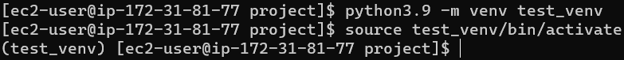

命令输出(由作者创建)

现在我们在虚拟环境中，我们可以安装运行脚本所需的所有必要的包。如果您将软件包和版本存储在 requirements.txt 文件中，那么您可以使用一个命令来执行所有安装。

```
pip3.9 install -r requirements.txt
```

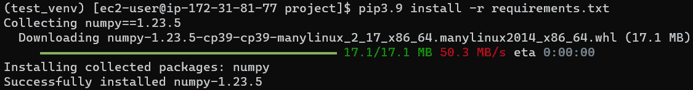

命令输出(由作者创建)

同样，这个命令是针对 Python 3.9 的。根据使用的 Python 版本修改命令。

## 第 6 步:运行您的代码！

您已经创建了 EC2 实例，连接到实例，安装了正确的 Python 版本，将文件传输到实例，并设置了虚拟环境。最后，您可以在新实例中运行 Python 脚本！

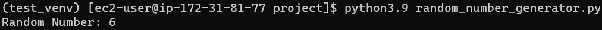

命令输出(由作者创建)

一旦你完成了在虚拟环境中的工作，你可以用`deactivate`命令离开它。

## 友情提示:停止你的实例

EC2 实例使用现收现付的定价模型，所以当您使用完实例时，请停止使用它们！否则，你会发现自己收到一份令人不快的账单。

即使您正在处理一个自由层实例，最好养成尽早停止实例的习惯。

## 结论


照片由[普拉蒂克·卡蒂亚尔](https://unsplash.com/@prateekkatyal?utm_source=medium&utm_medium=referral)在 [Unsplash](https://unsplash.com?utm_source=medium&utm_medium=referral) 上拍摄

通过这个演示，您有望顺利地在 AWS 实例上运行您的脚本。

即使你主要编写可以在本地机器上运行的程序，接触一些云平台提供的计算服务也是有好处的，因为当你的工作有更大的计算需求时，你会有所准备。

我祝你在数据科学的努力中好运！

## 参考

1.  *使用 SSH* 连接您的 linux 实例。(未注明)。2022 年 12 月 4 日检索，来自[https://docs . AWS . Amazon . com/AWS ec2/latest/user guide/accessinginstanceslinux . html](https://docs.aws.amazon.com/AWSEC2/latest/UserGuide/AccessingInstancesLinux.html)
2.  Mutai，J. (2022 年 1 月 17 日)。*如何在亚马逊 Linux 2 上安装 Python 3.9*。计算 ForGeeks。2022 年 12 月 4 日检索，来自[https://computingforgeeks . com/how-to-install-python-on-Amazon-Linux/](https://computingforgeeks.com/how-to-install-python-on-amazon-linux/)