# 如何在亚马逊 SageMaker 安排 Jupyter 笔记本

> 原文：<https://towardsdatascience.com/how-to-schedule-jupyter-notebooks-in-amazon-sagemaker-d50fa1c8c0ad>

## 使用 AWS 服务定期运行 Jupyter 笔记本的分步指南


在 [Unsplash](https://unsplash.com?utm_source=medium&utm_medium=referral) 上由[Towfiqu barb huya](https://unsplash.com/@towfiqu999999?utm_source=medium&utm_medium=referral)拍摄的照片

你的经理问:“下周你能为我重新运行这个分析吗？”。不用担心:您可以设置一个提醒来手动重新运行它。

接下来的一周，你重新运行分析。这一次，你的经理说，“这太好了。可以每周发给我吗？”真烦人。你不喜欢打开你的 Jupyter 笔记本，运行它，并将结果保存到 S3 周刊。这很费时间，而且你的任务清单上还有更有价值的任务。

这篇文章是如何在 Amazon SageMaker 中安排 Jupyter 笔记本的指南。这些是我用来在[11 月](https://movember.com)日自动运行时间序列预测笔记本的步骤(更多细节见[本文](https://medium.com/towards-data-science/build-complex-time-series-regression-pipelines-with-sktime-910bc25c96b6))。

# 解决方案概述

我将向您展示如何使用 AWS 服务安排您的 Jupyter 笔记本。我会假设你的数据可以在线访问(例如 S3，GitHub)，你会把它保存到一个类似的位置。Jupyter 笔记本将在亚马逊 SageMaker 笔记本实例上运行。一个[生命周期配置](https://docs.aws.amazon.com/sagemaker/latest/dg/notebook-lifecycle-config.html)将通过指定 *conda* 环境和实现自动停止功能来控制笔记本实例。最后，我们使用 [AWS Lambda](https://docs.aws.amazon.com/lambda/index.html) 和 [Amazon EventBridge](https://docs.aws.amazon.com/eventbridge/?id=docs_gateway) 按照固定的时间表触发笔记本实例。

我们的建筑看起来会像这样。

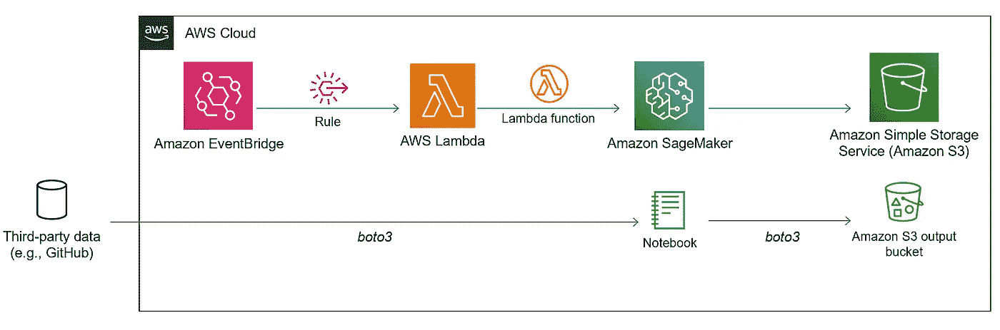

作者图片

您将看到我们仅使用 AWS 服务。第三方选项，比如 [JetBrains](https://blog.jetbrains.com/datalore/2022/06/14/how-to-schedule-a-jupyter-notebook/) 都有，但是自己做可能更划算。

# 场景和输入数据

我们将使用[JHU·CSSE·新冠肺炎的数据](https://github.com/CSSEGISandData/COVID-19/blob/master/csse_covid_19_data/csse_covid_19_time_series/time_series_covid19_confirmed_global.csv) [1]，该数据给出了各州和国家每日累计的新冠肺炎病例数。在我们的场景中，我们假设我们的经理要求我们创建一个折线图，显示澳大利亚各州在过去一年中的每日累积案例。我们的地块应该可以在 S3 以 PNG 格式访问，看起来像下面的图像。

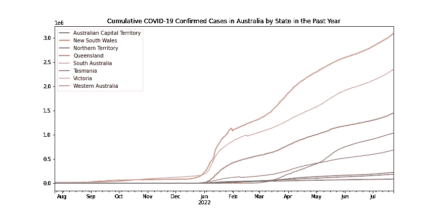

作者图片

# 创建一个 Amazon SageMaker 笔记本实例

我们将在一个[亚马逊 SageMaker 笔记本实例](https://docs.aws.amazon.com/sagemaker/latest/dg/nbi.html)中运行我们的 Jupyter 笔记本应用程序。该服务提供完全托管的云笔记本电脑，预装了执行数据科学任务所需的库。

首先在 SageMaker 控制台中创建一个新的笔记本实例。

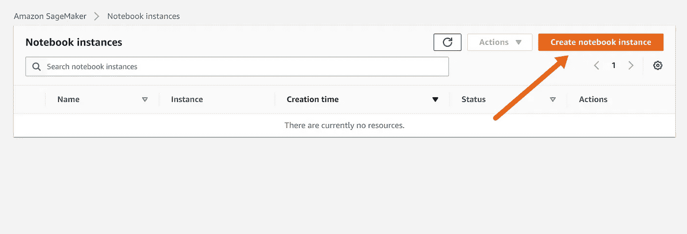

作者图片

我们使用 Jupyter Lab 3 创建了一个 *ml.t3.medium* 实例。我还创建了一个新的 IAM 角色，该角色将访问我的帐户上的所有 S3 存储桶。

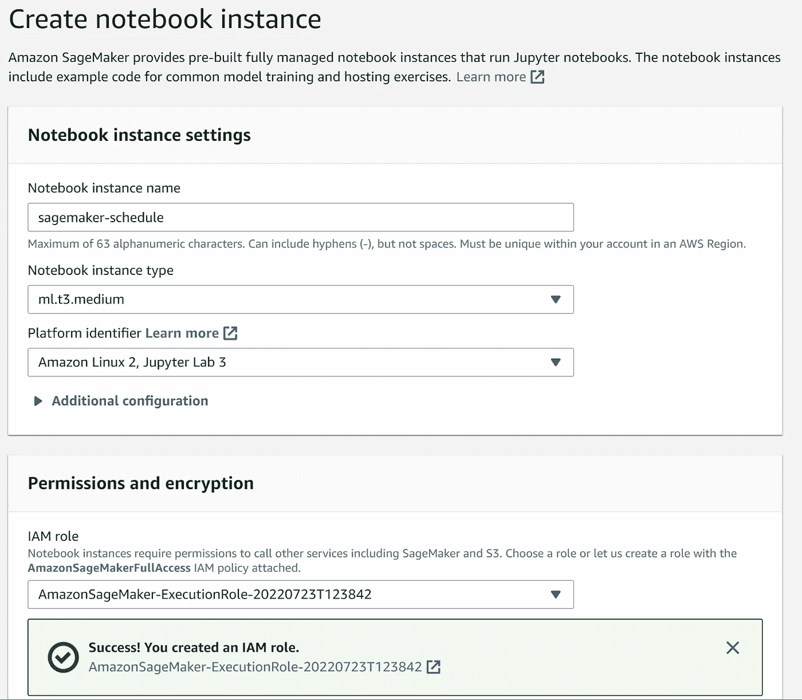

作者图片

创建您的笔记本实例后，您可以在 SageMaker 控制台中启动它并打开 Jupyter Lab。我将使用 *python3 conda* 环境内核，它预装了执行本教程所需的基本库。如果您需要在您的环境中安装外部库，您应该阅读[文档](https://docs.aws.amazon.com/sagemaker/latest/dg/nbi-add-external.html)。

然后，我们在我们的环境中创建我们的 **analysis.ipynb** Jupyter 笔记本。笔记本使用 *pandas* 从 GitHub 读取并处理 CSV 文件。然后，我们使用 *pandas* 和 *matplotlib* 绘制我们的新冠肺炎数据，并将生成的 PNG 文件导出到我们的 S3 存储桶。

我们示例中的代码如下所示。

你也可以在 [GitHub](https://github.com/rtkilian/data-science-blogging/blob/main/schedule_sagemaker_notebooks.ipynb) 上找到例子。

# 将生命周期配置添加到笔记本实例

一个[生命周期配置](https://docs.aws.amazon.com/sagemaker/latest/dg/notebook-lifecycle-config.html)是一个 shell 脚本，我们添加到我们的 SageMaker 笔记本实例来安装包，选择我们的 *conda* 环境，并自动停止我们的笔记本以防止超额计费。

首先为您的笔记本实例添加一个新的配置。

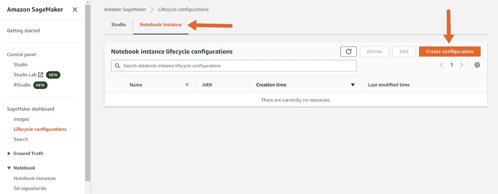

作者图片

我们将我们的配置称为 **schedule-configuration** ，并包含以下脚本。我们的脚本激活了 *python3 conda* 环境，并在空闲 5 分钟后加载命令来自动停止我们的笔记本实例。亚马逊提供的这个 [GitHub repo](https://github.com/aws-samples/amazon-sagemaker-notebook-instance-lifecycle-config-samples) 托管了几个样本生命周期配置脚本，你可以用它们来定制你的笔记本实例。

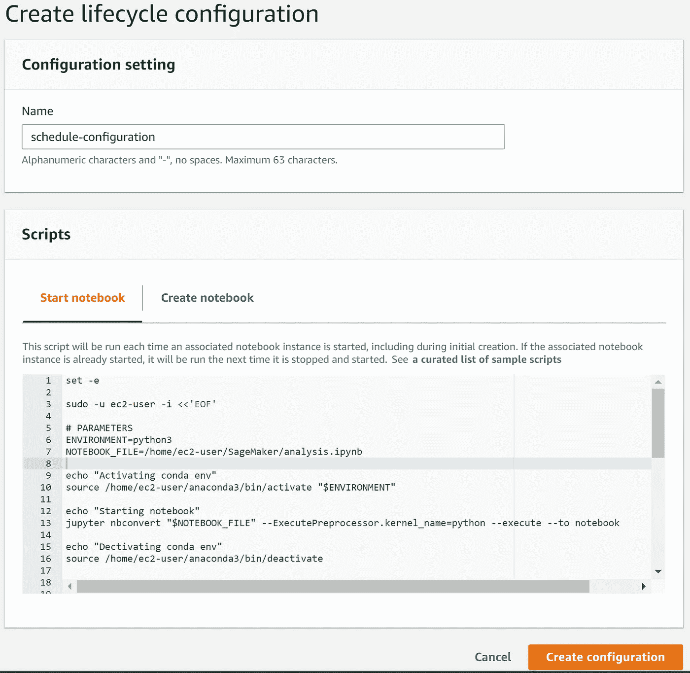

作者图片

```
set -esudo -u ec2-user -i <<'EOF'# PARAMETERS
ENVIRONMENT=python3
NOTEBOOK_FILE=/home/ec2-user/SageMaker/analysis.ipynbecho "Activating conda env"
source /home/ec2-user/anaconda3/bin/activate "$ENVIRONMENT"echo "Starting notebook"
jupyter nbconvert "$NOTEBOOK_FILE" --ExecutePreprocessor.kernel_name=python --execute --to notebookecho "Dectivating conda env"
source /home/ec2-user/anaconda3/bin/deactivate# PARAMETERS
IDLE_TIME=300echo "Fetching the autostop script"
wget [https://raw.githubusercontent.com/aws-samples/amazon-sagemaker-notebook-instance-lifecycle-config-samples/master/scripts/auto-stop-idle/autostop.py](https://raw.githubusercontent.com/aws-samples/amazon-sagemaker-notebook-instance-lifecycle-config-samples/master/scripts/auto-stop-idle/autostop.py)echo "Detecting Python install with boto3 install"# Find which install has boto3 and use that to run the cron command. So will use default when available
# Redirect stderr as it is unneeded
if /usr/bin/python -c "import boto3" 2>/dev/null; then
    PYTHON_DIR='/usr/bin/python'
elif /usr/bin/python3 -c "import boto3" 2>/dev/null; then
    PYTHON_DIR='/usr/bin/python3'
else
    # If no boto3 just quit because the script won't work
    echo "No boto3 found in Python or Python3\. Exiting..."
    exit 1
fiecho "Found boto3 at $PYTHON_DIR"echo "Starting the SageMaker autostop script in cron"(crontab -l 2>/dev/null; echo "*/5 * * * * $PYTHON_DIR $PWD/autostop.py --time $IDLE_TIME --ignore-connections >> /var/log/jupyter.log") | crontab -EOF
```

保存生命周期配置后，导航至您的笔记本实例，然后按“编辑”。

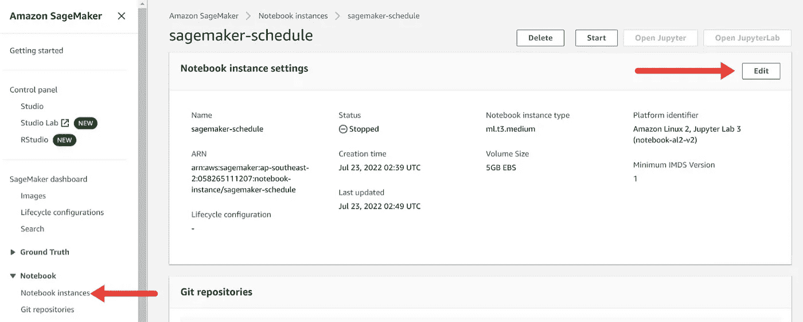

作者图片

添加您的生命周期配置并保存。启动您的笔记本实例将加载 *python3* 环境，并在空闲 5 分钟后触发自动停止功能。

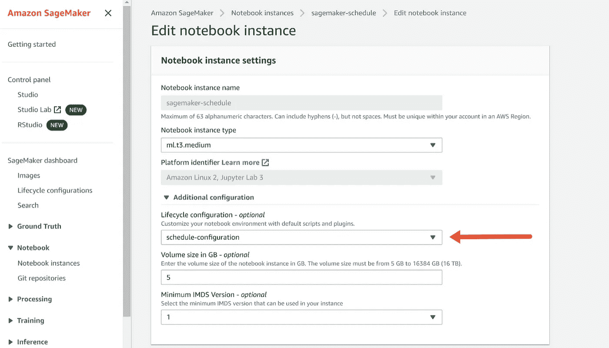

作者图片

# 用 Amazon EventBridge 和 AWS Lambda 触发笔记本

使用 Amazon EventBridge 和 AWS Lambda 可以按照固定的时间表运行我们的 SageMaker 笔记本。 [Amazon EventBridge](https://docs.aws.amazon.com/eventbridge/latest/userguide/eb-what-is.html) 是一个事件服务，它将触发一个 [AWS Lambda](https://docs.aws.amazon.com/eventbridge/latest/userguide/eb-what-is.html) 函数来启动我们的 SageMaker 笔记本实例。

首先，创建一个新的 Lambda 函数。

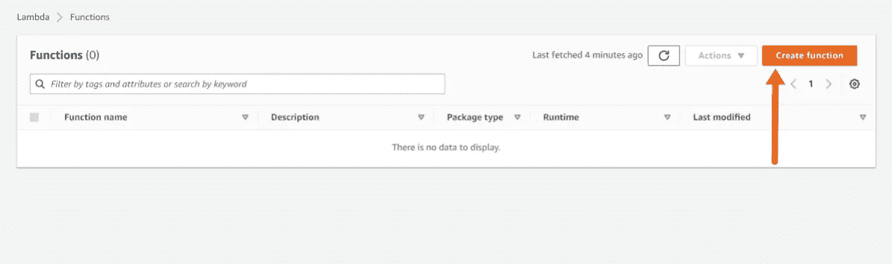

作者图片

我们将调用我们的函数 **launch_jupyter_nb** 并选择用 *Python 3.9* 编写。

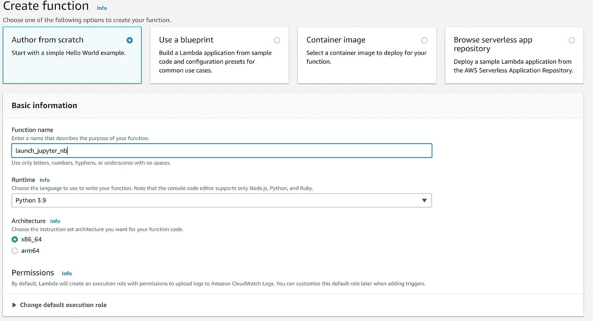

作者图片

保存后，我们添加 *boto3* 命令来启动我们的 SageMaker 笔记本实例。您可以在下面找到代码。完成后按“部署”。

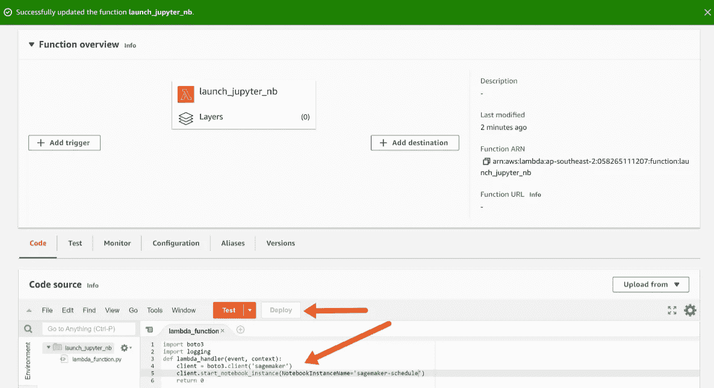

作者图片

```
import boto3
import logging
def lambda_handler(event, context):
    client = boto3.client('sagemaker')
    client.start_notebook_instance(NotebookInstanceName='sagemaker-schedule')
    return 0
```

我们还需要给 Lambda 函数访问 SageMaker Notebook 实例的权限。导航到“配置”选项卡，然后单击当前角色。

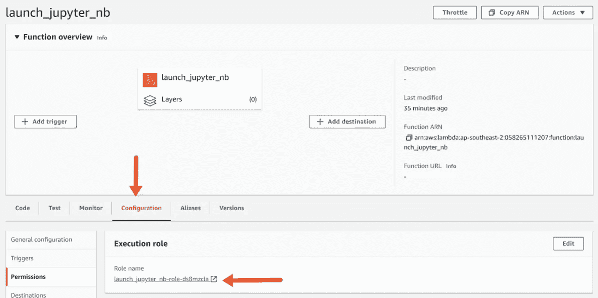

作者图片

单击该角色将引导您进入 IAM。在这里，您应该附加“AmazonSageMakerFullAccess”策略。

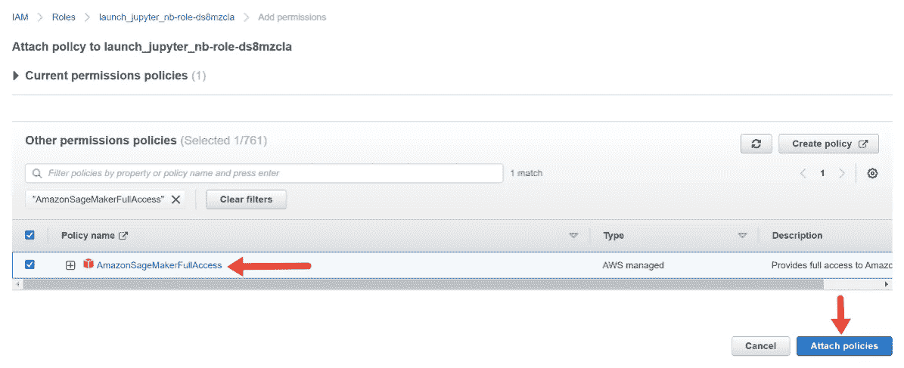

作者图片

回到 AWS Lambda，在“函数概述”下，给你的函数添加一个触发器。我们将添加一个名为 **launch_jupyter_nb** 的 EventBridge 触发器，它按照固定的时间表运行。我们使用一个 [Cron 表达式](https://docs.aws.amazon.com/eventbridge/latest/userguide/eb-create-rule-schedule.html)来指定时间表。在我们的示例中，EventBridge 触发器将在每天 03:00 UTC 运行。

```
cron(0 3 * * ? *)
```

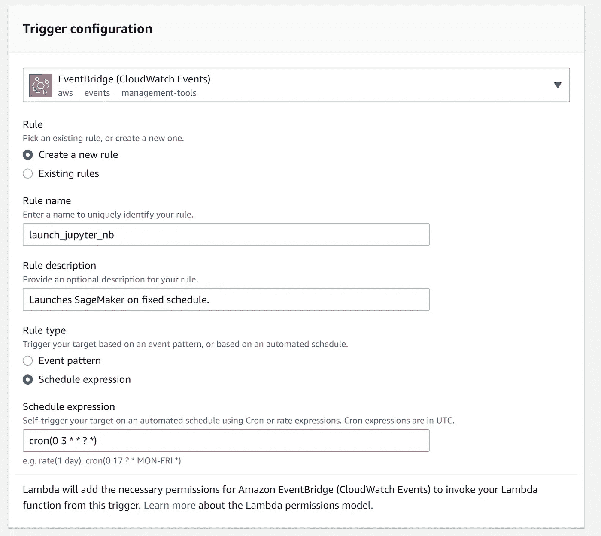

作者图片

我们完了！我们的 Jupyter 笔记本托管在 SageMaker 笔记本实例中，由于 Amazon EventBridge 和 AWS Lambda，它将按照固定的时间表运行。一旦笔记本电脑完成运行并闲置 5 分钟，我们的生命周期配置将关闭笔记本电脑实例。

# 其他考虑

在安排您的 Jupyter 笔记本时，您应该注意两个重要的考虑事项。首先，我们创建的生命周期配置不能运行超过 5 分钟。否则就会失败。根据[文档](https://docs.aws.amazon.com/sagemaker/latest/dg/notebook-lifecycle-config.html)，您可以通过以下方式克服这一限制:

*   减少步骤的数量
*   并行运行任务
*   在你的脚本中使用 [*nohup*](https://www.geeksforgeeks.org/nohup-command-in-linux-with-examples/) 命令

其次，本教程向您展示了如何在 SageMaker Notebook 实例中而不是[sage maker Studio Notebook](https://docs.aws.amazon.com/sagemaker/latest/dg/notebooks.html)中安排笔记本。您可以通过调整[生命周期配置](https://github.com/aws-samples/sagemaker-studio-lifecycle-config-examples)并参考*boto 3*文档来修改上述步骤，以使用 Studio 笔记本。

下次你的经理让你重复你的 Jupyter 笔记本分析，你可以。在本指南中，我向您展示了如何使用 Lambda 和 EventBridge 在 SageMaker 笔记本实例中调度您的笔记本。没有必要注册第三方服务。

喜欢你读的书吗？跟着我上[媒](https://medium.com/@rtkilian)。否则，[发微博给我](https://twitter.com/rtkilian)或者在 [LinkedIn](https://www.linkedin.com/in/rtkilian/) 上加我。

你可以在 GitHub 上找到这篇文章中用到的所有代码。

[1]约翰·霍普金斯大学系统科学与工程中心(CSSE)的新冠肺炎数据存储库，在知识共享署名 4.0 国际版(CC BY 4.0)下获得许可