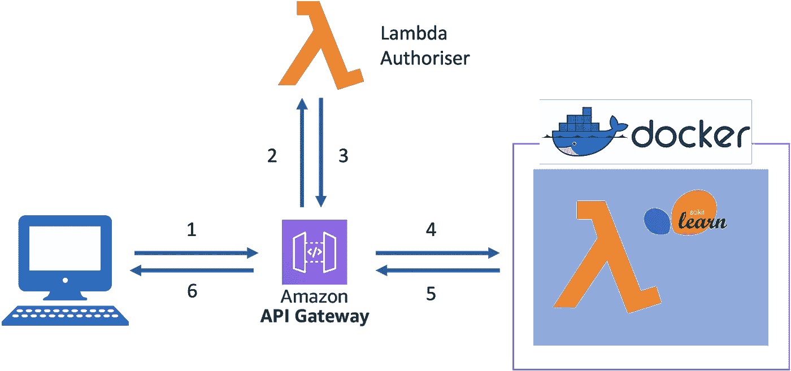

# 如何使用 CloudFormations 保护您的 AWS API 网关

> 原文：<https://towardsdatascience.com/how-to-secure-your-aws-api-gateways-with-cloudformations-template-713a17d3b1fd>

## 深入探讨如何保护您的 API


由 [Muhammad Zaqy Al Fattah](https://unsplash.com/@dizzydizz?utm_source=medium&utm_medium=referral) 在 [Unsplash](https://unsplash.com?utm_source=medium&utm_medium=referral) 上拍摄的照片

# 介绍

在任何机器学习模型到云的部署周期中，API 的安全性是一个重要的考虑因素。通过增加模型的可访问性，我们将无意中增加应用程序对潜在的未授权访问的脆弱性。

在之前的[帖子](/serverless-deployment-of-machine-learning-models-on-aws-lambda-5bd1ca9b5c42)中，我们部署了一个 k 近邻分类器，并将其作为 AWS lambda 上的 API 端点。在其当前的部署状态下，部署的 API 端点是不安全的，任何具有该 URL 的人都能够调用我们的函数。

让我们探索一下 Amazon 的 API 网关提供的一些方法来保护我们的 API 端点。下面列出了我们将详细探讨的保护 API 的两种方法。没有必要按顺序遵循这个指南，因此如果你想跳过，我已经链接了每个部分。

1.  [自定义 lambda 函数](#2598)。(`template_lambda.yaml`)

2.[身份访问管理。](#1d66) ( `template_iam.yaml`)

每种方法都有独特的特征，因此具有不同的优点和缺点。

# 先决条件

由于我们将建立在以前的项目上，本指南的先决条件将与我以前的博客中列出的要求相同。

[](/serverless-deployment-of-machine-learning-models-on-aws-lambda-5bd1ca9b5c42)  

在继续之前，您需要满足几个先决条件。本指南将要求您与许多工具进行交互，所以请花一些时间来满足这些先决条件。

我将使用 AWS 无服务器应用程序模型(SAM)来部署支持机器学习模型所需的所有基础设施。因此，假设您对使用 AWS SAM 和 AWS Cloudformations 有所了解。如果你不确定，请阅读我之前的博客，上面链接了更多关于使用 AWS SAM 模板以及如何部署它们的细节。

这个项目的源代码可以在下面的链接中找到。

[](https://github.com/lloydhamilton/aws_lambda_with_authoriser)  

# 1.λ授权者

Lambda authoriser 是一个自定义函数，充当 API 的看门人。它包含限制访问 API 网关背后的任何资源所需的授权逻辑。Lambda authoriser 在设计 API 访问控制时提供了更高的通用性，因为它有助于更好地定制授权逻辑。这是有利的，因为它允许更好地与第三方身份提供者集成，例如使用单点登录(SSO)的组织。

下面的图表详细描述了这个项目中 lambda 授权 API 网关的 HTTP 请求从发起到响应返回的路径。



作者图片

1.  HTTP POST 请求被发送到 API 网关，报头中带有授权令牌。
2.  指向 API 网关的 HTTP 请求启动 lambda 授权功能，其中授权令牌被认证。
3.  授权令牌的认证将返回允许或拒绝流量通过 API 网关的策略文档。
4.  lambda 授权者对 API 流量的成功认证将调用 lambda 函数来执行 ML 预测。
5.  预测通过 API 网关传递回客户端。
6.  客户端将在 HTTP 响应中接收作为数据有效负载的预测。

为了在 AWS cloudformations 上部署 lambda 授权的 API 网关，我们必须定义/声明 3 个关键资源。

*   包含授权逻辑的 python 函数。(handler.py)
*   SAM 模板中提供 python 函数的 lambda authoriser 函数资源。(template_lambda.yaml)
*   API 资源属性中对 lambda 授权者的引用。(template_lambda.yaml)

## **handler.py**

```
authorizer
  ├── handler.py
  └── requirements.txt
```

handler.py 文件包含 lambda 授权器的主要授权逻辑。在这个例子中，我们将使用 JSON web 令牌( [JWT](https://jwt.io/introduction) )来编码和解码通过 HTTP 请求传递的授权令牌。

需要注意的关键事项:

*   第 12 行:在这段代码中，密钥是纯文本的，只是为了演示的目的。我强烈推荐使用更安全的方法来访问密钥，比如 AWS secrets manager，这不在讨论范围之内。
*   第 15–21 行:JWT 令牌解码中的异常会将`auth`设置为“拒绝”。`auth`仅在 JWT 解码通过时设置为“允许”。
*   第 24–37 行:`authorize`函数将返回一个 JSON 策略文档，其中包含控制通过 API 网关访问的权限。

lambda authoriser 最重要的一点是，必须返回一个访问策略文档，这样才能工作。

## `template_lambda.yaml`

要部署 lambda 授权器，在资源选项卡下定义 lambda 授权功能，如`template_lambda.yaml`所示。在本例中，我们将授权函数定义为`MyAuthFunctions`,声明的属性如下面的代码片段所示。

要将 API 配置为使用`MyAuthFunctions`作为授权者，应该在`Auth`属性选项卡下声明对该函数的引用。

如下面的`template_lambda.yaml`所示，`MyApi`的默认授权者被声明为 lambda 函数`MyAuthFunctions`。因此，发送到`MyApi`的 HTTP 请求将启动 python 文件中定义的授权逻辑，以认证存储在`authorizatioToken`头中的 JWT。

## 部署

要部署 cloudformation 堆栈:

1.  建立 docker 形象。

```
sam build -t template_lambda.yaml
```

2.使用 SAM 在 AWS 上部署。

```
sam deploy --guided
```

成功部署堆栈后，我们可以用下面的代码调用 API。**用 API 端点的返回 URL 替换 URL。**

如前所述，lambda 授权器在管理 API 网关的授权逻辑方面提供了更多的功能。然而，如果没有为云安全设计适当的加密程序的适当知识，使用 lambda 授权者要自担风险。

保护您的 API 的一个更好的替代方法是利用现有的认证工具，如 IAM 或 Cognito(不在范围内),它们可以很容易地集成到 Amazon 的 API 网关中。

# 2.身份访问管理(IAM)

AWS 身份访问管理(IAM)是一项全球管理的服务，提供对 AWS 平台上的服务和资源的访问控制。从根本上说，它允许管理员通过分配权限来控制对 AWS 资源的访问。

使用 IAM，对 API 的 HTTP 调用将需要符合 AWS Signature Version 4 签名过程的附加身份验证信息。这个过程将使用预定义的访问和密钥对 HTTP 请求进行签名，这些密钥可以通过 IAM 控制台或通过`boto3` python API 获得。一般来说，签名是通过一系列嵌套的 sha256 散列结合当前的 datetime 和 IAM 安全凭证来创建的。

关于 AWS Signature V4 签名流程如何工作的具体细节可以在链接到此处的[主文档中找到。](https://docs.aws.amazon.com/general/latest/gr/signature-version-4.html)

## template_iam.yaml

与 lambda 授权者不同，通过 IAM 策略进行身份验证只需要对 cloudformation 模板代码进行微小的调整。要通过 IAM 认证`MyApi`，只需将`DefaultAuthoriser`选项设置为`AWS_IAM`。

## 部署

要部署 cloudformation 堆栈:

1.  建立 docker 形象。

```
sam build -t template_lambda.yaml
```

2.使用 SAM 在 AWS 上部署。

```
sam deploy --guided
```

成功部署堆栈后，我们可以用下面的代码调用 API。函数`aws_sign_v4.sign_v4`将使用当前在`boto3`会话中活动的已配置的 AWS 凭证来处理 HTTP 请求的签名。或者，您可以创建一个新的 IAM 用户，并通过 AWS 控制台访问所需的凭证，方法是遵循这里的官方文档。

AWS 使得配置和部署 IAM 认证的 API 网关变得非常简单。与 lambda 授权者不同，它不需要维护额外的代码，因此降低了安全漏洞的风险。然而，生成遵循正确协议的签名 HTTP 请求的复杂性增加了，但这仍然没有实现 lambda 授权器复杂。

# 摘要

总而言之，AWS 提供了很好的工具来集成所有 API 调用的认证过程。这将确保只有拥有适当权限的个人才能访问您的应用程序。哪个是更好的选择？嗯，这将取决于你的具体需求，以及你在云中设计系统的技术知识。

我希望你从这本指南中有所收获，并期待再次在这里见到你！如果有任何问题，请留下您的评论，我将非常乐意帮助您。

请在 LinkedIn、Medium 或 Twitter([@ illoyd Hamilton](https://twitter.com/iLloydHamilton))上关注我，了解更多数据科学相关内容，或在 [CodeClan](https://codeclan.com/) 与我一起学习。