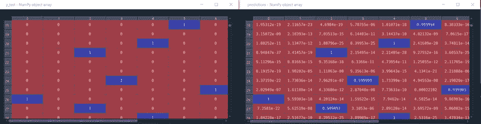
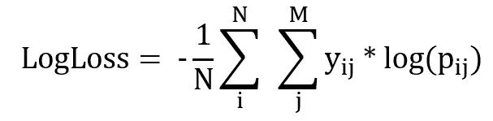

# 分类问题如何选择损失函数和激活函数

> 原文：<https://towardsdatascience.com/how-to-select-loss-function-and-activation-function-for-classification-problems-b7f32c724507>

## 了解如何选择神经网络最后一层的激活函数和损失函数

机器学习模型由遵循特定流程适应的数学过程组成。这需要一定的和谐与平衡。在构建模型时，从导入数据到评估结果的过程可能会有大量不同的组合。所以，机器学习，尤其是深度学习架构，可以称之为多种选择融合调和的数字艺术架构。深度学习粗略地产生前向传播和反向传播，意味着为了降低损失值而更新权重。本文介绍了如何在训练模型之前选择集合损失函数和激活函数变量。


照片由[丹尼斯·莱昂](https://unsplash.com/@denisseleon?utm_source=medium&utm_medium=referral)在 [Unsplash](https://unsplash.com?utm_source=medium&utm_medium=referral) 上拍摄

在进入内容之前，先澄清问题类型和一些术语:

*   **目标:**输入的最终输出，例如，物种列是 Iris 数据集的目标。
*   **标签:**输入的结果，例如，鸢尾、海滨鸢尾、杂色鸢尾是鸢尾数据集的标签。

分类可以是:

*   **二元分类:**目标中有 2 个标签。示例:[0]或[1]
*   **多类分类:**有两个以上的目标，但只有一个标签被分配给一个输入。示例:[0 0 1]或[1 0 0]或[0 1 0]。
*   **多标签分类:**有两个以上的目标，但一个输入可以分配多个标签。示例[ 1 1 0]或[1 0 1]或[0 1 1]

# 激活功能

如介绍中所述，模型的训练基于正向传播和反向传播。当从更广的角度来看该模型时，借助于设计的深度学习模型中的层提取的信息被转移到最终层用于分类过程。所选择的最终激活函数对于确定估计结果非常重要，这里的[是可视化](https://7-hiddenlayers.com/wp-content/uploads/2020/06/NEURONS-IN-NUERAL-NETWORK.gif)的链接。

因此，最终层中神经元的数量和最终层中使用的激活函数是相关的。这种关系如下:

如果是**二元分类**，即目标值集中只有 2 个标签:

## **-逻辑/乙状结肠激活功能**

Sigmoid 激活函数取 0 到 1 之间的值。值<0.5 are assigned to 0, values > 0.5 被赋值为 1，通过将它们与测试数据集进行比较来执行模型评估。

由于目标值将被分配给一个输入，`model.add(Dense(1,activation = “sigmoid”))`用于最终层。该模型建立在包含 2 个标签(二进制分类)的`breast_cancer dataset`之上，在下面的 sklearn 库中提供。

前 10 个`prediction`值是:

```
0.99996, 0.999997, 0.999995, 0.999813, 0.00298241, 5.99027e-06, 0.0589639, 0.985855, 0.999954, 8.34465e-07, 0.999944
```

而前 10 个`y_test`值是:

```
1, 1, 1, 1, 0, 0, 0, 1, 1, 0, 1
```

这里，阈值被设置为 0.5，预测值被舍入为 0 或 1。Sigmoid 激活函数主要用于二分类问题。

## - Softmax 激活功能

Softmax 激活函数也采用 0 到 1 之间的值，这些值是矢量值，表示概率比。获得的矢量结果分别给出了输入的每个目标(标签)的概率。具有明显最高概率的结果被选为预测结果。当然，对于那个过程，数据集必须是多类的，这意味着一个热编码。

由于概率数据将被分配给每个目标值，`model.add(Dense(10,activation = “softmax”))`被用于包括 10 个不同标签的数据集的最终层。以下是 sklearn 库中提供的数字数据集的示例:

在图 1 中，显示了一个截面的预测结果和已知的`y_test`值。在下一步中，如代码块所示，通过使用`np.argmax`确定每一行中的最大数据属于哪个目标来执行模型评估。



图一。y _ 测试值(左)和预测结果(右)，作者图片

## **- ReLu、Tanh 等**

在最后一层中，出于上述原因，sigmoid 和 softmax 是优选的。此外，有各种激活功能应用于模型中的层。其中一些可以在[维基百科链接](https://en.wikipedia.org/wiki/Activation_function)上找到。

**— ReLu**

整流线性激活单元是最优选的激活函数之一，因为它的消失梯度减小。虽然最小值为 0，但最大值没有限制。

```
the input<0, output=0
the input>0, output=input
```

在 MLP 和美国有线电视新闻网的模型中，它经常被首选。

**— Tanh**

它取值在-1 和 1 之间。它类似于 sigmoid 激活函数，是递归神经网络(RNN)的首选。它相对于 sigmoid 激活函数的优点是，它是围绕中心= 0 成形的，因为它取-1 和 1 之间的值，对于 sigmoid 来说，相同的情况是 0.5。这导致对下一层更有意义的学习。

# 损失函数

## **二元交叉熵**

二元交叉熵考虑真实标签和预测标签的值来计算损失值。顾名思义，在第一个代码块中可以看到,`binary_crossentropy`被用作损失函数来在二进制标签之间进行分类。使用通过 sigmoid 激活函数获得的概率估计结果和通过二进制交叉熵计算的损失来更新权重，然后进行训练。

## **分类交叉熵**

在多类数据集中，概率结果作为阵列输出估计获得。这里用`categorical_crossentropy`把这个分布训练成正确的方向。数学公式如下:



图二。分类交叉熵的数学公式，作者图像

## 稀疏分类交叉熵

它用于多个标签。分类交叉熵和稀疏分类交叉熵之间的主要区别在于，分类交叉熵用于一次性编码的目标([1 0 0]、[0 1 0]、[0 0 1])，而稀疏分类交叉熵用于编码的标签([0]、[1]、[2])。

例如，在第二代码块中，标签被转换为(n_samples，10)，即标签-9 对应于[0 0 0 0 0 0 0 0 0 0 0 0 0 0 1]，从而`categorical_crossentropy`被用作损失函数。如果标签被转换为整数，即标签-9 对应于[9]，则首选`sparse_categorical_crossentropy`。

# 结论

深度学习架构不仅应该与使用的层保持一定的和谐，还应该与模型的编译保持一定的和谐。为了实现这种和谐，从数据集的维度开始，应该考虑模型的输出维度并做出选择。

**如果问题是二元分类:**

*   在最后一层使用`model.add(Dense(1,activation = “sigmoid”))`可以选择`Binary_crossentropy`作为损耗。预测输出将是包括概率值的(n_test_samples，1)数组，并且选择 0.5 阈值将其设置为 0 或 1。
*   或者，通过选择`sparse_categorical_crossentropy`作为损耗，可以在最终层中使用`model.add(Dense(2,activation = “softmax”))`。预测输出将是(n_test_samples，2)数组，其包括分别属于标签的概率值。然后，使用`pred_labels = np.argmax(predictions, axis = 1)`，选择最大值，并通过与 y_test 比较进行模型评估。

**如果问题是多类分类:**

*   目标值被转换为一键编码格式，并且在最后一层使用`model.add(Dense(n_labels, activation = “softmax”))`可以选择`categorical_crossentropy`作为损失。预测输出将是(n_test_samples，n_layers)，并且使用包括概率值和`np.argmax(predictions, axis = 1)`的数组来确定最大值。
*   目标值被转换为整数(使用 LabelEncoder)，然后在最后一层添加`model.add(Dense(n_labels ,activation = “softmax”))`或`model.add(Dense(n_labels ,activation = “sigmoid”))`，并设置损失函数`sparse_categorical_crossentropy`。由于预测结果的形状将是(n_test_samples，n_labels)，因此可以通过使用`np.argmax`选择最大概率，使用 y_test 值来评估模型。

> 由于其性质，校正线性单元(ReLu)不能用作最终图层，而是应用于模型中的图层。

> 通过在 python 环境中使用上面的代码块尝试各种版本并观察维度，可以探索更多。

[](https://ibrahimkovan.medium.com/machine-learning-guideline-959da5c6f73d) [## 机器学习指南

### 所有与机器学习相关的文章

ibrahimkovan.medium.com](https://ibrahimkovan.medium.com/machine-learning-guideline-959da5c6f73d)