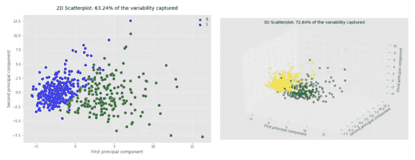
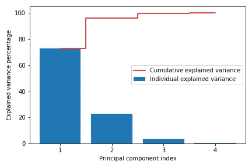
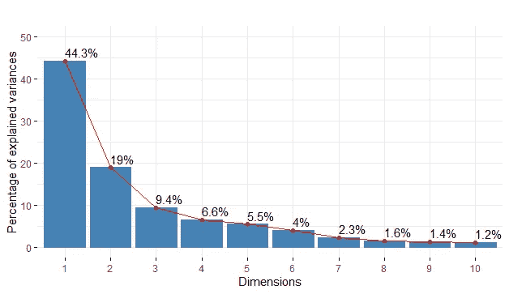
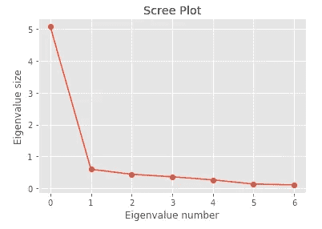

# 如何为数据集选择最佳数量的主成分

> 原文：<https://towardsdatascience.com/how-to-select-the-best-number-of-principal-components-for-the-dataset-287e64b14c6d>

## 你应该遵循的六种方法


兰迪·法特在 [Unsplash](https://unsplash.com/?utm_source=unsplash&utm_medium=referral&utm_content=creditCopyText) 上的照片

在对数据集应用主成分分析(PCA)时，选择最佳数量的主成分是主要挑战。

在技术术语中，选择主成分的最佳数量被称为一种超参数调整过程，在该过程中，我们为 Scikit-learn **PCA()** 类中的超参数 **n_components** 选择最佳值。

```
from sklearn.decomposition import PCA
pca = PCA(**n_components=?**)
```

换句话说，当我们对具有 **p** 个变量的原始数据集应用 PCA 得到具有 **k** 个**和**个变量(主成分)的变换数据集时， **n_components** 等于 **k** ，其中 **k** 的值远小于 **p** 的值。

由于 **n_components** 是一个[超参数](https://rukshanpramoditha.medium.com/parameters-vs-hyperparameters-what-is-the-difference-5f40e16e2e82)，它不从数据中学习。在运行 **PCA(** )功能之前，我们必须手动指定其值(调整超参数)。

为 **n_components** 选择最佳数量的背后没有什么神奇的规则。这取决于我们真正想从 PCA 得到什么。一些视觉检查和领域知识也可能有助于推断出 **n_components** 的正确值。

今天的文章专门讨论六种有效的方法，它们将帮助您为数据集选择最佳数量的主成分。

我们开始吧！

## 方法 1:如果你做 PCA 的唯一目的是为了数据可视化，你应该选择 2 或 3 个主成分。

PCA 对于数据可视化非常有用。通过主成分分析可以实现高维数据的可视化。

由于我们只熟悉 2D 和 3D 图，我们应该将高维数据转换成 2 维或 3 维数据，以便在 2D 或 3D 图上可视化。这可以通过 PCA 来实现。

对于 2D 图，我们需要选择 2 个主成分。

对于 3D 绘图，我们需要选择 3 个主成分。

在下图中，您可以看到 30 维*乳腺癌*数据的可视化示例。由于数据集包含 30 个变量，其维数为 30。我们无法在 30D 绘图中绘制 30 维数据，因为我们无法想象它是如何存在的。为此，我们将 PCA 应用于数据集，并选择 2 或 3 个主成分，这些主成分可以绘制在 2D 或 3D 图上。



**使用 PCA 对高维数据进行可视化**(图片由作者提供)

这些图大致代表了原始数据。这是因为当我们降低数据的维度时，我们丢失了原始数据中的一些方差。

## 方法 2:如果您希望在应用 PCA 后在数据中保留一个精确的方差，请为超参数 **n_components 指定一个介于 0 和 1 之间的浮点数。**

这是为数据集选择最佳数量的主成分的最简单方法。例如，如果您希望在应用 PCA 后保留原始数据中 85%的方差，您可以将浮点值 0.85 指定给超参数 **n_components** ，如下所示。

```
from sklearn.decomposition import PCA
pca = PCA(**n_components=0.85**)
```

然后，算法自动选择保持原始数据中 85%方差的最佳数量的主成分。如果您想知道算法选择了多少个组件，请运行以下代码行。

```
pca.n_components_
```

这将返回一个等于所选组件数量的整数值。

## 方法 3:绘制单个成分的解释方差百分比和所有主成分获得的总方差百分比。

这是最先进、最有效的方法，可用于为数据集选择最佳数量的主成分。

在此方法中，我们创建了以下类型的绘图。



**主成分捕获的总方差的百分比**(图片由作者提供)

条的数量等于原始数据集中变量的数量。在此图中，每个条形显示单个组件的解释差异百分比，而阶跃图显示累积的解释差异百分比。

通过查看该图，我们可以很容易地决定应该保留多少组件。在本例中，只有前两个分量捕获了数据集中几乎所有的方差。因此，我们决定只选择前两个组件。

要获取创建上述类型情节的 Python 代码，请参考我的《 [**主成分分析—十八问答**](https://rukshanpramoditha.medium.com/principal-component-analysis-18-questions-answered-4abd72041ccd) 》文章第 15 题。

在 R 中，使用 **factoextra** 库中的 **fviz_eig()** 函数，只需运行一行代码，就可以创建类似类型的绘图！

```
fviz_eig(pca_model, addlabels = TRUE, 
         linecolor = "Red", ylim = c(0, 50))
```



(图片由作者提供)

在这里，每个条形也显示了单个组件的解释差异百分比。红线是一种碎石图。

## 方法 4:创建碎石地块。

我们可以创建另一种类型的图来选择主成分的最佳数量，这就是 **Scree 图**，它是定义特征向量(主成分)大小的特征值的可视化表示。



**一个小阴谋**(图片由作者提供)

在 Scikit-learn PCA()类中，可以使用下面一行代码获得特征值。

```
pca.explained_variance_
```

为了创建上面的图，我们可以使用下面的代码块。

```
import matplotlib.pyplot as plt
plt.style.use("ggplot") plt.plot(pca.explained_variance_, marker='o')
plt.xlabel("Eigenvalue number")
plt.ylabel("Eigenvalue size")
plt.title("Scree Plot")
```

我们选择所有元件，直到在碎石图中发生弯曲的点。在上图中，弯曲发生在索引 1 处。因此，我们决定选择索引 0 和索引 1 处的组件(总共两个组件)。

## 方法五:遵循凯泽的法则。

> *根据* **凯泽** *法则，建议保留所有特征值大于 1 的分量。*

使用 PCA()类的`explained_variance_`属性可以得到特征值。

然后，您可以选择特征值大于 1 的元件。当遵循此规则时，最好将其与方法 3 中讨论的解释方差百分比图或方法 4 中讨论的碎石图结合起来。有时，略小于 1 的特征值(例如 0.95)可能会捕捉到数据中的一些显著变化。因此，如果它在解释的方差百分比图中显示相对较高的柱线，最好也保留它。

## 方法 6:使用一个性能评估指标，例如 RMSE(用于回归)或准确度分数(用于分类)。

只有当您计划在应用 PCA 后对缩减(转换)的数据集执行回归或分类任务时，才能使用此方法。

通过使用方法 3 中讨论的图，您可以选择主成分的初始数量，并获得缩减的(变换的)数据集。然后，您构建一个回归或分类模型，并通过 RMSE 或准确度分数来衡量其性能。然后，您稍微改变主成分的数量，再次构建模型并测量其性能得分。重复这些步骤几次后，您可以选择实际上给出最佳性能分数的最佳数量的主成分。

请注意，模型的性能分数还取决于其他因素。例如，它取决于分裂训练测试集的随机状态、数据量、类别不平衡、模式中的树的数量(如果模型是随机森林或类似的变体)、我们在优化期间设置的迭代次数、数据中的异常值和缺失值等。所以，使用这种方法的时候一定要小心！

# 摘要

没有必要同时尝试所有这些方法。最有效的方法是使用方法 3 中创建的图。你也可以把德皇法则和那个情节结合起来。

很明显，主成分的最佳数目取决于我们真正想从主成分分析中得到什么。如果我们做 PCA 的唯一目的是为了数据可视化，那么组件的最佳数量是 2 或 3。如果我们真的想减少数据集的大小，最佳的主成分数要比原始数据集中的变量数少得多。

当将 PCA 应用于数据集时，一个黄金法则总是存在的。

> **选择最佳数量的主成分，同时尽可能保留原始数据中的方差。**

如果您忽略了捕获数据中大量差异的关键组件，则在您对转换后的数据集执行回归、分类或其他可视化任务时，模型的性能得分将会降低。

应用 PCA 不是一次性的过程。这是一个反复的过程。您需要多次运行 PCA()函数。

首先，您必须用`n_components=None`运行 PCA()函数，这意味着我们暂时保留所有组件。

```
from sklearn.decomposition import PCA
pca_1 = PCA(**n_components=None**)
```

然后，我们创建方法 3 中讨论的图，并选择主成分的最佳数量(称为 ***k*** )。最后，我们用`n_components=k`再次运行 PCA()函数

```
pca_2 = PCA(**n_components=k**)
```

今天的文章到此结束。如果你对这篇文章有任何疑问，请在评论区告诉我。

感谢阅读！

下一篇文章再见！一如既往，祝大家学习愉快！

## 接下来阅读(推荐)——我写的！

了解主成分分析(PCA)的幕后工作原理。

[](https://rukshanpramoditha.medium.com/eigendecomposition-of-a-covariance-matrix-with-numpy-c953334c965d)  

一站式解决您关于 PCA 的大部分问题。

[](https://rukshanpramoditha.medium.com/principal-component-analysis-18-questions-answered-4abd72041ccd)  

主成分分析在降维中的应用。

[](/rgb-color-image-compression-using-principal-component-analysis-fce3f48dfdd0)  

整个 ML 都是降维及其应用。让我们看看他们的行动吧！

[](/11-different-uses-of-dimensionality-reduction-4325d62b4fa6)  

了解参数和超参数之间的区别。

[](https://rukshanpramoditha.medium.com/parameters-vs-hyperparameters-what-is-the-difference-5f40e16e2e82)  

## 成为会员

如果你愿意的话，你可以注册成为会员，以获得我写的每一个故事的全部信息，我会收到你的一部分会员费。

[](https://rukshanpramoditha.medium.com/membership)  

## 订阅我的电子邮件列表

订阅我的电子邮件列表，再也不会错过精彩的故事了。我一点击发布按钮，你就会在收件箱里收到每一篇文章。

[](https://rukshanpramoditha.medium.com/subscribe)  

撰写人[鲁克山·普拉莫蒂塔](https://medium.com/u/f90a3bb1d400?source=post_page-----287e64b14c6d--------------------------------)
**2022–04–24**