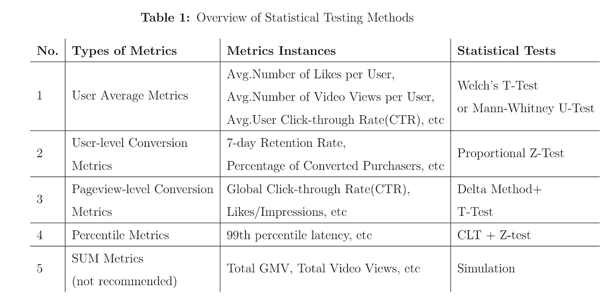
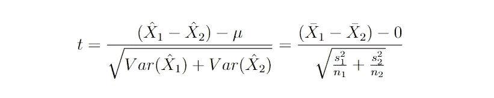
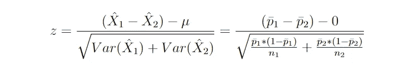
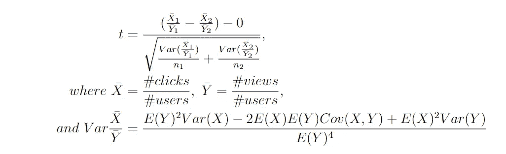
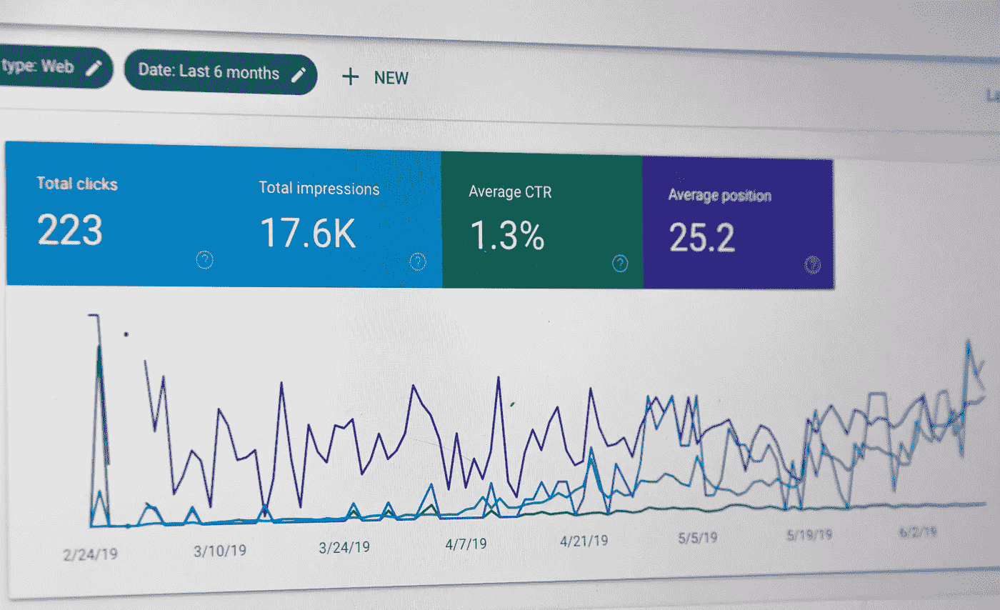
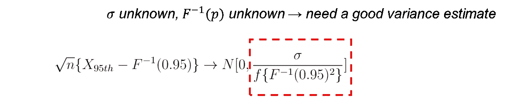
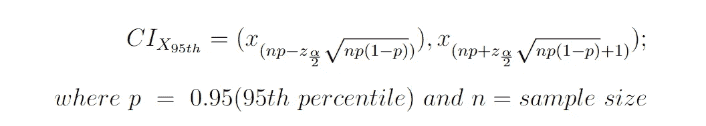
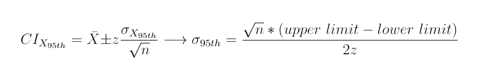

# 如何为不同的 A/B 指标选择正确的统计测试

> 原文：<https://towardsdatascience.com/how-to-select-the-right-statistical-tests-for-different-a-b-metrics-c8a1865851e>

## 讨论 5 种 A/B 指标的定位方法

# TL；速度三角形定位法(dead reckoning)

本文将 A/B 测试评估指标总结为 **5 个类别**，并在下表中概述了**建议的对其显著性值**的统计测试。

按作者分类的表格

# 目录

1.  [我们为什么要在乎](#1a90)
2.  [用户平均指标](#1215)
3.  [用户级转化指标](#f15d)
4.  [浏览量级转化指标](#e753)
5.  [百分位数指标](#5b15)
6.  [总和指标](#3ca6)
7.  [总结和实用提示](#e8c1)
8.  [注](#6219)

# 我们为什么要关心？

虽然 t-tests 非常强大，但是它们并不普遍适用于数据世界，因为数据世界中的业务指标分布与单一正态分布有很大不同。例如，每个用户发送的礼物数量和分享行为通常与严重的异常值有很大的偏差。这是因为用户行为不像统计规则那样有组织和客观，而是情绪化的，通常以极端行为为特征。

作为数据科学家，我们有责任，也是我们的价值所在，更深入地研究从统计学角度看具有科学意义的不同业务指标的适当测试方法。我们应该时刻提醒自己在进行 t 检验之前要检查抽样分布。

# 细节扩展

在这一主要段落中，我讨论了与 5 个度量类别中的每一个相对应的适当的测试方法。简而言之，决定使用哪种方法的两个关键方面是统计和实验角度。具体来说，我们想问自己两个问题:

1.  抽样分布是否符合假设(如独立性、正态性等)。)的建议测试方法？
2.  随机化单元是否与分析单元一致？

[图片由 Towfiqu Barbhuiya 在 Unsplash 上拍摄](https://unsplash.com/photos/oZuBNC-6E2s)

## 1.用户平均指标(例如，喜欢/用户、停留时间/用户等)

> 建议的测试 **:** Welch 的 T-Test，如果指标不是严重稀疏和偏斜的。否则，选择**曼-惠特尼秩和 U 检验**

***什么是用户平均指标？***

用户平均指标是根据独立用户的数量对总体业务绩效进行平均的指标，如实验期间**每个用户的平均点赞数**和**每个用户的平均停留时间**。它们是 A/B 测试中经常使用的评估标准，这种控制组和实验组之间的数学期望或样本均值是否相同的比较也是最常见和最经典的统计测试场景之一。

***如何测试用户平均指标***

对样本均值统计量进行假设检验的方法通常是**双样本 t 检验。**简单地说，双样本 t 检验通过比较两个样本组之间的样本均值来确定两个总体中某个指标的期望均值是否相等。**两个** **假设**以一种坦率但不太精确的方式是:

*   **每个样本观察值需要是独立的，并且遵循正态或准正态分布(i.i.d.):** 独立分布假设通常得到满足，因为每个用户都可以被视为独立的个体*，并且实验的随机化单元通常是用户级的(大多数实验通过用户 id 来确定特定用户属于哪个实验组)。**具有独立性，然后可以应用中心极限定理导出正态性**，满足双样本 t 检验的这一假设。值得重申的是，尽管 CLT 下的 t-检验的稳健性被公认为 t-检验结果通常是有效的，即使总体分布在技术上不是正态的(准/渐近正态)，这在现实世界的问题中是经常发生的，**稳健性对于非中度偏离正态的分布是有界的** ( [Bartlett，1935](https://www.cambridge.org/core/journals/mathematical-proceedings-of-the-cambridge-philosophical-society/article/abs/effect-of-nonnormality-on-the-t-distribution/400D10D04B8C956E6F2D9783CB6BEF23)；Snijders，2011 年。如果基础分布严重偏斜、多模态或带有极端异常值的稀疏分布，它就变得不太可信。
    作为旁注，[分位数-分位数(QQ)图](https://docs.scipy.org/doc/scipy/reference/generated/scipy.stats.probplot.html)，[直方图](https://seaborn.pydata.org/generated/seaborn.histplot.html)，[夏皮罗-维尔克检验](https://docs.scipy.org/doc/scipy/reference/generated/scipy.stats.shapiro.html)，[科尔莫戈罗夫-斯米尔诺夫(KS)检验](https://docs.scipy.org/doc/scipy/reference/generated/scipy.stats.kstest.html)是检验正态性的常用方法。
*   **两个总体中评估指标的方差可以是未知的，但它们需要是同质的:**这不是一个严格的假设，因为我们可以使用[韦尔奇的 t-检验](https://en.wikipedia.org/wiki/Welch%27s_t-test)，或不等方差 t-检验，来进行相等均值的假设检验。Welch 的 t 检验和 Student 的 t 检验在数学上的区别主要是关于自由度和样本方差估计。事实上，**我们应该总是使用韦尔奇的 t 检验，而不是学生 t 检验**。这不仅是一些学术文章(Delacre 等人，2017 年)所暗示的，也是科技公司的实验平台工程师根据我的经验提出的，因为从数据库中提取所有数据并断言方差相等可能会**计算昂贵**和耗时，这通常也是一个伪命题(在数百万和数十亿规模上计算方差可能非常繁重)。

> Delacre 等人(2017 年)表明，当不满足方差齐性假设时，Welch 的*t*-检验对 1 型错误率提供了更好的控制，当假设满足时，与 Student 的*t*-检验相比，它几乎没有损失稳健性。因此，他们认为韦尔奇的 *t* 测试应该作为一种默认策略。

等式 1: t 统计量

对于那些高度偏斜的指标，针对两个独立组的非参数方法— **Mann-Whitney 秩和 U 检验(MW 检验)** —更为合适，因为它使用“等级”而非真实值来确定指标的差异是否显著，从而绕过了由极值引入的失真。此外，即使通过用等级替代绝对值来丢失信息，MW 测试的灵敏度(功效)也不会令人失望，因为当分布高度偏斜时，其他参数测试(如 t-test)做出真正积极推断的能力会有更大幅度的下降— *VK 团队进行了模拟，并详细展示了这一想法。我强烈建议在这里* *查阅他们的中型文章* [*。*](https://vkteam.medium.com/practitioners-guide-to-statistical-tests-ed2d580ef04f#9e58)

然而，MW 测试的缺点是它是**计算密集型的**，因为它需要对完整的样本集进行排序来生成等级，所以在决定进行 MW 测试之前，应该考虑数据的大小。

## 2.用户级转换指标

> 建议的检验:比例 Z 检验

***什么是用户级转化指标？***

用户级转化是从**二进制结果**中得出的指标——该用户是否保留，该用户是否转化，等等。换句话说，所有用户将只有一个观察值，该观察值是 1 或 0 的标识符，这使得用户级别的转换度量基本上是**二项式比例统计** (#转换的用户/#所有用户)。

***如何测试用户级转化指标？***

根据中心极限定理(CLT)，我们可以使用正态分布安全地近似二项比例统计的分布。另一种思考方式是**对二项式聚合进行比例分配非常类似于取平均值**，其中当用户总数(人口规模)足够大时，CLT 可以有效地断言任何样本均值分布的正态性。因此，z-test 成为一个完美的候选。

等式 2:二项式比例

与上面讨论的用户平均度量相比，通常满足正态近似的假设，因为由于二进制伯努利事件的良好特性，底层采样分布是二项式的，而不是急剧偏斜的。此外，用户数量或人口规模通常非常大，以支持合理的近似值(根据经验，当 *N*p > 5* 和 *N*(1-p) > 5* 时，我们通常很有信心)。请参阅参考资料了解更多详细信息)。

值得注意的是，如果实验中的样本值不是**独立同分布(i.i.d.)** ，则中心极限定理不可信，z 检验不能应用。这在用户级度量场景中并不重要，因为在默认情况下，随机化单元是针对用户的，因此我们认为每个人的行为都是独立的。然而，**当指标在比用户更精细的级别上聚合时，这种独立的假设可能不成立**，例如下面第三节中的页面浏览量级别的转换指标。

等式 3: z 统计

## 3.页面视图级别的转换指标

> 建议检验:德尔塔法+ T 检验

***有哪些浏览量级的转化指标？***

一个常见的例子是点击率(CTR)，定义为#点击事件/ #查看事件。

***这里简单使用 t 检验有哪些问题？***

在 A/B 实验中，分析浏览量级转换指标(如点击率)的统计意义通常很复杂。本质问题是**的分析单位**(即事件级别——点击事件和印象事件)不同于**的随机化单位**(即用户级别)，这可能**使我们的 t 检验无效并低估方差。**

具体来说，当我们计算实验组和对照组之间 CTR 的 p 值时，我们实际上是聚合所有点击事件，并除以每组中所有用户的所有印象事件，然后对差异进行 t 检验。这个过程有一个固有的正态假设，即数据样本需要从正态分布中独立抽取。换句话说，由于每个样本观察都是一个视图事件，**我们需要确保所有的视图事件都是独立的。否则，我们无法使用 CLT 来断言我们的均值统计的正态性。**

然而，这种独立性假设被违反了。在我们按用户随机化的 A/B 实验中(*这通常是默认选项，因为如果我们按会话随机化，每个用户都会有不一致的产品体验*)，一个用户可以有多次点击/查看事件，这些事件与我们的常识相关——我们最多可以断言每个人的行为是独立的，但现在和明天的行为不是时间序列相关的。因此，样本方差将不再是总体方差的无偏估计值——我们的平均统计量的**真实样本方差可能会比我们的估计值**高，因为**共方差步骤在**中，而我们在计算中遗漏了它。

因此，对于具有事件级粒度的度量，如果坚持传统的 t 检验方法，则不可避免地会低估方差。低估样本方差的直接后果是假阳性——真实且高的方差可能**驱使样本均值**偏离零假设，并且**误导我们得出低 p 值，即使治疗无效**。

***如何解决这个样本依赖问题？***

有两种方法可以解决这个问题:(1)使用 **delta 方法**对差异进行 t 检验，或者(2)使用 **bootstrapping** 方法对经验方差进行 t 检验，这在< [*可信在线控制实验:A/B 测试实用指南*](https://www.cambridge.org/core/books/trustworthy-online-controlled-experiments/D97B26382EB0EB2DC2019A7A7B518F59) >中也有强调

> 使随机化单元比分析单元更粗糙，如
> 由用户随机化并分析点击率(按页面)，将会起作用，但需要更细致的分析方法，如 bootstrap 或 delta 方法(Deng 等人，2017 年；Deng，Knoblich 和 Lu，2018 年 Tang 等人，2010 年；Deng 等人，2011 年)。

*   **Delta 方法** : Delta 方法通常被认为是更有效的方法。关键思想可以解释为将页面视图级别的 CTR 比率指标重写为两个“平均用户级别指标”的**比率，并在该比率指标** *(使用泰勒展开和斯卢茨基定理)*上断言 CLT，以便我们可以将**分析粒度从页面级别转换为用户级别**，这现在与我们的分流单位(即用户)一致。这样，我们设法恢复了独立身份，因为**我们的分子和分母都是独立身份样本的平均值**。以 CTR 为例，`AVG.clicks`和`AVG.views`在极限和独立同分布中共同为二元正态，使得两个平均值之比`CTR`也成为正态分布(Kohavi，r .，Tang，d .，& Xu，Y. (2020))。代码实现可以在 Ahmad Nur Aziz 的中帖[这里](https://medium.com/@ahmadnuraziz3/applying-delta-method-for-a-b-tests-analysis-8b1d13411c22)找到。

等式 4:点击率(CTR)定义

等式 5:使用 Delta 方法的 t 统计量

*   **Bootstrapping**:Bootstrapping 是一种基于模拟的方法，根据经验计算样本均值统计的方差。其核心思想是从按用户 id 分层的每个组中的所有视图事件中重复抽取许多样本，然后从这些引导样本中计算许多平均统计量，并相应地估计这些统计量的方差。**按用户 ID 分层可确保满足 ID . I . d .假设**并且方差估计是可信的。

Stephen Phillips 在 Unsplash 上拍摄的图片

然而，自举在计算上是昂贵的，因为模拟基本上是对数百亿用户日志进行多次迭代操作和聚合(*复杂度~ O(nB)其中 n 是样本大小，B 是自举迭代次数*)。因此，尽管它很灵活，但它通常不是科技公司的首选，而是更多地被用作关键决策的防弹双重检查基准。

## 4.百分位度量

> 建议测试:中心极限定理(CLT) + Z 测试

***什么是百分位度量？***

分位数指标，比如 95%的页面加载时间，对于 A/B 测试来说是至关重要的，因为许多业务方面都以边缘案例为特征，因此可以更好地用分位数指标来描述。

***测试百分位指标的挑战是什么？***

大多数百分比指标，例如 95%的页面加载延迟，是在页面查看粒度中定义的工程性能指标。因此，随机化单元(用户)不会与分析单元(页面浏览量)相匹配，这使得独立性假设和使用简单样本方差的总体方差估计无效。

***如何测试百分制指标？***

*   **Bootstrapping:**Bootstrapping 作为一种“普遍适用”的工具，在这里可以用来估计经验方差和对百分位度量的样本均值进行 t 检验。尽管如此，它的计算仍然非常昂贵，因此不能很好地扩展。
*   **CLT+比例 Z 检验:**场景背后有相当多的数学，但我会尝试用简单的术语来展示主要观点(如果感兴趣，强烈推荐阅读[亚历克斯邓(2021)](https://alexdeng.github.io/causal/abstats.html#percentilevar) )。首先，我们将首先探讨分位数度量的分布，统计学家已经证明样本百分位数是近似正态的:

等式 6:95%度量的渐近正态性的说明。

***σ*** 是指一个数据点是否小于第 95 百分位的标准差(不能用‘传统’伯努利方式估计，因为这里的观测值是相依的)。 ***F*** 为底层数据的未知概率密度函数。

太好了！由于分位数遵循正态分布，我们可以使用 Z 检验来计算 p 值。嗯，这通常是我们要去的方向，但有一个关键的障碍——σ**以及概率密度函数 ***F*** 是未知的，可能难以估计。**

**所以我们现在的目标是得到一个好的方差估计值(用红色圈起来的)。业内采用的方法不止一种。LinkedIn、Quora 和 Wish 的数据科学家直接估计这个密度函数，而微软和则参考了由 [Alex Deng、Knoblich 和 Lu](https://alexdeng.github.io/causal/probability-minimum.html#ref-Deng2018kdd)(【2018)引入的一个新想法，该想法绕过了对密度函数 ***F*** 的估计。相反，他们首先通过调查小于百分位数的观察值的二项式比例的分布来估计真实百分位数的置信区间，如等式 7 所示:**

****

**等式 7:95%度量的置信区间**

**其次，他们基于近似置信区间的长度反向推导方差估计。**

****

**等式 8:从置信区间得出标准偏差**

**最后，通过方差估计，我们可以继续计算样本百分位的 z 统计量和相应的 p 值，类似于那些平均度量。**

## **5.合计指标(不推荐)**

> **建议的测试:模拟**

*****什么是和度量？*****

**总和指标指的是实验组和对照组的合计指标，包括文章阅读次数的总数、总 GMV、发布的总视频等。**

*****这里有哪些挑战？*****

**总和指标通常是产品开发的北极星指标，但由于缺乏统计有效性和混淆误差，可能很难测试。具体来说，在实验组和对照组中，SUM 指标可以分解为**用户平均指标**和**用户计数**，这意味着 SUM 指标不仅受**实际业务波动**(用户平均指标)的影响，还受**流量分流**引入的不可避免的随机误差的影响。：**

****

**等式 9:解开总和度量**

**虽然用户平均指标遵循(准)正态分布，而流量分流遵循 p = 0.5 的二项式分布，但经典统计没有关于两者乘积分布的完整研究。**

*****应该如何测试用户平均指标？*****

**我们可以用**模拟**来处理这个问题。由于这两种分布是确定的和独立的，我们可以通过迭代抽取样本来获得它们自己的概率密度函数(PDF)。然后，如果将两个 PDF 相乘，我们可以得到总和度量的经验 PDF。因此，可以通过研究我们在治疗组中实际看到的总和统计如何符合我们的模拟分布来计算 p 值。**

**这是一个相对令人生畏的过程，有相当数量的近似值。所以通常不推荐。我建议使用用户平均指标测试产品特性的有效性/统计显著性，如果管理层真的关心的话，计算总和指标的增量提升。**

# **总结和实用技巧**

****

**[图片由 Diego PH 在 Unsplash 上拍摄](https://unsplash.com/photos/fIq0tET6llw)**

**关于正确统计检验的问题本质上是问，给定实验和控制组数据，哪个检验具有最大的**敏感性或统计功效**。**

**这种能力与我们指标的基本分布和样本的独立性密切相关。因此，在继续分析之前，**检查分布偏斜度**和**仔细考虑假设**始终是一个好的做法。**

**以下是根据我的个人经验和我从参考资料中学到的三个技巧:**

1.  **当数据有偏差时，t 检验不那么稳健，曼-惠特尼检验也不那么弱。**
2.  **考虑转换指标(如对数转换)以减轻偏斜，甚至用更正态分布的指标来代替。**
3.  **如果你不想弄乱令人生畏的统计数据，另一种方法是尝试方差减少技术，如 CUPED。毕竟，我们的目的是获得高功效和值得信赖的显著性推论。**

# **注意:**

1.  **所有的方程式都是作者手工编码的。**
2.  ***每个用户都是独立的个体:假设没有网络效应。以下引用自 [Alex Deng (2021)](https://alexdeng.github.io/causal/abstats.html#percentilevar) 的文章很好地解释了 A/B 测试场景中独立性假设的思想:**

> **在在线实验中，用户通常被视为自主的基本单位，因此通常被用作随机化单位……一般的经验法则是，我们总是可以将随机化单位视为独立身份。我们将此命名为*随机化单位原则* (RUP)。例如，当一个实验按用户、页面浏览量( [S. Deng 等人，2011](https://alexdeng.github.io/causal/probability-minimum.html#ref-choiceofexp) )、cookie 日(【唐】等人，2010 )或会话/访问进行随机分组时，建议，合理的做法是假设这些级别上的观察值分别为独立同分布。之前没有公开发表的工作明确提到。但是它被社区广泛用于 A/B 测试的分析**

# **参考**

*   **阿齐兹·阿恩(2021)。Delta 方法在 A/B 测试分析中的应用。[*https://medium . com/@ ahmadnuaziz 3/applying-delta-method-for-a-b-tests-analysis-8b1d 13411 c 22*](https://medium.com/@ahmadnuraziz3/applying-delta-method-for-a-b-tests-analysis-8b1d13411c22)**
*   **巴特利特，硕士(1935 年 4 月)。非正态性对 t 分布的影响。在*剑桥哲学学会的数学会议录*(第 31 卷第 2 期，第 223-231 页)。剑桥大学出版社。**
*   **邓，a .，Knoblich，u .，，陆，J. (2018)。在度量分析中应用 Delta 方法:具有新颖思想的实用指南。在*第 24 届 ACM SIGKDD 知识发现国际会议论文集&数据挖掘*(第 233–242 页)。**
*   **邓(2021)。8.6 百分位度量的置信区间和方差估计。*因果推理及其在网络产业中的应用。*[*https://alexdeng.github.io/causal/abstats.html#indvar*](https://alexdeng.github.io/causal/abstats.html#percentilevar)**
*   **德拉克雷，m .，拉肯斯，d .，和莱斯，C. (2017)。为什么心理学家应该默认使用韦尔奇的 t 检验而不是学生的 t 检验。*《国际社会心理学评论》*， *30* (1)。**
*   **李庆国(2021)。如何希望 A/B 测试百分位数。[*https://towards data science . com/how-wish-a-b-tests-percentiles-35ee 3e 4589 e 7*](/how-wish-a-b-tests-percentiles-35ee3e4589e7)**
*   **刘，硕士，孙，x，瓦什尼，硕士，徐，杨(2019)。分位数度量的大规模在线实验。 *arXiv 预印本 arXiv:1903.08762* 。**
*   **柯哈维，r .，唐，d .，，徐，Y. (2020)。可信的在线控制实验:A/B 测试实用指南。在*可信的在线控制实验:A/B 测试实用指南* (p. I)。剑桥:剑桥大学出版社。**
*   **斯尼德斯(2011 年)。统计方法:稳健性。*摘自*[*【http://www.stats.ox.ac.uk/统计方法】MT2011 Snijders*](https://www.stats.ox.ac.uk/~snijders/SM_robustness.pdf) *。***
*   **VK 队。(2020).统计检验从业者指南。[*https://vk team . medium . com/practices-guide-to-statistical-tests-ed2d 580 ef 04 f # 9e 58*](https://vkteam.medium.com/practitioners-guide-to-statistical-tests-ed2d580ef04f#9e58)**
*   **邢，T 和崇，k . z(2018)。百分位数差异的双样本假设检验。[*https://quoradata . quora . com/双样本假设检验百分位数差异*](https://quoradata.quora.com/Two-Sample-Hypothesis-Tests-for-Differences-in-Percentiles)**