# 如何使用负载平衡器为不同的 GCP 应用程序设置自定义域

> 原文：<https://towardsdatascience.com/how-to-set-up-a-custom-domain-for-different-gcp-applications-using-a-load-balancer-bbcad40fed>

## 用简单的例子揭开神秘的负载平衡器的神秘面纱


图片由 Pixabay 上的 [geralt](https://pixabay.com/illustrations/internet-social-media-network-blog-4463031/) 提供

默认情况下，我们只能通过虚拟机(VM)的 IPs 或带有 Google 签名的长 URL 访问我们在 Google 云平台(GCP)上的应用程序，如 Cloud Run、Cloud Function、App Engine 以及云存储对象。如果我们想通过自定义域访问它们，我们需要使用负载平衡器。

谷歌云平台上的[云负载平衡器](https://cloud.google.com/load-balancing)实际上是一个相当复杂的概念，当你阅读[官方文档](https://cloud.google.com/load-balancing/docs/load-balancing-overview)时，你很容易迷失。简单地说，负载平衡器让您可以从世界各地使用一个 IP 地址访问您的应用程序。从技术上来说，它涉及到根据流量扩大和缩小后端服务。

在本帖中，我们将介绍最实际的案例，并使用负载平衡器为我们的后端应用程序添加自定义域。我们将介绍如何使用自定义域来访问虚拟机、云运行服务和云存储桶。

## 准备

在创建云负载平衡器之前，我们首先需要获得一个自定义域，保留一个静态 IP，添加 DNS 记录，并创建一个 SSL 证书。此外，我们还需要创建一个 VM 实例、一个云运行服务和一个存储桶。

## 获取自定义域

您可以从任何域名注册机构获得自定义域名。比较流行的域名注册商，请查看[这篇文章](https://www.forbes.com/advisor/business/software/best-domain-registrar/)。我的域名([superdataminer.com](https://www.superdataminer.com/))的注册人是 DOMAIN.COM。从技术上讲，你选择哪个域名注册商并不重要。重要的是价格，通常包括起步价和续约费。如果您需要一些特殊服务，也可能会有一些额外的费用。一个参考文献中的排名可能会有偏差。但是，如果不同的推荐人总是将同一个注册商排在前面，那么情况就不会很糟糕。需要注意的是，有些注册卡的起步价可能很低，甚至免费，但如果你想续费的话，起步价可能会很贵。因此，一定要检查不同的参考排名和比较，选择一个最适合你的项目。

## 保留静态 IP

为了使用 Google Cloud Load Balancer 为我们的应用程序添加自定义域，我们需要为它保留一个静态 IP。在 GCP 控制台上搜索“IP”并选择“IP 地址”。然后点击“保留外部静态地址”以保留静态地址。

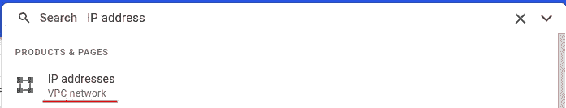

作者图片

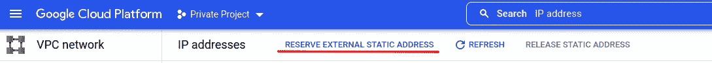

作者图片

给它一个名称，并将类型设置为“Global ”,因为该 IP 旨在被全局访问。所有其他选项都可以保留为默认值。

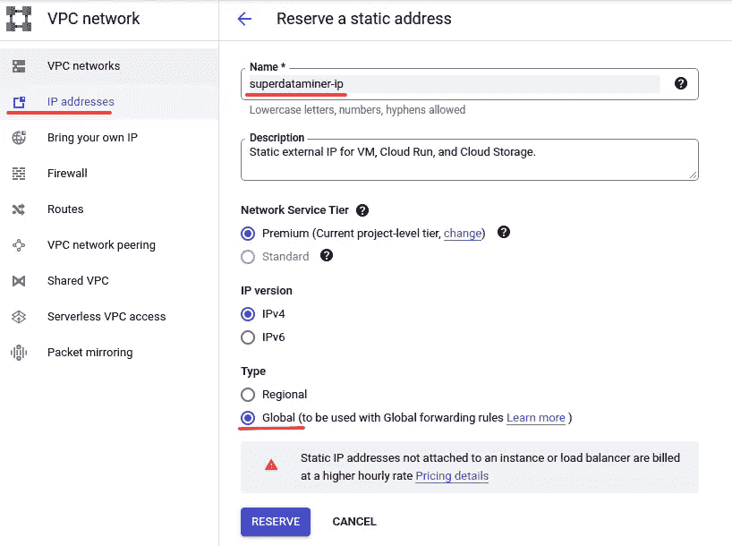

作者图片

当我们点击“保留”时，将为我们保留一个静态 IP。请记住这个静态 IP，因为它将用于为您的域添加 DNS 记录。

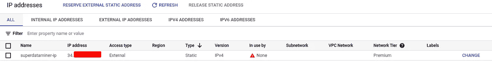

作者图片

## 为静态 IP 添加 DNS 记录

我们需要为静态 IP 添加一些 DNS 记录，这样我们的域就可以指向这个 IP。登录您的域注册商并添加以下 DNS 记录:

```
NAME                  TYPE     DATA
@                     A        <Your-Ststic-IP>
www                   CNAME    superdataminer.com
api                   CNAME    superdataminer.com
```

`@`名是指根域名，在本帖中是[superdataminer.com](https://www.superdataminer.com/),`www`是对应[www.superdataminer.com](https://www.superdataminer.com/)的子域，同样适用于`api`子域。此外，`A`代表“地址”,指定目标域的 IP 地址，而`CNAME`代表“圆锥形名称”,实际上是指向所创建的`A`记录的别名。

对于 DOMAIN.COM，您可以在购买的域名上点击“管理”,然后在左侧导航栏上找到“DNS &名称服务器”选项卡。最后，单击“DNS 记录”选项卡，然后单击“添加 DNS 记录”来添加新的 DNS 记录:

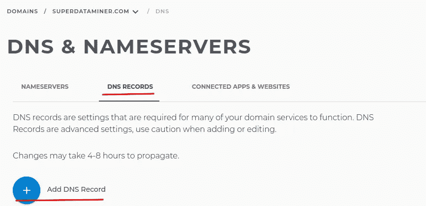

作者图片

按照上面的指示为每个 DNS 记录填写表格。特别是，IP 地址是上面创建的静态 IP。此外，我们需要为记录设置一个 TTL，它告诉 DNS 解析器将缓存该记录多长时间。对于这个例子，TTL 设置为什么值并不重要。通常，较小的 TTL 意味着 DNS 记录更改可以更快地传播。如果你想了解更多关于 DNS TTL 的知识，网上有很多参考资料。比如[这个](https://social.dnsmadeeasy.com/blog/long-short-ttls/)就是个好的。最后，优先级字段可以留空。

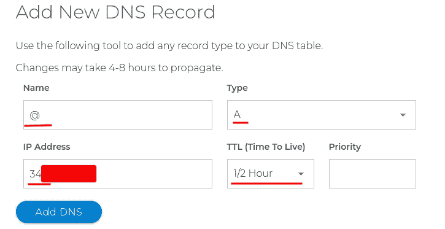

作者图片

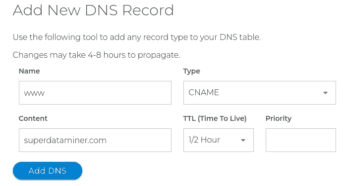

作者图片

添加的 DNS 记录将如下所示:

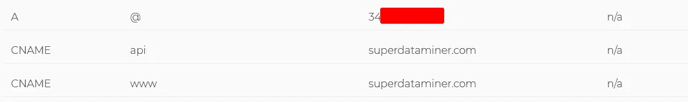

作者图片

现在已经添加了所有 DNS 记录，我们需要等待一些时间来传播更改，这可能需要几个小时甚至几天。然而，通常我们只需要等待几个小时甚至十几分钟就可以让它们繁殖。如果你的需要更长的时间，不要担心，只要多一点耐心，他们最终会工作。

添加完 DNS 记录后，您可以使用`ping`或`dig`命令来检查它们是否被正确添加以及它们是否被传播:

```
$ **ping superdataminer.com**
$ **ping** [**www.superdataminer.com**](http://www.superdataminer.com)
$ **ping api.superdataminer.com**
64 bytes from 230.190.111.34.bc.googleusercontent.com (**<Your-static-IP>**)$ **dig superdataminer.com**
;; ANSWER SECTION:
superdataminer.com. 3469 IN A **<Your-static-IP>**$ **dig** [**www.superdataminer.com**](http://www.superdataminer.com)
;; ANSWER SECTION:
[www.superdataminer.com](http://www.superdataminer.com). 3529 IN CNAME superdataminer.com.
superdataminer.com. 3453 IN A **<Your-static-IP>**$ **dig api.superdataminer.com**
;; ANSWER SECTION:
api.superdataminer.com. 3522 IN CNAME superdataminer.com.
superdataminer.com. 3406 IN A **<Your-static-IP>**
```

如果 IP 地址是上面保留的静态 IP，那么这意味着 DNS 记录已经被正确设置并且已经被传播。

## 创建虚拟机

现在，让我们在 GCP 上创建一个虚拟机，并在其中运行一个 Flask 应用程序。请在计算引擎页面上创建一个虚拟机实例，该实例也可以在搜索框中进行搜索。

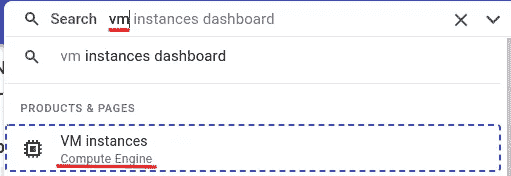

作者图片

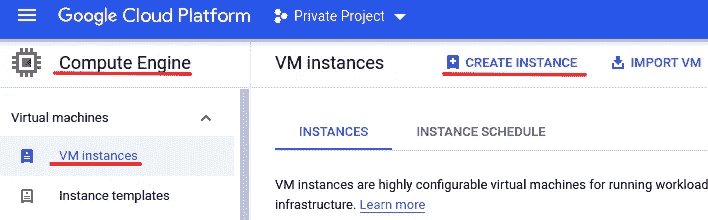

作者图片

出于测试目的，我们将选择最低配置:

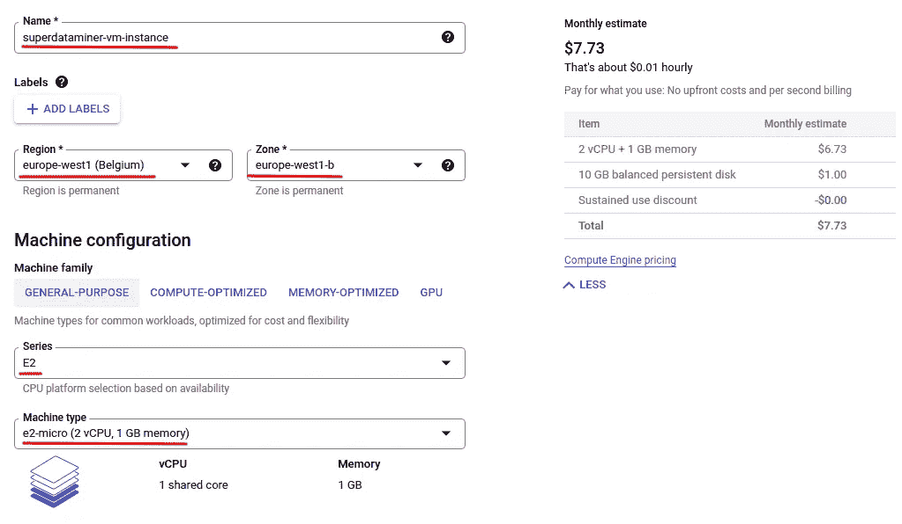

作者图片

如果您想为生产创建一个虚拟机实例，那么您应该选择适合您的应用程序的配置。

此外，重要的是，由于我们将从 GCP 之外访问虚拟机，我们需要允许 HTTP 和 HTTPS 流量:

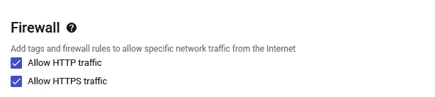

作者图片

单击“CREATE”后，将调配并创建虚拟机实例。

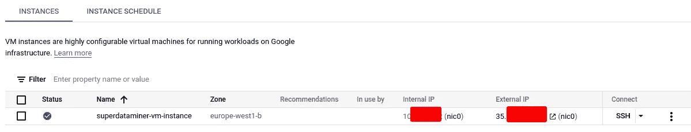

作者图片

在我们可以通过自定义端口(5000)访问 VM 实例之前，我们需要为它创建一个特定的防火墙规则。在 GCP 控制台上搜索“防火墙”，然后选择“防火墙 VPC 网络”。单击“创建规则”创建新的防火墙规则。首先，我们需要给它一个唯一的名字:

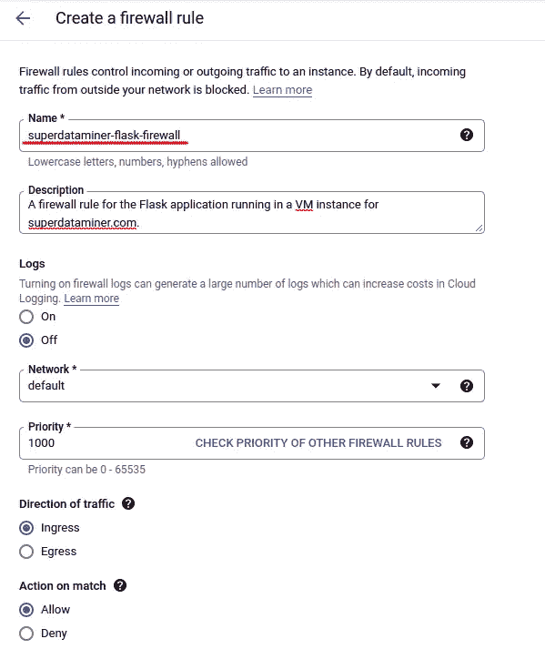

作者图片

然后，我们需要指定目标、IP 范围和端口:

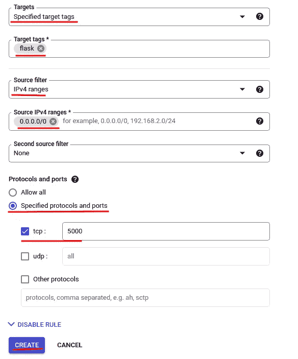

作者图片

我们也可以使用默认端口，即 80 用于 HTTP，443 用于 HTTPS。然而，这里我们演示了如何为我们的应用程序指定一个自定义端口，这在默认端口不适用的许多情况下是很有帮助的。

现在我们需要为新的防火墙规则添加标签(上面指定的`flask`标签)到我们的 VM 实例中。在虚拟机实例上单击“编辑”,并为其添加一个网络标记:

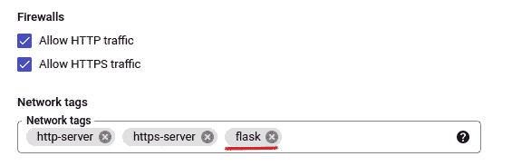

作者图片

单击“保存”保存更改。现在，让我们通过单击实例右侧的 SSH 链接登录到虚拟机实例，如上所示:

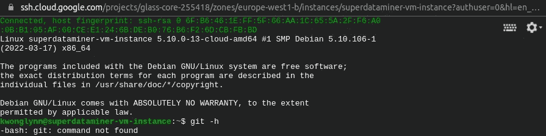

作者图片

由于`git`不可用，我们先安装一下:

```
$ sudo apt update
$ sudo apt install git
```

在低 CPU/内存配置的虚拟机中安装软件/库可能会非常慢，所以在安装`git`和`pip/venv`(如下)时要有点耐心。

然后为 Flask 克隆这个示例项目并安装`requirements.txt`中指定的库。

```
$ git clone [https://github.com/lynnkwong/flask-cloud-run-app.git](https://github.com/lynnkwong/flask-cloud-run-app.git)
$ cd flask-cloud-run-app$ sudo apt install python3-pip
$ sudo apt install python3-venv$ python3 -m venv .venv
$ source .venv/bin/activate(.venv) $ pip install -r requirements.txt
```

注意，虚拟环境是用 Python 的`venv`库创建的。这些库安装在虚拟环境中，而不是直接安装在系统中，建议在生产中使用。

最后，让我们启动应用程序。请注意，我们需要为它设置一个环境变量，这样我们就可以知道响应来自 VM 实例，而不是来自云运行，我们将很快展示这一点。

```
(.venv) $ export APP_NAME="App in VM instance"
(.venv) $ gunicorn -w 4 -b 0.0.0.0:5000 app:app &
```

我们使用`[gunicorn](https://flask.palletsprojects.com/en/2.1.x/deploying/wsgi-standalone/#gunicorn)`在 VM 实例中启动 Flask 应用程序。注意命令末尾的&符号(&)，即使我们退出控制台，它也能保持应用程序运行。

现在，当您尝试使用 Flask 应用程序的外部 IP 从任何地方访问它时，您可以得到一个响应:

```
$ curl <Your-VM-external-IP>:5000
<h1>Hello from App in VM instance!<h1>
```

## 创建实例组

我们需要为 VM 实例创建一个“实例组”,这样它就可以用于在负载平衡中创建后端服务。在 GCP 控制台中搜索“实例组”，选择“实例组”，然后单击“创建实例组”。我们需要选择“新的非托管实例组”来实现负载平衡。然后，在我们设置网络和实例之前，指定一个名称、区域和区域。

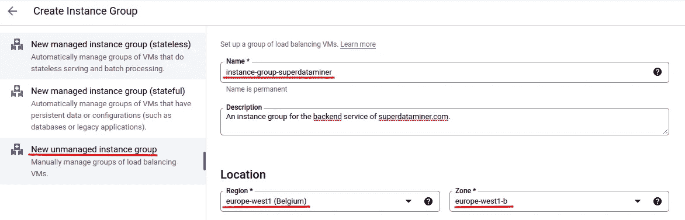

作者图片

对于“网络和实例”部分，选择默认网络和子网，然后选择要包含在此实例组中的虚拟机。我们可以在一个实例组中选择多个虚拟机，负载平衡器会平衡流量。对于本教程，我们只有一个虚拟机实例。

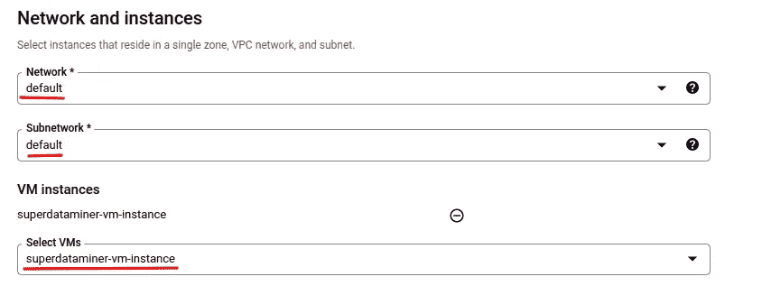

作者图片

重要的是，对于“端口映射”部分，我们需要创建一个映射，因为我们在 VM 中运行的 Flask 应用程序使用端口 5000。因此，我们需要为它创建一个映射:

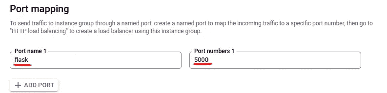

作者图片

当我们为实例组创建后端服务时，将使用这个端口映射。

## 创建云运行服务

在 GCP 控制台中找到“云运行”选项卡，然后单击“创建服务”来创建服务。您可以从现有的容器映像或源存储库中部署服务的一个修订版。我们将选择后者，因为我们不需要事先创建自定义图像。

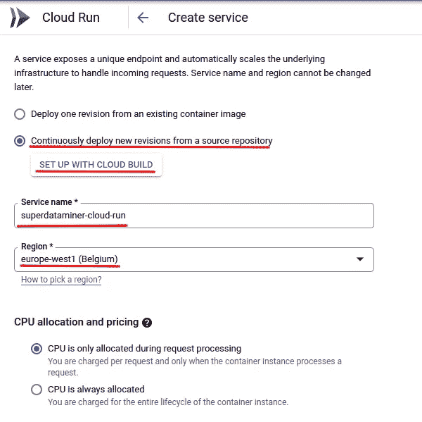

作者图片

如果您想跟进，请在单击“使用云构建设置”后，分叉[此回购](https://github.com/lynnkwong/flask-cloud-run-app)并设置您的云构建以链接到此回购:

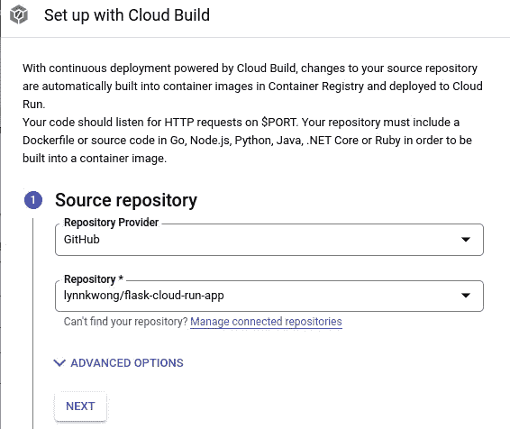

作者图片

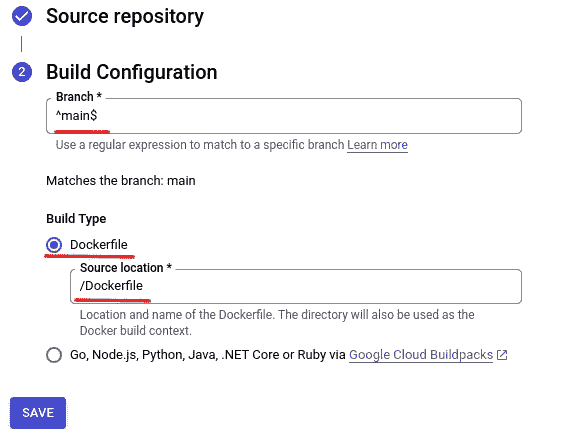

作者图片

如果您在这个 repo 中设置了您的存储库，那么您不需要做任何更改。默认设置可以工作。单击“保存”后，将为源代码创建一个云构建触发器。将来，每当您将一些新代码推送到 repo 时，都会构建一个新的映像，并部署一个新的服务(技术上来说是服务的新版本)。

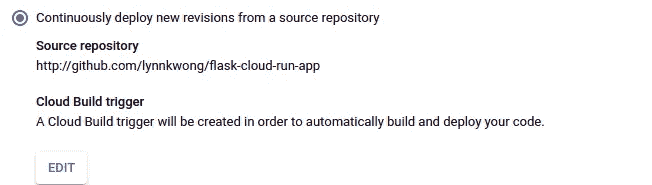

作者图片

此外，出于测试目的，我们将为我们的服务“允许所有流量”和“允许未经身份验证的调用”。如果您的应用程序有高安全性要求，您可能希望选择不同的方法。

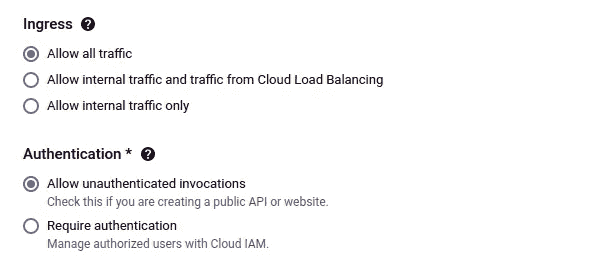

作者图片

最后，因为我们的 Flask 应用程序需要一个环境变量，所以让我们为它创建一个环境变量。展开“容器、变量和机密、连接、安全性”部分，并单击“变量和机密”选项卡。添加一个名为“APP_NAME”的新环境变量:

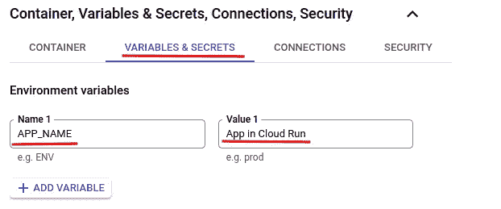

作者图片

现在，一切都准备好了，您可以保留其他选项的默认值。点击“点击”创建服务。过一会儿，您的服务将可用，您可以通过云自动运行分配的 URL 访问您的 Flask 应用程序:

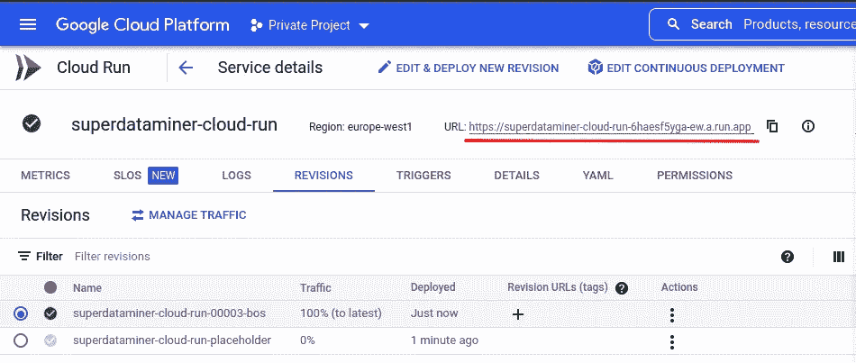

作者图片

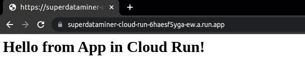

作者图片

如果您的部署出现任何问题，请查看“LOGS”选项卡中的日志。通常你会在那里找到原因。

要了解更多关于如何为 Flask 应用程序创建云运行服务的信息，请查看[这篇文章](https://betterprogramming.pub/how-to-deploy-a-web-application-to-cloud-run-automatically-6967d7c7d42a)。

## 创建一个桶并上传一些图像

首先，去谷歌云存储，创建一个存储你的图片的桶。通常情况下，您只需指定存储段名称并选择一个区域，其他选项都可以保留为默认值:

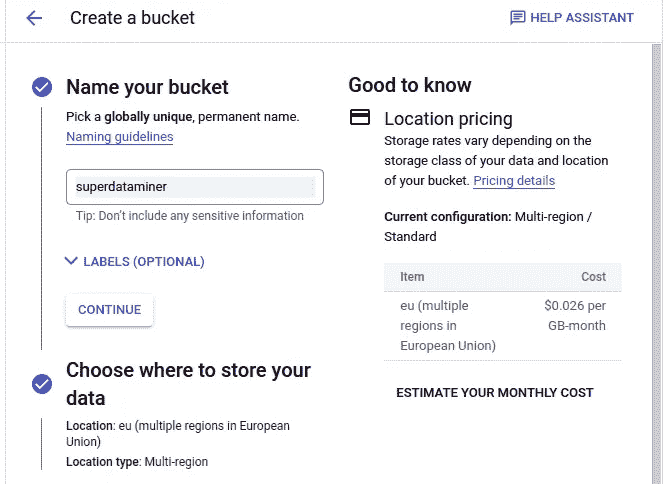

作者图片

然后，您可以创建文件夹并将文件上传到 bucket，就像使用 Google Drive 一样。本文中使用的图片是从 [Pixabay](https://pixabay.com/) 下载的免费图片。

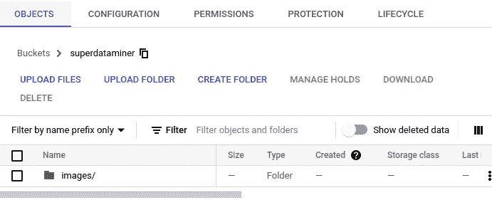

作者图片

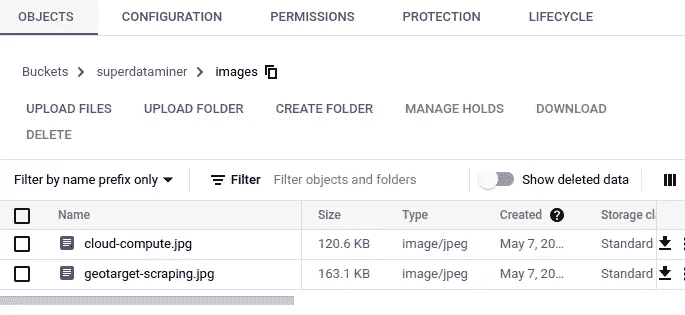

作者图片

默认情况下，只有经过身份验证的用户才能访问桶中的图像，外部用户无法访问。如果我们想将图像公开，让任何地方的任何人都可以访问，我们需要更改 bucket 的权限。若要添加权限主体，请单击“权限”，然后单击“添加”。要公开一个存储桶，我们需要为“所有用户”添加一个“存储对象查看者”角色。谷歌会警告你这一行动，但如果你知道你在做什么，你可以安全地确认它。

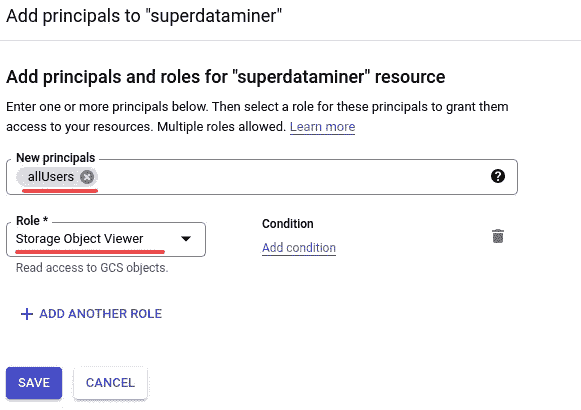

作者图片

现在，任何人在任何地方都可以访问这些图像:

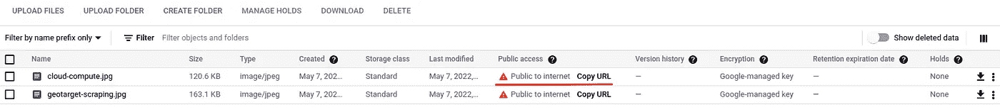

作者图片

## 创建 SSL 证书资源

因为我们正在创建一个 HTTPS 负载平衡器，所以我们需要为它创建一个 SSL 证书资源。出于生产目的，建议使用[谷歌管理的证书](https://cloud.google.com/load-balancing/docs/ssl-certificates/google-managed-certs)，这也比自签名证书更容易设置。

Google 管理的证书的入口点有点隐藏。如果你在谷歌云控制台的搜索框中搜索“SSL 证书”，找到的是自签名证书，而不是我们要找的谷歌管理的证书。要找到正确的，你需要首先进入负载平衡页面，点击“高级菜单”找到它。

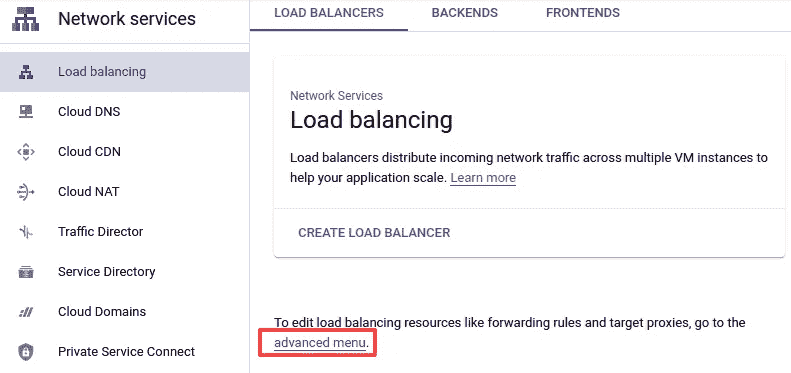

作者图片

在“高级菜单”打开的“负载平衡组件”页面中，单击“证书”选项卡，然后单击“创建 SLL 证书”按钮，创建一个新的 Google 管理的证书:

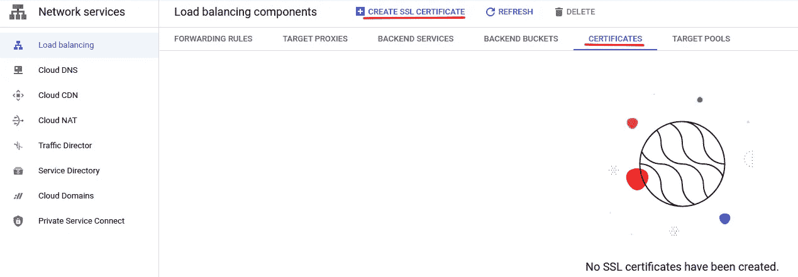

作者图片

按如下方式填写表格:

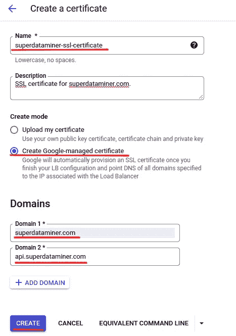

作者图片

重要的是:

*   给它一个描述性的名称，因为稍后创建负载平衡器时会用到它。
*   在“创建模式”中，选择“创建谷歌管理的证书”。
*   在“域名”部分，输入您从域名注册商处购买的域名。我们应该添加根域([superdataminer.com](https://www.superdataminer.com/))和所有子域(本例中只有 api.superdataminer.com)。
    **注意**:所有的域必须指向同一个 IP 地址，也就是负载均衡器的 IP，否则无法置备证书！

然后单击“创建”创建证书:

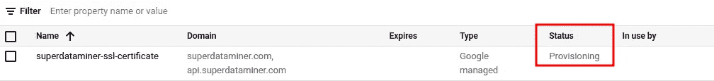

作者图片

SSL 证书的状态在变为“活动”之前会保持一段时间，稍后我们创建负载平衡器时会更详细地演示这一点。

## 创建一个谷歌云负载平衡器

最后，一切都准备好了，我们可以开始创建一个 Google Cloud 负载平衡器来为我们的应用程序设置一个自定义域。在 GCP 控制台的搜索框中搜索“负载”，然后选择“负载平衡”。在打开的窗口中，点击“创建负载平衡器”:

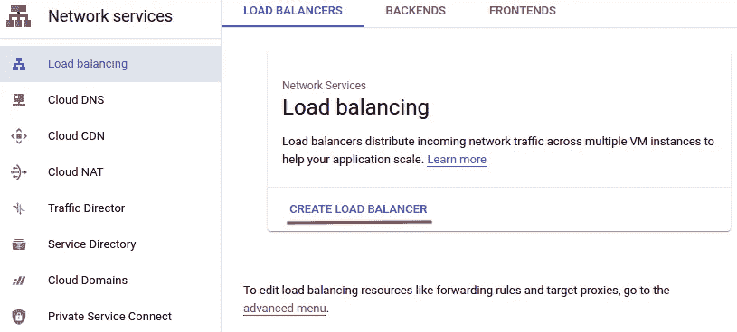

作者图片

然后单击“HTTP(S)负载平衡”上的“开始配置”，这就是我们要创建的配置:

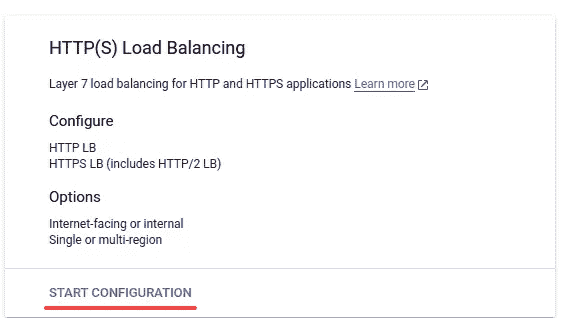

作者图片

保留默认选项如下，这是我们想要的:

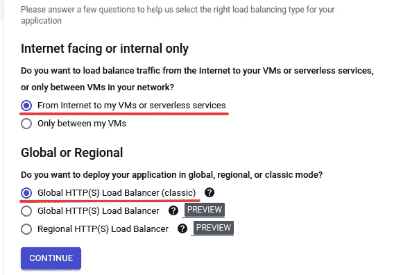

作者图片

单击“继续”后，我们需要为负载平衡器指定一个名称，然后设置后端、主机和路径规则以及前端的配置:

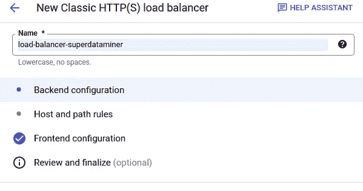

作者图片

首先点击“后端配置”。因为我们还没有任何后端服务，所以我们需要先创建它们。我们将分别为一个实例组、一个无服务器云运行服务和一个云存储桶创建一个后端服务。

## 为实例组创建后端服务

在“后端配置”部分，单击“后端服务和后端存储桶”，并选择“创建后端服务”。

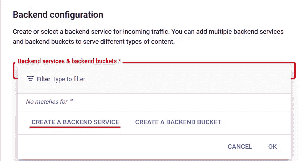

作者图片

在“创建后端服务”窗口中，指定后端服务的名称，并选择“实例组”作为后端类型。然后将协议更改为“HTTP ”,并将命名端口设置为“flask ”,这是我们在上面为实例组创建的端口。协议可以是 HTTP，不必是 HTTPS，因为流量是从负载均衡器转发到 GCP 系统内部的实例组的。

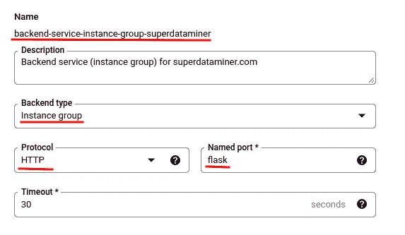

作者图片

然后在“后端”部分，选择我们创建的实例组。将自动检测并选择端口号:

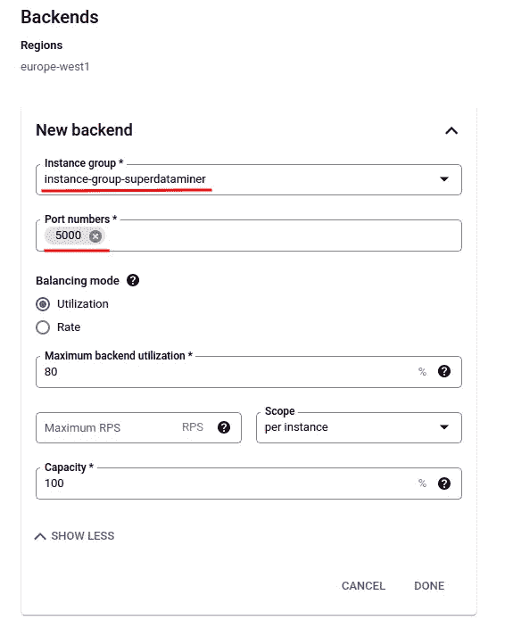

作者图片

重要的是，我们需要为实例组创建一个健康检查策略，否则实例组的后端服务将无法正常工作:

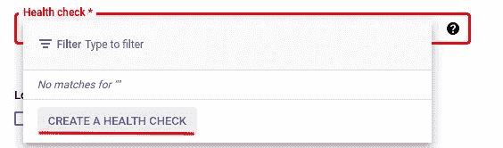

作者图片

在“健康检查”的新窗口中，指定名称、协议和端口。其他选项可以保留为缺省值，除非您想根据自己的特定需求对性能进行微调。

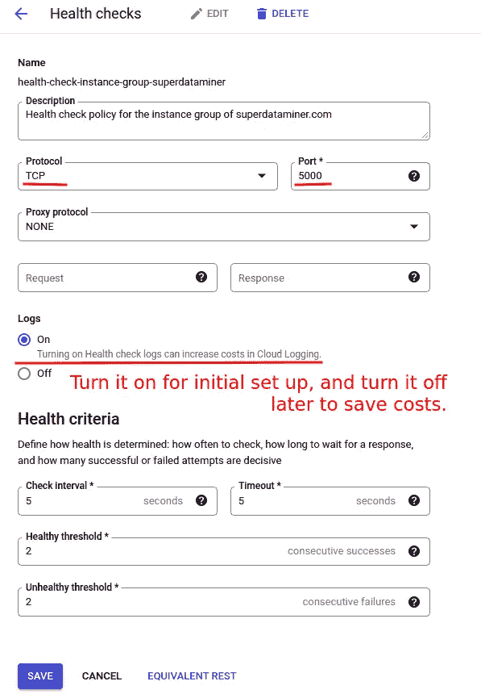

作者图片

请注意，协议可以是“TCP ”,因为运行状况检查是由内部 IPs 在 GCP 系统内部完成的。

创建运行状况检查策略后，我们可以单击“CREATE”为实例组创建后端服务。

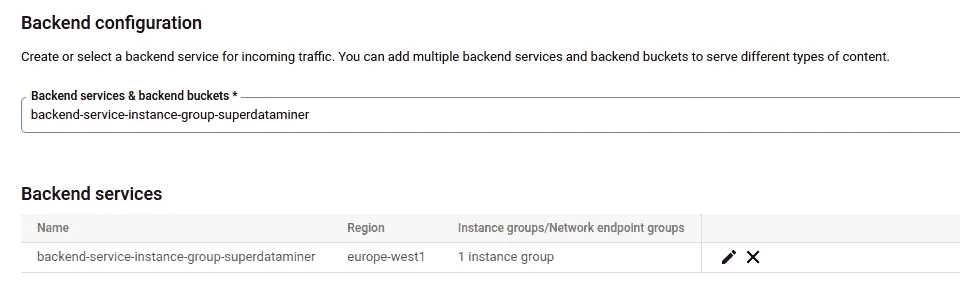

作者图片

## 为云运行创建后端服务

为云运行创建后端服务的过程实际上与为实例组创建后端服务的过程非常不同，尽管两者属于同一类型。要为云运行创建后端服务，我们也需要从“后端配置”开始:

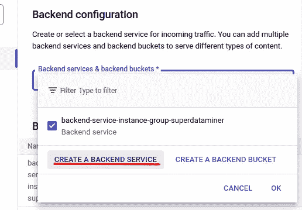

作者图片

在打开的“创建后端服务”窗口中，指定后端服务的名称，并选择“无服务器网络端点组”作为后端类型。

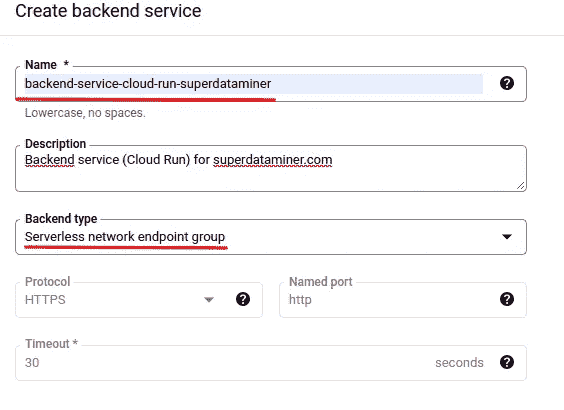

作者图片

然后，我们需要为我们的云运行服务创建一个无服务器网络端点组(NEG ):

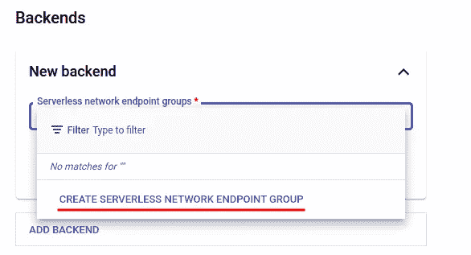

作者图片

单击“创建无服务器网络端点组”为我们的无服务器云运行服务创建后端:

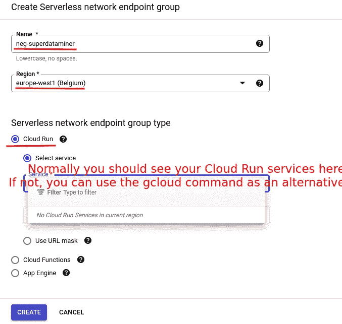

作者图片

有时，GCP 用户界面可能会有一个错误，当您尝试创建网络端点组时，您无法选择云运行服务。这是在创建本教程时发生的。在这种情况下，您可以使用`gcloud`命令创建一个:

```
**gcloud compute network-endpoint-groups create** <neg-name> \
  **--region**=<region> \
 ** --network-endpoint-type=serverless** \
 ** --cloud-run-service**=<serviceName>
```

对于本教程，该命令将是:

```
**gcloud compute network-endpoint-groups create** neg-superdataminer \
  **--region**=europe-west1 \
  **--network-endpoint-type=serverless** \
  **--cloud-run-service**=superdataminer-cloud-run
```

当该命令成功完成时，您会看到:

```
Created network endpoint group [neg-superdataminer].
```

如果您遇到这种权限错误:

```
ERROR: (gcloud.compute.network-endpoint-groups.create) Could not fetch resource:
 - Required 'compute.regionNetworkEndpointGroups.create' permission for
```

您可以运行以下命令来验证您的 Google Cloud SDK:

```
$ **gcloud auth login**
$ **gcloud config set project** <Your-Project-ID>
$ **gcloud auth application-default login**
```

当从 UI 或通过`gcloud`命令创建无服务器网络端点组时，您可以选择并使用它来创建您的后端服务:

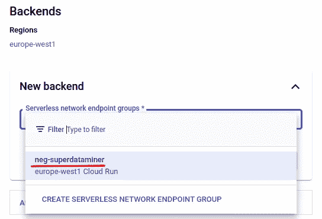

作者图片

现在，单击“创建”为我们的云运行服务创建后端服务。

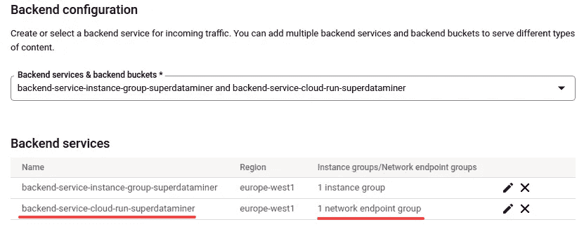

作者图片

## 为云存储创建后端服务

最后，让我们继续为您的云存储桶创建一个后端桶:

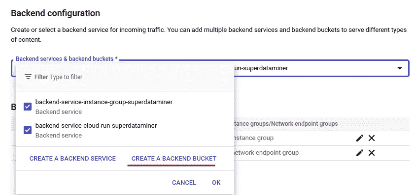

作者图片

在打开的“创建后端存储桶”窗口中，输入后端存储桶的名称，并选择您想要访问的云存储桶。此外，建议启用云 CDN 来更快地交付内容并节省成本，尤其是静态内容:

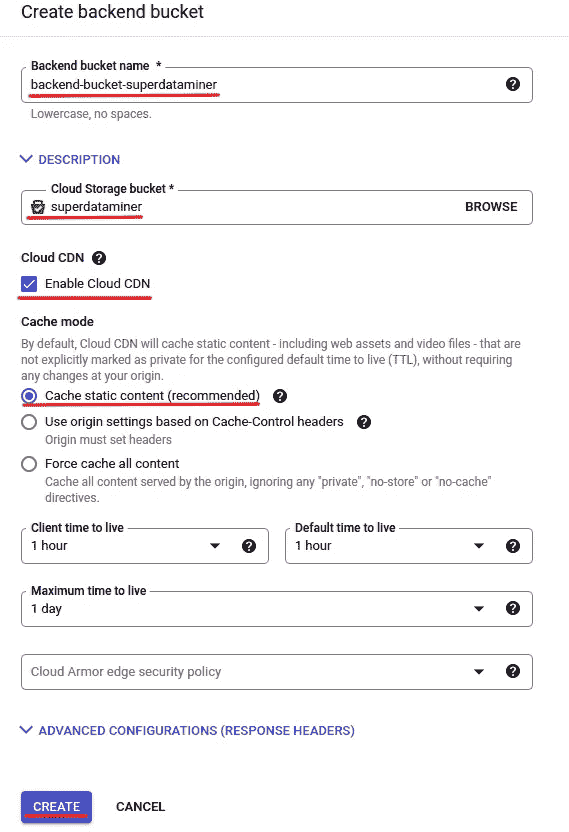

作者图片

这个过程简单得多，通常你不会遇到任何问题。现在，我们的负载平衡器的所有后端配置都已完成:

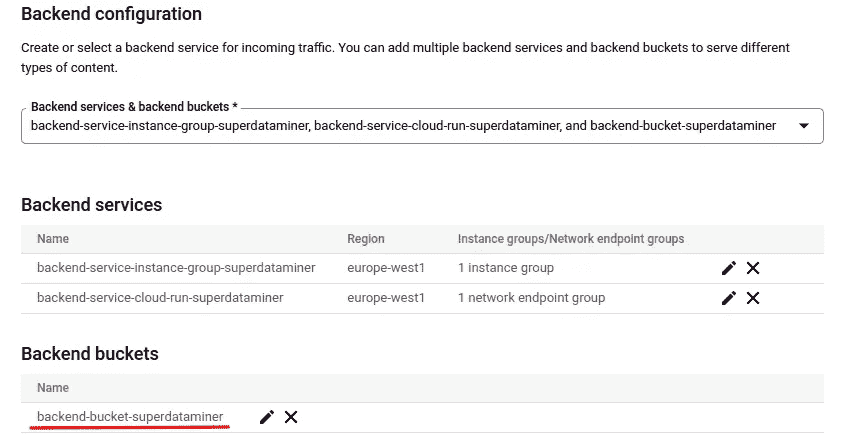

作者图片

## 指定主机和路径规则

配置后端后，我们需要指定主机和路径规则，这些规则决定了您的流量将如何定向。流量可以被定向到后端服务或存储桶，正如我们上面配置的那样。


作者图片

指定了三个主机和路径规则:

*   第一个是默认的，其主机和路径不能更改。所有不匹配的主机和路径都会被发送到分配给这个规则的后端，也就是我们的云运行服务。
*   第二个是图像的规则。它指定图像将被定向到“superdataminer.com/images/*”。这个规则的后端是上面创建的 Bucket 后端。
*   第三个是 API 子域，其后端是实例组。

## 前端配置

最后，我们来设置前端配置。点击左侧的“前端配置”,设置配置如下:

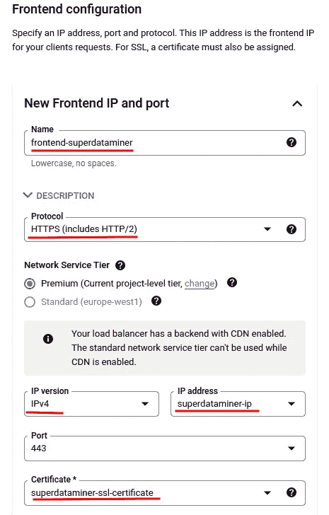

作者图片

重要的是，我们需要:

*   指定前端的名称。
*   将协议更改为“HTPPS(包括 HTTP/2)”。
*   将 IP 设置为之前保留的静态 IP。
*   选择之前创建的 SSL 证书。

请注意，“启用 HTTP 到 HTTPS 重定向”选项可能无法正常工作。在这种情况下，如果需要，您需要创建一个单独的 HTTP 前端。

现在一切准备就绪。我们可以检查并最终确定配置，然后单击“**创建**🔥“创建负载平衡器，如果一切正常，就创建它。

## 检查您的 SSL 证书的状态

如前所述，您的 SSL 证书的状态将保持在“[供应](https://cloud.google.com/load-balancing/docs/ssl-certificates/troubleshooting#domain-status)甚至“[失败 _ 不可见](https://cloud.google.com/load-balancing/docs/ssl-certificates/troubleshooting#domain-status)，直到满足以下两个条件:

*   如上所示，DNS 记录已经正确添加，并且已经为您的静态 IP 进行了传播。
*   SSL 证书已经附加到负载平衡器的前端，如上所示。

如果满足以上两个条件，状态将更改为“活动”，这意味着一切正常:


作者图片

## 测试负载平衡器

## 测试实例组

```
$ curl [https://api.superdataminer.com](https://api.superdataminer.com)
<h1>Hello from App in VM instance!<h1>
```

## 测试云运行

当你访问[https://superdataminer.com](https://www.superdataminer.com/)时，你会看到来自云润的问候:

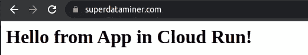

作者图片

## 测试云存储桶

当你访问[https://superdataminer.com/images/cloud-compute.jpg](https://superdataminer.com/images/cloud-compute.jpg)时，你可以看到谷歌云存储桶中的图片:

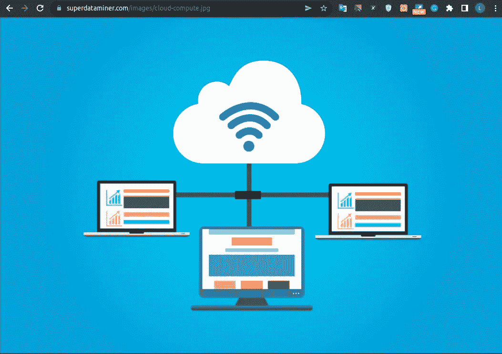

图片由作者提供(原始图片由 Pixabay 上的 [kreatikar](https://pixabay.com/illustrations/cloud-computer-hosting-3406627/) 提供)

干杯！所有 GCP 应用程序的自定义域都像预期的那样工作。

在这篇长文中，我们详细讨论了如何创建一个负载平衡器，并为您的后端服务和云存储桶分配一个自定义域。现在，您应该对什么是负载平衡器以及如何使用它为您在 GCP 的应用程序提供服务有了更好的理解。

乍看之下，负载平衡可能会让人不知所措。然而，如果你仔细遵循这些步骤，并试图理解每一个步骤背后的逻辑，它实际上并不复杂。如果您在为本文中演示的示例设置负载平衡器时遇到任何问题，欢迎您给我留言或私信，我会尽力帮助您。

另外，请注意域名[superdataminer.com](https://www.superdataminer.com/)在这篇文章中只是用于演示，当你阅读这篇文章时，它可能会被用于其他用途。因此，如果你想继续下去，你需要有自己的域名。