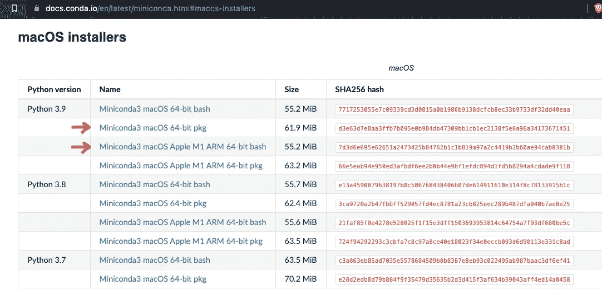
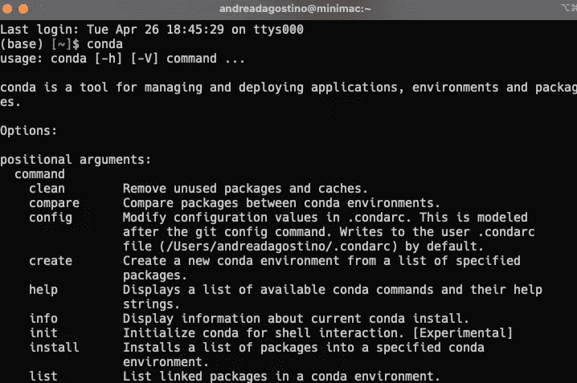

# 如何建立机器学习的开发环境

> 原文：<https://towardsdatascience.com/how-to-set-up-a-development-environment-for-machine-learning-b015a91bda8a>

## 如何为机器学习和数据科学相关任务安装、激活和使用虚拟环境

布拉德利·兰巴赫在 [Unsplash](https://unsplash.com/s/visual/5929a00a-b13e-4a55-80ef-0fec0fa1dc43?utm_source=unsplash&utm_medium=referral&utm_content=creditCopyText) 上拍摄的照片

在我们开始编码之前，用一个新的开发环境设置我们的机器是必要的。在这些例子中，我将使用 OSX 终端和 Python 3.8 来实现这一点，并向您展示入门的基础知识。

如果你是 Windows 用户，基本逻辑不会改变，但是对于一些命令，你可能需要使用谷歌。从 Windows 10 开始，你可以使用**WSL**(Linux 的 Windows 子系统)——这是微软提供的一个子系统，可以托管几个 Linux 发行版。[阅读此处](https://www.windowscentral.com/how-install-wsl2-windows-10)获得深入指导。另一个选择也是安装一个装有 Ubuntu 18.04 的虚拟机或者使用 VPS。

# 通俗地说什么是虚拟环境

对那些刚刚开始学习数据科学和 Python 编程的人的简要介绍。**虚拟环境是一个开发环境，充当我们当前项目**的容器。虽然能够安装任何系统范围的库，但是拥有一个虚拟环境允许您为特定的项目安装这样的库和包。这允许你有一个有序的和容易导航的系统，**没有不兼容的风险** **或全球水平的故障。**

将虚拟环境专用于一个项目是一种常见的做法，并且由于上面提到的原因，应该总是这样做。

在 Python 中，有几个管理虚拟环境的选项。其中最著名的当然是 Anaconda，一个帮助(尤其是数据科学家)有效配置和管理开发环境的软件。

我们将使用 [**Miniconda**](https://docs.conda.io/en/latest/miniconda.html) 在我们的系统上配置 Python。它是*康达*的轻量级安装程序，一个**开源的面向数据科学的开发环境管理系统**可用于 Linux、OSX 和 Windows。

之所以选择 Miniconda 而不是 Anaconda，是因为后者带来了大量的软件包，我认为除了偶尔的情况之外，我们永远不会使用这些软件包，因此安装一个小的软件包更有意义。

# 如何在 OSX 上安装 Miniconda

在写这篇文章的时候，我们将要从官网下载的文件会有这样一个名字:*miniconda 3-py38 _ 4 . 11 . 0-ma cosx-x86 _ 64 . sh*

迷你康达下载屏幕。图片作者。

根据我们系统的架构，我们可以在基本版本和 M1 ARM 芯片组版本之间进行选择。

一旦文件被下载，我们打开终端并写

`$ cd Downloads`

`$ sh Miniconda3-py38_4.11.0-MacOSX-x86_64.sh`

并按照屏幕上的说明进行操作。如果我们在终端中写下`conda`，我们可以检查我们是否正确安装了软件

图片作者。

此时，我们已经在 Mac OSX 系统上安装了 Miniconda，我们准备创建一个虚拟环境。

# 如何用 Miniconda 创建虚拟环境

一旦安装了 Anaconda 或 Miniconda，并且使用`conda`命令验证了它们的正确功能，我们就可以创建一个新的开发环境，如下所示:

`$ conda create -n name_of_my_environment`

这个命令将在安装目录中创建一个名为 *name_of_my_environment* 的虚拟开发环境。要激活虚拟环境，只需运行以下命令

`$ conda activate name_of_my_environment`

我们完了。我们的虚拟环境已经为应用程序的开发做好了准备。现在让我们看看如何在我们新激活的虚拟环境中**安装或卸载库**和包。

# 如何在虚拟环境中安装软件包和库

现在是时候给我们的工具箱添加工具了。要添加 Python 包或库，只需使用命令

`$ conda/pip install name_of_package`

正如我们所见，也可以使用 **pip** 命令在 conda 中安装包。事实上，如果我们使用这个命令

`$ conda/pip list`

conda 或 pip 将分别向我们展示通过它们的命令安装的包。

**我推荐使用 pip install 命令而不是 conda install** ,因为有些包在 conda 存储库中不可用。可能有几个原因，但是使用 pip 没有缺点，并且允许您有效地下载和安装软件包。

# 康达备忘单——触手可及的所有命令

在这篇文章的结尾，我将与你分享一个有用的资产，它在我的职业生涯和个人工作中帮助了我无数次。我说的是 Anaconda 提供的官方备忘单。这是它的预览图👇

备忘单的预览。图片作者。

我建议你将它保存在你经常打开的文件夹中，或者将单个命令保存在你最喜欢的笔记应用程序中。

我希望这个简短的指南能帮助你开始你的 Python 数据科学和分析之旅。如果您有任何问题或想分享您的反馈，请在下面留下评论！

直到下次👋