# 如何用 oh-my-zsh-Plugins 建立一个令人惊叹的数据科学终端

> 原文：<https://towardsdatascience.com/how-to-set-up-an-amazing-terminal-for-data-science-with-oh-my-zsh-plugins-2518dfeeab5d>

## 通过安装一些关键插件，提高您在终端中的工作效率和用户体验。


这篇文章中描述的终端的预览。作者图片

# 作为数据科学家，你为什么要使用终端？

对于开发人员来说，没有比这更高效或更通用的工具了——终端是开发人员工具箱中的瑞士军刀。

终端可以是您日常任务的一站式商店。代码编辑、启动程序、多任务、脚本、系统管理等等。

> 命令行技术将您从限制性的 GUI 工具和无休止的鼠标点击中解放出来，开启了一个高效和自动化的世界。

但是对于外行人来说，命令行可能是令人生畏和不可原谅的。

默认终端的单色用户界面没有俘虏。

没有语法高亮显示，也没有自动补全功能。谁知道您输入的命令是否正确？

**然而，对配置的小调整对改善用户体验大有帮助。**将命令行变成一个强大的工具来加速您的工作流程。

**关键是花点时间用插件定制你的终端。**花几个小时定制你的终端将会带来巨大的收益。

# 提高工作效率的终端关键特性

定制终端是一件非常私人的事情。每个人都有审美偏好和不同的功能需求，这取决于他们的技术组合。

**但我认为以下终端属性对提高生产率很重要**:

*   命令行(提示符)显示关于您的环境的关键信息，例如 git 信息、虚拟环境、Python 版本等。
*   语法突出显示
*   自动完成
*   窗口和会话管理
*   高效的文件系统导航和目录跳转
*   一个很好的美学——如果你不喜欢使用它，你可能不会去打扰它

**在这篇文章中，我将介绍我用来实现上述功能的关键插件，并将命令行转换成一个高效的环境。**

让我们开始吧！

# 先决条件

我使用 MacOS、 [iterm2](https://iterm2.com/) 和 [Homebrew](https://engineeringfordatascience.com/posts/setting_up_a_macbook_for_data_science/) 进行设置。

但是，应该可以在任何操作系统上安装和配置这个设置。

我将提供每个程序和插件的文档链接。有关如何为您的特定操作系统设置每个组件的更多信息，请阅读文档页面。

# 配置命令行提示符

# 1.哦，我的天

MacOS 终端提示符附带了作为默认 shell 的 [z shell](https://zsh.sourceforge.io/) (zsh)。

[**哦我的 Zsh**](https://ohmyz.sh/) **是一个管理你的 Zsh 配置的开源框架。**它提供了对许多优秀插件的便捷访问，这些插件可以改善您的终端体验并提高您的工作效率。

> “哦，我的 Zsh 不会让你成为 10 倍的开发者…但你可能会觉得自己是！”
> 
> ***— oh-my-zsh 文档***

我们将使用 oh-my-zsh 来管理和安装本文中描述的其余终端设置的插件。

您可以使用以下命令安装 oh-my-zsh(完整说明和文档在他们的[网站](https://ohmyz.sh/)):

```
*# install oh-my-zsh*
sh -c "**$(**curl -fsSL https://raw.github.com/ohmyzsh/ohmyzsh/master/tools/install.sh**)**"
```

安装`oh-my-zsh`将创建/更新您的`~/.zshrc`文件——位于您的主目录中——它定义了您的`zsh`配置。我们将在整个教程中编辑`~/.zshrc`文件来定制我们的终端。

# 2.下载一个书呆子字体

接下来，下载你选择的书呆子字体。

书呆子字体为你的终端提供了许多很棒的字体，这些字体被打了补丁以支持图标。我们稍后将需要一个补丁字体来渲染终端中的开发图标，并获得漂亮的外观。

你可以按照 [Nerd-font GitHub 页面](https://github.com/ryanoasis/nerd-fonts)上的说明，在你的操作系统上安装你选择的补丁字体。

我使用[黑客字体](https://github.com/ryanoasis/nerd-fonts/tree/master/patched-fonts/Hack)，这是我用[自制软件](https://brew.sh/)安装的:

```
*# install 'hack' font using Homebrew*
brew tap homebrew/cask-fonts
brew install --cask font-hack-nerd-font
```

您可以通过更新 item2 偏好设置，将终端中的字体更改为刚刚安装的字体。

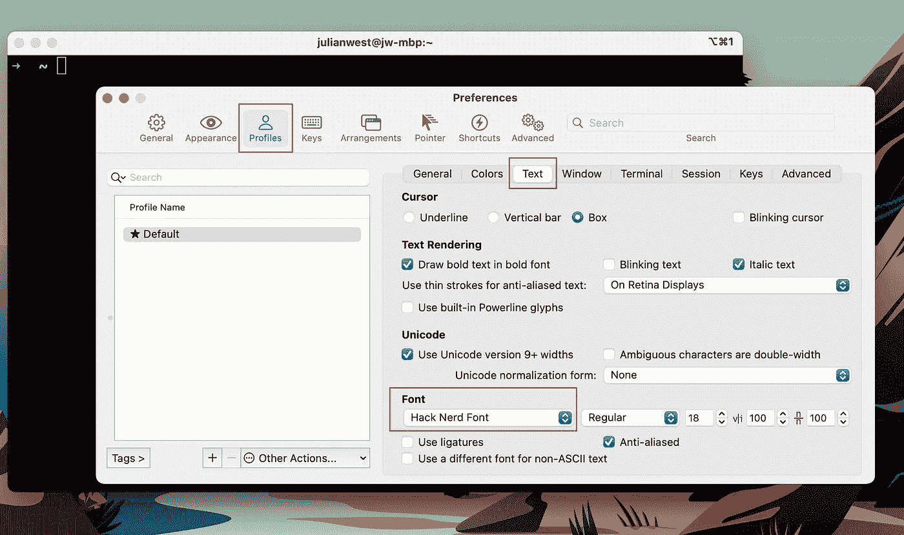

iterm2 首选项用户界面。作者图片

# 3.自定义提示(Starship)

oh-my-zsh 的默认主题叫做`robbyrussell`，以 oh-my-zsh 的创始人命名。

我真的很喜欢这个主题的简约美学，在移植到 Starship 之前我用了很长时间。

虽然这只是默认主题，但它已经是毫无特色的单色默认`zsh`提示符的一个巨大升级。

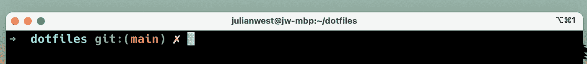

默认 robbyrussel oh-my-zsh 主题。图片作者。

还有许多其他的主题伴随着`oh-my-zsh`。完整列表可以在 [GitHub Wiki](https://github.com/ohmyzsh/ohmyzsh/wiki/Themes) 中找到。为了将主题更改为内置的主题之一，您只需要更新您的`~/.zshrc`中的`ZSH_THEME`值，并重启您的终端以使更改生效。

或者，您可以安装和使用外部主题来代替内置主题。

> [Powerlevel10K](https://github.com/romkatv/powerlevel10k#installation) 是一个流行的选择，然而我更喜欢用 [Starship](https://starship.rs/) 。

Starship 是一个高度可定制的提示符，跨 shell 兼容——无论您使用 bash、zsh、fish 还是 Powershell 作为 shell，您都可以使用相同的提示符配置。

Starship 带有合理的默认值，可以用一个用户友好的`toml`文件进行配置，并带有一个 CLI 工具，使即时更新您的提示变得轻而易举(稍后会有更多介绍……)。

要安装 Starship，你可以遵循[文档主页](https://starship.rs/)上的说明。

```
*# install starship*
brew install starship
```

然后在你的`~/.zshrc`的末尾添加下面一行来使用 zsh 中的 Starship 提示符。

```
*# ~/.zshrc*eval "**$(**starship init zsh**)**"
```

重新启动终端以使更改生效。

## **配置星舰提示**

配置 Starship 的完整文档可以在他们的网站上找到。

Starship 提示符配置由你的`.config`目录中的一个名为`starship.toml`的文件控制

例如，下面是一个简单的配置，当我导航到 Python 项目目录时，我使用它在提示中显示 Python 版本和虚拟环境:

```
*# example ~/.config/starship.toml*add_newline = **false**[python]
format = 'via [${symbol}${pyenv_prefix}(${version} )(\($virtualenv\) )]($style)'
```

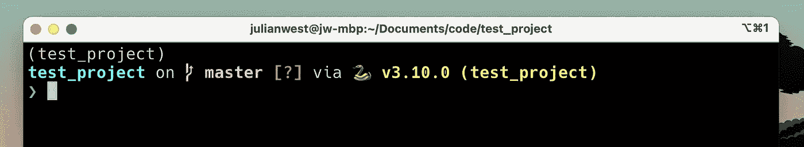

Starship 提示符和 starship.toml 配置文件示例。图片作者。

# 4.选择终端配色方案

好的，所以这部分不一定会影响你的“生产力”，但重要的是得到你喜欢回来的最好看的终端🎨。

这完全取决于个人喜好——你可能完全不同意我的选择——但我喜欢使用`Solarized Dark`配色方案。我也给背景添加了一些透明度/模糊度。

还有许多其他预设的配色方案可供选择，我建议你尝试找到你最喜欢的。

这些设置可以在 iterm2 的首选项 GUI 中更改。


iterm2 首选项 UI，设置配色方案。图片作者。

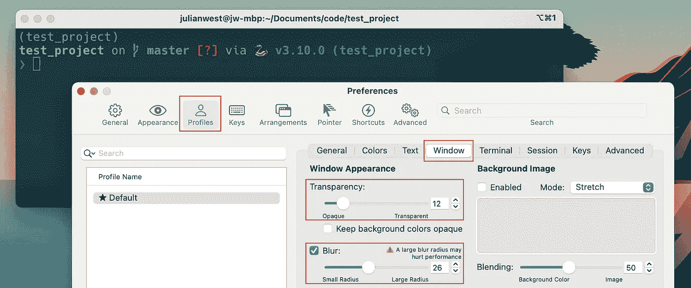

iterm2 首选项 UI，设置背景透明度和模糊度。作者图片

我的最后一个提示使用了星际飞船和日晒深色配色方案。

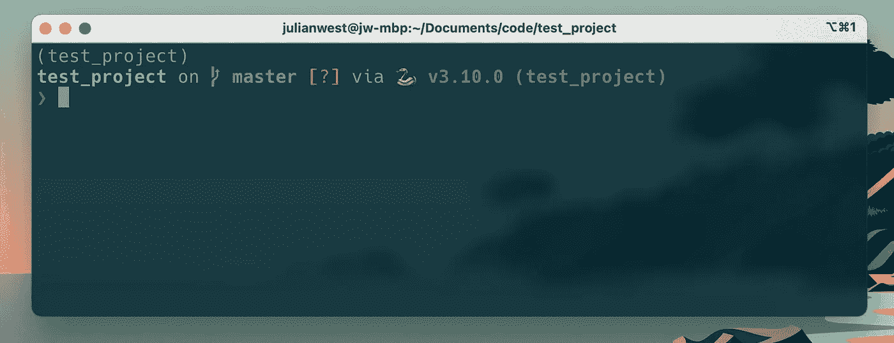

最终的星际飞船提示，有晒过的深色方案和一些透明度。图片作者。

# 基本工具:最好的插件

# 5.语法突出显示

语法突出显示对于提高终端的可用性至关重要。

它可以帮助您确定您是否正确安装了程序，并可以提醒您拼写错误或命令无效。

要在`zsh`中启用语法高亮，你需要安装一个名为 [zsh-syntax-highlighting](https://github.com/zsh-users/zsh-syntax-highlighting) 的插件。

安装说明在 [GitHub repo](https://github.com/zsh-users/zsh-syntax-highlighting/blob/master/INSTALL.md) 中提供。您可以使用以下命令安装`zsh-syntax highlighting`:

```
*# download syntax highlighting extension*
git clone https://github.com/zsh-users/zsh-syntax-highlighting.git ${ZSH_CUSTOM**:-**~/.oh-my-zsh/custom}/plugins/zsh-syntax-highlighting
```

然后通过更新`.zshrc`文件来激活插件。

```
*# add syntax highlighting to the list of plugins in your ~/.zshrc file*
plugins=(zsh-syntax-highlighting)
```

运行`source ~/.zshrc`或重启终端以使更改生效。

现在，当你键入一个关键字命令时，如果它是正确的，它会变成绿色，如果它是不正确的，它会变成红色。


语法突出显示。提交命令前发现错误。图片作者。

# 6.自动完成

当键入长命令时，自动完成可以节省大量时间，并且对于记住您以前运行过的命令非常有帮助。

需要 [zsh-autosuggestions](https://github.com/zsh-users/zsh-autosuggestions) 插件来启用`zsh`中的自动完成功能。

GitHub repo 的[安装 wiki 页面](https://github.com/zsh-users/zsh-autosuggestions/blob/master/INSTALL.md)上提供了安装说明。安装与语法突出显示非常相似。

```
*# install autocompletions extension*
git clone https://github.com/zsh-users/zsh-autosuggestions ${ZSH_CUSTOM**:-**~/.oh-my-zsh/custom}/plugins/zsh-autosuggestions*# update plugins in your ~/.zshrc file*
plugins=(
    zsh-syntax-highlighting 
    zsh-autosuggestions
)
```

重启你的终端或运行`source ~/.zshrc`来查看变化。

# 7.模糊文件查找( [FZF](https://github.com/junegunn/fzf) )

[FZF](https://github.com/junegunn/fzf) 是一个模糊文件查找器，使你能够从命令行交互地搜索文件。当您知道文件名称，但不记得具体保存位置时，这对于快速查找文件非常有用。

```
*# install FZF (say yes to each option during installation)*
git clone --depth 1 https://github.com/junegunn/fzf.git ~/.fzf
~/.fzf/install
```

安装脚本将自动用下面一行更新您的`.zshrc`:

```
[ -f ~/.fzf.zsh ] && source ~/.fzf.zsh
```

此外，为了让`fzf`更好地与`oh-my-zsh`配合，你需要将`fzf`添加到你的插件列表中，并用`fzf`的安装位置设置一个环境变量:

```
# update your ~/.zshrc file
FZF_BASE="$HOME/.fzf"plugins=(
    zsh-syntax-highlighting 
    zsh-autosuggestions
    fzf
)
```

你现在可以通过在终端上输入`fzf`命令或者按下`CTRL+T`来激活模糊查找器。您也可以使用`**`前缀并按下`<TAB>`来触发模糊查找器(参见[文档](https://github.com/junegunn/fzf#files-and-directories))。例如:

```
*# search which file to open in vim using the fuzzy finder*
vim **<TAB>
```

FZF 是高度可定制的。我不会在这里详细介绍如何配置它——它本身可能需要一整篇博文。但是网上有很多很棒的教程解释如何配置 FZF，我建议你研究一下，以便从中获得最大收益。


使用 FZF 的模糊文件查找。图片作者。

# 8.窗口和会话管理(tmux)

同时运行多个终端进程是很常见的。

数据科学家立即想到的一个用例是需要从终端运行 Jupyter 笔记本服务器，但也需要访问终端来执行其他任务，如提交 git 和运行其他 python 脚本。

如果不能一次打开多个窗口或终端会话，您的终端将被长时间运行的进程阻塞。

解决这个问题的方法是使用窗口管理工具同时管理多个窗口和终端会话。

iterm2 具有为不同会话打开多个选项卡的内置功能。然而，我喜欢使用 tmux，因为它非常可定制，功能强大，可以跨多个不同的终端模拟器工作，所以无论我使用哪个终端，我都可以使用相同的按键绑定。

Tmux 可以通过自制软件安装:

```
# install tmuxbrew install tmux
```

同样，你可以写一整篇关于配置`tmux`的博文。在这篇文章中，我将提供一个示例 tmux 会话的截图，并强烈建议您研究用于管理多个终端会话的会话/窗口管理解决方案，无论是使用 iterm2 选项卡还是`tmux`。

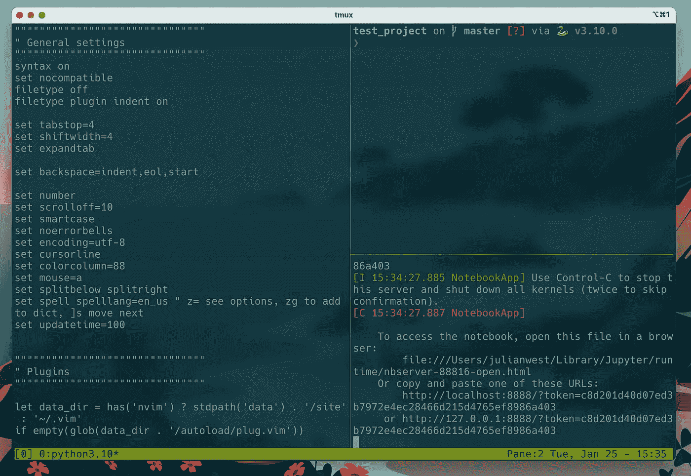

Tmux 窗口管理。三个会话在同一个窗口中打开:vim、命令行和 Jupyter Notebok 服务器。图片作者。

> *👨‍🎓Chris Toomey 在*[*thought bot*](https://thoughtbot.com/upcase/tmux)*上有一个学习 tmux 的速成课程，可以让你快速上手。*

# 附加:有用的插件和命令行工具

下面的程序是一些额外的`zsh`插件和命令行工具，我也觉得很有用。根据您偏好的工作流和用例，您自己的里程数可能会有所不同。

# [z](https://github.com/agkozak/zsh-z) —目录跳转工具

`zsh-z`是一个命令行工具，允许你在最近访问过的目录之间快速跳转。

使用终端的一个难点是在目录中导航，这比使用熟悉的文件浏览器 GUI 导航要复杂得多。像`z`(以及之前描述的 FZF)这样的工具可以让遍历文件系统变得轻而易举。

要安装`zsh-z`,我们可以克隆 GitHub 库，并像以前一样将`zsh-z`添加到`.zshrc`文件中的插件列表中:

```
*# download the plugin then update your ~/.zshrc file*
git clone https://github.com/agkozak/zsh-z $ZSH_CUSTOM/plugins/zsh-z
```

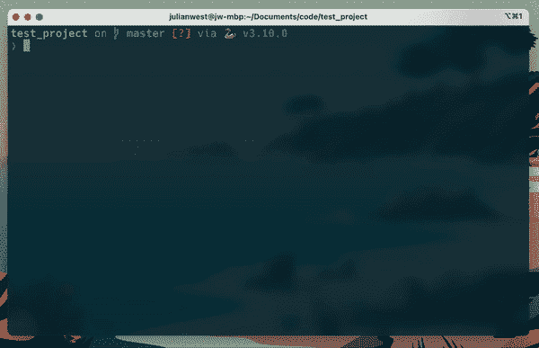

使用 z 插件的目录跳转。图片作者。

# 蝙蝠——猫的更好替代品

当你想在终端中快速查看一个文件的内容而不需要实际打开它(例如显示一个配置文件)时，你可以使用内置的`cat`命令。

然而，命令行上的输出只是普通文本，很难阅读，尤其是如果您习惯了 ide 和代码编辑器中的漂亮的语法高亮显示。

`bat`是`cat`的替代版本，它支持语法高亮显示和其他功能，还集成了其他工具，如 fzf。

您可以使用自制软件安装`bat`(其他操作系统的完整说明可从其 [GitHub 文档页面](https://github.com/sharkdp/bat#installation)获得):

```
*# install bat from Homebrew*
brew install bat
```

您可以像使用`cat`一样使用`bat`:

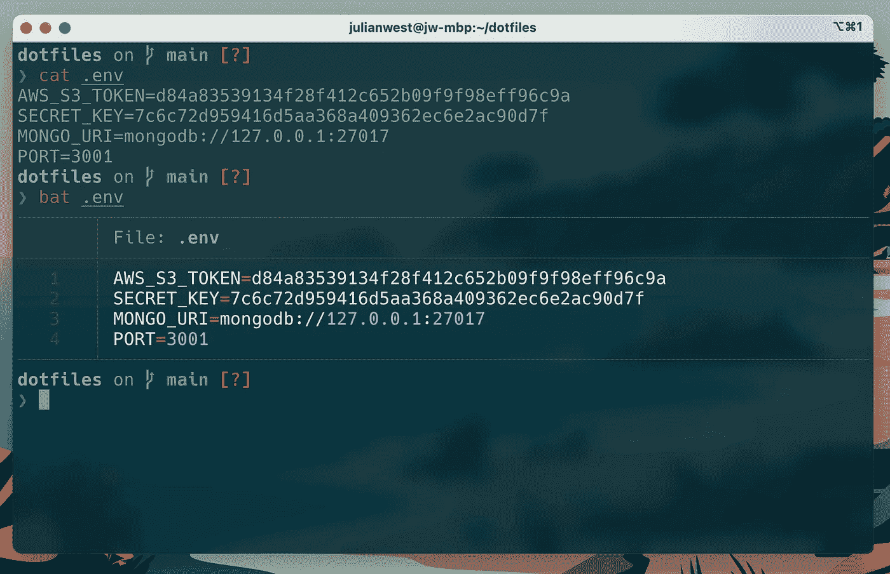

猫和蝙蝠产量的比较。(不是真正的 AWS 令牌和密钥😅).图片作者。

您还可以将它与 fzf 集成，以便在搜索文件时显示每个文件的预览，并突出显示语法:

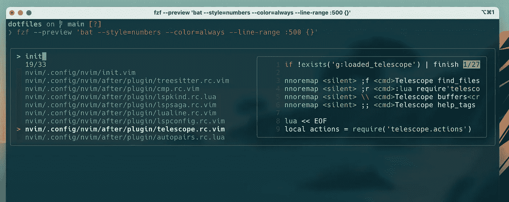

使用 FZF 和蝙蝠的模糊文件查找和文件预览。图片作者。

# [exa](https://the.exa.website/)——ls 的现代替代品

同理，`exa`是一个替代`ls`的命令行工具。

`ls`的输出可能难以扫描，因为文件和文件信息之间没有视觉差异。所有东西都以同样的颜色列出。

`exa`是一个更加美观的文件“lister ”,带有颜色编码和对图标的支持，可以更容易地理解输出。

安装说明在 [exa 网站](https://the.exa.website/)上。

```
*# install exa*
brew install exa
```

要使用`exa`列出目录中的文件，可以使用`exa`关键字，后跟一些参数(参见[文档](https://the.exa.website/docs))。我真的很喜欢对文件图标的支持，这使得识别每个文件类型变得很容易。

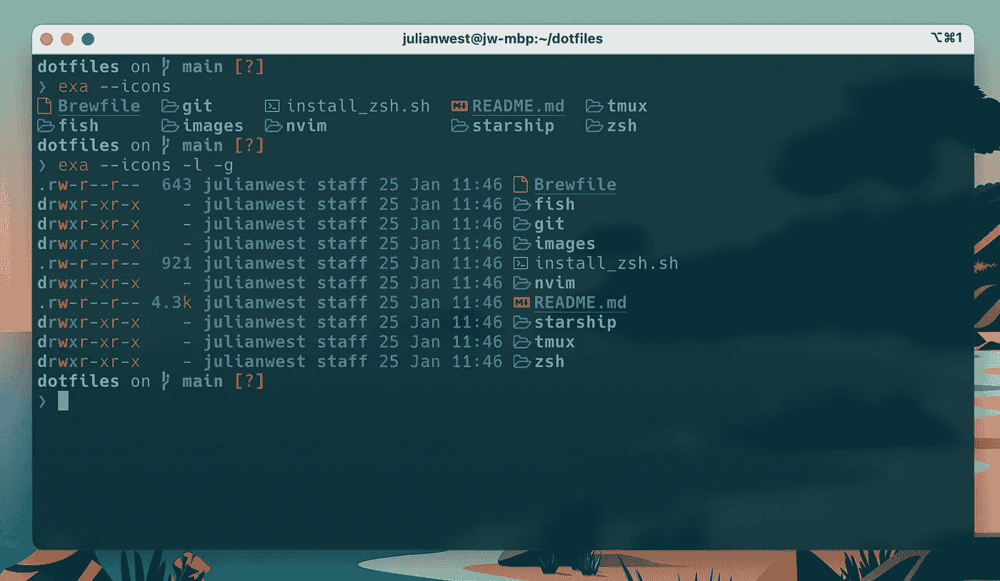

> *💡* ***顶部提示*** *:在你的* `*~/.zshrc*` *文件中创建一个别名来映射* `*exa --icons*` *到* `*ls*` *这样你就不需要重新学习任何语法*

# 个人风格:别名

另一个节省时间的方法是为您经常使用的长命令创建别名。

您可以在您的`.zshrc`文件中指定别名。

别名对您和您的工作流来说是个人的。我用的不多，但以下是我喜欢用的:

```
*# ~/.zshrc**# python*
alias python=python3*# git*
alias gs="git status"*# map exa commands to normal ls commands*
alias ll="exa -l -g --icons"
alias ls="exa --icons"
alias lt="exa --tree --icons -a -I '.git|__pycache__|.mypy_cache|.ipynb_checkpoints'"*# show file previews for fzf using bat*
alias fp="fzf --preview 'bat --style=numbers --color=always --line-range :500 {}'"*# starship prompt*
alias gt="starship toggle gcloud disabled" *# toggle gcloud info on the prompt*
```

> **使用 GCP 的用户注意事项**
> 
> 我用谷歌云做了很多工作来部署机器学习管道和模型。
> 
> 当使用`glcoud`命令行工具时，我担心会不小心将基础设施部署到错误的地区(#GDPR)，甚至部署到错误的客户项目。
> 
> Starship 允许你使用他们的 CLI 工具来“切换”提示符设置。
> 
> 我已经创建了一个别名`gt`，它在我的提示中切换关于我当前`gcloud`个人资料的重要信息的显示。
> 
> 这很棒，因为我并不总是需要它，但是能够在运行中改变我的提示来检查真的很有用！

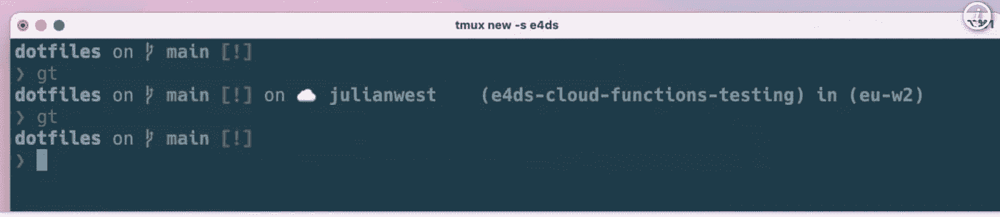

使用别名在提示符下切换 GCP 配置文件信息。图片作者。

# 结论

> 对于门外汉来说，这个终端使用起来让人难以忍受、紧张和烦恼。

默认设置有一个骇人的 UX。足以让一些开发人员退回到熟悉的 GUI 工具的舒适怀抱中，再也不回来了。

> 然而，花几个小时配置您的终端将会为您的生产力、工作流程和整体编程效率带来巨大的回报。

Oh-my-zsh 是管理您的`zsh` shell 配置和插件的一个很好的框架。通过安装三四个关键插件并在`.zshrc`文件中添加几行代码，您可以改变使用命令行的体验并提高工作效率。

编码快乐！

```
This article was originally published on my blog, [engineeringfordatascience.com](https://engineeringfordatascience.com/posts/configure_terminal_for_data_science_with_oh_my_zsh/)
```

# 资源

*   完整的`oh-my-zsh`插件列表可以在 [zsh GitHub wiki 页面](https://github.com/ohmyzsh/ohmyzsh/wiki/Plugins)上找到

**满。从本教程创建的 zshrc 文件**

**本教程的基本 starship.toml 配置文件**