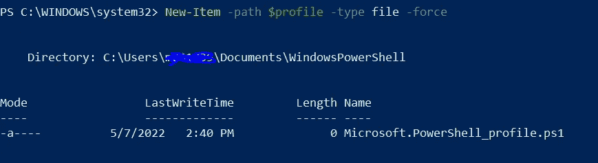
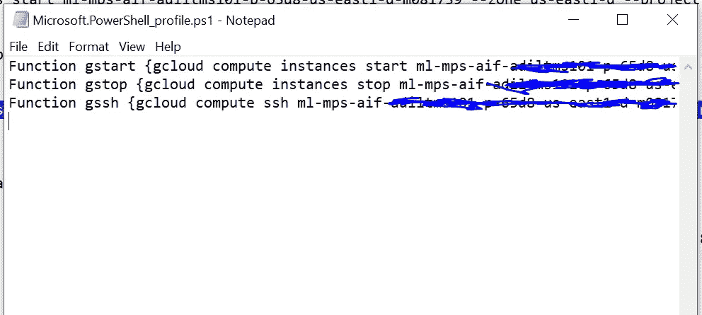
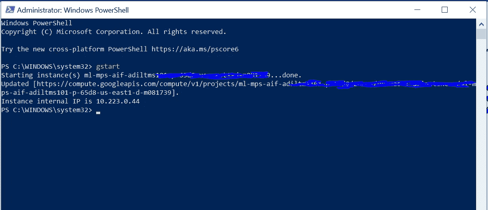

# 如何在 Windows PowerShell 中设置 Google CLI 命令别名

> 原文：<https://towardsdatascience.com/how-to-set-up-google-cli-command-aliases-in-windows-powershell-8dac18e3b57>

## 保存常用命令可以节省大量的时间和麻烦


狐狸和狮子。温塞斯拉斯·霍拉德。维基共享资源。

# 背景

谷歌的[云软件开发工具包(Cloud SDK)](https://cloud.google.com/sdk/auth_success) 是在本地管理云项目的必要工具。在 Linux 或 Mac 中，SDK 命令被终端自动继承，使得在您的*中设置命令别名变得容易。巴沙尔和其他地方*

不幸的是，在 Windows 中，SDK 作为一个独立的应用程序安装，似乎不会继承您的终端配置文件。

设置您的云配置文件需要几个步骤(并且要求您使用 PowerShell ),但这是我能想到的最好的方法。并且从长远来看，它节省了时间，而不必复制和/或重新键入命令。

# 设置

如果您使用的是机构笔记本电脑，您需要启用管理员权限。

首先，在开始菜单中启动 [PowerShell](https://docs.microsoft.com/en-us/powershell/scripting/overview?view=powershell-7.2) 。

PowerShell 通过 [Google 命令行界面(Google CLI](https://cloud.google.com/sdk/gcloud) )而不是 SDK 安装了一套略有不同的工具。在 PowerShell 中运行以下命令([指令](https://cloud.google.com/tools/powershell/docs/quickstart))。

```
Install-Module -Name GoogleCloud -Repository PSGallery -Force -AllowClobber
```

要保存会话之间持续的命令，您需要设置一个 PowerShell 配置文件。当您启动新的 PowerShell 会话时，会加载此配置文件(类似于。bashrc)。

这是一篇关于[创建 PowerShell 配置文件](https://www.howtogeek.com/50236/customizing-your-powershell-profile/)的完整文章。下面简单说明。

在 PowerShell 中运行以下命令来创建新的空白配置文件:

```
New-Item -path $profile -type file -force
```

这将在你的 Documents 文件夹中为我创建一个新文件，在
C:\ Users \ * \ Documents \ windows powershell \ Microsoft。PowerShell_profile.ps1



描述配置文件脚本保存位置的 PowerShell 输出。图片作者。

打开“微软。PowerShell_profile.ps1”。您可以在这里添加 Google CLI 命令(或任何其他命令)。

在 PowerShell 中，多字命令另存为“函数”。函数的语法是—

函数别名{要运行的命令}

例如，您可能希望将用于 ssh 的命令保存到带有端口转发的 DLVM 中(注意，Windows 中的语法略有不同)。

```
Function gssh {gcloud compute ssh my-dlvm --project my-project --zone my-zone '--' -L 8787:127.0.0.1:8787
```

这里是我的一些命令的快照



我的 PowerShell 配置文件保存了一些常用的 Google CLI 命令。图片作者。

容易多了！



在 PowerShell 中运行命令别名。这是它工作时的样子。图片作者。

如果你有更好的方法，请在评论中告诉我…

~噢