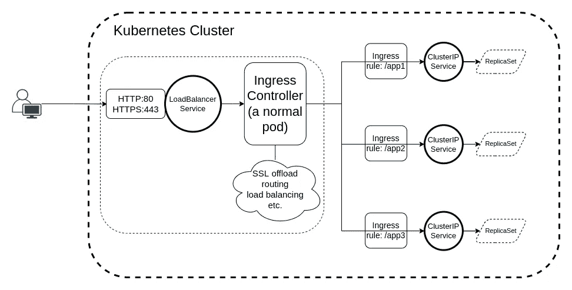
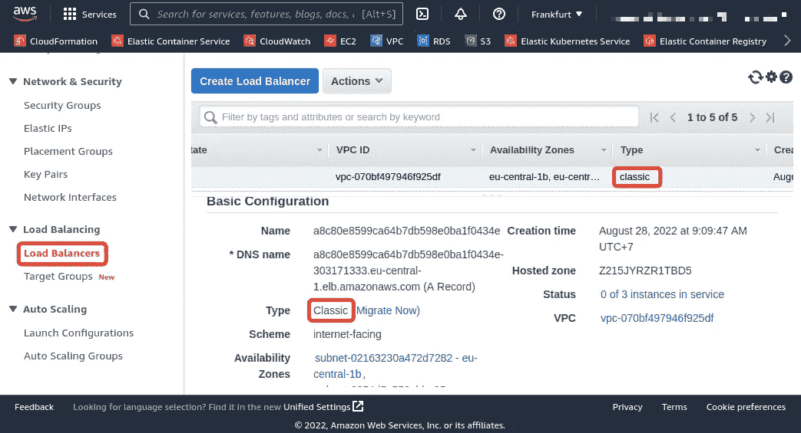
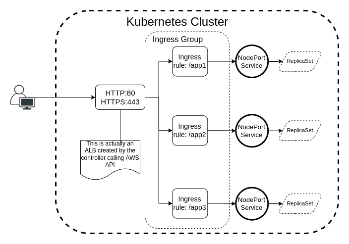

# 如何在自动气象站 EKS 设置入口控制器

> 原文：<https://towardsdatascience.com/how-to-set-up-ingress-controller-in-aws-eks-d745d9107307>

## 以正确的方式在 AWS EKS 上部署入口控制器。

由[安德里亚·扎能加](https://unsplash.com/es/@andreazanenga?utm_source=unsplash&utm_medium=referral&utm_content=creditCopyText)在 [Unsplash](https://unsplash.com/?utm_source=unsplash&utm_medium=referral&utm_content=creditCopyText) 上拍摄的照片

> 特征图像突出了大规模编排的重要性，这是承诺，也是选择 Kubernetes 的众多原因之一！

# 先决条件

本文中的一般指南适用于那些对 Kubernetes、Helm 和 AWS 云解决方案有相当了解的人。此外，请记住，这里介绍的方法是我为我的公司建立 Kubernetes 集群的尝试，您可以随时决定偏离这一方法以适应您的用例或偏好。

说完这些，让我们直接开始吧。

# 那么，入口控制器到底是什么？

与 Kubernetes 中负责将当前状态带入所需状态的其他"[控制器](https://kubernetes.io/docs/concepts/architecture/controller/)一样，入口控制器负责创建集群的入口点，以便[入口](https://kubernetes.io/docs/concepts/services-networking/ingress/)规则可以将流量路由到定义的[服务](https://kubernetes.io/docs/concepts/services-networking/service/)。

简而言之，如果您将网络流量发送到端口 80 或 443，入口控制器将根据入口规则确定该流量的目的地。

> 你必须有一个[入口控制器](https://kubernetes.io/docs/concepts/services-networking/ingress-controllers)来满足一个入口。仅创建入口资源没有效果[ [来源](https://kubernetes.io/docs/concepts/services-networking/ingress/#prerequisites) ]。

举个实际的例子，如果您定义一个入口规则来路由所有到达前缀为`/`的`example.com`主机的流量。除非您的入口控制器能够根据定义的入口规则区分流量的目的地并对其进行路由，否则此规则将不起作用。

现在，让我们看看入口控制器在 AWS 之外是如何工作的。

# 其他入口控制器是如何工作的？

我所知道的所有其他入口控制器都是这样工作的:你将控制器公开为一个[负载平衡器服务](https://kubernetes.io/docs/concepts/services-networking/service/#loadbalancer)，它将负责处理流量(SSL 卸载、路由等)。).

入口控制器如何在 Kubernetes 的世界中工作(图片由作者提供)

这样做的结果是，创建了一个负载平衡器后，集群中将会有以下内容:

使用 kubectl 获取服务信息

这里有一个命令来验证您的负载平衡器服务是否就绪。

使用 AWS CLI 描述负载平衡器

# 这种做法有什么问题？

负载平衡器服务对于其他云提供商来说可能是理想的，但对于 AWS 来说不是，这是一个关键原因。创建该服务后，如果您转到 EC2 控制台的 Load Balancer 选项卡，您会看到负载平衡器的类型是“classic”(AWS 称之为“legacy”负载平衡器)，并要求立即迁移，原因如下所述。

取自 AWS 控制台(图片由作者提供)

由于经典负载平衡器[已于 2022 年 8 月 15 日](https://docs.aws.amazon.com/elasticloadbalancing/latest/userguide/migrate-classic-load-balancer.html)达到其寿命终点，您不应该在 AWS 平台内部使用它。因此，您永远不要将任何[服务](https://kubernetes.io/docs/concepts/services-networking/service/)公开为负载均衡器，因为任何这种类型的服务都会产生一个“经典的”负载均衡器。他们推荐较新版本的负载平衡器(应用程序、网络或网关)。

避免“经典”负载平衡器是我们选择 AWS 支持的替代解决方案的主要原因，因为它让我们能够利用 Kubernetes 工作负载。

照片由 [C D-X](https://unsplash.com/@cdx2?utm_source=unsplash&utm_medium=referral&utm_content=creditCopyText) 在 [Unsplash](https://unsplash.com/s/photos/technology?utm_source=unsplash&utm_medium=referral&utm_content=creditCopyText) 上拍摄

# 那么还有什么选择呢？

当我第一次观察到，与其他入口控制器(HAProxy，Nginx 等)不同，我感到震惊。)，AWS 负载平衡器控制器不会公开 Kubernetes 集群内部的负载平衡器服务。入口控制器是 CKA 考试的基本主题之一[ [来源](https://github.com/cncf/curriculum/blob/master/CKA_Curriculum_v1.24.pdf) ]。

但是，仅仅因为 AWS 对其他入口控制器的支持很差，您就不想失去 Kubernetes 的任何丰富功能，直接进入特定于供应商的产品，并成为供应商锁定的产品；至少，我知道我不想。

> 我个人的偏好是有一个受管理的 Kubernetes 控制平面，带有我自己的自管理节点，但是当然，你可以在这里自由选择你自己的设计！

这里的替代方法是使用[AWS 入口控制器](https://kubernetes-sigs.github.io/aws-load-balancer-controller/v2.4/)，如果您在其他地方运行 Kubernetes，它将允许您拥有相同的工作负载和资源，只是有一点点配置差异，如下所述。

# 但是 Ingress 控制器在 AWS 的世界里是如何工作的呢？

入口控制器在 AWS EKS 内部工作，将入口资源“分组”在一个名称下，使它们可以从单个 AWS 应用负载平衡器访问和路由。您应该通过您在集群中创建的每个入口中的注释来指定“分组”,或者是通过 IngressClassParams 指定[,或者是通过](https://github.com/aws/eks-charts/blob/3798fa6ce1350eed02e8b6c15b19a2e7c5a79078/stable/aws-load-balancer-controller/templates/ingressclass.yaml#L35)[。我不知道你怎么想，但我更喜欢前者！](https://kubernetes-sigs.github.io/aws-load-balancer-controller/v2.4/guide/ingress/annotations/#group.name)

入口控制器如何在 AWS 的 Kubernetes 世界中工作(图片由作者提供)

“入口组”不是一个有形的物体，也没有任何花哨的功能。它只是一组入口资源[以同样的方式](https://kubernetes-sigs.github.io/aws-load-balancer-controller/v2.4/guide/ingress/annotations/#group.name)进行注释(如前所述，您可以通过[在 Ingres class](https://gist.github.com/meysam81/d7d630b2c7e8075270c1319f16792fe2#file-aws-load-balancer-values-yml-L20)中传递“group”名称来跳过对每个入口的注释)。这些入口资源共享一个组名，并且可以被假设为一个单元，共享相同的 ALB 作为边界来管理流量、路由等。

上面提到的最后一部分是 AWS 内部和外部的入口资源之间的差异。因为尽管在 Kubernetes 的世界里，你不需要处理所有这些分组，但是当你使用 AWS EKS 时，这种方法是可行的！

我对实现这一点和管理配置并不感到不舒服，特别是因为 Nginx、HAProxy 和其他入口控制器都有自己的调整和配置注释集，例如，要重写 Nginx 入口控制器中的路径，您可以使用`nginx.ingress.kubernetes.io/rewrite-target`注释[ [源](https://kubernetes.github.io/ingress-nginx/user-guide/nginx-configuration/annotations/#rewrite)。

这里要提到的最后一个重要注意事项是，您的服务不再是`ClusterIPs`，而是`NodePorts`，这使得它们在集群中的每个工作节点上发布服务(如果 pod 不在一个节点上，`iptables`重定向流量)[源](https://kubernetes-sigs.github.io/aws-load-balancer-controller/v2.4/guide/ingress/annotations/#target-type)。您将负责管理安全组，以确保节点可以在临时端口范围[ [source](https://docs.aws.amazon.com/eks/latest/userguide/sec-group-reqs.html) ]上进行通信。但是如果你[使用](https://eksctl.io/) `[eksctl](https://eksctl.io/)` [来创建你的集群](https://eksctl.io/)，它会照顾到所有这些以及更多。

现在，让我们开始部署控制器，以便能够创建一些入口资源。

# 部署 AWS 入口控制器有哪些步骤？

您首先需要在集群中安装控制器，以便任何入口资源能够工作。

这个“控制者”就是负责与 AWS 的 API 对话来创建你的目标群体的人。

1.  要安装控制器，您可以使用 Helm 或直接从 T5 试一试[。](https://kubernetes-sigs.github.io/aws-load-balancer-controller/v2.4/deploy/installation/)

安装 AWS 负载平衡器控制器 CRDs

> 注意:将您的安装锁定到一个特定的版本，并在测试和 QA 之后升级，这始终是一个最佳实践。

2.第二步是安装控制器本身，这仍然可以用 Helm 来完成。我提供我的自定义值；因此，您可以在下面看到安装文件和值文件。

使用 Helm 安装 AWS 负载平衡器控制器

现在我们已经完成了控制器的安装，让我们创建一个入口资源来接收来自万维网的流量！

> 注意:最初安装控制器时，没有创建任何负载平衡器服务，也没有创建任何类型的 AWS 负载平衡器，只有在创建第一个入口资源时，才会创建负载平衡器。

照片由[亚历克斯·科特利亚斯基](https://unsplash.com/@frantic?utm_source=unsplash&utm_medium=referral&utm_content=creditCopyText)在 [Unsplash](https://unsplash.com/s/photos/technology?utm_source=unsplash&utm_medium=referral&utm_content=creditCopyText) 上拍摄

# 空谈不值钱，给我看看代码！

好吧，好吧！以上步骤全部满足后，这里就是完整的 Nginx 栈。

Kubernetes 上完整的 Nginx 堆栈

下面是一些值得一提的注意事项。

*   如果你的`target-type`是一个`instance`，你必须有一个`NodePort`类型的服务。因此，负载平衡器会将流量发送到实例的公开节点端口。如果你更感兴趣的是将流量直接发送到你的 pod，你的 VPC CNI 必须支持这个[[source](https://kubernetes-sigs.github.io/aws-load-balancer-controller/v2.4/guide/ingress/annotations/#target-type)。
*   AWS 负载平衡器控制器使用您在入口资源上看到的注释来设置目标组、侦听器规则、证书等。您可以指定的内容列表包括但不限于健康检查(由目标组完成)、负载平衡器侦听器规则的优先级等等。阅读[参考文件](https://kubernetes-sigs.github.io/aws-load-balancer-controller/v2.4/guide/ingress/annotations/)以获得可能实现的功能的完整概述。
*   ALB 从来自 [ACM](https://aws.amazon.com/certificate-manager/) 的`tls`部分定义的配置中获取证书信息，您需要做的就是确保这些证书存在并且[没有过期](https://docs.aws.amazon.com/acm/latest/userguide/managed-renewal.html)。

应用上述定义，您将在集群中得到以下内容:

获取 Nginx 入口资源

# 结论

在 AWS 这样的云解决方案中管理 Kubernetes 有其挑战性。我认为，他们有很好的营销理由来实施这种挑战，因为他们希望你尽可能多地购买他们的产品，而使用像 Kubernetes 这样的云不可知工具对这一目标没有太大帮助！

在本文中，我解释了如何设置 AWS 入口控制器，以便能够在 AWS EKS 内部创建入口资源。

作为最后一个建议，如果你打算用 AWS EKS 来管理你的 Kubernetes 集群，我强烈推荐你用`[eksctl](https://eksctl.io/)`来试试，因为它会让你的生活变得更加轻松。

祝你今天休息愉快，[敬请关注](https://meysam.io)，保重！

# 参考

*   [https://kubernetes.io/docs](https://kubernetes.io/docs)
*   [https://helm.sh](https://helm.sh)
*   [https://aws.amazon.com/eks/](https://aws.amazon.com/eks/)
*   [https://eksctl.io](https://eksctl.io)
*   [https://github.com/cncf/curriculum](https://github.com/cncf/curriculum)
*   [https://kubernetes-sigs . github . io/AWS-load-balancer-controller/v 2.4/](https://kubernetes-sigs.github.io/aws-load-balancer-controller/v2.4/)
*   [https://github.com/aws/eks-charts](https://github.com/aws/eks-charts)
*   [https://artifacthub.io](https://artifacthub.io)

如果你喜欢这篇文章，看看我的其他内容，你可能也会觉得有帮助。

<https://medium.com/skilluped/what-is-iptables-and-how-to-use-it-781818422e52>  <https://medium.com/skilluped/stop-writing-mediocre-docker-compose-files-26b7b4c9bd14>  <https://medium.com/amerandish/clean-architecture-simplified-223f45e1a10>  <https://medium.com/amerandish/a-tmux-a-beginners-guide-7c129733148> 