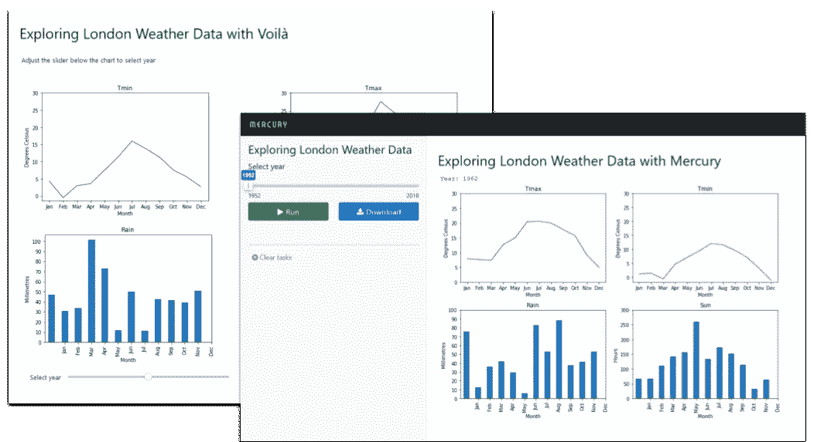
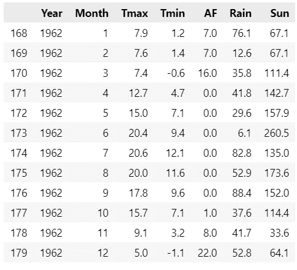
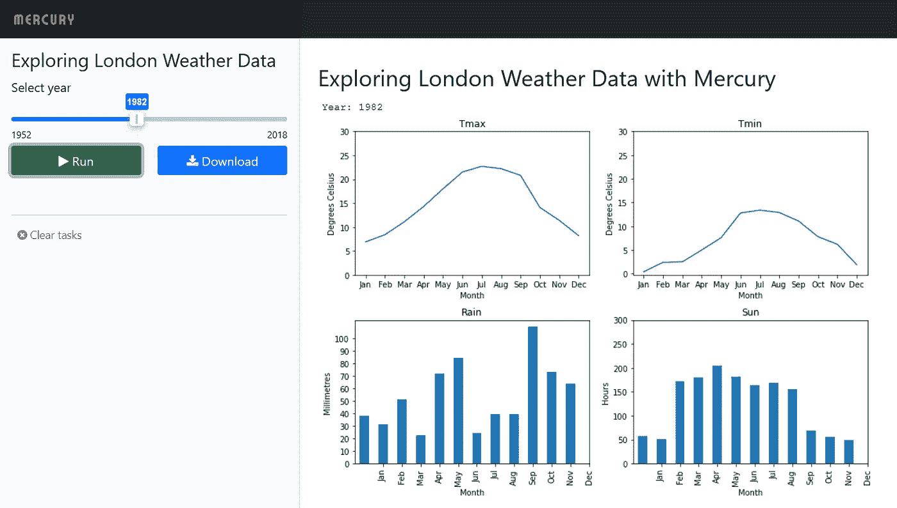

# 如何与 Mercury 或 Voilà共享您的 Jupyter 笔记本

> 原文：<https://towardsdatascience.com/how-to-share-your-jupyter-notebook-with-mercury-or-voil%C3%A0-2177110d2f6e>

## 数据可视化

## 使用 Mercury 或 Voilà将您的 Jupyter 笔记本放在网络上相当容易，但哪一种更容易呢——下面是这两种技术的简单比较



这两个应用程序，作者图片

在网上分享你的数据应该简单而有效。

你想把时间花在分析数据和产生结果上，对吗？演示很重要，但越简单越好。

Mercury 和 Voilà都是可以将你的笔记本自动转换成交互式网络应用的工具。我们要看看哪个更容易和/或更好。

为了说明使用 *Mercury* 或 *Voilà* 之间的区别，我将通过一个简单的应用程序从一个数据集生成一些交互式图形。

将有两个版本:第一个是简单的笔记本，我们将使用 Mercury 框架将其转换为交互式应用程序；第二个使用 *ipywidgets* ，因此交互内置于笔记本中，并使用Voilà *作为网页。*

然后我们会考虑哪种方法更好。

应用程序很简单，从 csv 读取伦敦的天气数据，并生成一个应用程序，显示所选年份每月的四个值的图表，*最高温度*、*最低温度*、*降雨量*和*日照时数*。使用滑块控件选择年份。

## 汞

第一种方法是使用水银。Mercury 将任何普通的 Jupyter 笔记本转变成一个网络应用程序。

为了包含交互，你需要在笔记本开头的一个特殊的 *raw* 单元格中定义小部件。下面是我为本文创建的一个:

```
---
title: Exploring London Weather Data
description: Use Mercury to make a web app from a Jupyter notebook
show-code: False
params:
   year:
      input: slider
      label: Select year
      value: 1952
      min: 1952
      max: 2018
---
```

在一些描述性的值定义之后是一个`params`部分。这指定了变量`year`被绑定到一个输入控件，并为该控件定义了一些值(这些值是不言自明的)。

这必须是笔记本中的第一个单元格；第二个单元格应该定义绑定了控件的变量。在我们的案例中:

```
year = 1952
```

接下来是笔记本的其余部分——我已经在一个代码单元中编写了整个应用程序。

作者图片

正如您在上面的代码中看到的，我们将一个 csv 文件读入 Pandas 数据帧。数据从 1948 年开始，一直持续到 2018 年。这是 1962 年的数据:



数据来源:作者，来自英国气象局发布的公开数据

然后，我们使用由`year`的值选择的数据帧的子集绘制图表:

`weather[weather['Year']==year].plot(…)`

如果你运行笔记本，你会看到 1952 年的图表，这是我们为`year`设定的初始值。

然而，如果我们从笔记本中创建一个 Mercury 应用程序，并在我们的网络浏览器中运行，我们将看到交互式应用程序。



水星应用程序，作者图片

滑块显示在左侧面板中，图表显示在右侧面板中。要更改年份值，我们移动滑块，然后点击*运行*按钮，一组新的图表将会显示出来。

当然，要创建 Mercury 应用程序，你需要安装 Mercury，

```
pip install mljar-mercury
```

或者

```
conda install -c conda-forge mljar-mercury
```

在终端窗口中，导航到笔记本所在的目录并运行命令:

```
mercury run
```

该应用程序将在本地主机上运行:127.0.0.1:8000

## 瞧

第二种方法是使用 Voilà从笔记本创建一个 web 应用程序，为此我们需要使用 *ipywidgets* 来创建交互控件。

因此，这里没有特殊的单元格，整个代码(我承认有点难看)都在一个单元格中:

为图表定义了四个小部件，为标题定义了一个小部件，这些小部件显示在一个 4 x 2 的网格中。每个图表部件都绑定到一个 slider 部件，该部件在第 38 行定义，并显示在最后一个网格位置。

其结果是，笔记本本身是交互式的，但当与 Voilà一起转换时，就变成了一个独立的网络应用程序。


作者图片

要转换笔记本电脑，您需要安装 Voilà:

```
pip install voila
```

或者

```
conda install -c conda-forge voila
```

在笔记本目录中，在终端窗口和弹出的网页中运行命令`voila`,导航到笔记本。

我倾向于认为代码的不雅是由于 *ipwidgets* 的限制——你可能有不同的看法！

## 选择哪一个

那么，哪种方法是最好的呢？

起初，我倾向于支持 **Voilà** 因为交互是即时的，当你移动滑块时，图表会立即改变。非常好。但缺点是(即使在这个非常简单的应用程序中)代码也比其他情况下复杂，这完全是由于使用了 ipwidgets。

**Mercury** 方法是添加定义控件的额外单元格，并将它们绑定到笔记本中的变量。缺点是笔记本本身不是交互式的(当然，应用程序是)，但它的好处是更简单，因为笔记本专注于重要的东西，数据分析，而不是交互。

水银解决方案也需要按下按钮来实现改变。但这是一个缺点吗——也许浮华的动态图表有点被高估了。

我不会在这件事上下定决心。您可以下载代码(参见下面的链接)并查看产品网站(也链接到下面的),然后自己做出决定。

*关于如何将应用程序部署到公共网络主机(如 Heroku)的说明，请访问 Voilà和 Mercury 网站。*

一如既往地感谢您的阅读，如果您想知道我何时发布新文章，请考虑注册下面的电子邮件提醒或订阅我在 [Substack](https://technofile.substack.com/) 上的免费临时简讯。

如果你还不是一个媒体订阅者，那就注册吧，这样你就可以每月花 5 美元阅读尽可能多的文章。在这里注册，我将赚取一小笔佣金。

## 密码

你需要的三个文件在我的 [Github 库](https://alanjones2.github.io/Alan-Jones-article-code/)里，直接链接在这里:

[heathrowDataFiltered](https://github.com/alanjones2/Alan-Jones-article-code/raw/master/mercury/heathrowDataFiltered.csv) 。战斗支援车

[heathrowdatamercury 2 . ipynb](https://github.com/alanjones2/Alan-Jones-article-code/raw/master/mercury/heathrowdataMercury2.ipynb)

[heathrowdatawidgets 2 . ipynb](https://github.com/alanjones2/Alan-Jones-article-code/raw/master/mercury/heathrowdatawidgets2.ipynb)

## 参考

我所使用的三种技术的网站如下:

    <https://mljar.com/mercury/> 