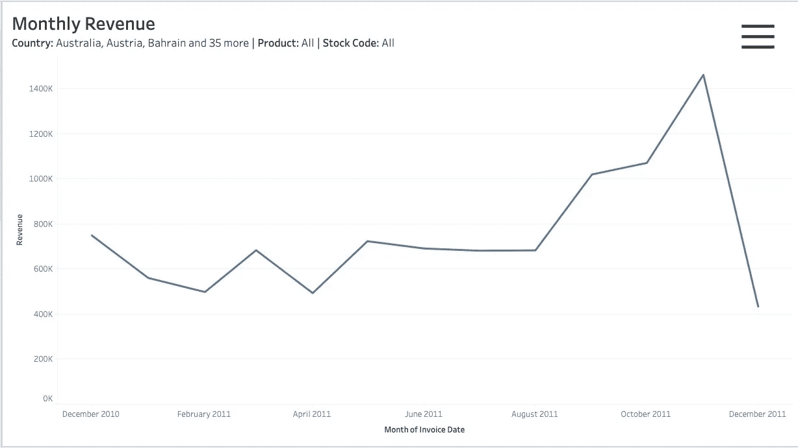
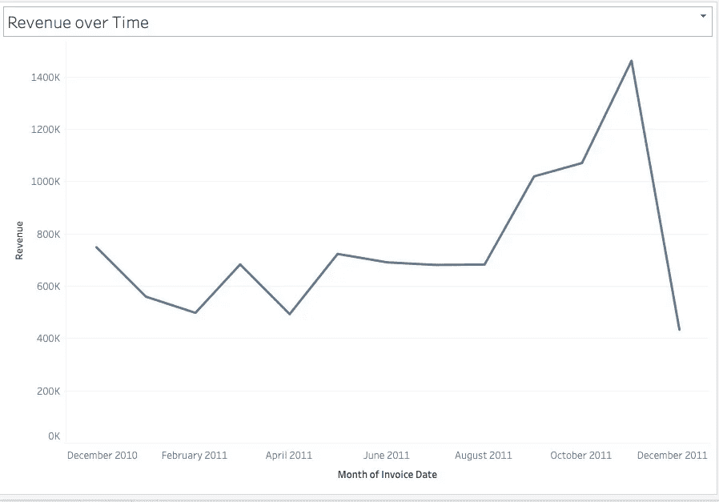
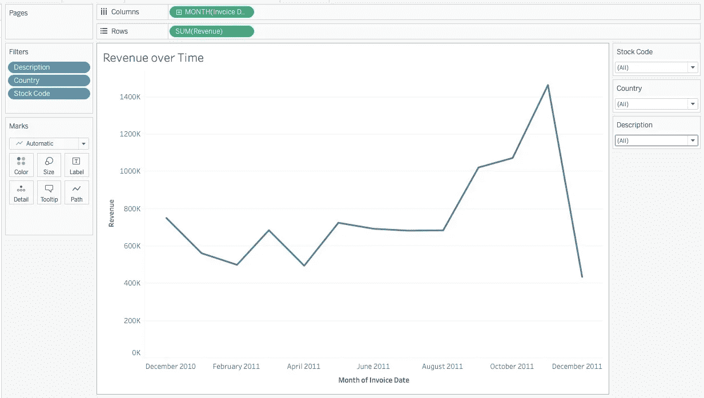
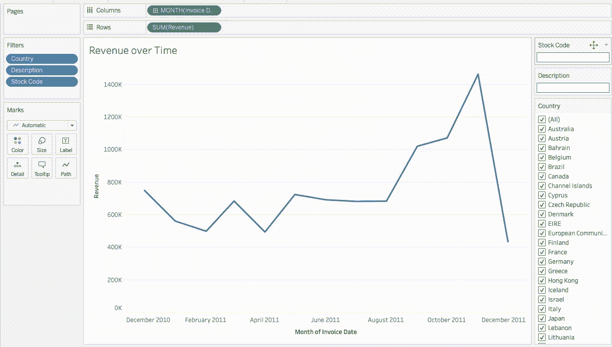
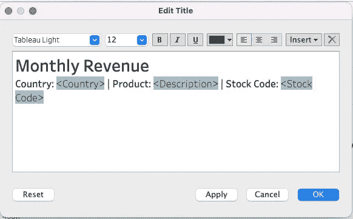
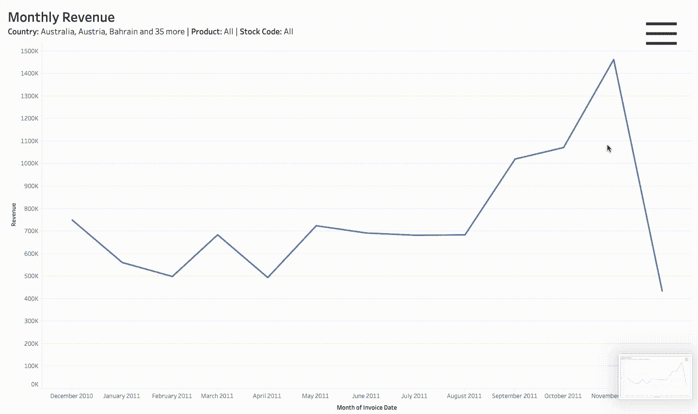

# 如何在 Tableau 中显示和隐藏过滤器

> 原文：<https://towardsdatascience.com/how-to-show-and-hide-filters-in-tableau-290b8b6c5c83>

## 了解如何通过添加“显示/隐藏过滤器”按钮来改进您的仪表板设计，并释放仪表板中的视觉空间。

隐藏的过滤器仪表板(作者图片)

对于本教程，我们将使用从 UCI 机器学习资源库[2]下载的**在线零售数据集** [1]。它包含来自虚构零售商的销售订单数据。我们对构建收入图表感兴趣，我们通过将数量乘以单价来计算收入。

收入折线图(作者图片)

为了让我们的最终用户能够深入了解对他们重要的数据，我们添加了针对*国家*、*描述*和*股票代码*的过滤器。这些过滤器自动添加到图表的右侧，作为一个*通配符匹配*或*多值(列表)*，它通常显示所有的值，并允许用户勾选他们感兴趣的值。当只有很少的值可供选择和很少的过滤器时，这很好，但是随着列表变大，这就变得难以控制了。

对于这个例子，我们将把我们所有的过滤器*多值下拉。*

下拉过滤器(作者图片)

这个仪表板通常做我们想要它做的事情，但是设计感觉不完整和笨拙。如果我们可以将每个筛选器制作成一个下拉列表，将图例移动到标题，添加一个开关来显示和隐藏筛选器，并在图表上显示选定的筛选器，会怎么样？它可能看起来像这样:

带过滤器的月度收入图表(图片由作者提供)

## 如何创建仪表板

从我们最初的仪表板开始，我们首先通过单击向下箭头符号并选择*多值(下拉)*选项*将所有过滤器转换为下拉列表。*对每个过滤器重复此步骤。

过滤器(图片由作者提供)

## 可选步骤

> 当我们对标题进行更改时，我们还可以向描述中添加过滤器，以便我们可以清楚地调出我们在图表上显示的内容。这是一个很好的步骤，可以向可能截屏最终视觉效果的用户提供图表实际上被过滤的内容的知识。这里的风险是，我们有太多的类别，我们不能以良好的方式将其可视化。

编辑标题(图片由作者提供)

现在我们已经解决了图表和过滤器的一些基本问题，我们可以回到仪表板了。在仪表板上，确保选择包含所有过滤器的容器，并选择添加显示/隐藏按钮。

这将创建一个按钮，隐藏过滤器所在的整个容器。您可以通过 alt 单击来切换隐藏或显示过滤器。

虽然这对于大多数人来说已经足够了，但我发现平铺视图有些混乱，我更喜欢让容器浮动。我们还将应用一些容器的浅色格式。(在本例中，我们添加了简单的边框和背景色)

就这样——我们成功地在 Tableau 仪表板上添加了一个显示隐藏按钮，并创建了一个更加简约的仪表板。我们的最终仪表板允许我们按需隐藏和显示过滤器。

最终仪表板(图片由作者提供)

[1]陈大庆、赛梁赛恩和郭昆，[在线零售业的数据挖掘:](https://archive.ics.uci.edu/ml/datasets/online+retail)使用数据挖掘进行基于 RFM 模型的客户细分的案例研究，《数据库营销和客户战略管理杂志》，第 19 卷，第 3 期，第 197-208 页，2012 年(印刷前在线出版:2012 年 8 月 27 日)。doi: 10.1057/dbm.2012.17)。

该数据集获得了[知识共享署名 4.0 国际](https://creativecommons.org/licenses/by/4.0/legalcode) (CC BY 4.0)许可。

[2]Dua d .和 Graff c .(2019 年)。 [UCI 机器学习资源库](http://archive.ics.uci.edu/ml)。加州欧文:加州大学信息与计算机科学学院。