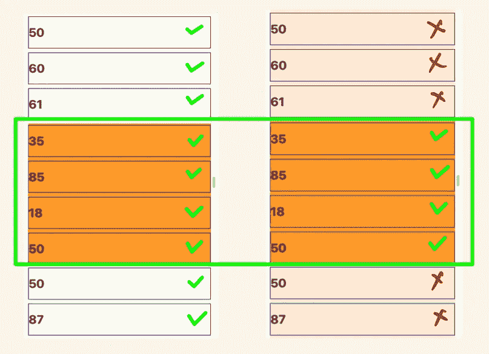
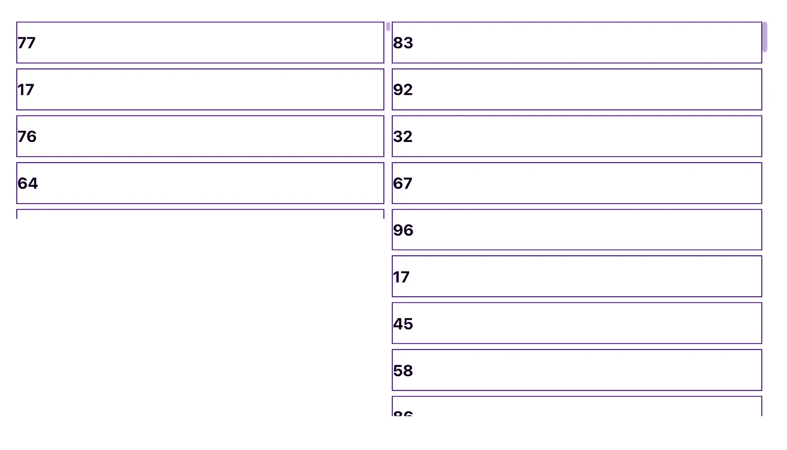

# 如何在 React 中使用无限滚动显示数据

> 原文：<https://towardsdatascience.com/how-to-show-data-using-infinite-scroll-in-react-7c7c8540d5b4>

## 使用反应大师


照片由[胡安乔·哈拉米略](https://unsplash.com/es/@juanjodev02?utm_source=unsplash&utm_medium=referral&utm_content=creditCopyText)在 [Unsplash](https://unsplash.com/@lautaroandreani?utm_source=unsplash&utm_medium=referral&utm_content=creditCopyText) 上拍摄

这里有多种向用户显示数据的方式，例如分页和无限滚动。我们可以根据情况选择它们中的任何一个或一些变体——例如，使用 **Load More** 按钮加载数据。

在这篇文章中，我们将实现无限滚动。可以描述如下。当用户向下滚动时，下一组数据从服务器加载，并添加到前面数据的底部，形成无缝的用户体验。除非没有更多的数据要加载，否则重复这种技术。

在实现无限滚动后不久，您可能会因为重新呈现数千个项目而遇到与性能相关的问题。为了解决这个问题，我们可以使用列表虚拟化或者窗口技术。在这个方法中，我们将只呈现对用户可见的项目。当用户上下滚动时，窗口将上下移动。因此，我们将最终重新呈现列表的一个子集。最后，它将提高性能和用户体验。



显示包含数千个项目的列表与显示项目子集——按作者排序的图片

我们将使用 [React Virtuoso](https://virtuoso.dev/) 库，它实现了列表虚拟化方法。它还提供了其他很酷的功能，如滚动到索引、自动调整内容大小、带有粘性标题的分组模式等。

# 设置

对于这个设置，我们将创建一个 React 应用程序。你可以从 [GitHub](https://github.com/lifeparticle/react-infinite-scroll) 下载最终的项目。首先，我们将使用 [create-react-app](https://create-react-app.dev/) (CRA)工具创建一个 react 应用程序。

```
npx create-react-app react-infinite-scroll
```

现在让我们将 React Virtuoso 库添加到我们的应用程序中。

```
cd react-infinite-scroll
npm install react-virtuoso
```

我们可以使用下面的命令启动我们的应用程序。

```
npm start
```

我们的初始设置已经完成，我们可以开始编码了。在这个应用程序中，我们将在用户每次滚动到底部时加载随机数。在现实生活中，这个函数可以由对服务器的 API 调用来代替。



两种类型的滚动——按作者滚动图像

厉害了，现在来说说布局吧。在左侧，我们使用 React Virtuoso 提供的滚动，在右侧，我们使用自己定制的滚动。

左手边的 React Virtuoso 设置。

```
<Virtuoso
 style={{ height: 400 }}
 data={numbersLeft}
 endReached={loadMoreLeft}
 itemContent={(index) => (
  <div className="scrollLeft">
   <div>
    <h1>{numbersLeft[index]}</h1>
   </div>
  </div>
 )}
/>
```

反应右侧的 Virtuoso 设置。

```
<div className="scrollRightParent" ref={parentRef}>
 <Virtuoso
  style={{ height: "100vh" }}
  data={numbersRight}
  endReached={loadMoreRight}
  useWindowScroll
  customScrollParent={parentRef.current}
  itemContent={(index) => (
   <div className="scrollRight">
    <div>
     <h1>{numbersRight[index]}</h1>
    </div>
   </div>
  )}
 />
</div>
```

为了使用我们的自定义滚动，我们需要传递两个额外的属性(props) `useWindowScroll`和`customScrollParent`。你可能想要使用其他的大师道具，这些可以在[大师 API 文档](https://virtuoso.dev/virtuoso-api-reference/)中找到。

在这篇文章中，我们讨论了与渲染大型列表相关的性能问题以及解决方案。我们还学习了如何使用 React Virtuoso 库通过显示用户可见的项目来提高性能。此外，我们已经演示了两种不同类型的滚动行为。正如我在本文开头提到的，使用 React Virtuoso 库创建所需的应用程序还可以实现其他一些很酷的事情。编码快乐！

# 相关帖子

[](/how-to-dockerize-an-existing-react-application-c27bd8517dcb) [## 如何对现有的 React 应用程序进行 Dockerize

### 轻松运行 React 应用程序

towardsdatascience.com](/how-to-dockerize-an-existing-react-application-c27bd8517dcb)