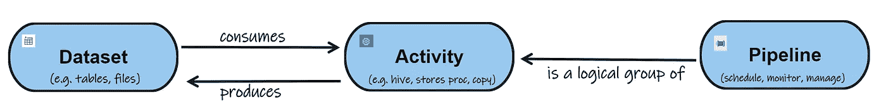
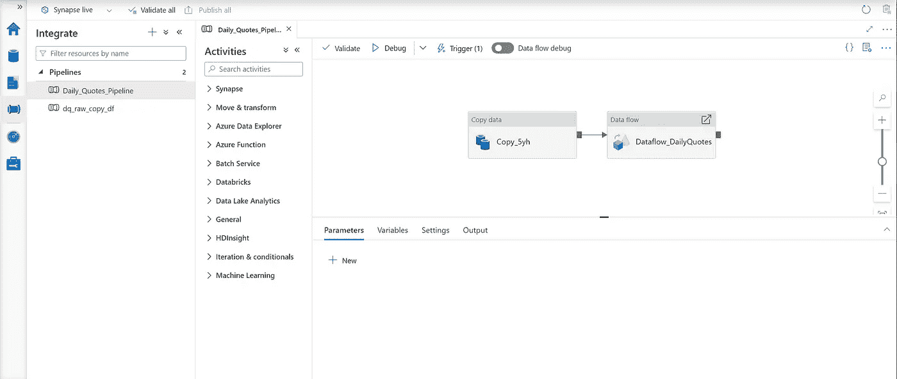
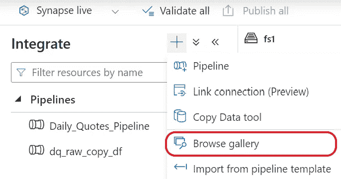
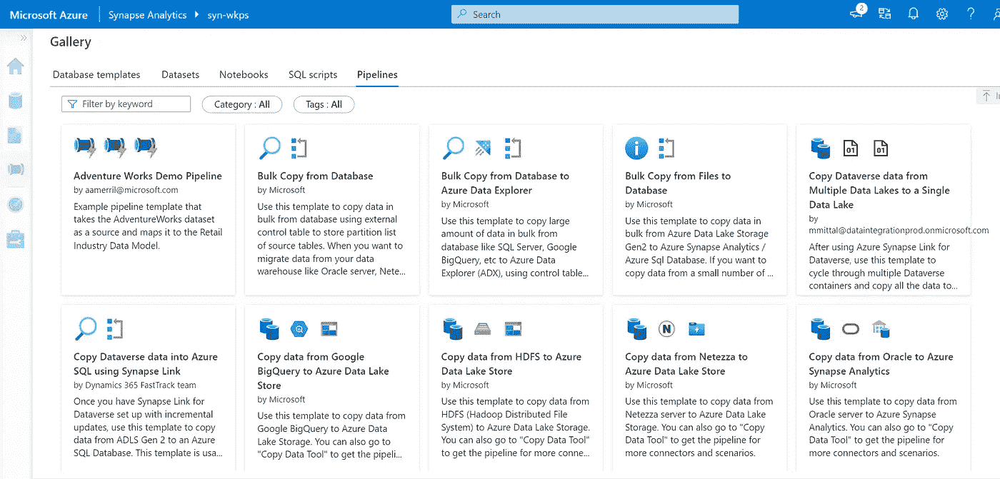

# 如何简化 Azure Synapse 管道的创建

> 原文：<https://towardsdatascience.com/how-to-simplify-creating-azure-synapse-pipelines-e33833abb4d>

## 了解管道的结构

照片由 [JJ 英](https://unsplash.com/@jjying)在 [Unsplash](https://unsplash.com)

TLDR

*   Azure Synapse 管道由什么组成
*   通过提前创建数据集，使 Azure Synapse 管道流程更加简单
*   这是一个关于如何创建 Azure Synapse 数据集的视频

*   利用模板创建管道

在我之前的[文章](/top-10-features-in-azure-synapse-analytics-workspace-ec4618a7fa69)中，我提到过管道是 Azure Synapse 的顶级特性之一。现在让我们更深入地了解它们是什么以及如何使用它们。

# **Azure Synapse 中有哪些管道**

Azure Synapse 中的管道与 Azure 数据工厂管道相同。它刚刚被嵌入 Azure Synapse Studio。它可以定义为一种将活动组合在一起以创建作业的方式。它也是一个低级代码，让您能够在工作的旅程中跟踪迭代。

要理解管道，你需要知道它如何与其他 Azure Synapse 数据术语(如“数据集”和“活动”)结合在一起。看看下面的图片。这表明需要一个**数据集**来创建一个**活动**并且一个**活动**可以被视为一个**管道**的逻辑分组

Azure Synapse 管道剖析—图片由作者提供

# **如何创建管道**

要在 Synapse 中创建管道，您需要转到 Integrate 部分，然后您会看到创建新管道的选项

作者图片

在左侧，您有所有的活动，在中间的空白区域，您可以将活动拖动到空白区域以开始流程。活动的例子有拷贝作业、数据流、查找、迭代和过滤器等条件。在活动中，您可以包含数据集。

一旦您完成了管道的创建，您将需要发布它。然后，您可以运行它来验证它的工作没有错误。您可以通过将管道作为计划作业来运行，从而更进一步。

# **如何使创建管道更容易**

如果您不了解所有的构造块，创建管道可能会很有挑战性。我发现在创建管道时有一点很有帮助，那就是确保提前创建数据集。在本博客开头的[视频](https://youtu.be/V3xsnfno-GY)中，我展示了如何创建数据集，以及一旦数据集已经创建，如何更容易地创建我的管道。

在 Azure Synapse 中创建管道是运行高效 ETL 或 ELT 流程的一个好方法。在管道之前做好基础准备是最大但最简单的部分之一，它使这个过程更容易创建和发布。如果你被困住了，需要一些创建管道的灵感，看看管道下面的图库部分(如下图红框所示)。

作者图片

您将看到不同类型的管道选项，您可以使用它们快速开始。如果你不确定管道应该是什么样子，这就是你要去的地方。

作者图片

# **结论**

在基于云的解决方案(如 Synapse)中创建管道可以更容易地执行 ETL / ELT 作业。确保创建数据集并使用模板，可以更轻松地创建管道。敬请关注其他与数据相关的内容。