# 如何在 Python 中简化线性回归的假设检验

> 原文：<https://towardsdatascience.com/how-to-simplify-hypothesis-testing-for-linear-regression-in-python-8b43f6917c86>

## 统计数字

## 什么是同性恋？


爱德华·豪厄尔在 [Unsplash](https://unsplash.com/s/photos/graph?utm_source=unsplash&utm_medium=referral&utm_content=creditCopyText) 上拍摄的照片

我发现自己一遍又一遍地回到基础知识来更新我的统计知识。大多数人对统计学的第一次介绍是从学习假设检验开始的，紧接着是 t 检验和线性回归。本文回顾了如何使用线性回归进行假设检验，以及为了信任线性回归统计检验的结果而必须满足的假设。我还想分享一个我制作的 Python 函数，它可以快速检查使用线性回归进行假设检验时需要满足的 5 个统计假设。

## 关于线性回归的快速提醒

在我分享进行线性回归假设检验应该满足的 4 个假设之前，关于线性回归，有一点需要记住。线性回归可以被认为是一种双重用途的工具:

1.  预测 y 变量的未来值
2.  推断趋势是否具有统计显著性

记住这一点很重要，因为这意味着如果使用回归来预测未来值，您的数据不必满足线性回归假设检验的要求。如果您试图确定是否存在实际趋势(也就是趋势具有统计学意义)，您需要满足假设检验假设。

## 线性回归和机器学习

与机器学习相比，传统统计学更多地与数据中信号的推断相关联；而机器学习更侧重于预测。在可供机器学习选择的所有模型中，线性回归是您可以使用的最简单的模型之一，通常在基于连续数据构建新的机器学习模型时用作基准(如果您正在处理分类数据，则逻辑回归将是等效的)。你可以看到为什么统计学和机器学习都是作为数据专业人员的必要工具。需要记住的一个很好的提醒是，统计学更倾向于推理，而机器学习更倾向于预测。也就是说，同样值得注意的是，统计学首先为机器学习提供了基础。

## 为什么线性回归假设检验很重要

假设检验帮助我们确定我们的数据中是否有足够的信号来确信我们可以拒绝零假设。本质上，它回答了这样一个问题，“我能对我在数据中看到的模式有信心吗，或者我看到的只是噪音？”我们使用统计学来推断数据中存在的关系和意义。

现在，为了使用线性回归假设检验从我们的数据中做出推论，我们需要确定我们在检验什么。为了解释这一点，我需要分享这个简单的公式:

```
y = mx + b
```

我想大多数学过高中数学的人都会记得，这是一条直线斜率的方程。

就线性回归而言，该公式的更正式表示为:

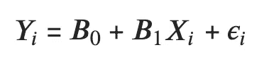

作者图片

其中 B0 是截距，B1 是斜率。x 和 Y 分别代表自变量和因变量，ε是误差项。

直线斜率(B1)的线性回归假设检验如下所示:

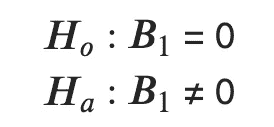

作者图片

这些数学符号表示零假设(Ho)是斜率(B1)等于 0(即斜率是平坦的)。另一个假设(Ha)是斜率不等于 0。

补充说明:还有一种假设检验很少用于线性回归，这是一种关于截距的假设。因为我们通常关心直线的斜率，所以用得较少。

## 线性回归假设检验的 4 个假设

1.  Y 和 X 之间存在线性回归关系
2.  误差项(残差)呈正态分布
3.  误差项的方差在所有 X 值上都是恒定的(同方差)
4.  误差项是独立的

为了演示测试这些线性回归的统计假设，我们需要一个数据集。我将使用 R 标准库中的 cars 数据集。数据集非常简单，如下所示:

```
pip install rdatasets
from rdatasets import data as rdatadat = rdata("cars")
dat
```

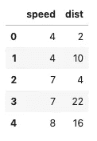

汽车数据集-按作者分类的图像

我们将预测一辆 1920 年的汽车在给定的速度下停下来之前的行驶距离。

让我们首先创建线性回归模型，然后执行检查假设的步骤。

*边注:技术上有第五个假设，X 值是固定的，测量没有误差。然而，这种假设并不是你要创建的诊断图，所以被忽略了。*

## 在 R 和 Python 中创建线性回归诊断图

我通常用 Python 编写代码，但是我想展示如何用 R 和 Python 创建线性回归模型，以展示在 R 中检查统计假设是多么容易。

**R 中的线性回归**

```
cars.lm <- lm(dist ~ speed, data=cars)
```

然后，为了检查假设，您需要做的就是调用绘图函数并选择前两个绘图

```
plot(cars.lm, which=1:2)
```

这将为您提供以下图表:

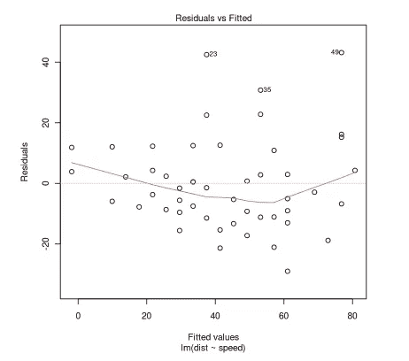

作者图片

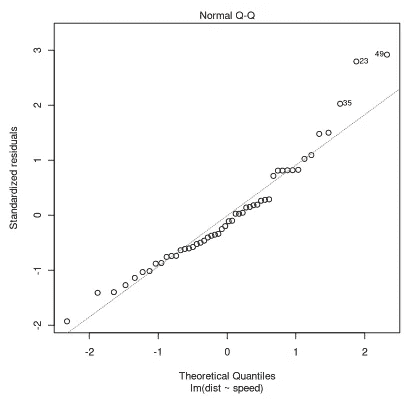

作者图片

第一个是残差与拟合图，第二个是 QQ 图。我将在下面更详细地解释这两个情节。

这两个图几乎是你测试上述 4 个假设所需要的全部。在 Python 中似乎没有像在 R 中那样快速简单的方法来检查线性回归假设，所以我做了一个快速函数来做同样的事情。

**Python 中的线性回归**

这就是在 Python 中对相同的 cars 数据集运行线性回归的方式:

```
from statsmodels.formula.api import ols
from rdatasets import data as rdatacars = rdata("cars")
cars_lm = ols("dist ~ speed", data=cars).fit()
```

*补充说明:R 中的线性回归是内置函数的一部分，而在 Python 中，我使用的是 statsmodels 包。*

然而，要获得上述两个相同的诊断图，您必须分别运行以下命令。

*Python 中的 QQ 剧情*

```
import statsmodels.api as sm
import matplotlib.pyplot as pltresiduals = cars['dist'] - cars_lm.predict()
sm.qqplot(residuals, line='45', fit=True) 
plt.title('QQ Plot')
plt.show()
```


作者图片

*残差 vs 拟合 Python*

```
from statsmodels.formula.api import ols
import statsmodels.api as sm
from rdatasets import data as rdata
import matplotlib.pyplot as plt# Import Data
cars = rdata("cars")# Fit the model
cars_lm = ols("dist ~ speed", data=cars).fit()# Find the residuals
residuals = cars['dist'] - cars_lm.predict()# Get the smoothed lowess line
lowess = sm.nonparametric.lowess
lowess_values = pd.Series(lowess(residuals, cars['speed'])[:,1])# Plot the fitted v residuals graph
plt.scatter(cars['speed'], residuals)
plt.plot(cars['speed'], lowess_values, c='r')
plt.axhline(y=0, c='black', alpha=.75)
plt.title('Fitted vs. Residuals')
plt.show()
```

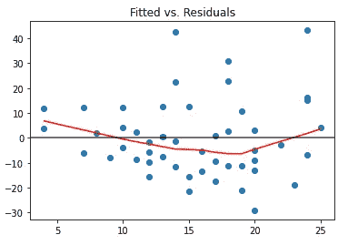

作者图片

## 用于线性回归诊断图的简化 Python 函数

创建上面的图所需的努力并不太可怕，但仍然比我每次检查线性回归假设时需要输入的要多。除了 QQ 图之外，我还想有更多的诊断图，例如用于检查正态分布的直方图。我还想用另一个图来检验假设 4，即误差项是独立的。

所以我做了一个 Python 函数来快速检查 OLS 假设。我将在以后引用这个函数，希望你也会觉得它有用。我在下面加入了要点，但是函数保存在 git repo [这里](https://github.com/amartinson193/Statistics-Book/blob/main/my_functions/check_ols_assumptions.py)。欢迎提出改进建议。

*作为旁注，我在这里* 找到了另一篇关于用 Python [*创建 R 诊断图的博文*](https://robert-alvarez.github.io/2018-06-04-diagnostic_plots/)

如果我将 cars 数据集传递到 check_ols_assumption 函数中，我将得到以下诊断图输出:

```
cars = rdata("cars")
cars_lm = ols("dist ~ speed", data=dat).fit()check_ols_assumptions(cars['speed'], cars['dist'], cars_lm.predict())
```

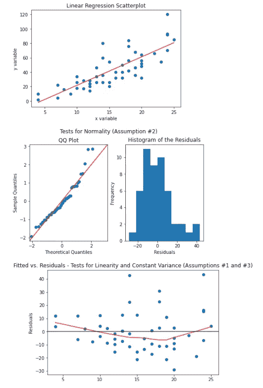

作者图片

## 线性回归假设检验假设解释

既然我已经分享了我在 Python 中为快速线性回归假设测试创建的函数，我想快速回顾一下如何解释诊断图，以及诊断图如何帮助确定是否满足线性回归假设。

1.  **线性关系**

确定线性度的诊断图是拟合残差图:

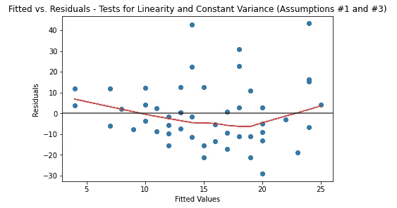

作者图片

X 轴上的拟合值是从线性回归预测的值。Y 轴上是残差，即预测值(拟合值)和实际 Y 值之间的差值。

如果图中没有明显的趋势，则假定满足线性关系。上面的图满足了这个假设。以下是一个不符合这一假设的诊断图示例:

```
# Create a synthetic dataset
np.random.seed(42)
x_var = np.arange(0,10,.1)
y_var = np.sin(x_var)data = pd.DataFrame({'x_var':x_var, 'y_var':y_var})ols_result = ols("y_var ~ x_var", data=data).fit()
check_ols_assumptions(data['x_var'], data['y_var'], ols_result.predict())
```

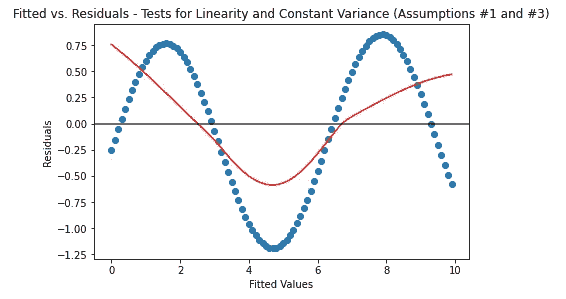

作者图片

此图显示了正弦函数的线性回归模型的残差。因为有一个明显的趋势(散点图值和 lowess 回归的红线所示)，所以不符合 X 和 Y 之间的关系是线性的假设。

*边注:想了解更多关于洛维斯回归的信息，请点击这里*[](/lowess-regression-in-python-how-to-discover-clear-patterns-in-your-data-f26e523d7a35)

***2。误差项呈正态分布***

*记住这一假设的关键点是，X 或 Y 变量不必呈正态分布，需要呈正态分布的是误差项或残差。另一个需要记住的要点是，仅仅因为图是线性的，并不意味着分布可以被认为是正态的。*

*以下是用于检查误差项(残差)是否正态分布的诊断图:*

*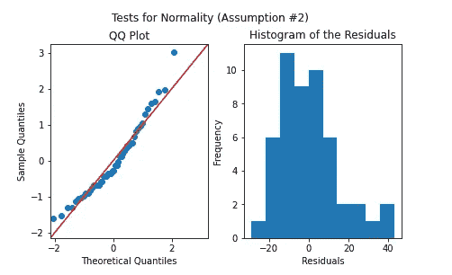*

*作者图片*

*我使用 QQ 图和直方图来检查正态性。如果 QQ 图点大致与 45 度线对齐，则满足此假设。另一种检查方法是直方图，如果分布遵循正态(高斯)钟形曲线，残差可以视为正态。要了解更多关于 QQ 情节的信息，请参考本文[这里](/q-q-plots-explained-5aa8495426c0)。*

***3。误差项的方差在所有 X 值上保持不变***

*拟合的 vs 残差图再次用于确定方差是否恒定。以下是再次供参考的情节:*

**

*作者图片*

*如果残差的垂直分布在所有拟合值中保持大致一致，则假设满足恒定方差假设。cars 数据集看起来可能不太符合这个假设。下面是一个更清晰的数据集示例，它不符合这一假设:*

```
*# Create a synthetic dataset
np.random.seed(42)
x_var = np.arange(0,10,.1)
y_var = np.random.normal(0,.1,100) * x_vardata = pd.DataFrame({'x_var':x_var, 'y_var':y_var})ols_result = ols("y_var ~ x_var", data=data).fit()
check_ols_assumptions(data['x_var'], data['y_var'], ols_result.predict())*
```

*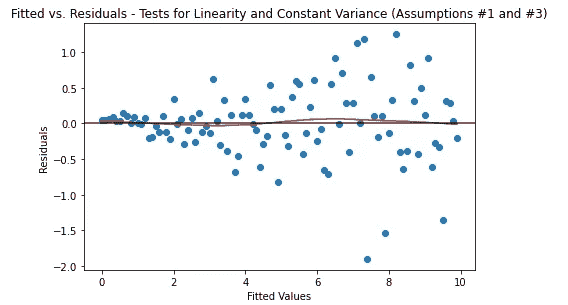*

*作者图片*

*本例显示了随着 X 值的增加，数据如何开始进一步扩散。这违反了这一假设，因为随着 X 值的增加，数据扩散得越来越远。*

***4。误差项是独立的***

*只有当您知道数据收集的顺序时，才能验证这一假设。最常见的情况是，当数据集中存在时间组件时，可以检查这一点(但是通过使用时间列，您可以假设数据收集的时间与该列的时间相同)。如果在一段时间内残值有一个趋势，那么这个假设就违背了。*

*如果值已经处于正确的顺序，它看起来将与拟合与残差图相同。上面的 check_ols_assumptions 中有一个默认参数，如果时间变量存在于数据集中，则可以传递该参数。*

*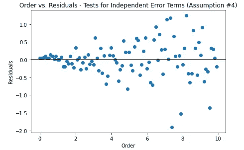*

*作者图片*

## *结论*

*现在你有了，一个关于使用线性回归进行统计分析的快速复习。我希望你会发现 check_ols_assumptions 函数很有用，如果你有任何反馈，请告诉我😄*

*感谢阅读！如果你喜欢读这篇文章，请在 LinkedIn 上与我联系，并查看我的其他文章。*

*如果你是中级新手，可以考虑使用下面的我的推荐链接订阅👇*

*[](https://medium.com/@andreasmartinson/membership) [## 加入 Medium 并通过我的推荐链接支持我

### 作为一个媒体会员，你的会员费的一部分会给你阅读的作家，你可以完全接触到每一个故事…

medium.com](https://medium.com/@andreasmartinson/membership) 

## 参考

1.  J.戴维森，[不，机器学习不仅仅是美化统计学](/no-machine-learning-is-not-just-glorified-statistics-26d3952234e3) (2018)，走向数据科学
2.  R.阿尔瓦雷斯，[用 Python 创建诊断图以及如何解释它们](https://robert-alvarez.github.io/2018-06-04-diagnostic_plots/) (2018)，罗伯特。Alvarez.github.io
3.  页（page 的缩写）Varshney， [Q-Q 图解释](/q-q-plots-explained-5aa8495426c0) (2020)，走向数据科学
4.  南 Dobilas，[Python 中的 LOWESS 回归:如何在你的数据中发现清晰的模式？](/lowess-regression-in-python-how-to-discover-clear-patterns-in-your-data-f26e523d7a35) (2020)，走向数据科学*