# 如何用机器学习解决一个分类任务

> 原文：<https://towardsdatascience.com/how-to-solve-a-classification-task-with-machine-learning-b73b4aa0cbf6>

## 使用机器学习为贷款申请人构建二元分类器

[梁杰森](https://unsplash.com/@ninjason?utm_source=medium&utm_medium=referral)在 [Unsplash](https://unsplash.com?utm_source=medium&utm_medium=referral) 上的照片

# 前言

这篇文章延续了我上一篇关于使用德国信用数据集进行[探索性数据分析](/german-credit-data-part-1-exploratory-data-analysis-8f5f266b2426)的文章。如果你没有读过我以前的文章，我建议你读一读，这样你可以对数据集有更好的了解。我将指导你如何使用机器学习方法处理德国信用数据案例研究。这个案例研究是一个很好的例子，说明机器学习如何用于解决一个实际的金融问题。完整的项目可以在我的 GitHub 上找到，我会在本文结尾留下链接。

# 介绍

到目前为止，我相信你已经听过很多机器学习这个术语了。这是信息技术领域的一个热门话题。由于大多数大公司和金融机构都依赖数据进行如此大规模的运营，因此数据科学领域的发展也就不足为奇了。但是机器学习到底是什么，我们如何在实际意义上使用它？

## 什么是机器学习？

> 机器学习是在没有明确编程的情况下赋予计算机学习能力的研究领域。
> 
> 阿瑟·塞缪尔，1959 年

在我看来，上面的引用是对机器学习的最好的一般性定义。这非常有用，因为大多数机器学习概念允许用户向计算机算法输入大量数据，并让计算机仅根据输入数据进行分析并做出数据驱动的建议和决策。本文中的案例研究将回顾一个流行的机器学习概念，称为分类。

## 分类

在机器学习(ML)中，分类是一个监督学习概念，它将数据分组到类中。分类通常是指任何类型的问题，其中特定类型的类标签是从给定的数据输入字段中预测的结果。一些类型的分类任务包括:

*   垃圾邮件过滤
*   顾客行为
*   图像分类
*   信用卡欺诈检测

## 目标

德国信用数据集的目标是最大限度地减少向申请人发放高风险贷款的机会，同时最大限度地增加从优质贷款中获利的机会。贷款经理在对申请人的贷款申请做出决定之前，会考虑申请人的人口和社会经济状况。

德国信用数据集是从 [UCI 机器学习库](https://archive.ics.uci.edu/ml/datasets/Statlog+%28German+Credit+Data%29)下载的公开可用数据集。德国信贷数据包含 20 个变量的数据，以及对 1000 名贷款申请人的申请人是否被视为良好或不良信贷风险的分类。该任务需要研究数据并建立预测模型，以便为银行经理提供指导，从而根据潜在申请人的个人资料决定是否批准向其提供贷款。

在这个案例研究中，我使用了原始数据集的简化版本，它只有 10 个变量:

1.  年龄(数字)
2.  性别(字符串:男性，女性)
3.  工作(数字:0 —非熟练和非居民，1 —非熟练和居民，2 —熟练，3 —高技能)
4.  住房(字符串:自有、租赁或免费)
5.  储蓄账户(字符串—少量、中等、相当丰富、丰富)
6.  支票账户(字符串—小额、中等、大额)
7.  信贷金额(数字，单位为德国马克)
8.  持续时间(数字，以月为单位)
9.  用途(正文:汽车、家具/设备、收音机/电视、家用电器、维修、教育、商务、度假/其他)
10.  风险(字符串—好的，坏的)

# 构建二元分类器

## 准备数据

在建立模型之前，首先要做的就是把问题框起来:是有监督的，无监督的，还是强化学习的？是分类任务，回归任务，还是别的？我们从探索性数据分析中知道，数据已经标记了目标变量(每个实例都带有预期输出，即贷款申请人的风险标签)。这也是一个典型的分类任务，因为我们被要求预测一个类别。更具体地说，这是一个**二元分类**任务，因为目标变量有两种类型。

## 导入库并读取数据集

下面的代码块使用 Pandas 库读取一个 CVS 文件，并将其格式化为一个数据帧，我们将使用该数据帧来检查我们的数据。

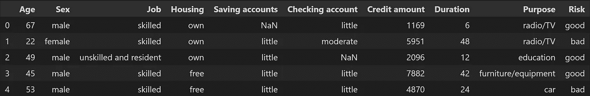

作者图片

## 特征工程

在建立模型之前，我们需要转换数据。我们将使用一种叫做**特征工程**的数据操作技术来转换数据。特征工程是指对数据集的操作(添加、删除、组合等)，以改善机器学习模型训练，从而实现更好的性能和更高的准确性。

我们从[探索性数据分析](/german-credit-data-part-1-exploratory-data-analysis-8f5f266b2426)中得知数据集中有缺失值，因此第一次转换将删除缺失值的实例。

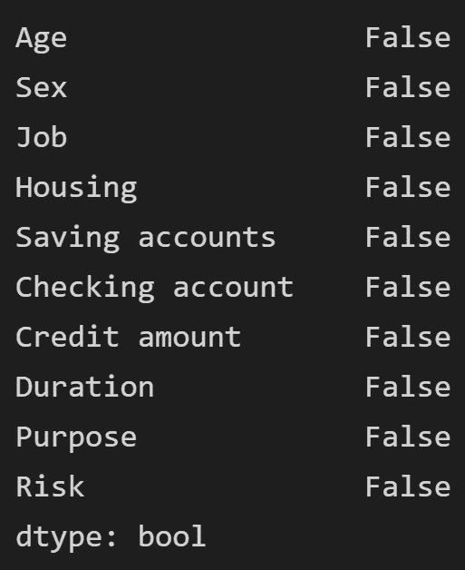

作者图片

既然丢失的值已经从我们的数据集中删除，我们可以继续下一个转换。

## 转换目标标签

从探索性分析中我们知道，目标列包含贷款申请人的标签。大多数机器学习算法更喜欢与数字打交道，所以我们需要将这些标签从文本转换为数字。这就是**标签编码器**派上用场的地方。LabelEncoder 将分类数据转换为数字数据。

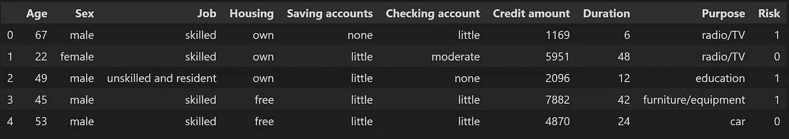

作者图片

上图显示风险栏已经转换为数值。可以看到之前的文本值不再存在，取而代之的是 1 和 0 (1 代表**好**，0 代表**坏**)。

## 创建新功能

有时，数据集中的默认要素可能没有足够的信息来处理。在这种情况下，我们可以用现有的数据创建新的特征，这就是为什么我创建了两个新的特征，分别叫做**年龄类别**和**信用类别**。年龄类别采用申请人的给定年龄，并将他们分配到特定的年龄类别:学生(18-24 岁)、青年(25-34 岁)、成人(35-59 岁)、老年人(60-119 岁)。信用类别使用类似的方法，但时间间隔是基于信用而不是年龄。

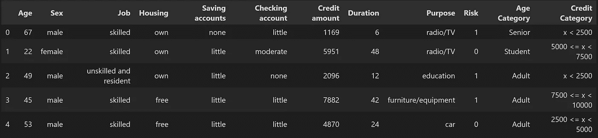

作者图片

## 移除异常值

让我们看看数据集通过这些新功能给了我们什么新信息。我使用了一个交叉表来可视化这两个新类别之间的关系。

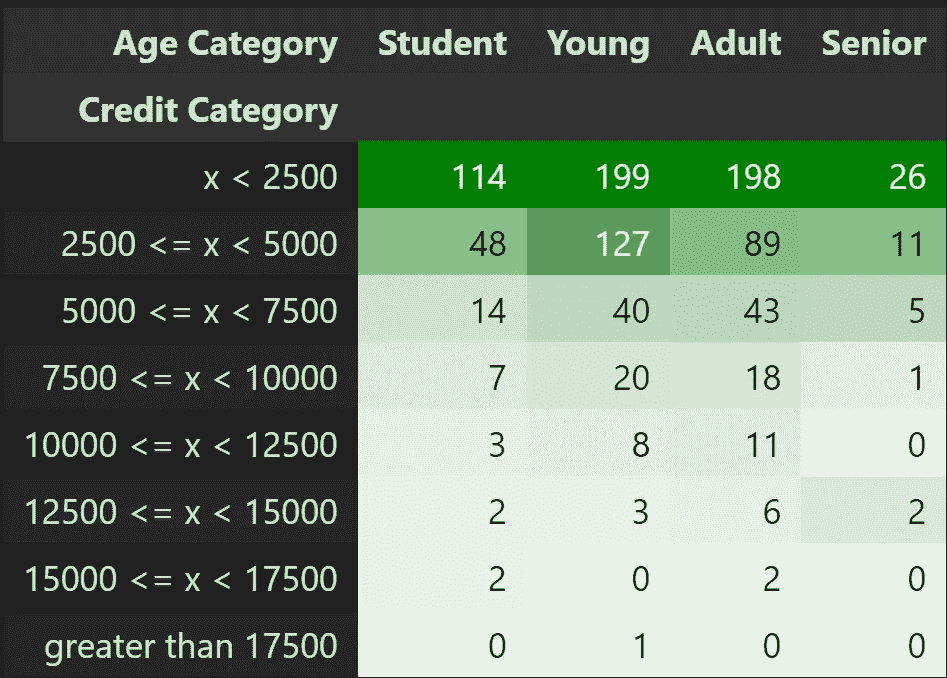

作者图片

上面的交叉表显示，只有一个实例的信用额大于 17，500 德国马克(DM)。这是一个很好的指标，表明数据集中预设了异常值。我们可以通过绘制年龄类别与信用额度的关系来仔细观察这个异常值。

作者图片

更清楚的是，存在一个异常值。但是在决定丢弃异常值之前，我们应该更仔细地研究一下具体的实例。

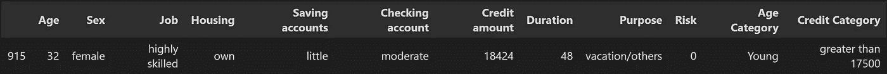

作者图片

通过查看特定的实例，我们可以对为什么这个异常值出现在数据集中做出合理的结论。申请人的证书是这笔贷款被批准的最可能的原因。年轻且高技能的申请人有更高的机会还清高风险贷款；然而，贷款的目的是为了度假。如果我是一个银行经理，如果我的唯一目的是度假，我不会愿意发放任何超过 17，500 德国马克的贷款。这将是一笔风险很高的贷款，而且事实证明，申请人最终会拖欠贷款。我认为可以肯定的是，大多数银行经理都会说同样的话，不会批准贷款，所以我们最好从数据集中删除这个实例。

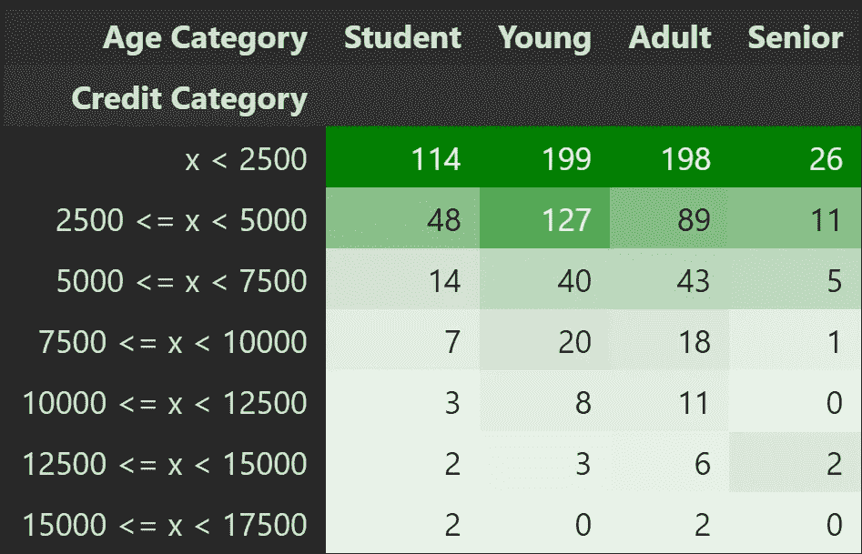

作者图片

上图是新的交叉表，离群值已从数据集中删除。

## 拆分数据

将数据集分成训练集和测试集是标准做法。这将确保模型被适当地训练，并且测试集上的性能被准确地测量。

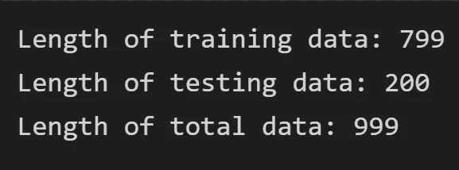

作者图片

上面的输出帮助我们直观地看到每个分割有多少个实例。我们希望总实例的 80%进入训练集，另外 20%进入测试集。训练集应该总是比测试集有更多的实例。

## 转换管道

在向模型显示数据之前，还有一些转换必须以正确的顺序实现。数据集中的数字要素应具有相同的比例，以提高模型精度。数据集中的分类要素必须是数值，因为模型无法处理文本(字符串)值。幸运的是，Scikit-Learn 提供了**管道**和 **ColumnTransformer** 类来帮助完成这样的转换序列。

## 模型训练和混淆矩阵

我从 Sklearn 库中取了 8 个知名的分类器进行训练和评估。下面的代码块显示了我为训练所有模型所做的事情。我创建了一个循环，通过包含每个模型的列表迭代训练过程，而不必单独训练一个模型。在循环结束时，模型的表现会显示在**混淆矩阵**上。

准确性通常不是分类器的首选性能指标，尤其是当我们处理倾斜数据集时。评估分类器性能的更有效的方法是查看**混淆矩阵**。

总体思路是统计 A 类的实例被分类为 b 类的次数。混淆矩阵中的每一行代表一个*实际类*，而每一列代表一个*预测类*。下图将帮助你想象出**混淆矩阵**的样子。

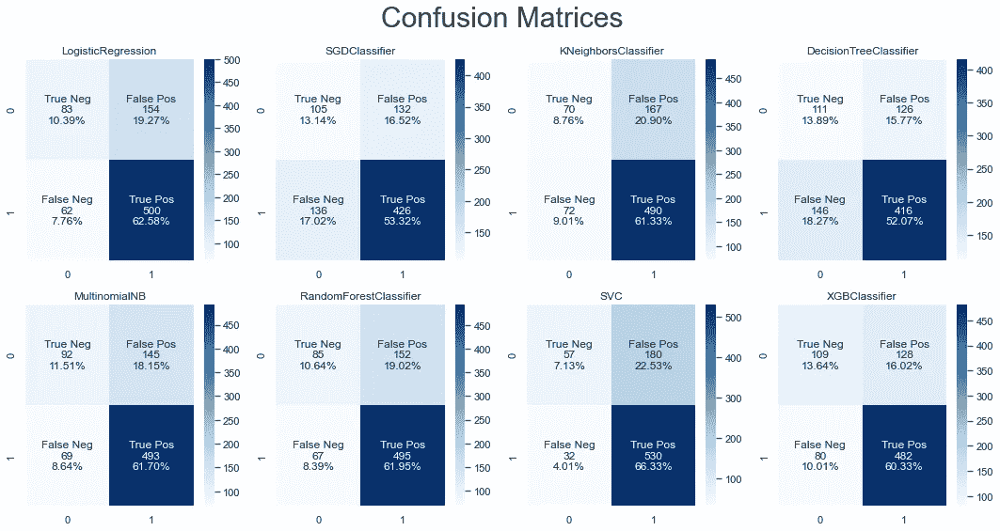

作者图片

让我们来看看第一个**混淆矩阵**，它是逻辑回归模型的性能度量。该矩阵的第一行考虑不良贷款(负类*):其中 83 个被正确分类为不良贷款(它们被称为*真负类(TN)* )，而剩余的 154 个被错误分类为好贷款(*假正类(FP)* )。第二行考虑好的贷款(*正类* ): 62 个被错误地分类为坏贷款(*假阴性(FN)* )，而剩余的 500 个被正确地分类为好的贷款(*真阳性(TP)* )。一个完美的分类器将只有真阳性和真阴性，所以它的**混淆矩阵**将只在其主对角线上有非零值(左上到右下)。*

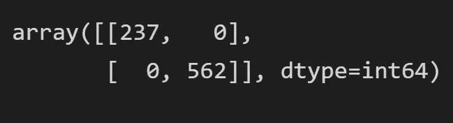

完美分类器上的混淆矩阵(图片由作者提供)

## 精确度、召回率和 F1 分数

混淆矩阵为您提供了大量信息，但有时您可能更喜欢更简洁的度量。这就是精确度、召回率和 f1 分数指标派上用场的地方。

*   **精度**是正确预测的正观测值与总预测观测值的比率

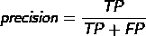

*   **回忆** ( *灵敏度*或*真阳性率*)是正确预测的阳性观测值与实际阳性类的总观测值之比

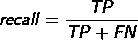

*   **F1 得分**是精度和召回率的加权平均值或*调和平均值*。F1 得分倾向于具有相似精度和召回率的分类器。如果你需要一个简单的方法来比较两个分类器，它经常被使用。

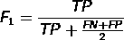

## 使用哪个指标？

很难决定哪个指标是最好的。以精度和召回率为例。 **precision** 和 **recall** 的问题在于，它们更多的是学术性的，因为它们优先考虑模型的性能，而不是实际的业务问题，后者可能需要更细微的度量。简单来说:

*   **精确度**更重要，因为*假阳性*比*假阴性*代价更高
*   **召回**更重要，因为*假阴性*比*假阳性*代价更高

我们希望开发一种机器学习算法来预测某人是否会还贷。假设我们的模型有 85%的精确度和 75%的召回率。这些数字到底是什么意思，低**精度** / **召回**有什么问题？

*   85% **精度**是指在所有被批准的贷款中，85%要还我们。其余 15%的获批贷款会出现违约。精确度低的问题在于我们批准的是违约贷款。
*   75% **召回**意味着 75%将偿还贷款的借款人得到了我们系统的批准。我们错过了 25%的会通过拒绝他们来回报我们的人。总的来说，**召回率低的问题在于，我们拒绝了那些我们本会偿还的客户(以及我们本会为其赚取利息的客户)。**

对于我们的案例研究，我们通常更喜欢强调**精确度**而不是**召回**，因为批准一笔坏账(并损失资本投资)比错过一笔好贷款可能带来的利润成本更高。

请记住，在精确度和召回率之间有一个权衡。精度越高，召回率越低，反之亦然。

让我们来看看模特们的表演。下面的代码块将输出每个模型的性能指标的数据帧。

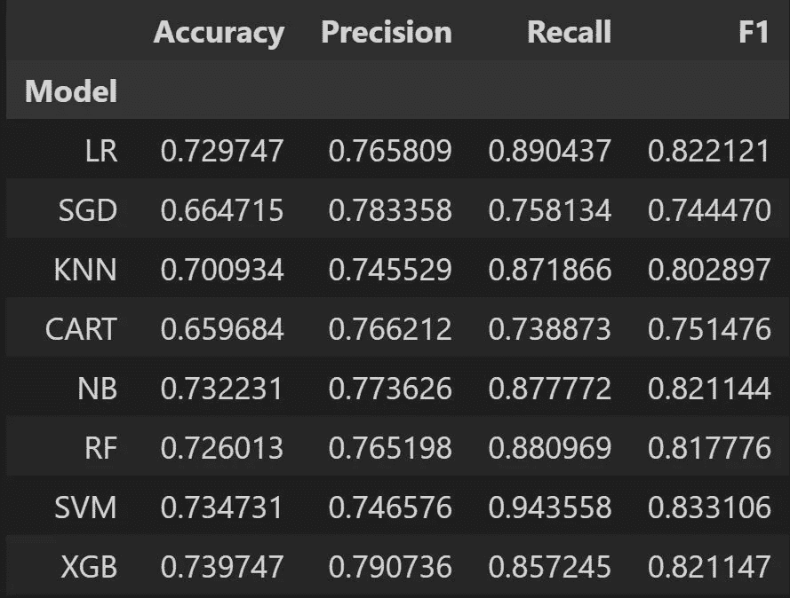

作者图片

正如我们所看到的，模型的表现符合预期。准确性和 F1 分数高于 50%，这意味着我们的模型运行正确。

## 选择最佳模型

没有一个模特的分数比其他模特高。这可能会使决定使用哪个模型变得困难。除了 SGD 和 Cart 模型之外，所有模型似乎都表现相似，因为与其他模型相比，它们的准确性和 F1 分数都较差。

因为我们主要关心精度，所以我认为 XGB 模型是这个案例研究中使用的最佳模型。它的准确率为 79%，召回率为 86%左右。XGB 模型在所有模型中具有最高的精确度分数，同时还保持了良好的召回分数。

## 根据测试数据测量模型

评估模型的最后一个方法是传递一些以前从未见过的数据，然后测量性能。我们可以预期性能与我们看到的训练数据的性能相似。如果模型在测试数据上的表现比在训练数据上的表现差得多，这意味着模型没有正确表现。

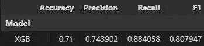

作者图片

成绩还不错。分数在 50%以上，因此该模型在测试数据上表现良好。我们还可以做一些其他的优化调整来改进这个模型，但是我想我会在另一篇文章中讨论。

# 结论

## 考虑什么？

问题并没有到此结束。在这个案例研究中，还有许多其他事情需要考虑。该模型不应该是批准贷款的唯一决策者，而是应该用作一种工具，可以帮助金融分析师就贷款申请人做出更明智的决策。财务分析师应该充当人力管道，检查分类器对申请人的选择。

此外，我们必须对这里的业务问题稍加小心，因为我们正在对一个连续变量进行二进制化:在支付 5 年期贷款的 1 年后违约的人和在支付 5 年期贷款的 4 年后违约的人之间存在差异。一位银行经理可能会希望你把客户的预期损失和阈值作为一个更有用的指标，而不是精度。

现在，我们可以说我们已经成功地构建、训练和测试了一个分类器来解决这个案例研究中的问题。我希望这篇文章能帮助你迈向精通机器学习的旅程。

## 项目可访问性

*   [**GitHub**](https://github.com/jpzambranoleon/german-credit-data-project/blob/main/german-credit-risk.ipynb)
*   [笔记本 ](https://github.com/jpzambranoleon/german-credit-data-project/blob/main/german-credit-risk.ipynb)
*   [**Kaggle 数据集**](https://www.kaggle.com/datasets/kabure/german-credit-data-with-risk)

## 数据集引用

汉斯霍夫曼。(1994).Statlog(德国信用数据)。UCI 机器学习知识库

该数据集获得了[知识共享署名 4.0 国际](https://creativecommons.org/licenses/by/4.0/legalcode) (CC BY 4.0)许可。