# 约束参数空间中的机器学习优化器:内点法

> 原文：<https://towardsdatascience.com/how-to-solve-constrained-optimization-problem-the-interior-point-methods-1733095f9eb5>

## 深潜

# 约束参数空间中的机器学习优化器:内点法

## 从零开始使用 python 的完整分步案例研究


凯文·布茨在 [Unsplash](https://unsplash.com?utm_source=medium&utm_medium=referral) 上的照片

```
**Table of Contents**· [Motivation](#2f50)
· [Problem Statement](#dba4)
· [The Barrier Method](#6f43)
· [Experiments](#d152)
  ∘ [Scenario 1](#af0e)
  ∘ [Scenario 2](#8974)
  ∘ [Scenario 3](#8f51)
· [Conclusion](#ef8e)
```

# 动机

在股票市场上，你是一个正派的交易者。你每天通过一些谨慎的策略优化你的利润，它没有限制:你可以在一天内赚很多(正利润)，也可以亏损很多，以至于你在推特上发了一个笑话(负利润)。因为对你优化的利润没有限制，所以你可以选择多种策略:做空股票，配对交易，甚至用它做一个[几何布朗运动](https://en.wikipedia.org/wiki/Geometric_Brownian_motion)模型。

除了交易，你也是镇上伟大的园丁。你有三种植物，每天在最近的传统市场出售:西红柿、薄荷和菠菜。要获得最大利润，当然需要尽可能多的种植。但是有一个问题:你有有限的土地和一定的需求趋势。所以，你要有效利用土地，同时不要卖太多，以避免产品卖不出去。例如，你用 1/2 的土地种西红柿，另外 1/4 种菠菜，1/8 种薄荷，剩下的都没人种。换句话说，在这种情况下，优化利润是有限制的。

在现实生活中，很容易看出交易者的情况比园丁的情况更少发生。在数学公式中，后者可以写成

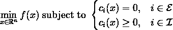

其中 *f* 和函数 *cᵢ* 都是ℝ *ⁿ* 子集上的光滑实值函数，ℰ和ℐ是两个有限的指数集。我们称 *f* 为*目标*函数，而 *cᵢ* ， *i* ∈ ℰ为等式约束， *cᵢ* ， *i* ∈ ℐ为不等式约束。满足所有 *cᵢ* 的点或迭代 *x* 的集合称为*可行*集，我们用ω表示。

这个公式被称为*约束优化问题*。现在，怎么解决？

# 问题陈述

作为一个具体的例子，我们将考虑一个简单的约束优化问题如下:

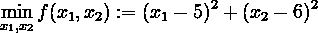

受制于约束 *hᵢ* ( *x₁* ， *x₂* ):

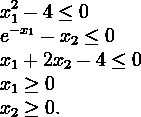

换句话说，我们正在最小化带有约束条件 *hᵢ* 的非线性二元目标函数 *f* 。忽略 *hᵢ* ，很容易验证极小值为 *x* * = ( *x₁* *， *x₂* *) = (5，6)与 *f* ( *x₁* ， *x₂* ) = 0。但是对于 hᵢ来说，最小化并不像看起来那么简单。在这里，为了方便起见，我们写 *x* = ( *x₁* ， *x₂* )。

导入一些库来开始。

这里是代码中的 *f* 。

# 屏障法

障碍法是内点法的一部分，内点法是一类解决线性和非线性凸优化问题的算法，由约翰·冯·诺依曼于 1948 年首次提出。然而，与单纯形法相比，该方法在实践中效率低且速度慢。Karmarkar 在 1984 年改进了该算法，随着进一步的改进，内点法变得非常有效，并且几乎在连续优化的每个领域都得到了应用。


照片由[在](https://unsplash.com/@dizzyd718?utm_source=medium&utm_medium=referral) [Unsplash](https://unsplash.com?utm_source=medium&utm_medium=referral) 上绘制的迪兹·格拉汉姆

内点法通常通过将牛顿法应用于一系列等式约束问题来解决约束凸优化问题。顾名思义，障碍方法采用障碍函数将*不等式*约束整合到目标函数中。由于我们要将不等式约束合并到目标中，下列关于障碍函数 *ϕ* 的条件看起来是自然的:

*   障碍函数应该将可行集ω映射到真实空间，即*ϕ*:ω→ℝ.
*   *ϕ* ( *x* )被整合到目标函数中，我们打算使用牛顿法，这是一种基于梯度的方法，因此屏障函数应该是合理的“平滑”(连续可微)。
*   *ϕ* ( *x* )应该表现得像一个障碍，并且随着 *x* 进入可行集的边界而无限增长。
*   势垒函数的海森(标量函数的二阶导数)需要是正定的，即∇ *ϕ* ( *x* ) ≻ 0，∀*x*∈ω。

障碍函数的例子有很多。特别是，现在我们将使用如下的障碍函数。

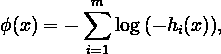

其中 *m* 为约束数 *hᵢ* ( *x* ) ≤ 0。很容易看出这个函数满足上面解释的所有条件。然后，可以将 *ϕ* ( *x* )整合到目标函数 *f* 中，从而可以用一个新的优化问题来逼近该优化问题


在我们的例子中，这可以写成

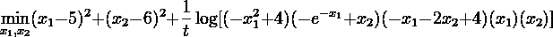

其中*t*0 是由用户确定的参数。如果 *t* < ∞则新问题的解属于ω的内部，即*x*∈ω，当 *t* → ∞时解趋于最优，即*x*(*t*)→*x**。

现在，坡度 *g* 和 Hessian *H* 可以计算为

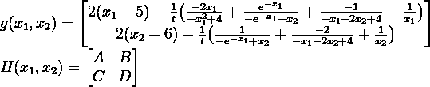

随着

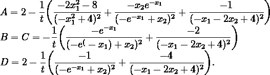

了解了这一切之后，我们就准备创建障碍法算法了:

1.  设定停止判据的初始点*x*∈ω，初始参数 *t* ，公差 *ε* 。这里我们会用 *ε* = 1 × 10⁻⁵.
2.  执行以下 a-b-c 循环，直到满足停止标准。使用的停止准则是*对偶间隙**m*/*t*≤*ε*，其中 *m* 是约束 *hᵢ* 的数量。在我们的例子中， *m* = 5。

**a)** 对中步骤:计算

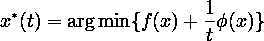

用牛顿法进行迭代

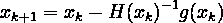

直到满足牛顿法的停止标准。使用的标准是ǁ*xₖ₊₁*—*xₖ*ǁ₂≤10⁻⁵或者最大迭代次数达到 1000 次。

**b)** 更新*x*:=*x**(*t*)。

使用以下等式增加 *t*

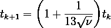

ν 是与屏障功能 *ϕ* 相关的参数。这里我们用 *ν* = 0.01。

除了执行算法，注意上面的`BarrierMethod`函数还打印出当前迭代 *x* ，目标函数 *f* ( *x* )的值，以及对偶间隙 *m* / *t* 。

# 实验

这就是乐趣的开始。为了可视化优化的过程，我们将首先创建一个`plot_all`函数。该函数绘制了来自`BarrierMethod`函数的结果，详情如下:

1.  黄色阴影区域表示可行集
2.  黑色区域表示不可行的集合
3.  洋红色曲线是迭代路径
4.  青色点是算法找到的解

迭代的收敛性应该取决于初始选择的 *x* 和 *t* 。为此，我们选择了以下三个选项:

1.  初始值 *x* = (0.50，0.75)和 *t* = 0.1
2.  初始值 *x* = (0.50，0.75)并且 *t* = 1
3.  初始值 *x* = (1.50，2.00)和 *t* = 0.1

## 场景 1:初始值 *x* = (0.50，0.75)，t = 0.1

```
Initial condition: x = [0.5  0.75], f(x) = 47.8125Iteration: 1 	 x = [1.0202 1.1642], f(x) = 39.2236, gap = 28.2609
Iteration: 2 	 x = [1.1088 1.1778], f(x) = 38.3945, gap = 15.9735
Iteration: 3 	 x = [1.2357 1.1815], f(x) = 37.3873, gap = 9.0285
Iteration: 4 	 x = [1.3893 1.1683], f(x) = 36.3827, gap = 5.1031
Iteration: 5 	 x = [1.5441 1.1408], f(x) = 35.5548, gap = 2.8843
Iteration: 6 	 x = [1.6786 1.1079], f(x) = 34.9641, gap = 1.6303
Iteration: 7 	 x = [1.7838 1.0771], f(x) = 34.5792, gap = 0.9215
Iteration: 8 	 x = [1.8603 1.0519], f(x) = 34.3412, gap = 0.5208
Iteration: 9 	 x = [1.9129 1.0333], f(x) = 34.1983, gap = 0.2944
Iteration: 10 	 x = [1.9473 1.0205], f(x) = 34.1142, gap = 0.1664
Iteration: 11 	 x = [1.9689 1.0122], f(x) = 34.0654, gap = 0.0940
Iteration: 12 	 x = [1.9819 1.0072], f(x) = 34.0372, gap = 0.0532
Iteration: 13 	 x = [1.9896 1.0041], f(x) = 34.0211, gap = 0.0300
Iteration: 14 	 x = [1.9941 1.0024], f(x) = 34.0120, gap = 0.0170
Iteration: 15 	 x = [1.9966 1.0013], f(x) = 34.0068, gap = 0.0096
Iteration: 16 	 x = [1.9981 1.0008], f(x) = 34.0038, gap = 0.0054
Iteration: 17 	 x = [1.9989 1.0004], f(x) = 34.0022, gap = 0.0031
Iteration: 18 	 x = [1.9994 1.0002], f(x) = 34.0012, gap = 0.0017
Iteration: 19 	 x = [1.9997 1.0001], f(x) = 34.0007, gap = 0.0010
Iteration: 20 	 x = [1.9998 1.0001], f(x) = 34.0004, gap = 0.0006
Iteration: 21 	 x = [1.9999 1.0000], f(x) = 34.0002, gap = 0.0003
Iteration: 22 	 x = [1.9999 1.0000], f(x) = 34.0001, gap = 0.0002
Iteration: 23 	 x = [2.0000 1.0000], f(x) = 34.0000, gap = 0.0001
Iteration: 24 	 x = [2.0000 1.0000], f(x) = 34.0000, gap = 0.0001
Iteration: 25 	 x = [2.0000 1.0000], f(x) = 34.0000, gap = 0.0000
Iteration: 26 	 x = [2.0000 1.0000], f(x) = 34.0000, gap = 0.0000
Iteration: 27 	 x = [2.0000 1.0000], f(x) = 34.0000, gap = 0.0000
Iteration: 28 	 x = [2.0000 1.0000], f(x) = 34.0000, gap = 0.0000
```

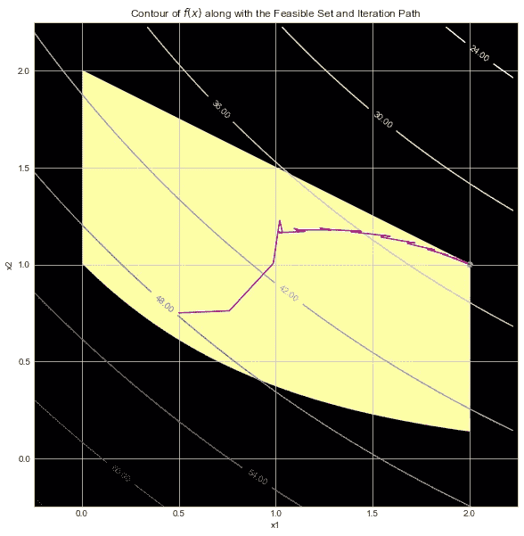

图片作者[作者](http://dwiuzila.medium.com/membership)

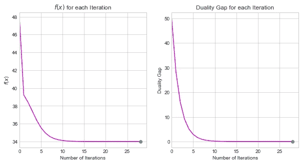

图片由[作者](http://dwiuzila.medium.com/membership)

该算法通过最小化对偶间隙使得 *m* / *t* ≤ *ε* ，在 28 次迭代后找到了解 *x* * = (2，1】。函数值在 *f* ( *x* *) = 34 时最小。从等高线图可以确认 *x* * = (2，1)确实是唯一解。注意，由于定心步骤，迭代路径不会平滑到 *x* *。

## 场景 2:初始值 x = (0.50，0.75)，t = 1

```
Initial condition: x = [0.5  0.75], f(x) = 47.8125Iteration: 1 	 x = [5.3475 6.2329], f(x) = 0.1750, gap = 2.8261
Iteration: 2 	 x = [5.2030 6.1341], f(x) = 0.0592, gap = 1.5974
Iteration: 3 	 x = [5.1171 6.0767], f(x) = 0.0196, gap = 0.9029
Iteration: 4 	 x = [5.0670 6.0436], f(x) = 0.0064, gap = 0.5103
Iteration: 5 	 x = [5.0381 6.0247], f(x) = 0.0021, gap = 0.2884
Iteration: 6 	 x = [5.0216 6.0140], f(x) = 0.0007, gap = 0.1630
Iteration: 7 	 x = [5.0123 6.0079], f(x) = 0.0002, gap = 0.0921
Iteration: 8 	 x = [5.0069 6.0045], f(x) = 0.0001, gap = 0.0521
Iteration: 9 	 x = [5.0039 6.0025], f(x) = 0.0000, gap = 0.0294
Iteration: 10 	 x = [5.0022 6.0014], f(x) = 0.0000, gap = 0.0166
Iteration: 11 	 x = [5.0013 6.0008], f(x) = 0.0000, gap = 0.0094
Iteration: 12 	 x = [5.0007 6.0005], f(x) = 0.0000, gap = 0.0053
Iteration: 13 	 x = [5.0004 6.0003], f(x) = 0.0000, gap = 0.0030
Iteration: 14 	 x = [5.0002 6.0001], f(x) = 0.0000, gap = 0.0017
Iteration: 15 	 x = [5.0001 6.0001], f(x) = 0.0000, gap = 0.0010
Iteration: 16 	 x = [5.0001 6.0000], f(x) = 0.0000, gap = 0.0005
Iteration: 17 	 x = [5.0000 6.0000], f(x) = 0.0000, gap = 0.0003
Iteration: 18 	 x = [5.0000 6.0000], f(x) = 0.0000, gap = 0.0002
Iteration: 19 	 x = [5.0000 6.0000], f(x) = 0.0000, gap = 0.0001
Iteration: 20 	 x = [5.0000 6.0000], f(x) = 0.0000, gap = 0.0001
Iteration: 21 	 x = [5.0000 6.0000], f(x) = 0.0000, gap = 0.0000
Iteration: 22 	 x = [5.0000 6.0000], f(x) = 0.0000, gap = 0.0000
Iteration: 23 	 x = [5.0000 6.0000], f(x) = 0.0000, gap = 0.0000
```

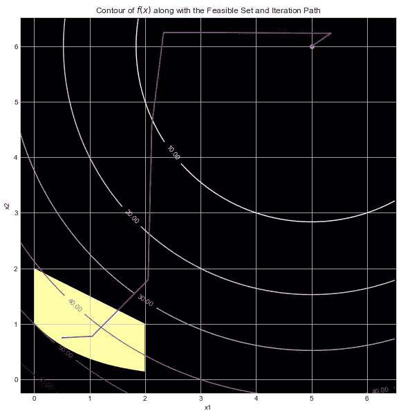

图片作者[作者](http://dwiuzila.medium.com/membership)

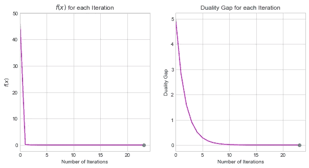

图片作者[作者](http://dwiuzila.medium.com/membership)

经过 23 次迭代后，发现一个解是 *x* * = (5，6)*f*(*x*)= 0。但由于初始的 *t* 太大，在迭代过程的某个时刻，临时迭代 *x* 突破了可行集，之后的迭代试图在可行集之外寻找解，我们知道是(5，6)。

## 场景 3:初始值 x = (1.50，2.00)，t = 0.1

```
Initial condition: x = [1.5 2\. ], f(x) = 28.2500Iteration: 1 	 x = [1.4440 8.0101], f(x) = 16.6853, gap = 28.2609
Iteration: 2 	 x = [1.5565 7.2585], f(x) = 13.4414, gap = 15.9735
Iteration: 3 	 x = [1.6742 6.7642], f(x) = 11.6450, gap = 9.0285
Iteration: 4 	 x = [1.7785 6.4526], f(x) = 10.5827, gap = 5.1031
Iteration: 5 	 x = [1.8587 6.2633], f(x) = 9.9374, gap = 2.8843
Iteration: 6 	 x = [1.9138 6.1514], f(x) = 9.5476, gap = 1.6303
Iteration: 7 	 x = [1.9490 6.0864], f(x) = 9.3161, gap = 0.9215
Iteration: 8 	 x = [1.9704 6.0491], f(x) = 9.1810, gap = 0.5208
Iteration: 9 	 x = [1.9830 6.0279], f(x) = 9.1031, gap = 0.2944
Iteration: 10 	 x = [1.9903 6.0158], f(x) = 9.0585, gap = 0.1664
Iteration: 11 	 x = [1.9945 6.0089], f(x) = 9.0332, gap = 0.0940
Iteration: 12 	 x = [1.9969 6.0050], f(x) = 9.0188, gap = 0.0532
Iteration: 13 	 x = [1.9982 6.0029], f(x) = 9.0106, gap = 0.0300
Iteration: 14 	 x = [1.9990 6.0016], f(x) = 9.0060, gap = 0.0170
Iteration: 15 	 x = [1.9994 6.0009], f(x) = 9.0034, gap = 0.0096
Iteration: 16 	 x = [1.9997 6.0005], f(x) = 9.0019, gap = 0.0054
Iteration: 17 	 x = [1.9998 6.0003], f(x) = 9.0011, gap = 0.0031
Iteration: 18 	 x = [1.9999 6.0002], f(x) = 9.0006, gap = 0.0017
Iteration: 19 	 x = [1.9999 6.0001], f(x) = 9.0003, gap = 0.0010
Iteration: 20 	 x = [2.0000 6.0001], f(x) = 9.0001, gap = 0.0006
Iteration: 21 	 x = [2.0000 6.0000], f(x) = 9.0001, gap = 0.0003
Iteration: 22 	 x = [2.0000 6.0000], f(x) = 9.0000, gap = 0.0002
Iteration: 23 	 x = [2.0000 6.0000], f(x) = 9.0000, gap = 0.0001
Iteration: 24 	 x = [2.0000 6.0000], f(x) = 9.0000, gap = 0.0001
Iteration: 25 	 x = [2.0000 6.0000], f(x) = 9.0000, gap = 0.0000
Iteration: 26 	 x = [2.0000 6.0000], f(x) = 9.0000, gap = 0.0000
Iteration: 27 	 x = [2.0000 6.0000], f(x) = 9.0000, gap = 0.0000
Iteration: 28 	 x = [2.0000 6.0000], f(x) = 9.0000, gap = 0.0000
```

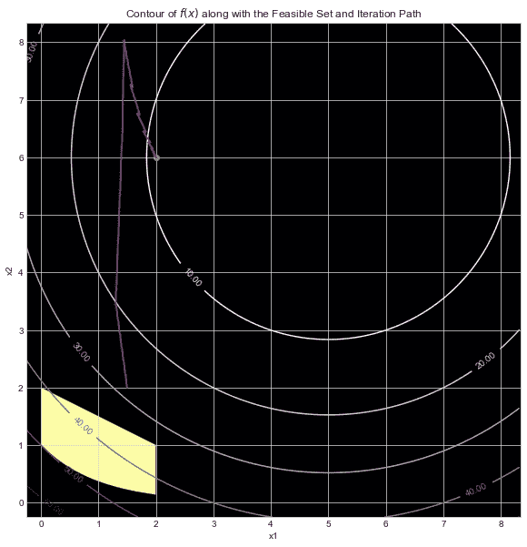

图片作者[作者](http://dwiuzila.medium.com/membership)

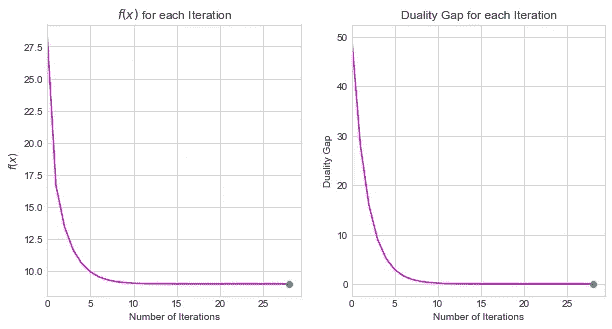

图片作者[作者](http://dwiuzila.medium.com/membership)

这是实施障碍法的错误做法的一个例子。注意，初始的 *x* 不在可行集中，这导致迭代产生违反约束的迭代。因此，我们最终得到了解决方案 *x* *

# 结论

障碍法是求解带约束优化问题的一种有效算法。它使用障碍函数将不等式约束整合到目标函数中。该方法使用目标函数的梯度和 hessian，并使用牛顿法作为定心步骤。我们已经看到了 Barrier 方法的作用，并发现初始迭代 *x* 和参数 *t* 对于它按照我们期望的方式工作是至关重要的。


🔥你好！如果你喜欢这个故事，想支持我这个作家，可以考虑 [***成为会员***](https://dwiuzila.medium.com/membership) *。每月只需 5 美元，你就可以无限制地阅读媒体上的所有报道。如果你注册使用我的链接，我会赚一小笔佣金。*

🔖*想了解更多关于经典机器学习模型的工作原理，以及它们如何优化参数？或者 MLOps 大型项目的例子？有史以来最优秀的文章呢？继续阅读:*


[艾伯斯·乌兹拉](https://dwiuzila.medium.com/?source=post_page-----1733095f9eb5--------------------------------)

## 从零开始的机器学习

[View list](https://dwiuzila.medium.com/list/machine-learning-from-scratch-b35db8650093?source=post_page-----1733095f9eb5--------------------------------)8 stories

[艾伯斯·乌兹拉](https://dwiuzila.medium.com/?source=post_page-----1733095f9eb5--------------------------------)

## 高级优化方法

[View list](https://dwiuzila.medium.com/list/advanced-optimization-methods-26e264a361e4?source=post_page-----1733095f9eb5--------------------------------)7 stories

[艾伯斯·乌兹拉](https://dwiuzila.medium.com/?source=post_page-----1733095f9eb5--------------------------------)

## MLOps 大型项目

[View list](https://dwiuzila.medium.com/list/mlops-megaproject-6a3bf86e45e4?source=post_page-----1733095f9eb5--------------------------------)6 stories

[艾伯斯乌兹拉](https://dwiuzila.medium.com/?source=post_page-----1733095f9eb5--------------------------------)

## 我最好的故事

[View list](https://dwiuzila.medium.com/list/my-best-stories-d8243ae80aa0?source=post_page-----1733095f9eb5--------------------------------)24 stories

[艾伯斯乌兹拉](https://dwiuzila.medium.com/?source=post_page-----1733095f9eb5--------------------------------)

## R 中的数据科学

[View list](https://dwiuzila.medium.com/list/data-science-in-r-0a8179814b50?source=post_page-----1733095f9eb5--------------------------------)7 stories[](https://dwiuzila.medium.com/membership)