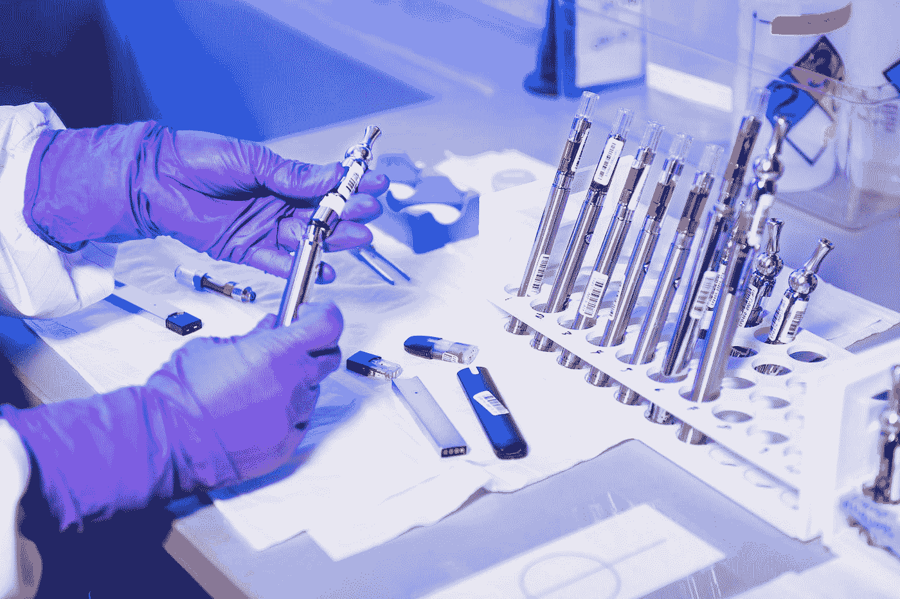

# 如何更快解决数据科学问题

> 原文：<https://towardsdatascience.com/how-to-solve-data-science-problems-faster-14c962edaf27>

## 从以解决方案为中心转向以诊断为中心的方法

蒂姆·莫斯霍尔德在 [Unsplash](https://unsplash.com?utm_source=medium&utm_medium=referral) 上的照片

作为数据科学家，我们因出色的**问题解决能力**而获得认可。我们的教育是一系列的考试和黑客马拉松，挑战越来越大，越来越难。数据科学创新的特征还在于现有业务问题和应用中的算法优化。

尽管我们的解决方案不断创新和进步，但我们经常面临各种业务挑战。根据我的行业经验，它们是:

*   数据科学**供不应求**:人们经常被数据科学解决方案改善生活和商业决策的潜力所吸引。这导致了想法的爆发。然而，现有的数据科学家有限，招募新的数据科学家很难满足不断增长的想法。
*   数据科学**解决方案不经常使用**:虽然利益相关者可能会对解决方案的功能印象深刻，但他们在最初几个月之后很少使用该解决方案，或者该解决方案无法获得承诺的投资回报。

> 你会相信一个直接给你开药的医生吗？

医学领域是另一个先进的科学学科，由复杂的问题和不同的解决方案组成。我一直注意到的一件事是他们对诊断的不懈关注。患者分享他们的观察结果，这些观察结果被视为初始假设，但随后医生会进行自己的诊断。通常，他们甚至会将病人转介给其他专科医生做进一步诊断！

虽然这需要更多的前期时间，但我相信数据科学的**诊断优先方法**会减少总体项目交付时间并且**会带来更大的组织影响**。这是因为返工的大量减少。生产化的数据科学解决方案需要 3 到 6 个月的时间，而返工可能需要两倍以上的时间。除此之外，这对资源成本和采购也有巨大的影响。

那么，我们如何实践以诊断为中心？我们将探索一些简单而有效的习惯。

**提示 1:练习积极倾听**

乔恩·泰森在 [Unsplash](https://unsplash.com?utm_source=medium&utm_medium=referral) 上的照片

维基百科将积极倾听定义为“一种用于咨询、培训和解决冲突的沟通技巧”。它要求听者全神贯注，理解，回应，然后记住所说的内容。“数据科学家在解决复杂问题方面经验丰富。这通常会导致问题到解决方案的关联偏差，即一切都被认为是“相同的”。

本质上，商业问题通常是模糊不清的。通常，问题超出了最初的症状。往往大家都觉得没什么大不了的。通常，所要求的业务解决方案不涉及数据科学。

数据科学家需要有**好奇心和开放的心态。**他们需要更深入地了解顾客。他们还应该接受这样一个事实，即正确的解决方案可能不涉及数据科学。例如，我帮助一个营销团队在续约前通过“简单”的自动化沟通减少了季节性客户流失。对一个问题说“不”,就有机会帮助其他具有更大潜在影响的领域。

**提示 2:实践假设检验**

照片由[疾控中心](https://unsplash.com/@cdc?utm_source=medium&utm_medium=referral)在 [Unsplash](https://unsplash.com?utm_source=medium&utm_medium=referral) 上拍摄

数据科学家喜欢高级数学算法，我们希望将它们应用于尽可能多的商业问题。这就造成了**解决方案中的偏差**，数据科学家为每个出现的问题提出一个预测模型解决方案。

我们需要将假设驱动的方法应用到我们的解决方案中。这可以跨诊断级别完成。以下是一些问题示例:

*   *梯度推进模型的实施是否会显著改善广义线性模型？*这个假设解决了我们对更复杂的解决方案的偏好，有利于业务可解释性。
*   我们有足够的数据来建立模型吗？该假设解决了项目的实用性，因为数据是任何预测模型的支柱。
*   *更广泛的业务认为这是最重要的问题吗？*该假设解决了问题选择和优先化偏差，以确保我们解决重要的问题。

**提示 3:积极与企业合作**

照片由[克拉肯 images](https://unsplash.com/es/@krakenimages?utm_source=medium&utm_medium=referral) 在 [Unsplash](https://unsplash.com?utm_source=medium&utm_medium=referral) 上拍摄

> 跳舞需要两个人

数据科学家是聪明人。数据科学是一门与数学打交道的商业专业，而积极的合作伙伴关系是成功企业的关键因素。然而，许多研究数据的科学家经常从一个更“个人主义”的方法来处理它。

根据我对行业的观察，数据科学家通常在以下 4 个不同的接触点与业务互动:

*   用例筹资:向企业询问问题总结、业务收益和资源估算。
*   需求收集:向企业询问他们问题的更多细节。
*   测试:要求企业确认我们的模型是正确的。
*   生产:要求企业在决策中经常使用它。

如果说实话，以上所有的接触点大多都是**单向互动**。企业通常被视为数据科学解决方案的*【看门人】*。他们在数学知识上的不足，可以在商业环境中弥补。

积极的合作伙伴关系需要**每天与企业进行双向互动**。这包括:

*   让他们参与日常活动:交流是关键，日常活动是最低要求。这也是一个检查点，检查你是否让他们充分参与，以便他们与数据科学家共同完成任务。
*   让他们参与探索性数据分析:作为模型的一部分
*   让他们参与模型解释:企业想要理解驱动因素，而不是“黑盒”算法。虽然这两者之间存在权衡，但是企业必须能够信任并理解模型的结果。注意，他们不一定要理解算法——一个好的模型通常有一个合理的结果解释。
*   让他们参与模型消费:一个好的模型需要用于决策。我们需要了解他们的业务流程——以及如何适应这一流程。这需要承认将需要“不方便的”改变。因此，更广泛的业务需要感觉到利大于弊，因为如果过程不顺利，他们将承担责任。

> 我们需要专注于解决方案

善于解决问题是一种美德。这涉及到通过数据科学解决方案帮助组织的积极态度。然而，仅有激情和精力是不够的。我们需要一个良好的整体方法。

我的行业经验教会我**利用诊断方法**。许多组织希望从事数据科学，但许多组织仍处于起步阶段。我经常看到对数据科学解决方案的怀疑和抵制。人们不会在乎你做什么，直到你关心他们。在我看来，这涉及到对他们处境的深入了解。我认为作为高等科学研究的一部分，我们的职业和医学有相似之处。

试试这个假设——并渴望在评论中听到你的想法。

**如果你喜欢这篇文章，并希望看到更多的内容，请考虑加入媒体会员，使用下面的链接来支持我和其他作者:**

 [## 通过我的推荐链接加入 Medium-Albert Suryadi

### 阅读艾伯特·苏亚迪(以及媒体上成千上万的其他作家)的每一个故事。您的会员费直接支持…

albertsuryadi.medium.com](https://albertsuryadi.medium.com/membership) 

**关于作者:** [*阿尔伯特·苏亚迪*](https://www.linkedin.com/in/albertsuryadi/) *是为前瞻性组织提供高级分析和数据科学能力的公认领导者。他被公认为分析团队(实践社区)的领导者，该团队授权并激励他人超越现状。*