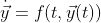
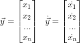
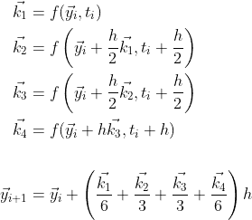
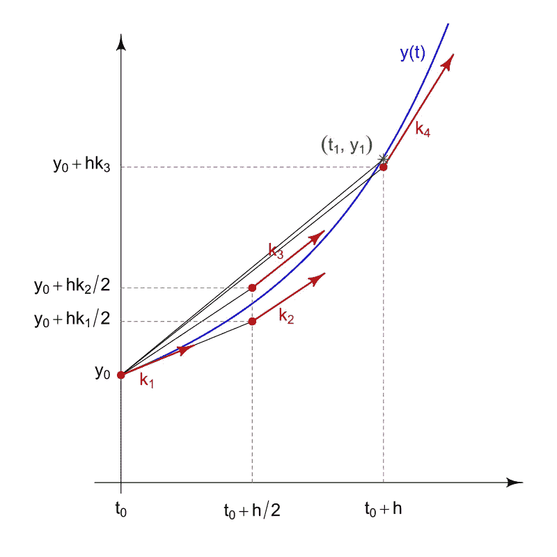
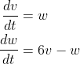
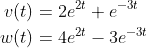
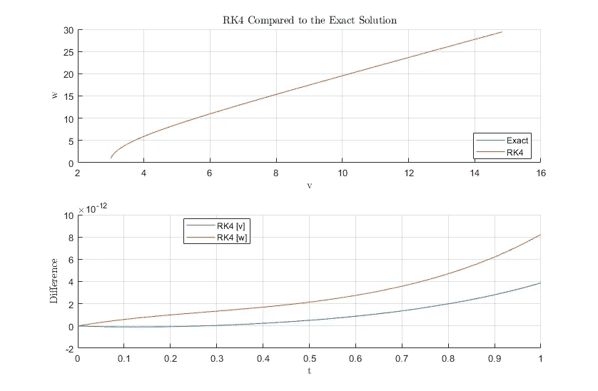

# 如何在 MATLAB 中用龙格-库塔法求解常微分方程

> 原文：<https://towardsdatascience.com/how-to-solve-odes-in-matlab-without-built-in-functions-9eaa01c9fe10>

## 学习编写一个 Runge-Kutta 4 阶算法来求解常微分方程


Joshua Woroniecki 在 [Unsplash](https://unsplash.com?utm_source=medium&utm_medium=referral) 上的照片

常微分方程在工程和科学的各个方面都很常见。它们用于模拟物理现象，如湍流气流、卫星轨道、热传递、振动和无数其他现象。它们是人类理解物理和数学的基础。虽然我们可以基于直觉和我们对世界如何运作的基本理解来创建这些方程，但解决它们可能更具挑战性。

## 常微分方程

在这篇文章中，我假设你对微积分和[微分方程](https://en.wikipedia.org/wiki/Differential_equation)有基本的了解。术语常微分方程是指包含一个独立变量的函数和这些函数的导数的微分方程。对于大多数工程和科学常微分方程，独立变量是时间，方程的形式如下:



这里的 ***y*** 矢量可以是空间状态、质量、温度等。，而 ***t*** 是时间。不幸的是，大多数常微分方程不能解析求解；这意味着不能推导出一个函数来提供微分方程的精确解。求解这些微分方程的另一种方法是利用数值积分方法。

## 数值积分

数值积分这个术语最早出现在 1915 年，但是直到现代计算机的出现，它的好处才真正显现出来。数值积分是一种通过了解控制 ***y*** 随时间变化的微分方程来近似函数 ***y*** 随时间变化的方法。它们只是陈述的一个估计，所以它们只和使用的方法和技术一样好。最流行的数值积分形式之一是四阶龙格-库塔法(或 RK4)。

RK4 可以用下面的等式和图表来描述。通常情况下，你会有一个向量形式的常微分方程求解，所以向量形式的 RK4 显示。在等式中， ***k*** 值是在图中所示的位置使用微分方程计算的 ***y*** 的斜率估计值。一旦确定了 ***k*** 值，它们被平均并乘以时间步长 ***h*** 。然后将其添加到当前值 ***y*** 中，得到下一个时间步长的近似值 ***y*** 。重复这一过程，直到达到所需的时间步数。请注意，所使用的 ***h*** 值越小，结果越接近真实值。



斜率估计的描述[由 [HilberTraum](http://By HilberTraum - Own work, CC BY-SA 4.0, https://commons.wikimedia.org/w/index.php?curid=64366870) 创建]

## MATLAB RK4 脚本

对于这个例子，假设我们有一个粒子，它的运动由下面的常微分方程描述:



这组常微分方程是方便的，因为它可以解析求解(解决方案如下所示)。选择这些，以便我们的 RK4 算法可以与实际解决方案进行比较。请记住，当使用你自己的微分方程时，它们可能无法解析求解，所以你可能没有任何东西来比较你的结果。



我们可以通过定义一个函数 ***model*** 来开始代码，当值*、 ***v*** 和 ***w*** 传递给它时，该函数将返回 ODEs 的值。确保将这个函数定义放在脚本的底部。*

```
*function dydt = model(t,y)
    v = y(1);
    w = y(2);
    dv_dt = w;
    dw_dt = 6*v-w;
    dydt = [dv_dt,dw_dt];
end*
```

*现在开始主脚本吧。我总是从清除命令窗口、清除变量和关闭数字开始。*

```
*clc
clear variables
close all*
```

*为了利用 RK4 方法，我们需要定义初始条件*y0，以及一个时间数组*。这里， ***t*** 被定义为以 1000 为增量从 0 到 1，并且 ***v*** 的初始条件是 3，而 ***w*** 是 1。时间数组用于创建 ***h*** 及以后，精确值为 ***v*** 和 ***w*** 。***

```
**% Initial Conditions and Simulation Time
y0 = [3, 1];  % y0 = [v0, w0]
t = linspace(0,1,1000)';**
```

**接下来，我们可以创建一个数组*，来存储每个时间步的 RK4 近似值。利用 ***v*** 和 ***w*** 的初始条件，我们可以定义 RK4 数组的第一个索引( ***i*** = 1， ***t*** =0)。我们还可以定义时间步长变量，*。然后我们为循环引入一个*来遍历时间数组的长度。每次迭代我们都会给 yₖᵤₜₜₐ的*增加一个新值，然后使用这个迭代为 yₖᵤₜₜₐ的*创建另一个值。这个过程会一直重复，直到到达最后一个时间步( ***t*** = 1)。*******

```
*% Runge-Kutta 4th-Order Algorithm
y_Kutta = zeros(length(t), 2);
y_Kutta(1, :) = y0;
h = t(2)-t(1);  % Constant time step
for i = 2:length(t)
    k1 = model(t(i-1), y_Kutta(i-1, :));
    k2 = model(t(i-1)+h/2, y_Kutta(i-1, :)+k1*h/2);
    k3 = model(t(i-1)+h/2, y_Kutta(i-1, :)+k2*h/2);
    k4 = model(t(i-1)+h, y_Kutta(i-1, :)+k3*h);
    y_Kutta(i, :) = y_Kutta(i-1, :)+(k1/6+k2/3+k3/3+k4/6)*h;
end*
```

*如前所述，这组常微分方程有一个解析解，所以让我们创建一个这些值的数组，并将其与我们从 RK4 得到的结果进行比较。为了比较，我们可以简单地计算精确解和近似解之间的差。*

```
*% Exact
y_Exact = 2*exp(2*t).*[1, 2]-exp(-3.*t)*[-1, 3];% Calculating the Difference Between Exact and RK4 Solutions
diff_Kutta = y_Exact-y_Kutta;*
```

*最后，我们有了比较龙格-库塔四阶方法和精确解所需的所有数据。最后一步是绘制结果。*

```
*% Comparison Subplot
figure; subplot(2,1,1);  hold on;
plot(y_Exact(:, 1), y_Exact(:, 2))
plot(y_Kutta(:, 1), y_Kutta(:, 2))
title('RK4 Compared to the Exact Solution', 'Interpreter', 'Latex')
xlabel('v', 'Interpreter', 'Latex')
ylabel('w', 'Interpreter', 'Latex')
legend('Exact', 'RK4', 'Location', 'Best')
grid on; hold off% Difference Subplot
subplot(2,1,2); hold on;
plot(t, diff_Kutta(:, 1))
plot(t, diff_Kutta(:, 2))
xlabel('t', 'Interpreter', 'Latex')
ylabel('Difference', 'Interpreter', 'Latex')
legend('RK4 [v]', 'RK4 [w]', 'Location', 'Best')
grid on; hold off*
```

*结果是:*

**

*龙格-库塔四阶结果[由作者创建]*

*正如你所看到的，Runge-Kutta 4 阶方法的结果对于这个例子来说是非常精确的。RK4 结果与上图中的精确解难以区分，并且 ***v*** 和 ***w*** 的结果与精确解之间的差异实际上可以忽略不计。龙格-库塔可以扩展到 4 阶以上，以减少误差，但对于大多数应用来说，这可能是不必要的。*

*感谢您阅读文章！希望你对 RK4 有所了解！给我一个关注，看看我关于 Python、数学和轨道力学的其他文章！如果您有任何意见或顾虑，请告诉我！*