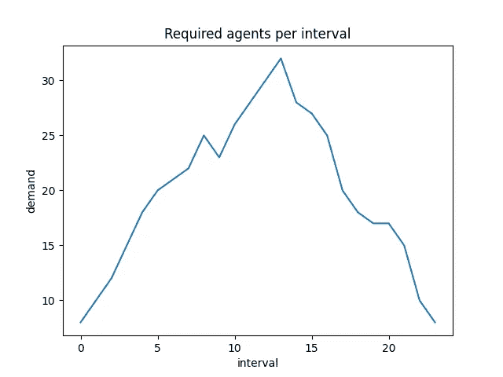
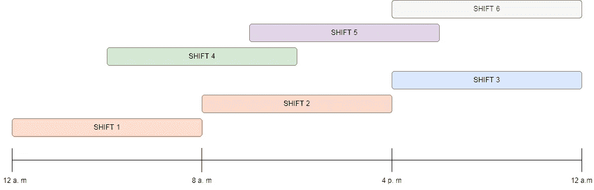
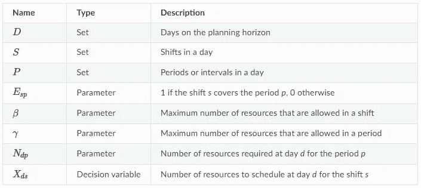
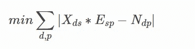
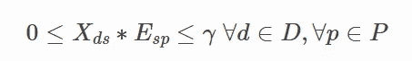
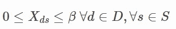
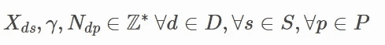
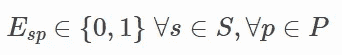
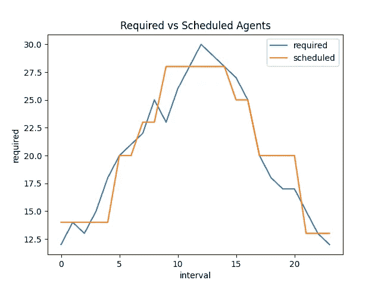

# 如何用 Python 解决调度问题

> 原文：<https://towardsdatascience.com/how-to-solve-scheduling-problems-in-python-36a9af8de451>

## 使用线性规划来最小化所需资源和计划资源之间的差异

埃里克·罗瑟梅尔在 [Unsplash](https://unsplash.com/es/fotos/FoKO4DpXamQ) 上的照片

在劳动力管理中，计划是指根据每个时间间隔的预计需求，找到安排一组资源的“最佳”方法。例如，这可能是在给定一些需求(例如，使用 ErlangC)和一些限制的情况下，找出每一小时间隔要调度多少呼叫中心代理。

“最优”标准是在一个目标函数下定义的，例如，最小化预定资源的数量或需求和计划资源之间的绝对差异。

# **1。配方**

让我们假设我们正在为一个呼叫中心操作创建调度；我们有每 60 分钟间隔所需的估计人数。查看[这篇](/workforce-planning-optimization-using-python-69af0ef9011a)其他帖子，了解如何找到需求。

需求可能如下所示:

必需的代理。图片由作者提供。

我们想回答这样一个问题:给定一组覆盖部分时间间隔的班次，我应该安排多少个座席代表每个班次？例如，每个区间所需人员和计划人员之间的差异尽可能低，以确保尽可能满足需求，而不会出现大量人员不足或人员过多的情况。

考虑到轮班覆盖可能看起来像这样，所以在一个时间间隔，来自不同班次的人同时工作。

轮班设计。图片由作者提供。

# 1.1 数学公式

在这一节中，我将把这种情况定义为优化问题。为此，我引入以下变量和符号:

调度变量。图片由作者提供。

请注意，period 的定义允许将一天分成任意数量的间隔；它可以是 24 个一小时的间隔，48 个 30 分钟的间隔，等等。这将取决于需求的粒度。

现在我们必须定义目标函数和模型的限制；根据可用数据和业务需求，此步骤可能会有所变化。

我将把这个公式称为“最小绝对差”模型；在这种方法中，求解器将最小化所需资源和计划资源之间的绝对差异；这意味着计划资源可能高于或低于实际需求。

在这个定义下，目标函数被公式化为:

目标函数。图片由作者提供。

请注意，术语 Xds÷Esp 将得出某个时间段和某一天的计划资源数量，术语 Ndp 是所需资源。因此，该目标有效地最小化了需求与实际计划在所有日期和期间的绝对差异。

现在我们介绍这个模型的限制:

*   周期 *p* 和日期 *d* 的调度资源数量不能超过最大允许能力。

*   同一班次的计划资源数量不能超过最大允许能力。

*   正整数限制

*   布尔限制

# **2。Python 解决方案**

从上一节可以看出，问题已经完全定义好了，您可以使用任何支持定义不同变量和目标函数的求解器。

然而，将这些方程翻译成代码并求解它们可能需要相当多的优化知识；幸运的是，一些软件包已经简化了这个过程；在这种情况下，我将使用 [pyworkforce](https://pyworkforce.readthedocs.io/) ，这是运筹学中常见问题的 python 接口，适用于排队、调度、排班和优化问题。

首先，让我们定义每个间隔的需求和我们可以使用的固定班次，我将只解决一天的问题:

现在，在 pyworkfoce 的帮助下，我们只需要将这些数据传递给 MinAbsDifference 对象，然后运行 solve 方法:

对于这个特定的运行，我得到以下输出:

首先要注意的是状态是“最优”，这意味着求解器能够找到最优可行解。接下来，我们有一个 35.0 的成本，这是找到解后目标函数的值。

resources _ shifts 对象将告诉我们在每个可用的班次中要安排多少代理人；例如，您应该在第三班安排 13 名座席代表。

如果我们将此信息与班次覆盖范围相匹配，即我们找到 Xds÷Esp，我们将得到每个间隔的以下计划座席代表与理论上所需的座席代表:

必需代理与预定代理。

您可以看到，有时我们的代理可能比我们需要的多/少；你可以把它想成有六个位移只能得到所需曲线的某种程度的离散化，但它保证是在目标函数及其限制的定义下的最好的。

我希望这篇文章对你开始处理调度问题有用。如果您想了解更多关于 pyworkforce 以及如何解决其他优化问题的信息，您可以查看文档及其 repo:

 