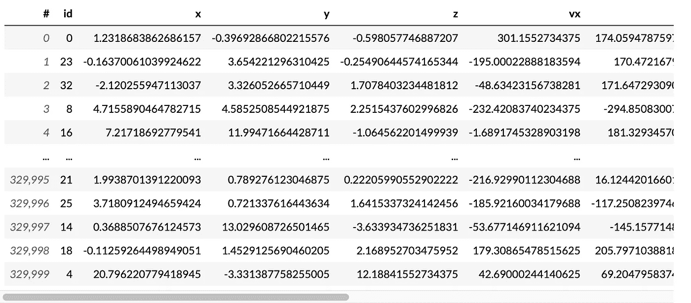
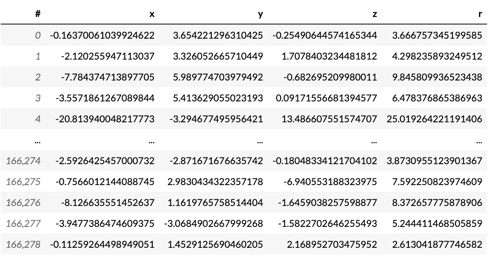
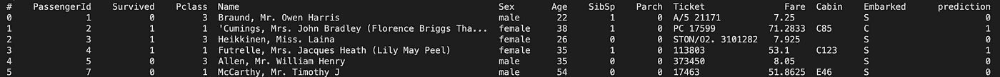

# 使用核外方法处理大型数据集

> 原文：<https://towardsdatascience.com/how-to-speed-up-data-processing-in-pandas-a272d3485b24>

## 利用开源库加快大数据分析工作流程

如果你是一名处理大型数据集的数据科学家，那么在执行分析或训练机器学习模型时，你肯定已经用完了内存(OOM)。


增强您的工作流程。卡拉·富勒在 [Unsplash](https://unsplash.com?utm_source=medium&utm_medium=referral) 上的照片

这并不奇怪。台式机或笔记本电脑上的可用内存很容易超过大型数据集。我们被迫一次只处理一小部分数据，这可能导致低效的数据分析。

更糟糕的是，对大型数据集执行数据分析可能需要很长时间，尤其是在使用复杂的算法和模型时。

> 声明:我不隶属于 vaex。

# Vaex:大型数据集的数据分析库。

输入 vaex。这是一个强大的开源数据分析库，用于处理大型数据集。它通过使用核外方法处理不适合内存的大型数据集来加速数据分析。这意味着它只在需要时将数据加载到内存中。


Vaex:大型数据集的银弹([来源](https://vaex.io/docs/index.html#))

# **vaex 的 4 个主要特性**

vaex 有助于加速数据分析的一些关键特性包括:

1.  **快速高效地处理大型数据集:** vaex 使用优化的内存数据表示和并行算法。vaex 处理大量表格数据，每秒处理 10 亿行。
2.  **灵活的交互式数据探索**:它允许您使用各种内置的可视化工具和工具交互式地探索数据，包括散点图、直方图和内核密度估计。
3.  **易于使用的 API:** vaex 有一个用户友好的 API。该库还与 pandas、numpy 和 matplotlib 等流行的数据科学工具集成良好。
4.  **可扩展性:** vaex 可以扩展到非常大的数据集，可以在单台机器上使用，也可以分布在一个机器集群上。


以闪电般速度处理数据。通过稳定扩散成像。

# vaex 入门

要在您的数据分析项目中使用 Vaex，您可以使用 pip 简单地安装它:

```
pip install vaex
```

安装 Vaex 后，您可以将其导入 Python 代码并执行分析。

下面是一个简单的示例，说明如何使用 Vaex 计算数据集的平均值和标准差。

```
import vaex

# load an example dataset
df = vaex.example()

# calculate the mean and standard deviation
mean = df.mean(df.x)
std = df.std(df.x)

# print the results
print("mean:", mean)
print("std:", std) 
```



示例 dataframe ( [MIT license](https://github.com/vaexio/vaex/blob/master/LICENSE.txt) )有 330，000 行。

在这个例子中，我们使用`vaex.open()`函数加载一个示例数据帧(上面的截图)，然后使用`mean()`和`std()`方法计算数据集的均值和标准差。

# Vaex 语法类似于 pandas

## 用 vaex 过滤

vaex 中的很多功能都和熊猫类似。例如，要使用 vaex 过滤数据，可以使用以下方法。

```
df_negative = df[df.x < 0]
print(df_negative[['x','y','z','r']])
```



## 使用 vaex 进行分组

聚合数据对于任何分析都是必不可少的。我们可以使用 vaex 来执行与熊猫相同的功能。

```
# Create a categorical column that determines if x is positive or negative
df['x_sign'] = df['x'] > 0

# Create an aggregation based on x_sign to get y's mean and z's min and max.
df.groupby(by='x_sign').agg({'y': 'mean',
                             'z': ['min', 'max']})
```

其他聚合，包括`count`、`first`、`std`、`var`、`nunique`可用。

# 使用 vaex 执行机器学习

也可以使用 vaex 进行机器学习。它的 API 与 scikit-learn 的结构非常相似。

要使用它，我们需要执行 pip 安装。

```
import vaex
```

我们将说明如何使用 vaex 来预测泰坦尼克号的幸存者。


用泰坦尼克号幸存者问题来说明 vaex。通过稳定扩散成像。

首先，需要将 [titanic 数据集](https://www.kaggle.com/c/titanic)加载到 vaex 数据帧中。我们将使用`vaex.open()`方法，如下所示:

```
import vaex

# Download the titanic dataframe (MIT License) from https://www.kaggle.com/c/titanic
# Load the titanic dataset into a vaex dataframe
df = vaex.open('titanic.csv')
```

一旦数据集被加载到 dataframe 中，我们就可以使用`vaex.ml`来训练和评估一个预测乘客是否在泰坦尼克号灾难中幸存的机器学习模型。例如，数据科学家可以使用随机森林分类器来训练模型，如下所示。

```
from vaex.ml.sklearn import Predictor
from sklearn.ensemble import GradientBoostingClassifier

# Download the titanic dataframe (MIT License) from https://www.kaggle.com/c/titanic
# Load the titanic dataset into a vaex dataframe
titanic_df = vaex.open('titanic.csv')

titanic_df = titanic_df.dropna()

# Get numeric columns of titanic_df
features = ['Age','SibSp','Parch','Fare','Pclass']
target = 'Survived'

# Use GradientBoostingClassifier as an example
model = GradientBoostingClassifier(random_state=42)
vaex_model = Predictor(features=features, target=target, model=model, prediction_name='prediction')

vaex_model.fit(df=titanic_df)
```

当然，其他预处理步骤和机器学习模型(包括神经网络！)都有。

一旦模型被训练，数据科学家使用`transform()`方法执行预测，如下所示:

```
titanic_df = vaex_model.transform(titanic_df)
```

让我们打印结果。请注意，有一个新列“预测”。

```
print(titanic_df)
```



预测的结果

用 vaex 解决泰坦尼克号问题绝对是大材小用，但这足以说明 vaex 可以解决机器学习问题。

# 使用 vaex 增强您的数据科学管道

总的来说，vaex.ml 提供了在大型数据集上执行机器学习的强大工具。它的核外方法和优化的算法使得在不适合内存的数据集上训练和评估机器学习模型成为可能。

我们没有介绍 vaex 可用的许多功能。为此，我强烈建议您查看[文档](https://vaex.io/docs/index.html#)。

以下是完整的代码:

```
import vaex

# load an example dataset
df = vaex.example()
print(df)

# calculate the mean and standard deviation
mean = df.mean(df.x)
std = df.std(df.x)

# print the results
print("mean:", mean)
print("std:", std)

df_negative = df[df.x < 0]
print(df_negative)

# Create a categorical column that determines if x is positive or negative
df['x_sign'] = df['x'] > 0

# Create an aggregation based on x_sign to get y's mean and z's min and max.
df.groupby(by='x_sign').agg({'y': 'mean',
                             'z': ['min', 'max']})

from vaex.ml.sklearn import Predictor
from sklearn.ensemble import GradientBoostingClassifier

# Download the titanic dataframe (MIT License) from https://www.kaggle.com/c/titanic
# Load the titanic dataset into a vaex dataframe
titanic_df = vaex.open('titanic.csv')

titanic_df = titanic_df.dropna()

# Get numeric columns of titanic_df
features = ['Age','SibSp','Parch','Fare','Pclass']
target = 'Survived'

model = GradientBoostingClassifier(random_state=42)
vaex_model = Predictor(features=features, target=target, model=model, prediction_name='prediction')

vaex_model.fit(df=titanic_df)

titanic_df = vaex_model.transform(titanic_df)Follow me for more content.
```

我是一名在技术部工作的数据科学家。我定期在 Medium 和 LinkedIn 上分享这样的数据科学技巧。关注我，了解更多未来内容。