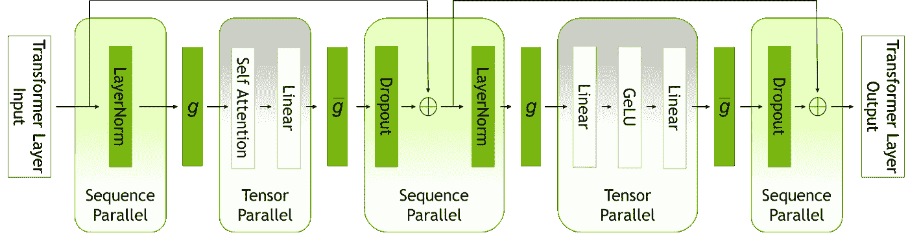
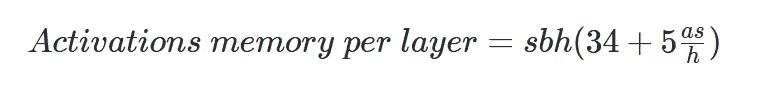
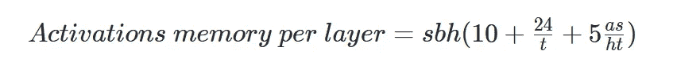
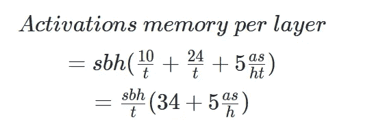
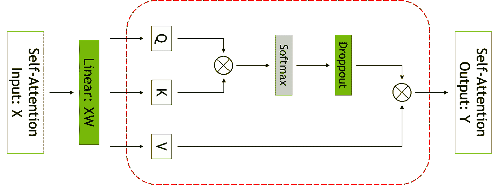
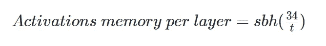

# 如何加快大型语言模型的训练

> 原文：<https://towardsdatascience.com/how-to-speed-up-training-for-large-language-models-81ffb30c36b2>

## 探索序列并行性和选择性激活重新计算的概念


艾莉娜·格鲁布尼亚克在 [Unsplash](https://unsplash.com/s/photos/neural-network?utm_source=unsplash&utm_medium=referral&utm_content=creditCopyText) 上的照片

随着人工智能的进步，现在可以训练大型语言模型来完成自然语言处理任务。通常，大型语言模型包含超过 1000 亿个参数，并使用高级算法在大型语料库上进行训练。

大型语言模型(LLM)非常有效，能够很好地概括大多数下游任务，如文本生成、翻译、摘要、语义搜索等。因此，它为自然语言处理领域的开发人员和研究人员提供了新的能力。

在撰写本文时，世界各地的研究人员在训练大型语言模型方面取得了重大突破。下面的列表重点介绍了一些最著名的具有一流性能的大型语言模型:

*   [OPT-175B](https://github.com/facebookresearch/metaseq) —一个基于公开可用数据集的拥有 1750 亿个参数的语言模型。这是 Meta AI 研究计划的一部分。
*   [BLOOM](https://huggingface.co/bigscience/bloom) —在 46 种语言和 13 种编程语言上训练的 1760 亿个参数模型。这个模型是由大科学促成的。
*   [威震天-图灵 NLG 模型](https://github.com/NVIDIA/Megatron-LM)—105 层变压器模型，拥有 5300 亿个参数。这是微软和英伟达的共同努力。

训练一个大型的语言模型并不容易，而且常常伴随着许多挑战。例如:

*   不可能在 GPU 的内存中容纳大型语言模型的所有参数。它需要分布式软件和硬件轨道来训练大型语言模型。
*   训练时间长得不切实际，这使得训练大型语言模型的成本非常高。整个训练过程需要跨越数千个 GPU 的并行性。此外，算法需要进行优化，以便在内存和计算上高效且可扩展。

有两种新方法可用于改进大型语言模型的训练:

*   [序列并行性](https://arxiv.org/abs/2205.05198)
*   [选择性激活重新计算(SAR)](https://arxiv.org/abs/2205.05198)

NVIDIA AI 平台在其对 NeMo 威震天大型语言模型的最新更新中演示了这些技术。根据所提供的基准，当训练 GPT-3 模型的不同变体时，这两种技术都将训练时间减少了约 30%(最小的模型约为 220 亿个参数，而最大的模型高达 1 万亿个参数)。

> 本教程涵盖了这两种技术背后的基本概念。对于实际的实现，请前往[官方库](https://github.com/NVIDIA/Megatron-LM)。

# 序列并行性

序列并行与张量级模型并行协同工作。首先，它注意到了以前没有并行化的 transformer 层区域。这些层在序列维度上是独立的。

请看下图中变形层的并行模式:



图片由英伟达公司提供

随后，它将通过沿着序列维度分割变换器层，在张量并行设备上分布这些区域的计算和激活存储器。结果，不需要重新计算，因为分布式激活可以用于反向传递。

根据[发表的论文，](https://arxiv.org/abs/2205.05198)嵌入层的输出是一个大小为 s × b × h 的三维张量。该输出也代表了变换器模块的输入。

> `*a*` —注意头的数量
> 
> `*s*` —序列长度
> 
> `*b*` —微量批量
> 
> `*h*` —隐藏尺寸大小
> 
> `*t*` —张量平行尺寸

多层感知器(MLP)块所遵循的层范数的公式如下:

> Y = LayerNorm(X)，
> 
> Z = GeLU(Y A)，
> 
> W = ZB，
> 
> V =压降(W)

x 是尺寸为 s × b × h 的层范数的输入。另一方面，A 和 B 表示线性层的权重矩阵。作者将张量并行和序列并行操作组合成单个减少-分散操作。

将所有这些部分结合在一起，最终的等式如下:


图片由作者提供。方程式是使用 Markdown 中的 LaTeX 创建的。

每个注意块大约需要

```
11sbh + 5as^2b
```

字节的存储。细分如下:

## MLP

*   两个线性层以 2sbh 和 8sbh 的大小存储它们的输入。
*   GeLU 非线性以 8sbh 大小存储其输入用于反向传播。
*   dropout 存储其大小为 sbh 的掩码。

MLP 块需要大约 19sbh 字节的存储。

## 层范数

*   每个层 norm 存储其大小为 2sbh 的输入，使其总存储量为 4sbh。

存储变压器网络单层的激活所需的总存储器如下:



图片由作者提供。方程式是使用 Markdown 中的 LaTeX 创建的。

通过应用 t 向张量并行，存储每层激活所需的内存现在是:



图片由作者提供。方程式是使用 Markdown 中的 LaTeX 创建的。

通过结合 t-way 张量并行性和序列并行性，可以进一步减少所需的存储器:



图片由作者提供。方程式是使用 Markdown 中的 LaTeX 创建的。

# 选择性激活重新计算(SAR)

顾名思义，选择性激活重新计算通过仅重新计算每个转换器层的部分而不是整个转换器层来优化性能。这种方法对于由于内存限制而需要重新计算力的情况非常有用。



图片由英伟达公司提供

红色虚线示出了应用选择性激活重新计算的区域。请注意，不同的激活需要不同数量的重新计算操作。

通过组合 t-way 张量并行性、序列并行性和选择性激活重新计算，所需的存储器减少到:



图片由作者提供。方程式是使用 Markdown 中的 LaTeX 创建的。

上面的等式清楚地概述了这两种技术允许所需的激活记忆与序列长度成线性比例。此外，它们现在独立于注意力头的数量。

> 有关序列并行性和选择性激活重新计算的更多信息，可以参考下面的研究论文中的[。](https://arxiv.org/abs/2205.05198)

# 结论

序列并行和选择性激活重新计算是加速大型变压器模型训练的两种新颖而简单的方法。这两种技术具有相似的内存节省，并且有望将训练所需的内存减少大约 5 倍。因此，训练大型语言模型的成本和时间显著减少。

话虽如此，它要被大众广泛采用还有很长的路要走。希望人工智能社区将继续在现有研究的基础上创新，使每个人都有可能访问和部署大型语言模型。

感谢你阅读这篇文章。祝你有美好的一天！

# 参考

1.  [使用 OPT-175B 民主化访问大规模语言模型](https://ai.facebook.com/blog/democratizing-access-to-large-scale-language-models-with-opt-175b/)
2.  [推出全球最大的开放多语言模型——BLOOM](https://bigscience.huggingface.co/)
3.  [NVIDIA AI 平台为大型语言模型带来巨大收益](https://developer.nvidia.com/blog/nvidia-ai-platform-delivers-big-gains-for-large-language-models/)