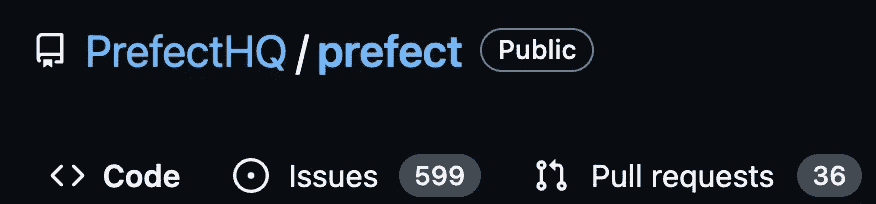
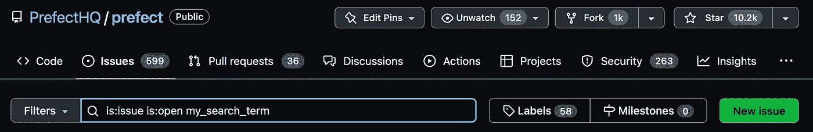
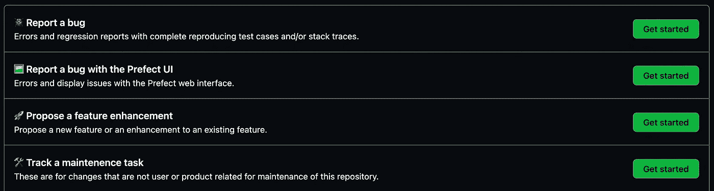
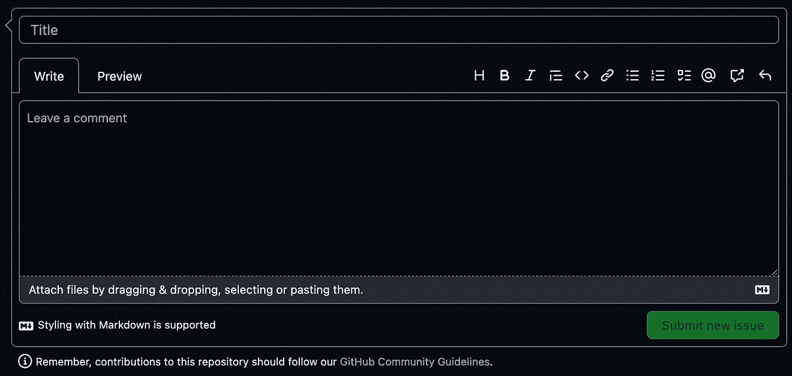
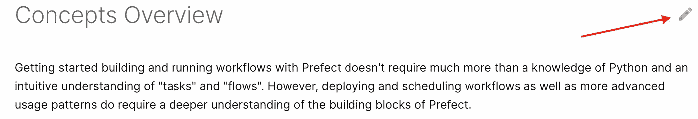
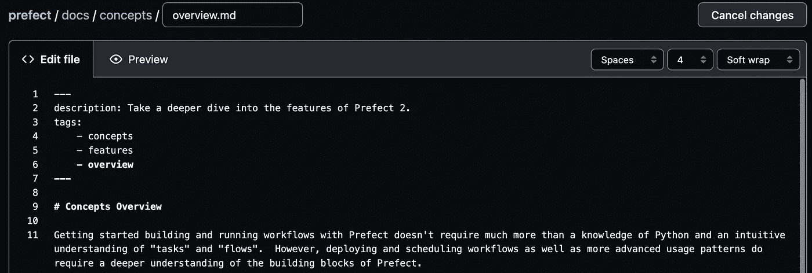
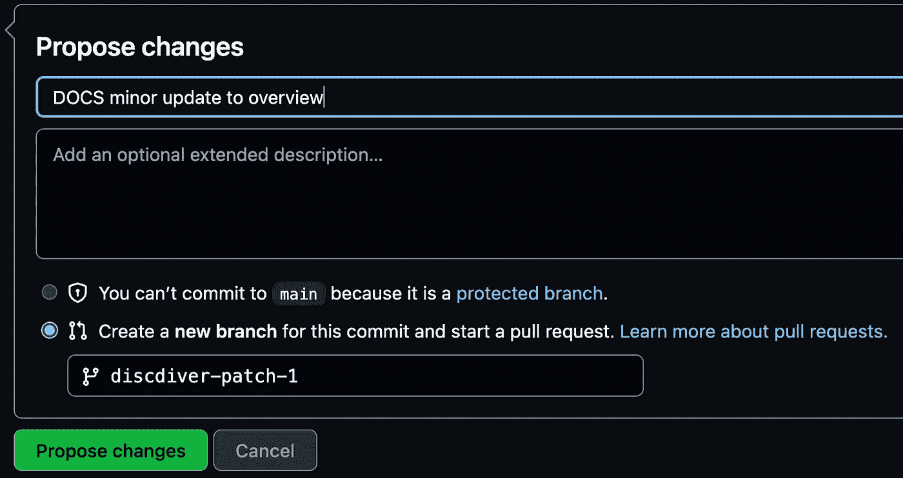
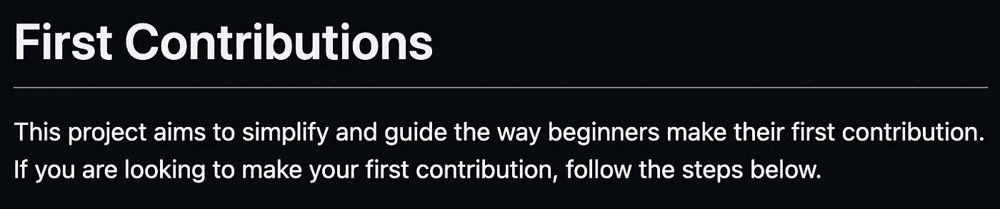
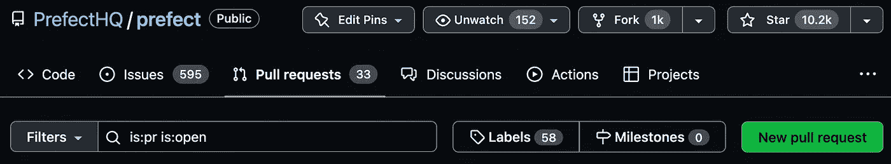

# 如何开始为开源软件做贡献

> 原文：<https://towardsdatascience.com/how-to-start-contributing-to-open-source-software-9651ca4cedd4>

## 直接参与的指南

开始使用开源软件可能会感到害怕，但事实并非如此。在本指南中，您将学习如何为开源做出贡献，无论您的经验水平如何。


资料来源:pixabay.com

首先，让我们看看你为什么想要参与进来。

# 为什么要贡献开源？

有很多原因促使项目使用[主导的软件开发模型](https://github.blog/2022-01-20-open-source-creates-value-but-how-do-you-measure-it/)。以下是回报社区的几个理由，我们都从中受益:

*   为您自己或其他用户解决问题
*   修复安全问题
*   构建新功能
*   帮助用户理解事物是如何工作的
*   发展你的技能
*   向其他人展示你的能力

好吧，所以贡献是你应该做的事情之一。但是不知道如何开始会让人麻痹。让我们制定一个路线图，让事情变得更简单。

# 如何为开源🛠做贡献

不管你的技能水平如何，你都有很多方法可以为开源做出贡献。让我们从每个人现在都能做的事情开始。

## 你发现有价值的⭐️

[GitHub](https://github.com/) 是绝大多数开源工作完成的地方。如果您没有免费的 GitHub 帐户，您需要创建一个。


向 GitHub 存储库添加一颗星，向其他人表明您发现了一个有价值的存储库。这个社区信号非常有用，因为我们都需要决定使用哪个存储库。

使用和关注越多的开源库一般反馈越多，贡献者也越多。这些资源引导项目被更新，以便它们保持安全和相关。

星星是最快的价值信号，所以当一颗星星是应得的时候，就加一颗。

## 制造一个问题⚠️

启动一个回购需要一秒钟，而第一次创建一个问题可能需要几分钟。尽管如此，这并不是一个巨大的提升。提交问题是您提醒开发团队关于错误、所需的文档修复和特性请求的方式。

假设你认为你在一个项目中发现了一个 bug。首先，确保您已经检查了文档和堆栈溢出，并做了一些谷歌搜索。

然后是时候去 GitHub 回购项目了。如果你在文档中没有现成的直接链接，通常可以通过谷歌搜索“ *project_name* *GitHub”找到回购。*

点击*问题。*



搜索关于该主题的任何未决问题。你可能不是第一个发现这个问题的人。如果有人已经打开了一个关于相同问题或功能请求的 GitHub 问题，请在现有问题中添加评论，而不是复制它。



假设您发现没有人报告您的问题。是时候创造一个了。点击绿色的*新问题*按钮。

有些项目回购有问题模板供您使用。如果有说明，就照着做。



没有模板的 Repos 的标题和描述字段为空白。



尽可能详细地描述这个问题，如果你认为有帮助的话。如果适用，包括您使用的软件包版本、编程语言版本和您的硬件(如 Windows 10)。

包含错误的完整堆栈跟踪是非常好的。利用降价格式使问题更具可读性。Markdown 类似于添加了一些符号以使格式美观的普通文本。[这里有一个快速指南](https://commonmark.org/help/tutorial/index.html)。快速提示:三个反勾号`````将为您提供代码格式，这使得读取堆栈跟踪更加容易。

如果你能创建一个最小可重复的例子(MRE ),这对那些试图诊断和修复你的问题的人来说是一个巨大的帮助。只要记住把任何代码放在反斜线中。

请记住，开源贡献者通常是志愿者和忙碌的人。请善待他们。🙂

让我们看看你如何能直接促成改变。

# 改进✍️文档

让我们先来看看文档的变化。为了纠正一个打字错误或添加一些文档，有时你可以幸运地点击一个编辑按钮。



然后，您可以在浏览器中调整降价文件。



如果你要改变文档的格式，你可能会使用 Markdown。有些回购是用 reStructuredText(。rst)。我会在你的第一份文档工作中避免使用 rst，因为学习那个 Markdown 有点困难，但是如果你想学习 rst，[这里有一个指南](https://sphinx-tutorial.readthedocs.io/step-1/)。



在浏览器中进行更改后，您可以创建一个拉请求。

如果您处理的不仅仅是一个文件，那么您会想要派生 repo，并将这个派生文件克隆到您的机器上。

如果您正在寻找 docs 文件，它们通常可以在 *docs* 文件夹中找到。如果有的话，提供的指导方针可以帮助您知道在哪里可以找到这些文件。通常它们在一个名为 *docs 的文件夹中。*

然后，您将在文本编辑器中工作，提交更改，并将更改推送到您的 repo。最后，您将打开一个拉取请求。

如果你想练习提出拉式请求，[这个回购](https://github.com/firstcontributions/first-contributions)就是为此而设计的！



好了，让我们回到最后一个场景——贡献一些代码。

# 修复🧑‍代码中的一个错误💻

向存储库贡献代码的门槛有点高。您需要:

*   精通所使用的编程语言
*   创建一个开发环境——应该有说明
*   花时间了解代码库
*   编写测试

这里有一些提示来指导你的方式。

# **如何找到好的第一个项目🚀**

## **起步小**

如果这是你第一次写代码，我建议从一个小项目开始。较小的项目需要较少的时间来理解。它也可能有一个运行速度更快的测试套件。

## **确保项目处于活动状态**

你会想要一个积极维护的项目。您可以看到自存储库中的文件更新以来已经过了多长时间。如果六个月内什么都没做，那么无论你做什么都不可能很快融入代码库。☹️


# **如何找到一个好的问题来解决📝**

你想要速战速决。寻找一个你认为你可以在几个小时内解决的问题。

不同的项目管理方式略有不同。如果项目有诸如`*good first issue*`之类的问题标签，这些可能是一个有收获的地方。

如果你的编码技能很强，可以随意解决更难的问题。

# 如何让你的拉请求合并✅

## **遵循风格指南**

许多项目都有一个风格指南。如果有，它很可能在*贡献*文档文件*中。使用文档字符串，如果你使用 Python，使用类型提示。遵循指示是游戏的大部分。🙂*

## 编写测试

编写测试是使代码可靠的一个好方法。代码风格的测试和林挺通常必须在你的 PR 被接受之前通过。

如果您添加了新功能，请确保在文档中添加说明。

在本地运行测试，确保一切顺利。提交您的代码，并将其推送到您的存储库。现在你可以要求维护者接受你的贡献了。

## 创建公关

点击绿色的*新拉动请求*按钮，创建请购单。



描述当您打开拉取请求时，它会做什么。

当您提交 pull 请求时，测试和格式化可能会在云中运行。

## 现在怎么办？

也许你的 PR 马上就被接受了。厉害！

很有可能你会花一点时间等待某人回复你。保持耐心。

如果已经过了几个星期，没有人对你的 PR 发表评论，要求修改，或者把它合并到主分支，你可以礼貌地询问是否有人可以看一下。

在 GitHub 中，如果你使用`@`和维护者的句柄，就会 ping 它们(谨慎使用)。希望你遵循了上面的建议，选择了一个正在积极维护的库。

如果你被要求做出改变，请这样做或在 GitHub 评论中讨论。

# 包装

您已经看到了如何开始为开源做贡献！开源社区的繁荣需要一个虚拟的村庄。有了你的贡献，你就加入了这个社区。🎉

我希望这个指南对你有所帮助。如果你有，请在社交媒体上分享，这样其他人也可以找到它。

如果你想参与到 [Prefect](https://www.prefect.io/) 中来，我们将通过举办一场非正式的#winterjamboree 让人们更容易参与，有点像#hacktoberfest，但更酷。明白了吗？😉在提督 GitHub repo 上查看一些[好的第一期](https://github.com/orgs/PrefectHQ/projects/38/views/1) 寻找灵感，并提交一些提督赠品的 PR！


资料来源:pixabay.com

快乐贡献！