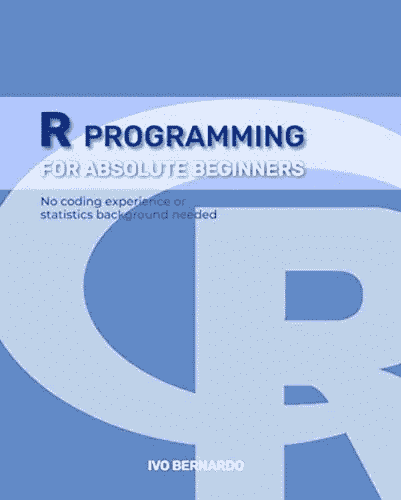
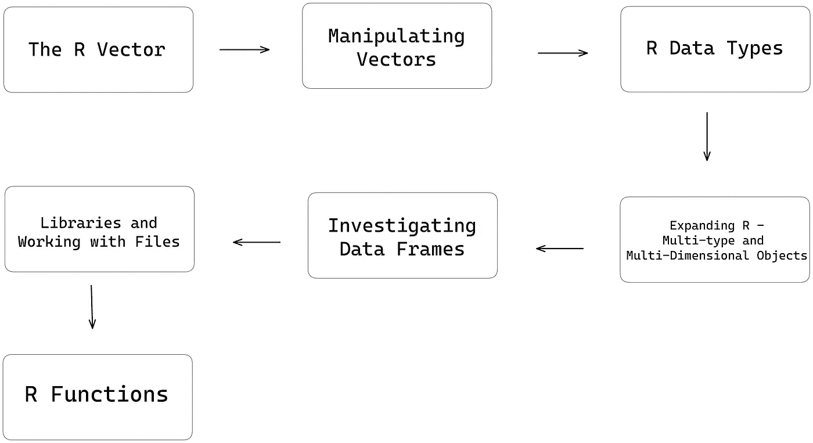

# 如何开始学习 R 编程语言

> 原文：<https://towardsdatascience.com/how-to-start-learning-the-r-programming-language-90e7c98ff3b9>

## 在本指南中，我将带您逐步创建一个全面的学习计划，为您打下坚实的 R 语言基础


帕特里克·帕金斯的照片——Unsplash.com

*【免责声明:这篇文章包含了我的《绝对初学者 R 编程》一书的一些链接，可以在亚马逊上找到】*

对于那些不熟悉 R 的人来说，R 是一种开源编程语言，广泛用于数据分析和统计计算。这是一个强大的工具，允许您处理大型数据集，创建可视化，构建算法等。

大多数 R 课程或材料都是从向您展示如何处理数据框架、读取外部数据或训练模型开始的。虽然学习所有这些概念确实是学习 R 的重要部分，但是还有许多其他的基本概念对语言的坚实基础至关重要。掌握这些基础知识是关键，通过这样做，您将能够更有效地使用 R，避免使用该语言时可能出现的常见陷阱和令人头痛的问题。

虽然首先跳到更实际的例子可能很诱人，但是花时间学习基础概念是很重要的，比如数据结构或数据类型。例如，使用 R 的一个关键方面是理解如何存储数据以及它与 R 对象的关系。向量、数组、矩阵和列表都是基本的数据结构，允许您存储和操作数据，它们包含许多使它们独一无二的属性。

我的[最新著作](https://www.amazon.com/dp/B0BQFMT3JP)遵循了一个关于如何接近 R 语言的成熟结构，并带你踏上从零开始学习 R 语言的旅程——这种方法已经帮助了全球 8000 多名学生(在 Udemy 上)，帮助他们掌握这门语言，即使他们没有任何编码背景。在这篇博文中，我将详细介绍书中涉及的不同概念，以及我为帮助学生掌握 r。



面向绝对初学者的 r 编程语言—图片由作者提供

在我们开始详细描述每个步骤之前，先简单概述一下我们将要讨论的内容:



r 学习流程—作者图片

# 第一个——R 向量

在《绝对初学者的 R 编程》一书中，我们从最基本的 R 对象——R 向量开始。

在 R 中，vector 是一种基本的数据结构，它存储一系列相同类型的元素。向量通常用于存储可以连续表示的数据，如一系列数字或字符串。可以通过多种方式创建向量，例如，使用代表“组合”的`c()`函数，或者使用切片(例如`1:10`)。

如何创建 R 向量的示例如下:

```
example <- c(1, 2, 3, 4, 5)
```

向量有几个重要的性质:它们可以被索引，它们同时保持单一类型，并且是一维对象。

# 操纵 R 向量

接下来，在创建和构建了我们的第一个 R 向量之后，这本书介绍了您将对 R 对象进行的两个常见操作:

*   索引元素。
*   修改数据结构(添加、删除或更改元素)。

首先，我们将探索如何对向量进行子集化，通过使用方括号[]结合数字索引，命名或逻辑向量。我们将使用几个代码示例详细探索所有这些索引技术。

我们还将检查在 R 中修改或删除元素的多种方法，特别是探索如何使用索引来添加、删除或更改向量元素。

这方面的一个例子是使用 subsetting 操作符——假设您想要从向量 x 中删除第二个元素，您可以使用下面的代码:`x[-2]`:这将创建一个新的向量，其中包含除第二个元素之外的所有元素`x`。

总的来说，在 Vectors 介绍之后的章节将集中于在 R 中操作对象，并熟悉添加、更改或删除元素——这是熟悉 R 语言的关键技术。

# 数据类型

向量的一个最重要的特征是它一次只能保存一种类型。这个事实把我们带到了该语言最重要的组成部分之一——R 数据类型！

r 数据类型用于指定特定对象可以存储的数据类型。 **R 有多种数据类型，包括数值、字符、逻辑、因子或日期数据类型。**

数字数据类型包括整数和浮点数:整数是整数，而浮点数是包含小数点的数字。数字数据类型通常用于存储和操作数字数据，如计数、测量或统计。另一方面，字符数据类型通常用于存储文本数据，如名称或描述。

为数据选择合适的数据类型至关重要。使用错误的数据类型会导致分析中的错误或意外结果，因为数据类型决定了可以对 R 对象执行什么类型的操作！

# 扩展 R——多类型和多维对象

当然，我们不局限于在 r 中使用单一类型或单一维度的对象。数组、矩阵或列表是为我们提供额外功能的对象，与数据分析和科学管道极其相关。

在 R 中，矩阵是二维的数据集合，有行和列。使用`matrix`函数(或使用`array`命令传递两个维度)创建矩阵，该函数接受一个数据向量和可选的行数和列数参数。例如:

```
# Create a 2x3 matrix with 6 elements
m <- matrix(1:6, nrow = 3, ncol = 2)
```

这将创建一个 3 行 2 列的矩阵，包含元素 1 到 6。

数组也是一个多维对象(通常有两个以上的维度),它们是使用`array`函数创建的，该函数接受一个数据向量和一个维度向量。例如:

```
# Create a 3-dimensional array with dimensions 2x3x4
a <- array(1:24, dim = c(2, 3, 4))
```

这将创建一个包含 2 行、3 列和 4 个切片的数组，包含元素 1 到 24。使用索引访问多个维度很容易——我们只需在我们的`[]`操作符上打开新的逗号！

```
# Access the element at row 2, column 3, and slice 4
a[2, 3, 4]
```

另一方面，列表是 R 中对象的集合，可以由不同的类型和维度组成。列表是语言中最灵活的对象，使用`list`函数创建，将一系列对象作为参数。例如:

```
#Create a list with a vector, a numeric vector, and a matrix
l <- list(c("a", "b"), c(1, 10, 100), matrix(1:9, nrow = 3))
```

这个简单的命令创建了一个包含 3 个元素的列表:一个字符向量、一个数字向量和一个矩阵。

在学习旅程的这一点上，在研究了几种类型的 R 对象之后，我们仍然缺少最著名的一个——数据框！

# 调查数据框

可以说，最重要的 R 对象是数据框。在本书中，我们将用整整两章的时间详细介绍如何使用这个著名的 R 对象，并一步一步地介绍使用这种表格格式时可以遵循的正常流程。

数据框类似于矩阵，但它们有一个巨大的区别:每列可以有不同的类型(数字、字符、因子等。)，当我们比较这两个对象时，这是一个很大的优势。

您可以使用`data.frame`函数在 R 中创建一个数据框，该函数将一系列向量作为参数。每个向量最终将成为新对象中的一列:

```
# Create a data frame with three columns: "Name", "Age", and "Degree"
students <- data.frame(Name = c("Alice", "Joe", "John"),
                 Age = c(20, 21, 19),
                 Gender = c("Mathematics", "History", "Literature"))
```

这将创建一个 3 行 3 列的数据框，包含三个人的姓名、年龄和性别。

数据框还有一个名为`row.names`的特殊属性，它指定数据框的行名。您可以使用`row.names`函数访问行名，也可以使用相同的命令设置它们。例如:

```
# Get the row names of the data frame
row.names(students)

# Set up Rows for the Data Frame
row.names(students) <- c("Student 1", "Student 2", "Student 3")
```

掌握数据框对于任何数据科学家或分析师来说都是至关重要的，因为该对象通常用作统计分析、数据可视化和机器学习算法的输入。我们将在书中看到一些例子:

*   如何对数据帧进行子集划分？
*   如何聚合数据？
*   如何检查一个数据帧的结构、头和尾？
*   如何组合数据框？

# 库和使用文件

R 库是 R 函数、数据和文档的集合，为 R 编程语言提供了额外的功能。

一旦安装了一个库，就可以使用著名的`library`函数将它加载到当前的 R 会话中。

**有数千个可供 R 使用的库，涵盖了广泛的主题，如数据操作、统计分析、机器学习、数据可视化等。**。一些流行的库包括用于数据操作的`dplyr`或用于数据可视化的`ggplot2`，其中许多库由 R 社区维护，他们不断地用新特性和错误修复来更新它们。

为什么图书馆很重要？因为它们可以极大地提高您的生产力，并允许您依靠开源社区用最少的代码执行复杂的任务。由于 R 是一种依赖于全球成千上万用户的开源语言，这种语言有一个非常活跃和支持它的开发人员社区，他们为它的开发做出贡献，并与他人分享他们的知识和经验。这使它成为一个很好的资源，不仅用于实现数据科学和机器学习系统，还用于跟踪行业研究的新发展。

# 功能

r 函数对于组织和模块化代码是必不可少的。函数是执行特定任务的代码块，可以在程序中多次重用，帮助用户构建可测试和模块化的适当软件。

在 R 中使用函数可以极大地提高您的生产率，改善代码的可读性和可维护性，帮助您避免长期的错误。**如果你想认真对待数据分析师或科学家的生活，你必须学会如何使用 r 中的函数**

在代码中使用函数有几个好处。首先，它可以使你的代码更容易理解和修改，同时降低出错的风险。其次，编写良好并有文档记录的函数可以更容易地与其他用户共享您的代码。这在协作编码工作中特别有用，因为它允许其他用户更容易地理解和构建您的工作。

在本书的函数部分，我们还将探讨其他可以在上下文中使用的概念:for 循环、while 循环和条件。

学习 R 编程语言可能是一次既有收获又有挑战的经历。通过从一个全面的学习计划开始，并专注于基础概念，如数据类型、数据结构和控制结构，你可以建立一个强大的语言基础，并为处理更高级的主题做好充分准备。

如果你想开始学习 R 语言，想要一种结构化的方法来帮助你掌握这门语言，可以考虑看看我的新书，[“绝对初学者的 R 编程”](https://www.amazon.com/dp/B0BQ94N9L7)。通过简单的解释和实际的例子，我希望这本书对于任何想从头开始学习 R 的人来说都是一个很好的资源——如果你将来碰巧读到了它，我也很乐意得到你对改进和调整的反馈，这对将来的学生会有帮助！

你可以在所有主要的亚马逊商店找到我的书，有 Kindle 和平装版:

*   亚马逊美国:【https://www.amazon.com/dp/B0BQ94N9L7 
*   亚马逊 ES:[https://www.amazon.es/dp/B0BQ94N9L7](https://www.amazon.es/dp/B0BQ94N9L7)
*   亚马逊英国:[https://www.amazon.co.uk/dp/B0BQ94N9L7](https://www.amazon.co.uk/dp/B0BQ94N9L7)
*   亚马逊德:[https://www.amazon.de/dp/B0BQ94N9L7](https://www.amazon.de/dp/B0BQ94N9L7)


r 编程学习流程—作者图片