# 如何开始用 Python 编程:Anaconda 101

> 原文：<https://towardsdatascience.com/how-to-start-programming-in-python-anaconda-101-724b5e7e367e>

## 你是否想尝试用 Python 编程，但不知道从哪里开始？Anaconda 会让你的生活轻松很多。

当你学习任何新技能时，最难的部分是弄清楚如何开始以及如何为自己的成功做准备。学习 Python 也是如此！你需要弄清楚如何获得这种语言，使用什么样的开发环境，如何确保你可以使用最先进的工具。。。这样的例子不胜枚举。刚开始可能会让人不知所措，尤其是当你是新人，还不太了解自己需要什么(或者为什么需要)。

好消息是:你可以使用 [Python](https://www.python.org/) 的 [Anaconda 发行版](https://www.anaconda.com/)来解决所有这些问题。

在我们详细讨论 Anaconda 之前，让我们先来谈谈您需要为自己的成功做些什么。

# 成功使用 Python 所需的工具

开始用 Python 编程需要三个主要工具。

1.  Python 编程语言的最新版本(我打赌这并不奇怪)。
2.  集成开发环境(IDE)。
3.  访问用户友好的包管理器，这样你可以利用其他人的基于 Python 的工具，如[熊猫](https://builtin.com/data-science/data-wrangling-pandas)和 [TensorFlow。](https://builtin.com/data-science/guide-logistic-regression-tensorflow-20)

Anaconda 通过一个简单的下载提供了所有这三个工具，这使得它非常方便。既然人们总是喜欢免费获得东西，我也要指出 Anaconda 对于个人使用是免费的。

默认情况下，安装 Anaconda 将会安装 Python 的最新[版本，所以您已经准备好了。Anaconda 还将自动安装许多可用于](https://builtin.com/software-engineering-perspectives/python-3.10)[机器学习](https://builtin.com/machine-learning)和[数据科学](https://builtin.com/data-science)的关键 Python 包，如 NumPy、SciPy 和 [Matplotlib](https://builtin.com/data-science/matplotlib-python-tutorial) 。这意味着一旦安装了 Anaconda，您只需要决定想要使用哪个 ide。

# 蟒蛇的最爱

Anaconda 已经安装了几个 ide，每个 ide 都提供不同的特性。人们有不同的偏好，但我发现大多数人要么用 [Jupyter Notebook](https://builtin.com/software-engineering-perspectives/jupyter-notebook) 要么用 Spyder。

*注意:Jupyter Lab 正在慢慢取代 Jupyter Notebook，但是如果你学习 Jupyter Notebook，你将同时拥有当前期望的行业技能和未来学习 Jupyter Lab 的良好开端。*

# Spyder

Spyder 是 Scientific PYthon Development EnviRonment 的缩写(是的，这是一个有点扭曲的缩写)。这是 Python 开发的一个有用工具，因为它有强大的调试工具。借助 Spyder，您还可以轻松实现可视化；你可以一次看到所有的东西。

这是我在创建使用 [Scikit-learn 实现机器学习](https://builtin.com/data-science/scikit-learn)的基础教程时使用的 Spyder 环境窗口。这张截图展示了我真正喜欢 Spyder 的所有地方。看一下，我会告诉你细节。

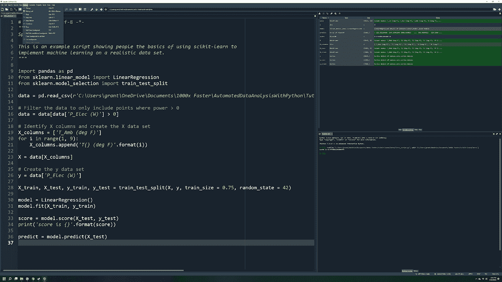

图片来源:作者

图像左侧的大框是脚本编辑器窗口，如下图所示。

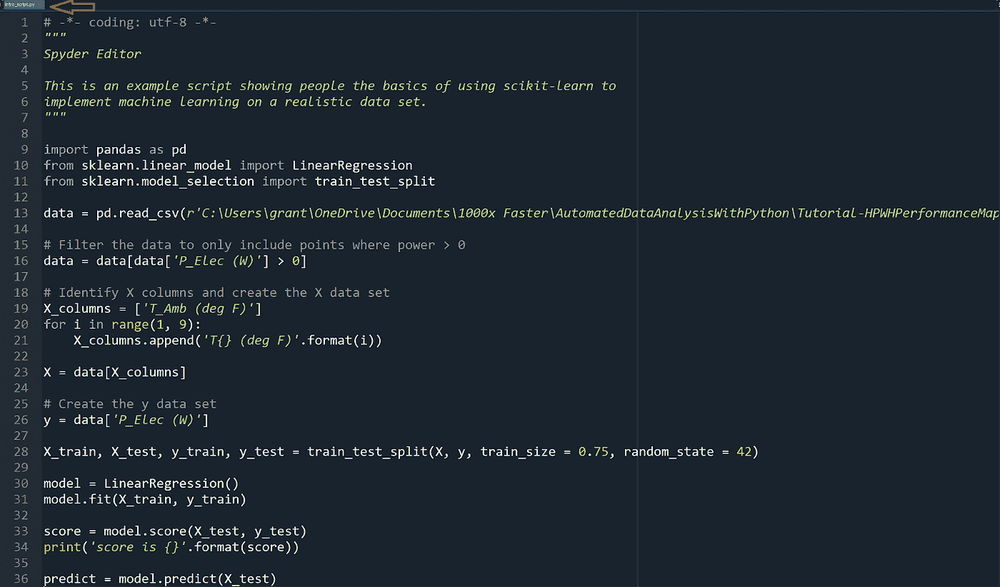

图片来源:作者

如果你仔细观察左上方的选项卡(沿着红色箭头)，你会看到我正在编辑一个名为“intro_script.py”的 Python 文件。这个窗口很有用，因为它提供了一个可以编写脚本的地方。其他一切都支持这个目标。

右下方的窗户(下面放大的)也极其值钱。

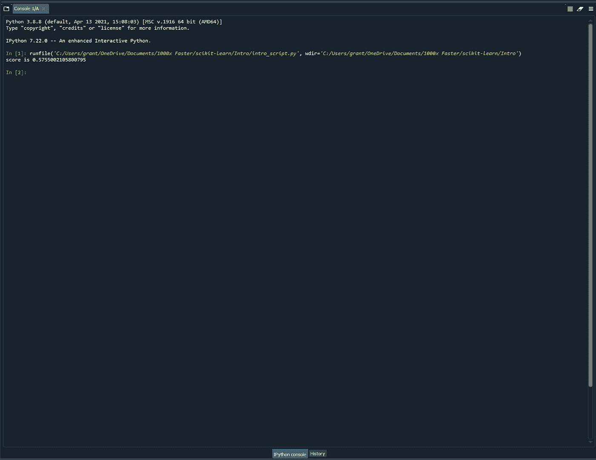

图片来源:作者

你可以在那个窗口的左下角(非常接近图像的底部中间)看到它说这是一个 IPython 控制台。这个控制台使您能够立即运行您喜欢的任何 Python 命令，并提供一个终端来输出可能对您有用的更新或调试信息。

如果你看看那里的内容，你可以看到在' In [1]:'之后，我运行了我的示例脚本(绿色文本)。在此之后，脚本打印出一个显示分数的输出，该分数表明我在该脚本中开发的模型执行得有多好([不好](https://www.youtube.com/watch?v=CQeezCdF4mk))。

使用 IPython 控制台，您可以在将一段代码放入脚本之前立即对其进行测试。假设你有一个写了一半的剧本，但你不确定如何写下一行。您正在尝试基于互联网建议的新命令，但您不确定自己知道如何正确执行。您可以这样做:运行您的脚本来创建您的新行将经历的相同条件，然后在 IPython 控制台中编写新行。

因为您可以立即执行那一行，所以您可以测试以确保您的代码是正确的(并在它不符合您的预期时修复它)。一旦它按照您想要的方式工作，您就可以将它添加到主脚本中。这比修改脚本，一遍又一遍地运行整个过程，直到你做对为止(或者放弃)要容易得多。

在下图的右上角，你可以看到变量浏览器。该工具显示 Spyder 在运行脚本时存储的所有变量的名称和值(用红色文本突出显示)。这有助于您确保您的脚本工作正常(如果不正常，则查找错误)。

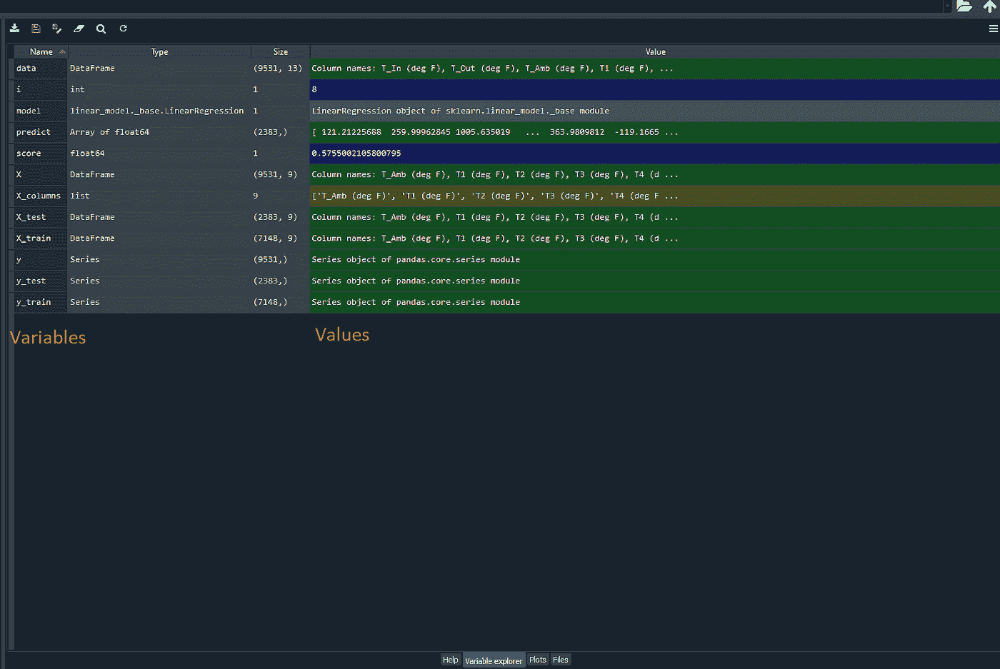

图片来源:作者

在编写代码时，我经常一次写一行脚本，并通过用已知的输入运行脚本来不断检查以确保新行正确工作。然后，我可以在变量浏览器中检查每个值，确保它们是正确的。

这里有一个(可能过于简单)的例子:如果我写一个脚本将三和七相加，我可以检查变量 Explorer 以确保结果是 10 而不是 9000。您还可以在一个窗口中打开 Pandas DataFrames，彻底研究它存储的每个值，并搜索可能出现的错误。

也许最好的 Spyder 功能是“调试”工具下拉窗口。

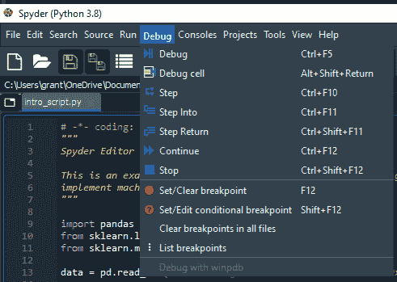

图片来源:作者

您可以看到我打开了调试窗口。该窗口包括强大的选项，如“设置/清除断点”和“单步执行”这两个命令提供了巨大的调试能力，因为您可以告诉脚本在运行时何时停止，何时前进。

Spyder 会在程序到达您添加的断点时暂停运行程序，并“单步执行”到下一个断点。这允许您一次遍历几行代码，这允许您在过程的不同状态下检查变量资源管理器，并帮助您找到出错的确切位置。

# Jupyter 笔记本

Jupyter Notebook 可能是基于 Python 的数据科学家最喜欢的 IDE，因为它的模块化性质(这使它感觉就像在笔记本上写东西)和它在笔记本本身中存储图形的能力。这些特性使 Jupyter Notebook 成为一个优秀的数据探索和交流结果的工具。

下图显示了我在 Jupyter 笔记本上创建的 Matplotlib 绘图教程的示例代码。

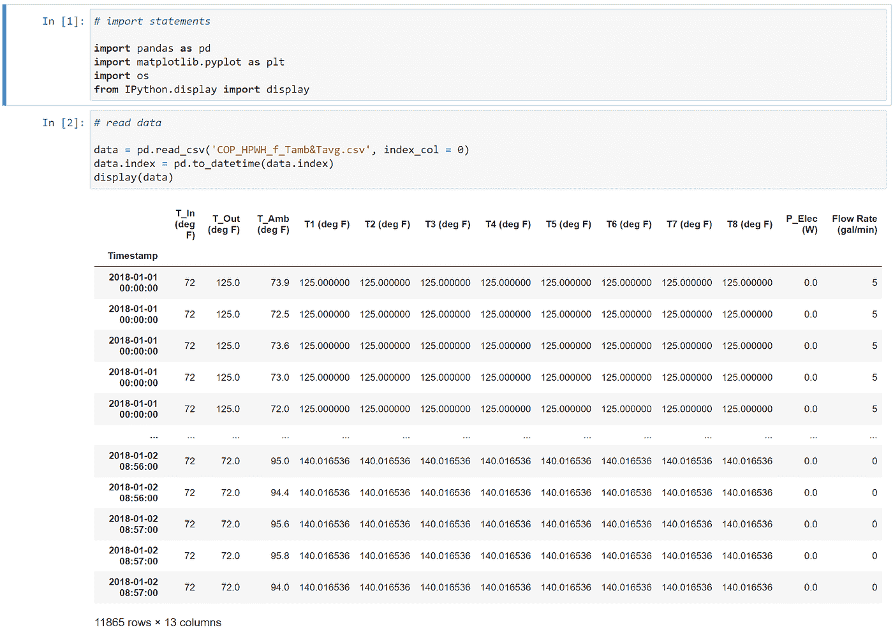

图片来源:作者

此图显示了两个输入单元和一个输出单元。您可以通过灰色背景和旁边的蓝色文本“In [x]”来识别输入单元格，其中 x 是输入单元格的编号。输出单元格以白色背景显示您指定的输出。

第一个输入单元包括几个导入语句，在包中读取(稍后会有更多内容！)是我后来在数据分析教程中用到的。该输入单元格之后没有输出单元格，因为我没有指定任何输出。

第二个输入单元格读入我在示例中使用的数据集，然后在输出单元格中显示数据帧。数据显示在输入下方的表中，使学习本教程的学生能够在学习本教程的其余部分之前探索这些数据。

能够一步一步地处理代码，并在进行过程中分享结果，这使得 Jupyter Notebook 成为一个优秀的对话和指导工具。您可以轻松地展示您的工作，因为每个输入单元格可能只有一两行代码，您将使用这些代码来生成下一个输出。这使得 Jupyter Notebook 成为一个很好的工具，向人们展示你为什么做出特定的决定和得出特定的结论。

Jupyter Notebook 也是一个优秀的教程工具，因为您可以一步一步地指导学生完成代码，并在进行过程中输出结果，这使他们更容易学习您试图用笔记本演示的技能。

为了强调这一点，这里有更多的图片来展示我如何在我的教程中使用这个功能。

首先，我向读者展示如何创建一个 Matplotlib subplot 对象，它有四行指定大小的绘图。为此，我在输入单元格中添加代码，使读者能够看到所需的输入，然后运行单元格，向他们显示结果图。这向读者展示了如何创建一个空白的情节，他们可以添加细节。

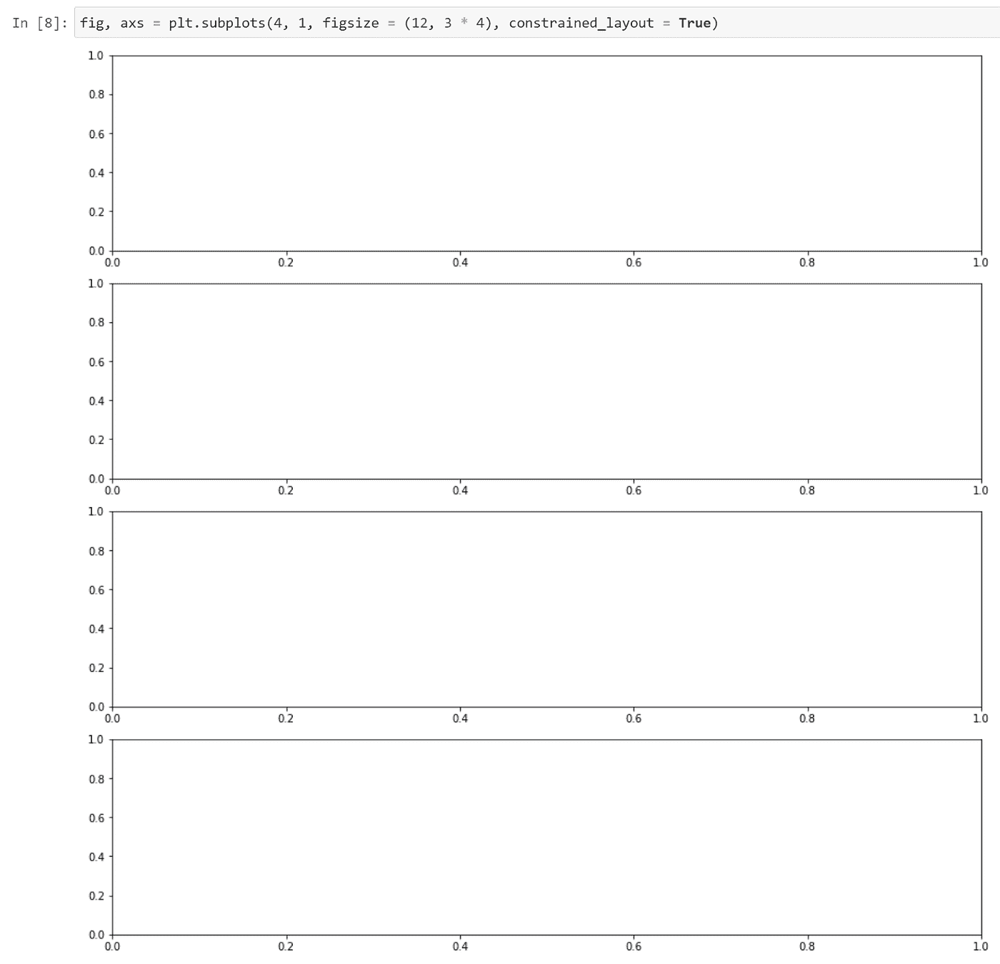

图片来源:作者

接下来，我将向他们展示如何创建一个字典来定义每个子情节中包含的数据集的列。该字典提供了数据集中的列和为图创建图例时使用的标签。我在一个没有输出的新单元格中创建字典，使学生能够吸收字典的创建，而不会被其他细节或附加代码淹没。注意，这个单元格没有输出，它只是保存字典供以后使用。

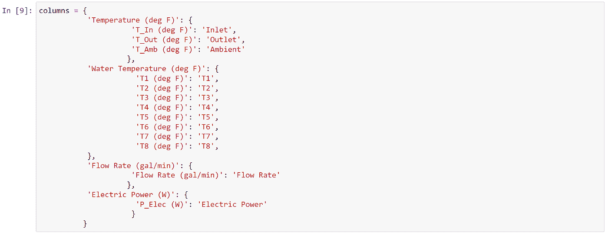

图片来源:作者

然后，我将向读者展示如何引用该字典向子情节添加数据。我添加了一个新的输入单元格:

1.)创建子情节数组

2.)遍历列字典中定义的每个图(例如“温度(华氏度)”或“水温(华氏度)”)

3.)遍历单个绘图中的每个数据系列(例如' T_In (deg F)'或' T_Out (deg F)')，以在指定绘图上绘制数据系列

4.)将绘图保存到. png 文件。

因为在我们创建它之后，这个图就被打印出来了，所以读者可以马上看到这个代码的结果，并且理解这个代码为什么会这样做。

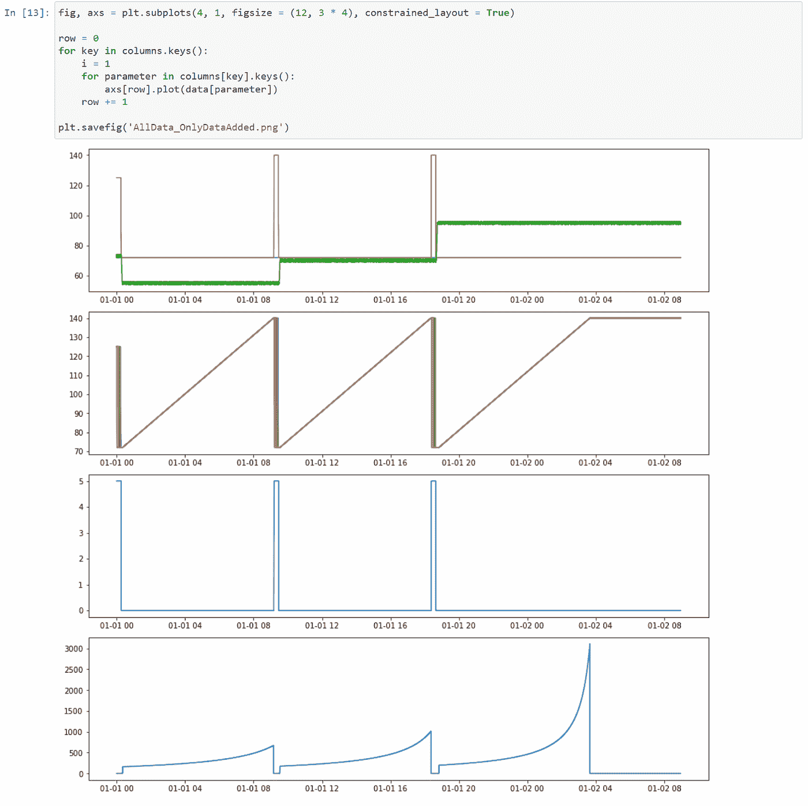

图片来源:作者

这种方法可以让你一步一步地学习教程，每次增加一个小动作，这样读者就可以很容易地掌握新技能。

例如，注意上面的图不包含任何标题、轴标签或图例。下一步我将演示下面的代码，它将这些元素添加到了绘图中。

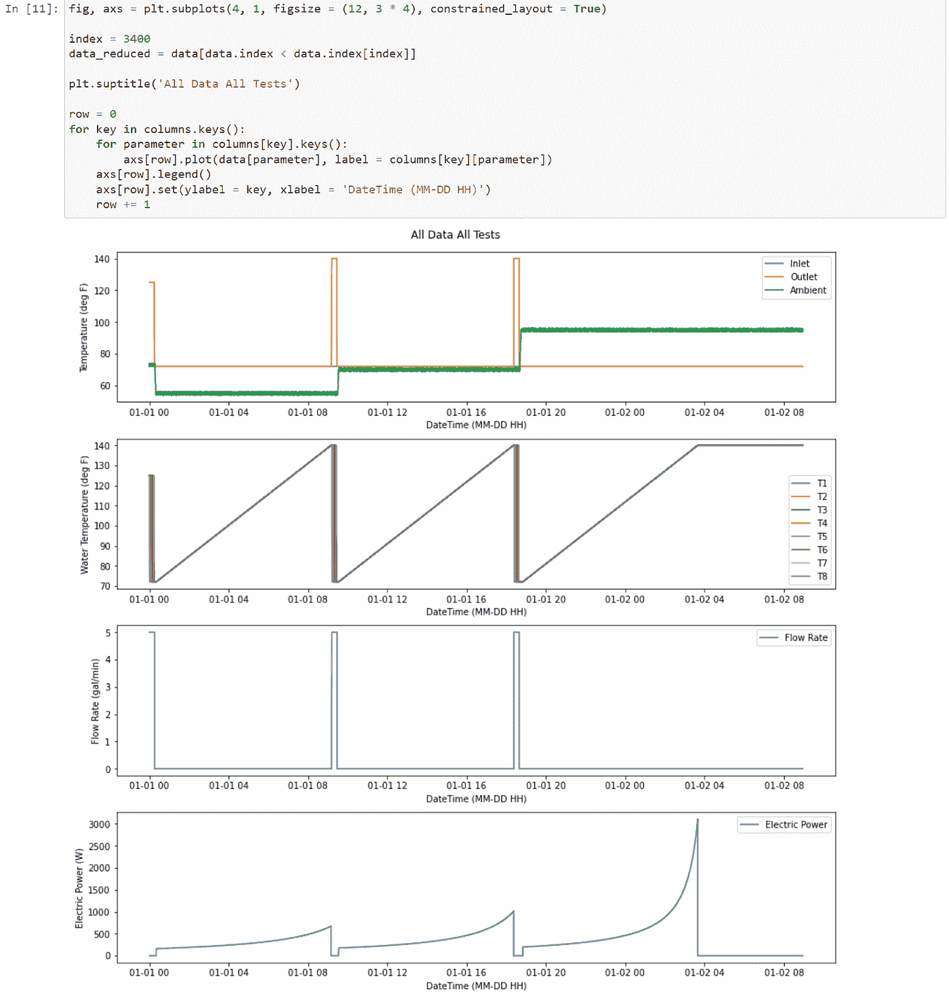

图片来源:作者

# 包管理器

包是 Python 如此强大的主要原因，Anaconda 提供了优秀的包管理器工具。Python 的主要优势之一是行业专家创造了有用的开源 Python 语言工具，如 [Matplotlib](https://builtin.com/data-science/matplotlib-python-tutorial) 、 [Scikit-learn](https://builtin.com/data-science/scikit-learn) 和 [TensorFlow](https://builtin.com/data-science/linear-regression-tensorflow) 。软件包管理器使您能够下载这些免费的软件包，将它们导入到您的环境中，并随意使用它们。

这是我的 Anaconda 包管理器的一个片段。

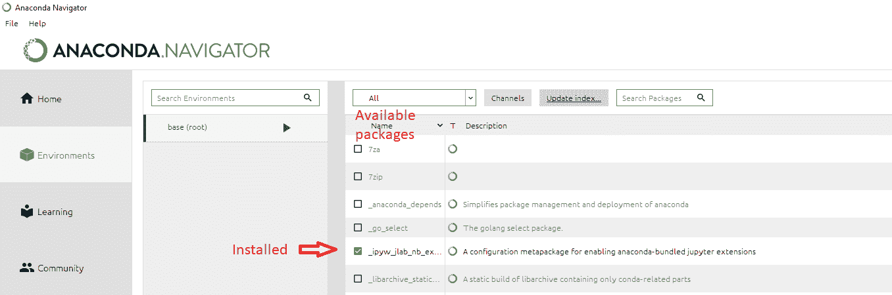

图片来源:作者

在主窗口中，您可以看到 Anaconda 的包管理器中可用的包列表。第五个包，标有绿色方框和白色勾号，是我的环境中安装的惟一一个包；其余的都是可以安装的包。

包管理器很有用，有几个原因。首先，它可以方便地访问几个不同的包。如果我想安装其他的，我只需点击复选框，点击右下角的“应用”按钮。

下图在安装 arviz 包的例子中突出了这个过程。因为安装新的包只需要这两步，所以包管理器使得在 Anaconda 中安装新的包变得非常简单。

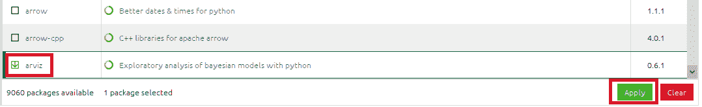

图片来源:作者

其次，包管理器为更新包提供了一个很好的界面。如果一个包有可用的更新，你可以右击复选框，标记为更新，然后点击应用按钮。下图显示了我标记我的熊猫包进行更新。

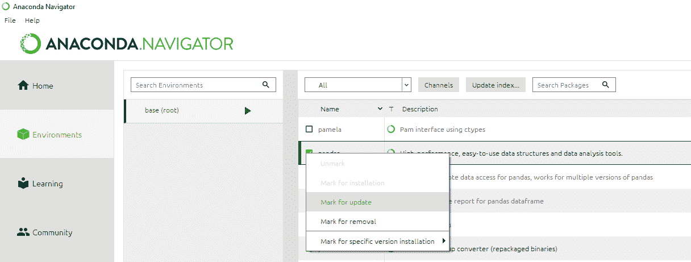

图片来源:作者

左上角标有“All”的下拉窗口甚至有一个“Updatable”选项，因此您甚至可以看到一个列表，其中只列出了准备更新的软件包。

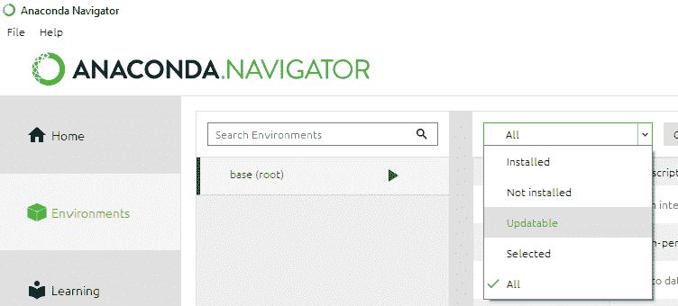

图片来源:作者

您还可以在主窗口的左侧看到一个较小的窗口，其中有文本“base”。此窗口提供了您储存在电脑上的不同环境的列表。这是一个很方便的特性，因为有时包只能与其他包的旧版本一起工作。因此，如果你更新所有的包，你可能会破坏你的代码，这将是糟糕的。

但是，假设有一个包，您需要完全更新才能与一个脚本中的包接口，并且还需要一个旧版本才能与另一个脚本中的不同包接口。通常这将是一个巨大的痛苦，但是对于不同的环境，这仅仅意味着你只在一个环境中更新软件包。您可以根据需要使用不同的环境来存储包的版本。

最后，并不是每个包都可以在 Anaconda 的包管理器中使用。有时包太新，或者太小众，不能进入 Anaconda 系统。那你是做什么的？

您仍然可以使用 pip 或 conda 命令安装它们。为此，单击“base”右侧的箭头，并选择打开一个终端窗口，如下图所示。如果这样做了，您将能够键入必要的命令来将软件包安装到基础环境中。如果你需要以这种方式安装一个软件包，在终端上输入的正确代码会写在网站上。例如，我刚刚在 conda-forge 上找到了一个用于[界面分子分析](https://anaconda.org/conda-forge/pytim)(不管那是什么)的包，你可以通过键入 conda install -c conda-forge pyti '来安装它。

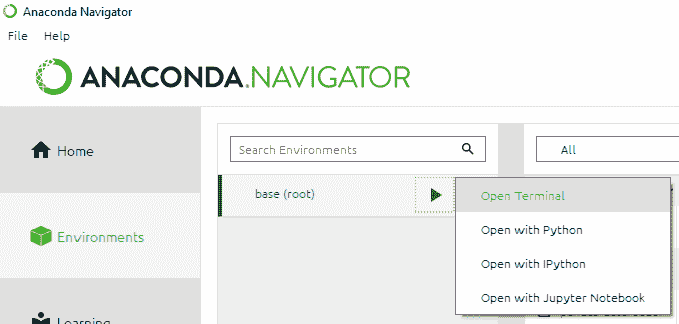

图片来源:作者

就是这样！现在，您知道了我为什么如此喜欢 Anaconda 发行版，如何安装 Python，最强大的 ide 的一些优点，以及如何确保您拥有用 Python 编程所需的包。

你喜欢这篇文章吗？你想得到更多这样的内容吗？考虑成为访问我所有教程的中级会员，使用[我的推荐链接](https://petergrant-81989.medium.com/membership)来支持我的工作。