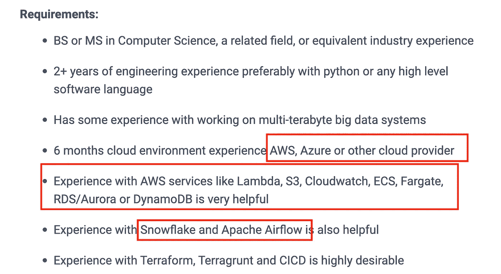

# 如何开始你的下一个数据工程项目

> 原文：<https://towardsdatascience.com/how-to-start-your-next-data-engineering-project-d34ac5aebdba>

## 使用什么工具和数据集

照片由[西格蒙德](https://unsplash.com/@sigmund?utm_source=medium&utm_medium=referral)在 [Unsplash](https://unsplash.com?utm_source=medium&utm_medium=referral) 上拍摄

许多刚刚起步的程序员都在为开始新的数据工程项目而奋斗。在我们最近在 YouTube 上的投票中，大多数观众承认他们甚至在开始一个数据工程项目时都有最大的困难。调查中最常见的原因是:

1.  为我的项目寻找合适的数据集
2.  你应该使用哪些工具？
3.  一旦有了数据，我该如何处理？

让我们从您可以使用的一系列工具开始，逐一讨论这些要点。

# 选择正确的工具和技能

对于这个项目的第一部分，我将从 [Thu Vu 的建议](https://www.youtube.com/watch?v=XYKuslcJp7A)开始一个数据分析项目。

为什么不看看猎头网站上的数据工程职位描述，弄清楚人们需要什么工具？没有比这更简单的了。我们从智能表数据工程中找到了一份工作描述。很容易看出他们正在寻找的确切工具和技能，并将它们与你能提供的技能相匹配。

下面是你想要包括的几个关键工具。

# 云平台

你的[数据工程项目](https://www.youtube.com/watch?v=385mKftVr3I&)首先需要的东西之一是像亚马逊网络服务(AWS)这样的云平台。我们一直建议新手程序员早点学习云平台。数据工程师的许多工作不再是在本地完成的。我们几乎所有的工作都在云中进行。

所以，选择一个你更喜欢的平台:谷歌云平台(GCP)，AWS，或者微软 Azure。从这三个平台中选择哪个平台并不重要；重要的是你从这三个中选择一个，因为人们知道如果你用过一个，你很可能会很容易地选择另一个。

# 工作流管理平台和数据存储分析系统

除了选择云提供商之外，您还需要选择一种工具来管理您的自动化工作流和管理数据本身。工作描述中提到了气流和雪花。

*   [**气流—** 选择像 MWAA 或 Cloud Composer 这样的云管理服务也是一个不错的主意](https://www.youtube.com/watch?v=eTtrsGc4Wd4)
*   [**雪花** —当然 BigQuery 也是一个不错的选择](https://seattledataguy.substack.com/p/snowflake-vs-bigquery-two-cloud-data?s=w)

无论如何想象，这些都不是唯一的选择。其他流行的编排选项有[*【Dagster】*](https://dagster.io/)*和 [*提督*](https://www.prefect.io/) 。我们实际上建议从*气流*开始，然后随着你对流程的熟悉，再看看其他的。*

*不要一开始就关心学习所有这些工具；保持简单。只关注一两个，因为这不是我们的主要关注点。*

# *挑选数据集*

*数据集有彩虹的每一种颜色。你的重点不应该是处理已经处理过的数据；您的注意力应该集中在开发数据管道和寻找原始数据源上。作为[数据工程师，](https://www.theseattledataguy.com/is-data-engineering-for-you-maybe-youre-a-recovering-data-scientist/)你需要知道如何建立一个数据管道，并从原始资源中提取你需要的数据。一些[原始数据集的重要来源](https://www.youtube.com/watch?v=LJkVvNWlO0g)是:*

*   *OpenSky :提供航班现在的位置和将要去的地方，以及更多更多的信息。*
*   *Spacetrack 是一个跟踪系统，它将跟踪、识别和编目所有围绕地球运行的人造卫星。*
*   *其他数据集:[纽约时报标注语料库](https://catalog.ldc.upenn.edu/LDC2008T19)，[国会图书馆数据集储存库](https://guides.loc.gov/datasets/repositories)，[美国政府数据集](https://data.gov/)，以及 Tableau 的这些[免费公共数据集](https://www.tableau.com/learn/articles/free-public-data-sets)。*

*提取数据需要做大量的工作，所以当您挑选数据集时，您可能会找到一个 API 来帮助您将数据提取到一个逗号分隔值(CSV)或 parquet 文件中，以便加载到您的数据仓库中。*

*现在你知道如何找到你的数据集并操作它们。那么，你如何处理这些原始数据呢？*

# *可视化您的数据*

*显示您的数据工程工作的一个简单方法是创建带有指标的仪表板。即使您将来不会构建太多的仪表板，您也会想要创建某种类型的最终项目。*

*仪表板是一种简单的方法。*

*这里有几个工具可供您参考:*

*   *[**画面**](https://www.tableau.com/)*
*   *[PowerBI](https://powerbi.microsoft.com/en-us/landing/free-account/?&ef_id=CjwKCAjwo8-SBhAlEiwAopc9W9kbHliQ_kOFZcScsos7JNyPDooe2wulwb1L__QfHuuPxgmkZbJKNBoCtboQAvD_BwE:G:s&OCID=AID2202141_SEM_CjwKCAjwo8-SBhAlEiwAopc9W9kbHliQ_kOFZcScsos7JNyPDooe2wulwb1L__QfHuuPxgmkZbJKNBoCtboQAvD_BwE:G:s&gclid=CjwKCAjwo8-SBhAlEiwAopc9W9kbHliQ_kOFZcScsos7JNyPDooe2wulwb1L__QfHuuPxgmkZbJKNBoCtboQAvD_BwE)*
*   *[**D3.js**](https://d3js.org/)*

*选择数据可视化工具后，您现在可以开始挑选一些想要跟踪的指标和问题。*

*也许你想知道一天有多少航班。在此基础上，您可能希望通过航班、时间或旅行的长度和距离来了解目的地。辨别一些基本指标，并编制一个图表。*

*任何像这样的基本问题都会帮助你轻松地解决“为什么”这个问题这个问题需要在你开始真正的项目之前回答。就当这是让血液流动的热身吧。*

*现在让我们来看一下你可以尝试的一些项目想法。*

# *3 数据工程项目:想法*

****开始数据工程项目示例*** :考虑使用类似 [Cloud Composer](https://cloud.google.com/composer) 或[Amazon Managed Workflows for Apache air flow(MWAA)](https://www.theseattledataguy.com/what-is-managed-workflows-for-apache-airflow-on-aws-and-why-companies-should-migrate-to-it/#page-content)的工具。这些工具可以让你避免从头开始设置*气流*，这让你有更多的时间来学习*气流*的功能，而不必费心去弄清楚如何设置它。从那里，使用一个 API 如 [PredictIt](https://www.predictit.org/) 抓取数据并以可扩展标记语言(XML)返回。*

*也许你正在寻找一天内交易大幅波动的数据。你可以创建一个模型，在这个模型中，你可以识别一天中的某些模式或波动。如果你创建了一个 Twitter 机器人，日复一日地发布这些波动，一些交易者肯定会看到你的帖子和数据的价值。*

*如果你想更新这个想法，可以找到与那个秋千相关的文章进行讨论，并把它们贴出来。这些数据有明确的价值，而且做起来很简单。你只是使用一个云合成器来接收数据，并将其存储在像 [BigQuery](https://cloud.google.com/bigquery) 或 *Snowflake* 这样的数据仓库中，创建一个 Twitter bot 来使用类似 Airflow 的东西向 Twitter 发布输出。*

*这是一个有趣而简单的项目，因为你不必重新发明轮子或投资时间来建立基础设施。*

****中间例子*** :这个[数据工程项目](https://www.startdataengineering.com/post/data-engineering-project-for-beginners-batch-edition/)是 Start Data Engineering(SDE)带给我们的。虽然他们似乎只是引用了一个关于电影评论的基本 CSV 文件，但更好的选择可能是去纽约时报开发者门户网站[并使用他们的 API 来拉直播电影评论。使用 SDE 的框架，并根据自己的需要进行定制。](https://developer.nytimes.com/)*

*SDE 在分解这个项目方面做得非常出色。它们确切地告诉你你需要什么工具，以及你的项目什么时候需要它们。它们列出了您需要的先决条件:*

*   *[码头工人](https://www.docker.com/)*
*   *[亚马逊网络服务(AWS)账户](http://aws.amazon.com/)*
*   *[气流](https://airflow.apache.org/)*

*在这个例子中，SDE 告诉你如何从头开始设置阿帕奇气流，而不是使用预设。您还将接触到以下工具:*

*   *[亚马逊 S3](https://aws.amazon.com/s3/)*
*   *[亚马逊红移](https://aws.amazon.com/redshift/)*
*   *[我是](https://theiam.org/)*

*有许多组成部分提供，所以当你在那里抓住潜在的未来雇主的注意，这个项目将帮助你详细说明雇主正在寻找的需求技能。*

****高级示例*** :对于我们的高级示例，我们将使用大多数开源工具。Sspaeti 的网站给了很多精彩项目的灵感。在这个项目中，他们使用了各种各样的开源工具，比如:*

*   *亚马逊 S3*
*   *[阿帕奇火花](https://spark.apache.org/)*
*   *[三角洲湖](https://delta.io/)*
*   *[阿帕奇德鲁伊](https://druid.apache.org/)*
*   *[达格斯特](https://dagster.io/)*

*在这个项目中，您将从实际的网站中收集房地产数据，因此这将是 API 和网站之间的联姻。您将从网站上搜集数据并清理 HTML。您将使用超集实现变更数据捕获(CDC)、数据科学和可视化。*

*这可以是一个基本框架，你可以从这个框架扩展你的想法。这些都是挑战，让你推动和延伸你自己和你的界限。但是，如果您决定构建它，只需选择一些工具并尝试一下。你的项目不必完全一样。*

# *现在轮到你了*

*如果你正在努力开始一个项目，希望我们已经启发了你，给了你迈出第一步的工具和方向。*

*不要让犹豫或缺乏明确的前提阻止你开始。第一步是承诺一个想法，然后毫不拖延地执行它，即使是像 Twitter 机器人一样简单的事情。那个 Twitter 机器人可能是更大更好的想法的灵感来源！*