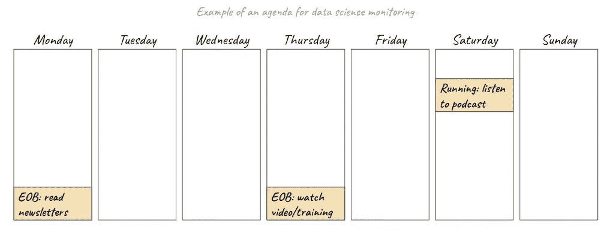
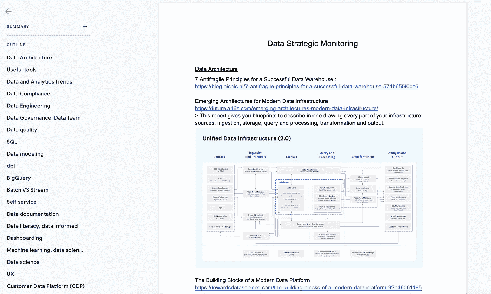

# 如何在数据领域保持最新

> 原文：<https://towardsdatascience.com/how-to-stay-up-to-date-in-the-field-of-data-1f108d123dfb>

## 数据新闻

## 一个 4 步方法和具体的例子来应用

Ethan Robertson 在 [Unsplash](https://unsplash.com/?utm_source=unsplash&utm_medium=referral&utm_content=creditCopyText) 上拍摄的照片

九月通常需要新的决心。暑假结束了，活动又开始了。**为什么不利用这段时间建立新的习惯——或者改善现有的习惯——跟上数据科学领域的最新发展呢？**

当我开始我的数据分析师职业生涯时，我并没有真正衡量那里可用的资源数量。我脑子里有我刚学过的课程，我可以在工作中运用我的知识。只是到了后来，我才意识到我可以自己学得更多，从别人那里得到一些帮助，并发现我从未听说过的新话题。免费的！在线！我很快意识到被内容的多样性淹没的风险。所以我开发了某种仪式来保持最新状态，而不用花无数时间阅读文章、听播客或观看与数据科学相关的视频。

在这篇文章中，我想分享一些我认为最有效的跟踪数据领域一切进展的最佳实践。从更个人的角度来说，我将详细介绍我的一些个人技巧，并举例说明如何将这些最佳实践应用到我自己的习惯中。

# 定义要寻找的内容

随着数据世界的不断扩大，可用在线资源的数量和种类呈指数级增长。大部分都是免费的；对于其他人来说，你应该看看投资回报(购买在线培训，成为时事通讯的付费订阅者……)是否值得。

你应该从定义**你最感兴趣的主题类型**开始。当然，保持开放的心态至关重要。但是缩小你的兴趣范围会让你避免浪费时间和精力去了解与自己不相关的话题。以下是数据科学广泛领域内的子领域列表:

*   数据工程
*   机器学习
*   编程(特别是用你最喜欢的语言)
*   数据分析
*   数据可视化
*   数据团队管理
*   …

# 知道去哪里找

一旦你对你想了解的话题有了一个更清晰的想法，是时候在网上寻找专门的资源了。保持最新状态的第一个方法是**订阅专门的时事通讯**。由于我目前对在一家公司建立数据最佳实践感兴趣，我特别欣赏[本的时事通讯](https://benn.substack.com/)。但是也有一些其他的时事通讯，像[现代数据栈的时事通讯](https://letters.moderndatastack.xyz/)和 [Blef 的数据新闻](https://www.blef.fr/tag/datanews/)。

另一种了解最新消息的方法是寻找数据公司的资源。显然，人们必须系统地记住，对公司自己的产品存在潜在的偏见。然而，我在 Airbyte 的博客[的“数据洞察”部分和 dbt 的](https://airbyte.com/blog)[分析工程综述](https://roundup.getdbt.com/)时事通讯中发现了一些非常好的内容。

了解更多数据新闻的第三种方式是**加入社区并与数据从业者联系**。无论是在 Medium 还是 LinkedIn 上，找到并关注分享数据内容的人。通过他们的帖子和文章，你将了解他们目前在思考什么，这可能会引导你进一步调查与你有共鸣的话题。您可以在[数据创作者俱乐部](https://datacreators.club/)中找到数据内容创作者的列表。就我个人而言，这是我与其他面临类似挑战的数据从业者联系的方式。

最后一些公司定期**组织** **活动**像 [dbt Coalesce](https://coalesce.getdbt.com/) 和[雪花峰会](https://www.snowflake.com/summit/)。无论你是否想要(也能够)亲自去参加这些活动，在那里发布的公告都会在网上发布。如果您想了解特定工具的工作原理，还可以找到一些网络研讨会和在线培训。例如，我最近参加了 [dbt 基础课程](https://courses.getdbt.com/courses/take/fundamentals/lessons/30210802-welcome)，学到了很多关于数据转换的知识——甚至超出了 dbt 提供的特定工具解决方案。

# 找时间

现在你已经找到了很好的资源来保持更新，你如何为他们奉献时间？乍一看，这似乎很费时间，而且不可能将这个 R&D 时间纳入正常的一天。谁说你必须阅读每一篇文章，听每一个播客？

有了这些内容，你就被宠坏了。选择读什么或听什么的第一个方法是简单地跟随你的直觉:**你今天最想了解什么？**这至少是我区分主题的优先顺序，因为我知道我最好记住的主题是那些直觉上引起我注意的主题。

记住这些预先选择的资源，**你如何将它们融入你的一天或一周？**对我来说，最有效的方法是在我的日历上每周至少留出一次时间进行数据科学监控。有时候这个时间段会被分成一周的几天，尤其是在工作日结束的时候，我没有精力做其他事情。这时我会阅读一些我收到的时事通讯。至于播客，我喜欢在坐火车旅行或跑步时听。

数据科学监控议程示例(图片由作者提供)

# 只保留必要的东西

阅读和聆听了这么多内容，你如何记住其中的基本要素呢？即使有最好的记忆能力，也很难记住你经历过的所有美好的事情。

在你阅读完与数据科学相关的内容后，**口头快速回顾一下**可以帮助“修正”你的想法。你可以和朋友谈论你刚刚读过的文章，或者告诉自己文章的要点。这就是我如何确保从一篇文章中保留一些具体的东西。否则很容易阅读，而且几乎会立刻忘记你刚刚读过的内容。

一个补充的方法是**把这些写下来**。我个人保存了一个谷歌文档文件，里面储存了所有最相关的链接、摘要和未来的想法。随着主题类别的出现，我将笔记分成常见的主题，如“数据架构”、“有用的工具”等。在一个专门的文件夹里，我会有这个文件和一些下载的内容(电子书、图表……)。

我的“数据战略监控”文件概述(图片由作者提供)

# 结论

通过定义一个用于数据监控的**框架**，我跟踪相关新闻变得更加容易。如果你不知道从哪里开始，这是我推荐的四步法:

1.  定义要寻找的内容
2.  知道去哪里找
3.  找时间
4.  只保留必要的东西

你还有其他小技巧可以分享吗？你是如何跟上数据新闻的？我希望听到其他人的习惯和建议，以便在数据科学领域保持最新！

你喜欢读这篇文章吗？ [*成为*](https://marie-lefevre.medium.com/membership) *的一员，加入一个不断成长的充满好奇心的社区吧！*

 [## 通过我的推荐链接加入媒体-玛丽·勒菲弗尔

### 阅读玛丽·勒费夫尔(以及媒体上成千上万的其他作家)的每一个故事。每月 5 美元(或每年 50 美元),直接向…

marie-lefevre.medium.com](https://marie-lefevre.medium.com/membership)