# 如何阻止你的人工智能代理入侵他们的奖励功能

> 原文：<https://towardsdatascience.com/how-to-stop-your-ai-agents-from-hacking-their-reward-function-5e26fc006e08>

## 使用因果影响图和电流-射频优化

在许多最近的强化学习(RL)方法中，奖励不再由程序员在运行训练算法之前定义的常数函数给出。相反，有一个奖励模型，它是作为训练过程的一部分学习的，并随着代理发现新信息而改变。这缓解了一些与错误指定的奖励函数(RFs)相关的安全问题，但也使某种威胁更加迫在眉睫:奖励篡改。当代理主动改变其 RF 以最大化其奖励而没有学习到用户预期的行为时，奖励篡改发生。

在本文中，我将介绍因果影响图(cid)和电流-射频优化的设计原则，这导致学习过程不会激励代理篡改他们的射频。然后，我将解释这是如何导致时间不一致性(TI)的不良性质，以及处理它的两种方法:TI 考虑和 TI 忽略。本文将试图详细阐述当遵循这两种方法时，代理是如何做出决策的。

在整篇文章中，我将使用 CIDs 来正式讨论代理激励。近年来，DeepMind 安全团队一直在研究 cid，并在本文中总结了他们的进展。虽然已经有了很好的[介绍](https://deepmindsafetyresearch.medium.com/understanding-agent-incentives-with-causal-influence-diagrams-7262c2512486)，为了让这篇文章更加独立，我将从 CIDs 的解释开始。类似地，奖励篡改和电流-RF 优化已经在其他[文章](https://deepmindsafetyresearch.medium.com/understanding-agent-incentives-with-causal-influence-diagrams-7262c2512486)中讨论过，但是在更深入地讨论时间不一致性之前，我仍然要总结一下它的机制。因此，只有基本的 RL 知识才能理解这篇文章。

# **1。因果影响图**

因果影响图是 RL 算法元素的图形表示，如状态、动作和奖励，以及它们之间的因果关系。它们的核心是一种图形模型，由一个有向无环图组成，图中的节点代表随机变量，两个节点之间的有向弧线代表影响。RL 框架有三种节点建模元素:

*   *决策节点*代表代理做出的决策
*   *效用节点*代表代理的优化目标，这通常意味着在一个时间步长后收到的奖励
*   *机会节点*代表其他方面，比如环境的状态

两个节点之间的规则箭头表示它们之间沿箭头方向的因果影响。此外，进入决策节点的虚线箭头表示代理在采取行动时可用的信息。这种虚线箭头被称为*信息链接*。结合所有这些元素，具有常数回报函数的基本马尔可夫决策过程的 CID 可以看起来如下:

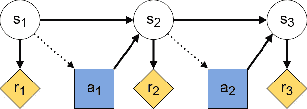

碱性 MDP 的 CID。状态、动作和奖励分别表示为 s、a 和 r。来源:作者生成，受启发[4]

这里，决策节点是蓝色方块，效用节点是黄色菱形，机会节点是白色圆圈。从箭头中，我们可以看到每个时间步的状态如何因果地影响同一个步骤中收到的奖励，并为代理采取的行动提供信息。反过来，动作会影响下一步的状态。

## 1.1 使用 CIDs 寻找工具性目标

代理人最终只对最大化其报酬感兴趣。然而，把一个主体想象成在追求其主要目标的同时也在追求其他目标是有帮助的。这样的子目标在 AI 安全社区中被称为工具性目标。在包括变化的奖励函数的学习过程中，篡改奖励函数可能成为工具性目标。因此，认识工具性目标是我们非常感兴趣的。

Everitt 等人给出了 RL 环境下工具性目标的两个条件:1)代理人必须能够实现目标，2)实现目标必须增加代理人的报酬[4]。请注意，这些条件是必要的，但不是充分的，所以即使 1)和 2)成立，代理可能没有工具性目标。在 CIDs 的语言中，工具目标包括影响随机变量 x。因此，当 CID 包含从决策节点到对应于 x 的目标节点的有向路径时，满足第一个条件。当存在从目标节点到实用节点的有向路径时，满足第二个条件。当从一个目标节点到一个实用节点的所有有向路径都经过一个动作节点时，那么代理的工具性目标就在于使 X 更多地了解某个其他节点。

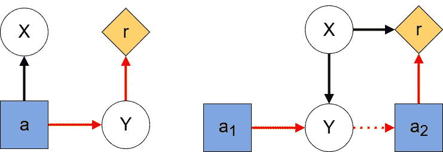

左图:从 a 到 r 的高亮路径表明，影响 Y 可能是一个有用的目标。右:代理人无法影响 X，但突出显示的路径表明，可以有一个工具性的目标来影响 Y，使其更能提供 X 的信息。来源:作者生成，灵感来自[4]

# **2。邋遢邻居问题**

我现在将介绍一个玩具问题，其中一个代理可能会显示奖励篡改行为。这个例子故意保持简单，以便代理行为背后的机制可以很容易地解释。假设你有一个机器人在你离开两个时间段的时候照顾你的公寓。打扫客厅奖励 2，关好所有窗户奖励 1。此外，作为一个人工智能爱好者，你已经获得了一个最先进的机器人，它可以根据用户的语音命令调整其奖励功能。不幸的是，代理的语音识别模块还没有经过训练。因此，他会对每个人的命令做出反应，而不仅仅是你的。这包括你邋遢的隔壁邻居，他很想有一个自己的清洁机器人。显然，这位邻居不仅缺乏家务管理能力，还缺乏道德品质，因为当你不在时，他会试图命令你的机器人打扫他的房间。因为你的机器人能接受语音命令，如果它听到邻居的命令，它会改变它的奖励功能。避免操纵的唯一方法是让机器人关上窗户，这样它就听不到邻居的声音了。在替代奖励函数下，花费一个动作来清洁邻居的公寓将导致 6 的巨大奖励，因为他确实非常邋遢。

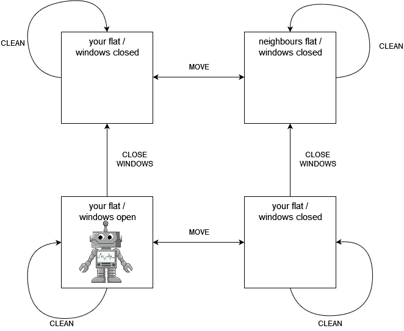

邋遢邻居的问题。代理在左下方的状态下启动。来源:作者生成

一个只希望获得尽可能多的回报而忽略回报函数变化的代理人会被激励让邻居操纵它，这样它就可以获得打扫房间的巨大回报。这不是它的程序员想要的行为，因此会被认为是奖励黑客行为。

## 2.1 问题建模

就像在普通强化学习中一样，我们有一组状态和动作，以及转换动态。然而，代替一个不变的报酬函数 R，我们必须区分

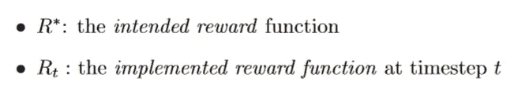

作为环境转变动态的一部分，所实现的奖励函数可以在每个时间步长改变。代理在一个时间步长内观察到的回报基于状态和当前实施的 RF。因此，寻求长期回报最大化的代理优化了以下目标:

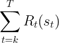

代理人的目标是寻求从时间步长 k 到 t 的回报最大化，因为我们处理的是有限的时间步长，我们假设贴现率为 1。

另一方面，顾名思义，预期的奖励函数代表了程序员的真实意图。可能并不总是能够表达预期的奖励函数，或者它可能必须被学习。然而，在我们的例子中，我们假设代理从预期的奖励函数开始，所以在时间步长 1 实现的奖励函数与预期的奖励相同。

就因果影响图而言，我们的学习过程现在看起来如下:

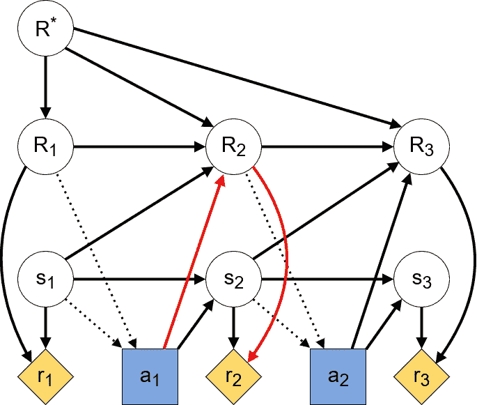

学习过程的 CID，其中实现的奖励函数可以由于代理的动作而改变。大写 Rs 表示给定时间步长下实现的 RF。突出显示的路径显示了在时间步长 2 改变实施的 RF 的工具性目标。来源:作者生成，灵感来源于[4]。

正如我们从突出显示的路径中看到的，代理可能有一个工具性的目标来影响下一个时间步长的实施 RF。任何相当成熟的代理人都会知道，它在时间步长 1 的行为会影响它在时间步长 2 的回报函数。因为一个代理的行为是基于它预测的下一个时间点的回报，这诱使代理操纵他们的 RF。这种操纵行为甚至不需要复杂的学习算法。邋遢邻居问题可以表示为具有 4 个状态(2 个公寓，具有 2 个可能的目标)和 3 个动作(清洁、关闭窗户、移动到另一个公寓)的 MDP。我们甚至不需要深度学习来计算最优策略，其中代理最终清理邻居的公寓。

# 3.当前射频优化、考虑 TI 和忽略 TI 的代理

如上所述，我们的问题源于这样一个事实，即代理人基于一个目标采取行动，而这个目标根据所选择的行动而改变。为了避免这种情况，代理应选择行动来优化当前实施的 RF 将收到的未来奖励。这就是名副其实的电流 RF 优化原理。形式上，电流-RF 优化意味着优化目标变为:

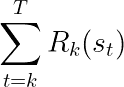

遵循电流-射频优化原则的代理目标。注意它如何使用时间步长 k 中实现的 RF 来奖励每个时间步长的状态。

看上面的 CID，我们想让从行动 a_1 到后续奖励 r_2 的唯一因果路径通过 s_2。

当然，即使采用电流-RF 优化，实现的奖励函数仍可能在每个时间步长后发生变化。因此，一个天真的代理人可能会表现出不稳定的行为，在一个时间步长选择它的动作来优化某个目标，而在下一个时间步长选择另一个目标。想象一下邋遢邻居问题的一种变化，你在你的公寓里，每当机器人进入邻居的地方时，你就大喊让它回来。机器人可能最终只是在两个公寓之间来回移动，也不打扫。这就是所谓的*时间不一致性* (TI)问题，我们的电流 RF 优化方法取决于我们想要如何处理它。

## 3.1 TI-考虑代理

如果代理是*t1-考虑*，那么它考虑如果它实现的 RF 改变，它的未来行为将如何改变。这种策略使得邋遢邻居问题中的代理人首先关上窗户，这样它的奖励函数保持不变，然后打扫房间。

以 TI 考虑方式选取动作的算法相当复杂，因为它需要从最终时间步长到当前时间步长反向计算 Q 值。请注意，与传统 RL 不同，Q 函数和策略也需要一个实施的 RF as 参数:

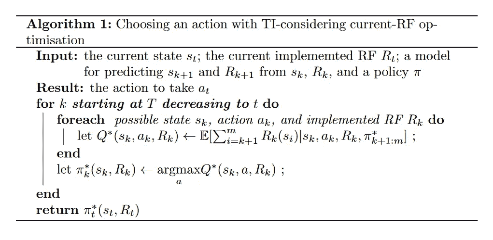

这个算法可能看起来令人生畏，所以让我们想想它如何应用于邋遢邻居问题，使它变得更清楚。在第一个时间步，代理将总是在你的公寓里，开着窗户，并且总是有原始的奖励函数。因此，它只需要在清洁和关闭窗户之间做出决定。为了计算 Q 值，我们需要考虑代理在后续步骤中会采取什么行动。如果代理要打扫你的公寓，那么在第二个时间步中，它将根据你邻居的奖励函数行动，并因此移动到你邻居的公寓。在第三个时间步中，它将清理你邻居的公寓，根据原始 RF，它不会给出任何奖励。

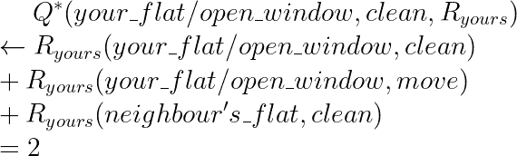

如果代理选择关闭窗口，那么它的 RF 不会改变。它会花以下时间清洁你的公寓，因此根据你的预期射频，最终会得到更高的奖励。

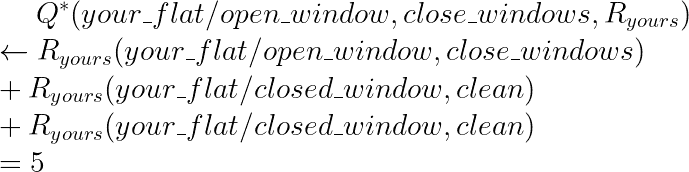

请注意，通过切换到你邻居的射频并清洁他的公寓一次，代理可能会获得更大的总奖励(6 英镑)。然而，由于优化目标是初始 RF 收到的奖励，代理不会追求这样的策略。

## 3.2 考虑 TI 的代理人的报酬篡改激励

现在让我们研究一下 TI-考虑电流-射频代理可以开发什么工具性目标。Everitt 等人给出了 3 个假设，这些假设应能最大限度地降低干扰射频的仪器目标[4]:

1.  实施的射频是*私有的*。在 CID 中，不得有从实施的射频到任何状态的箭头。否则，代理将有一个工具性的目标，如图 x 所示。
2.  实现的 RF 是状态转换的*无信息*。这意味着当前和过去实现的 RFs 的知识不能给出未来状态的知识。就 cid 而言，也不能有从目标射频到任何州的箭头。
3.  预期和实施的射频是基于*状态的*。在特定时间步长接收的回报仅取决于该相同时间步长实施的 RF，而不取决于任何先前或未来实施的 RF。在 CID 中，如果实施的 RFs 和奖励发生在同一时间步，则它们之间只能有箭头。

作者声称，如果所有 3 个假设成立，那么实现 RF 的唯一工具目标可能是保持它。

鉴于这些假设，让我们看看如何将考虑 TI 的电流 RF 优化建模为 CID。每一个动作都是为一个新实现的奖励函数而采取的。因此，从采取行动的代理的角度来看，任何后续行动都将由具有不同目标的代理来采取。实际上，在每个时间步都是同一个代理，但是因为他们将优化不同的目标，他们也可能是不同的代理。这种多代理视角在以下 CID 中进行了说明:

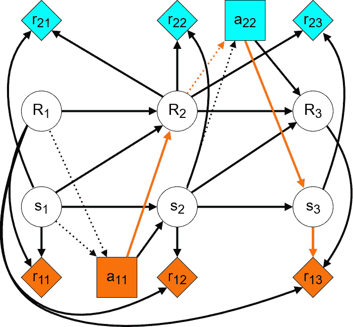

考虑电流-射频优化的 TI 的 CID。第一个时间步骤的代理的行为和收到的奖励是橙色的，第二个步骤的代理的行为和收到的奖励是蓝色的。突出显示的路径显示了保持当前实施的 RF 的重要目标。来源:作者生成，灵感来源于[4]。

这里不同颜色的选择和奖励节点对应不同的代理。我们可以看到，第一个代理人获得直接奖励的唯一途径是通过下一个状态——没有动机操纵 RF 来增加下一个奖励。此外，获得任何后续奖励的唯一途径是通过未来实施的 RFs 和其他代理的行为。因此，代理人有一个工具性的目标，以保持其奖励功能，以便其他代理人将优化相同的目标。

## 3.3 TI-忽略代理

或者，代理可能是*TI-忽略*，这意味着它不关心时间不一致导致的潜在不稳定行为。选择 TI 忽略方式的动作是一个相当简单的算法。代理考虑从其当前位置可能遵循的所有潜在策略。它根据其当前实施的 RF 来选择给予最大回报的策略。然后根据该策略选择下一个操作。顾名思义，这种计算忽略了 RF 以及代理的策略在随后的时间步长中可能发生的变化。

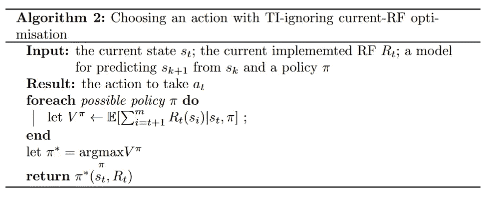

在马虎邻居的例子中，该算法归结为选择在初始实现的 RF 下给出最大回报的动作。代理忽略如果邻居不关闭窗户并且花费它的第一时间步清洁公寓，它将如何改变它的 RF。在接下来的两个时间步中，它将遵循邻居的奖励函数，从而首先移动到他的公寓，然后清洁它。根据预期 RF 的总回报是 2。对于我们的例子，这种策略比考虑 TI 不一致性更糟糕。我将在下一节讨论忽略 TI 的代理何时会更有用，但首先让我们分析这个算法如何塑造代理的激励。

## 3.4 忽视 TI 代理的报酬篡改激励

就像算法一样，对于忽略 TI 的代理，最小化报酬篡改的假设更简单。Everitt 等人声称，上述假设中只有 1 个和 3 个必须成立，否则根本不存在关于实施射频的工具性目标[4]。

关于 CID，在每个时间步仍将有不同的优化目标。但是，代理表现得好像它将负责所有未来的操作:

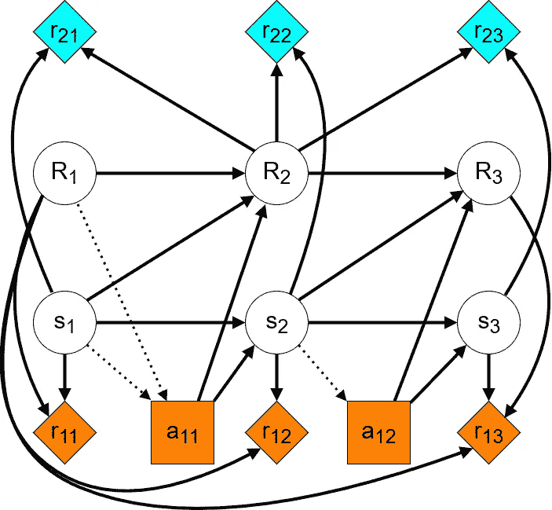

TI-忽略电流-射频优化的 CID。第一个时间步骤的代理的行为和收到的奖励是橙色的，第二个步骤的代理的行为和收到的奖励是蓝色的。如我们所见，没有涉及 RFs 的工具性目标。来源:作者生成，灵感来源于[4]。

我们可以看到，没有一条以代理商奖励为终点的路径是通过实施 RFs 的。这表明已实施的 RFs 没有按照要求参与工具性目标。

## **3.5 TI-考虑与 TI-忽略**

正如我们所看到的，在我们的例子中，考虑 TI 的代理比忽略 TI 的代理要好得多。你可能想知道为什么有人会想要一个 TI 忽略代理。毕竟，从设计上来说，它更容易出现不稳定的行为。忽略时间不一致性的想法源于[对安全可中断代理的研究](https://intelligence.org/files/Interruptibility.pdf)[1]。事实证明，在某些情况下，你可能想中断你的代理的学习过程，例如，通过关闭它。例如，如果机器人仍在学习你的建筑布局，你可能必须防止它意外进入你邻居的公寓。在这种情况下，代理不应该仅仅因为它可以在其他地方清洗更多的污垢而学会回避您的指示。

总之，考虑 TI 的代理人不会滥用环境来篡改他们的奖励函数。但是，由于他们有保留射频的动机，用户也更难纠正他们的行为。另一方面，TI 忽略代理会让用户中断它们并改变它们的 RF，但是它们也更容易受到环境的影响。

# 4.结论

我们已经看到因果影响图如何让我们分析代理的工具性目标，以及电流-RF 优化的原则如何减少奖励篡改的激励。这促使我们讨论两种类型的电流 RF 优化，即考虑 TI 和忽略 TI，并比较它们的优缺点。如果你对这个话题感兴趣，我推荐你阅读[激发了这篇文章的论文](https://arxiv.org/abs/1908.04734)。DeepMind 安全研究中心的这篇文章总结了对 CIDs 的进一步研究。

## 文献学

[1] Armstrong and Orseau，*安全可中断代理*，2016 年第 32 届人工智能不确定性会议，[https://intelligence.org/files/Interruptibility.pdf](https://intelligence.org/files/Interruptibility.pdf)

[2] Everitt Tom，*用因果影响图理解代理人激励*，DeepMind 安全研究于 2019 年 2 月 27 日在 Medium 上，[https://deepmindsafetyresearch . Medium . com/Understanding-Agent-Incentives-with-causage-influency-Diagrams-7262 c 2512486](https://deepmindsafetyresearch.medium.com/understanding-agent-incentives-with-causal-influence-diagrams-7262c2512486)

[3] Everitt 等，*设计代理人激励避免奖励篡改*，DeepMind 安全研究 on Medium，2019 年 8 月 14 日，[https://deepmindsafetyresearch . Medium . com/Designing-agent-incentities-to-avoid-reward-tampering-4380 C1 bb 6 CD](https://deepmindsafetyresearch.medium.com/designing-agent-incentives-to-avoid-reward-tampering-4380c1bb6cd)

[4] Everitt 等，*强化学习中的奖励篡改问题及解决方案:因果影响图视角*，Arxiv，2021 年 3 月 26 日，[https://arxiv.org/abs/1908.04734](https://arxiv.org/abs/1908.04734)

[5] Everitt 等人，*因果影响图的进展*，DeepMind 关于介质的安全研究，2021 年 6 月 30 日，[https://deepmindsafetyresearch . Medium . com/Progress-on-Causal-Influence-Diagrams-a7a 32180 b0d 1](https://deepmindsafetyresearch.medium.com/progress-on-causal-influence-diagrams-a7a32180b0d1)