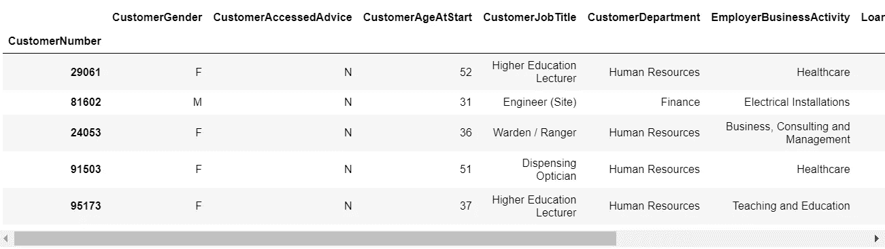
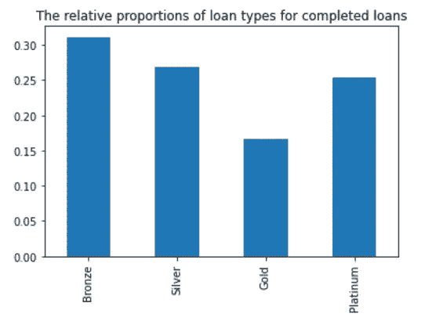
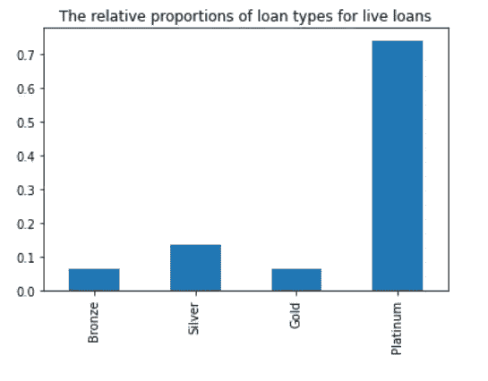
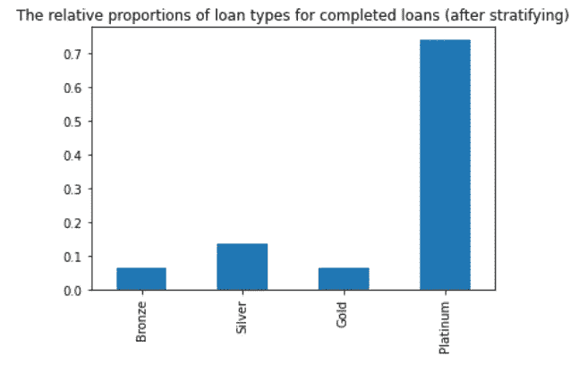
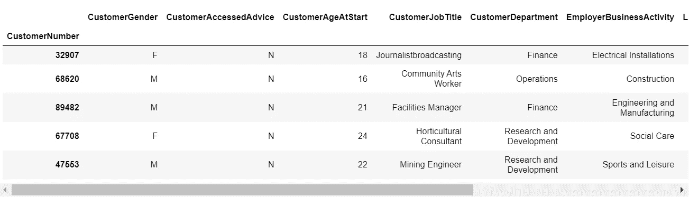
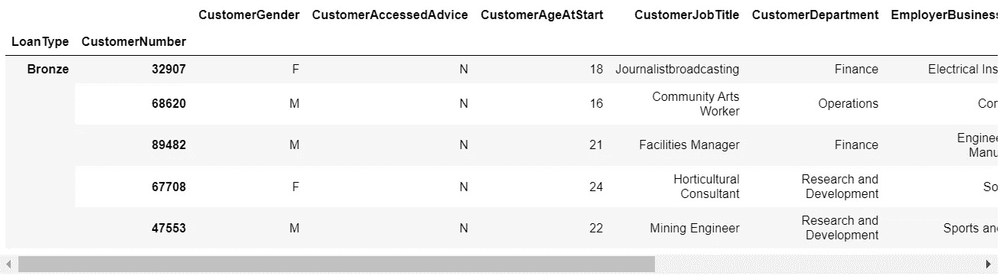
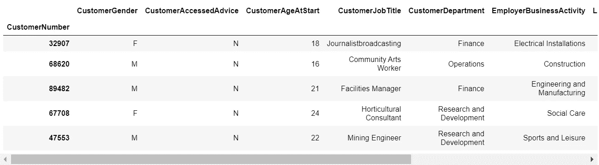
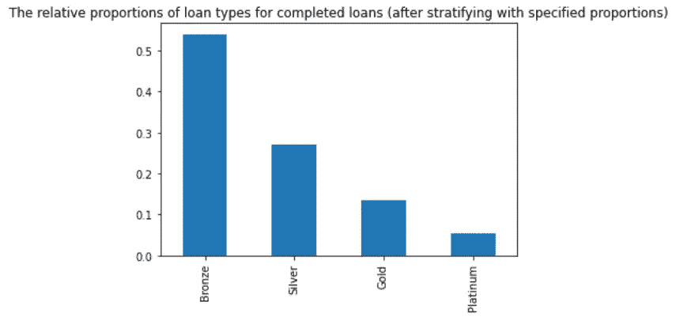

# 如何对机器学习项目中的数据进行分层，以显著提高模型性能

> 原文：<https://towardsdatascience.com/how-to-stratify-data-in-machine-learning-projects-to-significantly-improve-model-performance-4929b600340b>

## 如何以及何时对机器学习项目中的数据进行分层，以确保仅使用 7 行 Python 代码就能做出准确且有意义的预测


照片由[金刚砂木火子](https://unsplash.com/@muhozi?utm_source=unsplash&utm_medium=referral&utm_content=creditCopyText)在 [Unsplash](https://unsplash.com/s/photos/rock?utm_source=unsplash&utm_medium=referral&utm_content=creditCopyText) 上拍摄

## 背景

我最近参与了一个真实世界的机器学习项目，该项目最初产生了一组预测，但这些预测被领域专家拒绝，因为他们无法接受未来会以模型预测的方式出现。

问题的原因围绕着数据所代表的业务方面随时间变化的性质，即未来不会像过去一样。

这可能意味着机器学习模型可能不够准确，没有意义，但最终通过对数据进行分层找到了解决方案，这促使我写了这篇文章来分享该解决方案，以便其他遇到类似问题的数据科学家可以使用它。

## 入门指南

我们首先需要的是一些数据。项目中使用的真实数据不能共享，所以我使用 Faker 库从头开始创建了一个虚拟数据集。这意味着**对数据没有许可限制，数据可以用于或重新用于学习和开发目的**。

  

让我们从导入我们需要的库开始，然后读入虚构的数据集…



作者图片

`CompletedCustomerLoans.xlsx`表示虚拟贷款已经以存储在`LoanStatus`目标特征中的两种状态或分类之一完成。“已偿还”贷款已成功完成并由客户偿还，而“违约”贷款未偿还且未成功完成。

`LiveCustomerLoans.xlsx`有完全相同的格式，但没有`LoanStatus`，因为它们仍在运行，尚未完成，无论成功与否。

## 理解问题

机器学习的一个很好的用途是在已完成的贷款上训练一个模型，该模型可以预测当前贷款的未来贷款状态。

然而，我们需要两样东西来让一个模型以这种方式工作-

*   一组可靠、准确和一致的历史数据
*   未来会以与过去相似的方式发展

第二个因素是我们在这个数据集上有一些问题。此数据中的一个重要因素是`LoanType`，它可以是青铜、白银、黄金或白金。

贷款构成随时间变化的方式可以想象如下-



作者图片



作者图片

这些图表突出了这个问题。历史/已完成贷款有大量的青铜、白银和黄金贷款，但活贷款/未完成贷款没有。看起来我们的虚构贷款业务正在将所有未来客户转换为白金贷款，并停止其他贷款类型。

如果不同类型的贷款在偿还和违约方面的表现不同，那么机器学习模型将产生扭曲的预测。

如果遇到这种情况，您可能需要根据实时数据中的比例对训练数据进行分层，以提高预测的准确性。

本文的剩余部分将展示如何用不到 5 行的 Python 代码来实现这一点…

## 实现解决方案(前 5 行代码)

基于在另一个数据集中发现的任何要素组合的比例对一个数据集进行分层的可重用函数可按如下方式实现



作者图片



作者图片

## 了解解决方案

`stratify`函数只用了 3 行代码就实现了它的目的，这是 Pythonic 式的方法，但是减少代码行数会降低可读性，所以让我们把它拆开来看看到底发生了什么...

这是第一行代码…

`stratify_cols`包含用于构建权重的数据字段列表。

这行代码的返回类型是 Pandas 系列，其中 index 包含在人口数据中找到的值的范围，value 包含找到该值的行的百分比。

`normalize=True`告诉`value_counts`返回百分比而不是实际计数。然后将这些值乘以在样本数据中找到的记录总数(`sample.shape[0]`)，得到样本数据集中所需的记录数，以反映在总体中找到的比例。

```
<class 'pandas.core.series.Series'>
MultiIndex([('Platinum',),
            (  'Silver',),
            (  'Bronze',),
            (    'Gold',)],
           names=['LoanType'])LoanType
Platinum    2032
Silver       367
Bronze       170
Gold         170
dtype: int32
```

下面是下一行代码。它做了很多事情，我将分阶段解释…

让我们从头开始。`sample.groupby(stratify_cols)`返回一个`DataFrameGroupBy`对象，为在`stratify_cols`中找到的每个唯一组合分组。这可以想象如下...

```
Bronze
Gold
Platinum
Silver
```

`group.sample(n=weights[group.name])`然后使用组名索引权重系列，并提取要采样的记录数...

```
170
```

最后一部分只是承认样本数据中可能有在总体数据中找不到的值，所以内联`if`语句只对任何符合该条件的数据进行零行采样

```
group.sample(n=weights[group.name] if group.name in weights else 0
```

样本中的参数`replace=True`将每个采样行放回数据中，以便在必要时可以重新采样，并且`random_state`被设置为支持可再现的结果。

最后，lambda 函数的魔力意味着为每个组返回的样本被连接在一起，产生一个单独的`DataFrame`。

为了解释第三行也是最后一行代码，让我们快速看一下`df_return`



作者图片

这看起来不太对。Pandas 已经返回了一个`MultiIndex`，这需要看起来像在原始数据中找到的简单索引，而不丢失索引值。

这需要进行大量的研究和文档阅读，但事实证明，通过删除与最初用于构建索引的特性相关的多部分，可以将索引恢复到原始格式



作者图片

# 最后的改进(总共 7 行代码)

现在我们有了一个函数，可以通过在另一个数据集中找到的比例对任何数据集进行分层，但是如果我们只知道所需的比例，但没有人口数据集，那该怎么办呢？

这可以通过在`build_weights`函数中增加一行代码和对`stratify`做一点小小的修改来实现，以接受`weights`作为可选参数。

请注意，如果`values`的列表代表行数，则`sample_size`被设置为`0`。如果`values`包含一组加起来等于`1`的浮点数(即百分比)，则`sample_size`包含要乘以百分比进行采样的记录数。

`build_weights`中的一行代码相当简单明了。它使用内联的`if`语句为`data`和`index`参数传递适当的值。为了找到如何为不止一个层次的实例构造一个`MultiIndex`,但是完成的代码非常干净，确实花费了相当多的研究...

```
Bronze      1000
Silver       500
Gold         250
Platinum     100
dtype: int64
```

或者…

```
Bronze      1000
Silver       500
Gold         250
Platinum     100
dtype: int64
```



作者图片

## 结论

在本文中，对数据进行分层可以显著提高机器学习模型的性能。这已经通过引用真实世界的项目来呈现，然后使用虚构和合成的数据来演示。

仅用 3 行 Python 代码就开发了一个简单的函数，该函数可以根据在另一个数据集中发现的比例对任何数据集进行分层，从而为符合所述条件的建模准备数据。

最后，还提供了一个额外的函数，该函数可以构建权重并将其传递给执行分层的函数，以满足数据科学家知道比例应该是多少，但无法访问包含正确比例的数据集的情况。

## 感谢您的阅读！

如果你喜欢读这篇文章，为什么不看看我在 https://grahamharrison-86487.medium.com/的其他文章呢？此外，我很乐意听到您对这篇文章、我的任何其他文章或任何与数据科学和数据分析相关的内容的看法。

如果你想联系我讨论这些话题，请在 LinkedIn 上找我—【https://www.linkedin.com/in/grahamharrison1 或者发电子邮件到[ghar rison @ Lincoln college . AC . uk](mailto:GHarrison@lincolncollege.ac.uk)。

如果你想通过订阅来支持作者和全世界 1000 个为文章写作做出贡献的人，请使用下面的链接(注意:如果你使用这个链接免费注册，作者将收到一定比例的费用)。

<https://grahamharrison-86487.medium.com/membership> 