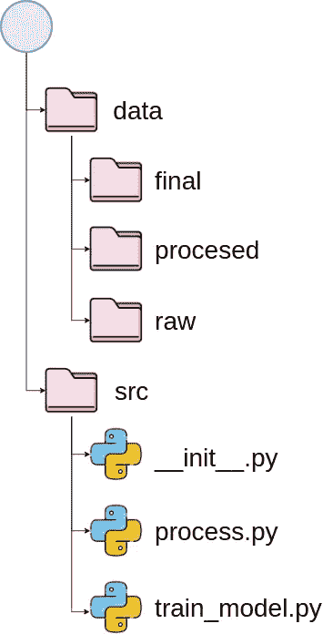
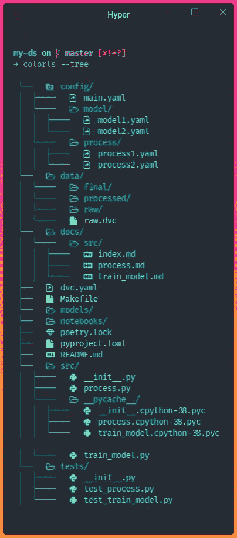
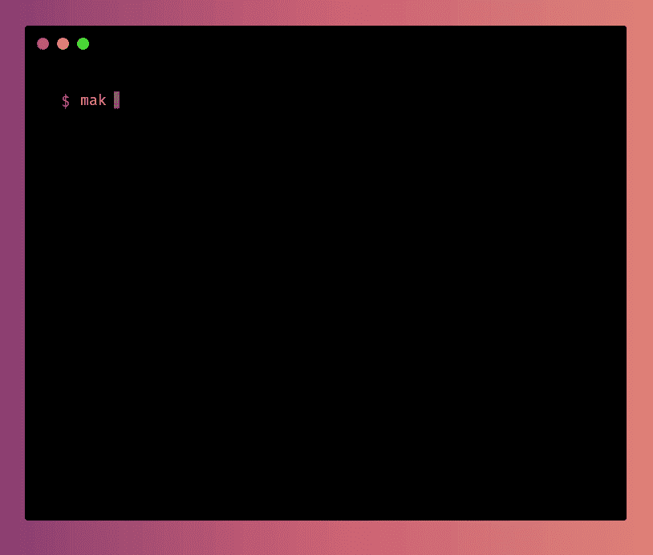
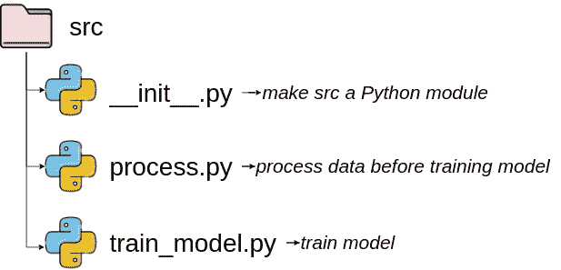
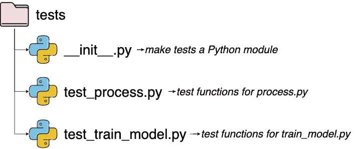
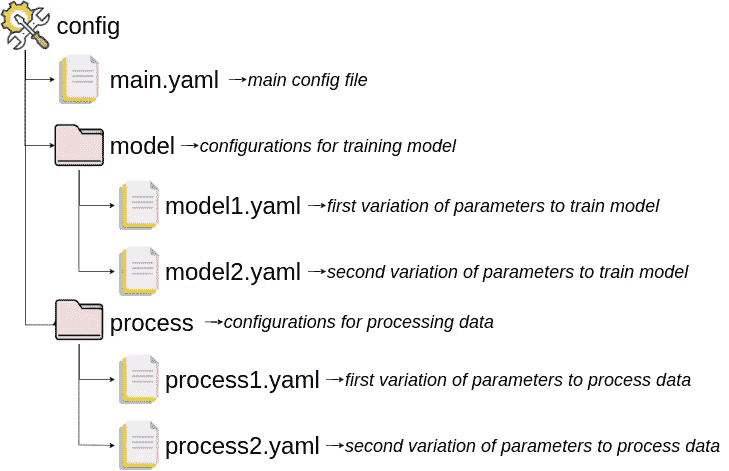
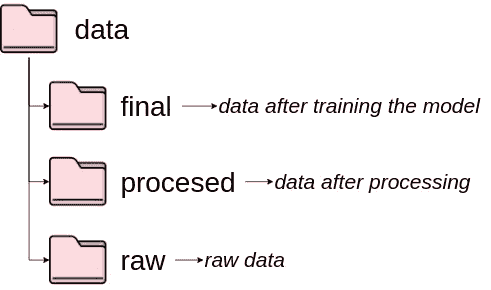
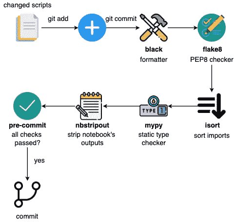

# 如何构建可读性和透明度的数据科学项目

> 原文：<https://towardsdatascience.com/how-to-structure-a-data-science-project-for-readability-and-transparency-360c6716800>

## 以及如何用一行代码创建一个

# 动机

根据特定标准构建数据科学项目非常重要，这样您的团队成员就可以轻松地维护和修改您的项目。



作者图片

但是你应该遵循什么样的标准呢？如果您可以使用模板为数据科学项目创建一个理想的结构，这不是很好吗？

有一些很好的数据科学项目模板，但是它们缺乏一些好的实践，比如测试、配置或格式化代码。

这就是为什么我创建了一个名为 [data-science-template](https://github.com/khuyentran1401/data-science-template/blob/master/README.md) 的库。这个存储库是我多年来提炼构建数据科学项目的最佳方法的结果，以便它是可重复的和可维护的。

在本文中，您将了解如何使用该模板将最佳实践整合到您的数据科学工作流中。

# 开始

要下载模板，从安装 [Cookiecutter](https://github.com/cookiecutter/cookiecutter) 开始:

```
pip install cookiecutter
```

基于模板创建项目:

```
cookiecutter https://github.com/khuyentran1401/data-science-template --checkout dvc-poetry
```

…，系统会提示您回答有关项目的一些细节:


作者 GIF

现在，在您的当前目录中创建了一个具有指定名称的项目！项目的结构如下所示:



作者图片

该模板中使用的工具有:

*   [诗词](/how-to-effortlessly-publish-your-python-package-to-pypi-using-poetry-44b305362f9f):依赖管理
*   [九头蛇](https://hydra.cc/):管理配置文件
*   [预提交插件](https://pre-commit.com/):自动化代码审查格式
*   [DVC](https://dvc.org/) :数据版本控制
*   [pdoc](https://github.com/pdoc3/pdoc) :自动为你的项目创建 API 文档

在接下来的几节中，我们将学习这些工具和文件的功能。

# 安装依赖项

有两种常见的安装依赖关系的方法:pip 和诗歌。在接下来的部分中，将向您展示如何使用每种方法。

## 点

为您的项目创建一个虚拟环境，以将您的项目的依赖项与您计算机上的其他项目的依赖项隔离开来，这是一个很好的做法。

要创建虚拟环境，请键入:

```
python3 -m venv venv
```

要激活虚拟环境，请键入:

```
source venv/bin/activate
```

接下来，从 requirements.txt 安装这个项目的依赖项:

```
pip install -r requirements.txt
```

要添加新的 PyPI 库，请运行:

```
pip install <library-name>
```

## 诗意

[poems](https://python-poetry.org/)是一个 Python 依赖管理工具，是 pip 的替代方案。诗歌让你:

*   将主依赖项和子依赖项分离到两个独立的文件中(而不是将所有依赖项存储在`requirements.txt`中)
*   创建可读的依赖文件
*   删除库时删除所有未使用的子依赖项
*   避免安装与现有软件包冲突的新软件包
*   将您的项目打包成几行代码

在这里找到如何安装诗歌[的说明。该项目的所有主要依赖关系在`pyproject.toml`中指定。要安装所有依赖项，请运行:](https://python-poetry.org/docs/#installation)

```
poetry install
```

要添加新的 PyPI 库，请运行:

```
poetry add <library-name>
```

要删除库，请运行:

```
poetry remove <library-name>
```

# 生成文件

Makefile 允许您为任务创建简短易读的命令。您可以使用 Makefile 来自动化任务，例如设置环境:

现在，每当其他人想要为您的项目设置环境时，他们只需要运行以下命令:

```
make activate
make setup
```

将运行一系列命令:



作者 GIF

# 管理代码和测试

所有的 Python 代码都存储在`src`目录下。



作者提供的图片—从[平面图标](https://www.flaticon.com/)获得的图标

所有测试文件都在`tests`目录下。每个测试文件都以单词`test`开头，后跟测试文件的名称。



作者提供的图片—从[平面图标](https://www.flaticon.com/)获得的图标

# 使用 Hydra 管理配置文件

配置文件将所有值存储在一个地方，这有助于将值与代码分开，并避免复杂的编码。在该模板中，所有配置文件都存储在目录`config`下。



作者图片—从[平面图标](https://www.flaticon.com/)获得的图标

[Hydra](https://hydra.cc/) 是一个 Python 库，允许你访问 Python 脚本中配置文件的参数。

作者提供的视频

例如，如果我们的`main.yaml`文件如下所示:


作者图片—从[平面图标](https://www.flaticon.com/)获得的图标

…，然后我们可以通过在特定函数上添加装饰符`@hydra.main`来访问配置文件中的值。在这个函数中，我们可以使用点符号`config.processed.path`来访问`processed`和`path`下的值。

# 使用 DVC 管理数据和模型

所有数据都存储在`data`下的子目录下。每个子目录存储不同阶段的数据。



作者提供的图片—从[平面图标](https://www.flaticon.com/)获得的图标

所有型号都存储在目录`model`下。

由于 Git 对于二进制文件的版本控制并不理想，我们使用 DVC——数据版本控制来对我们的数据和模型进行版本控制。

[](/introduction-to-dvc-data-version-control-tool-for-machine-learning-projects-7cb49c229fe0)  

我们在`dvc.yaml`文件中指定了 DVC 阶段。每个阶段代表单独的数据过程，包括它们的输入(`deps`)和结果输出(`outs`)。

DVC 会自动跟踪`outs`下的所有目录和文件。

如果你想执行在它们的阶段中定义的命令，运行`dvc repro`。DVC 将跳过没有改变的阶段。


作者 GIF

## 远程存储您的数据

使用 DVC 的主要好处是它允许你将 DVC 追踪的数据上传到远程存储器。你可以将数据存储在 DagsHub、Google Drive、亚马逊 S3、Azure Blob Storage、Google 云存储、阿里云 OSS、SSH、HDFS 和 HTTP 上。

```
dvc remote add -d remote <REMOTE-URL>
```

将数据添加到本地项目后，您可以将数据推送到远程存储:

```
dvc push
```

将所有更改添加并推送到 Git:

```
git add .
git commit -m 'commit-message'
git push origin <branch>
```

# 提交前检查代码中的问题

将 Python 代码提交给 Git 时，您需要确保您的代码:

*   看起来不错
*   是有组织的
*   符合 PEP 8 风格指南
*   包括文档字符串

然而，在提交代码之前检查所有这些标准可能会让人不知所措。预提交是一个框架，允许您在提交代码之前识别代码中的简单问题。

[](/4-pre-commit-plugins-to-automate-code-reviewing-and-formatting-in-python-c80c6d2e9f5)  

您可以在预提交管道中添加不同的插件。一旦你的文件被提交，它们将被这些插件检查。除非通过所有检查，否则不会提交任何代码。



作者图片—从[平面图标](https://www.flaticon.com/)获得的图标

在这个模板中，我们使用了在`.pre-commit-config.yaml`中指定的五个不同的插件。它们是:

*   [blac](https://black.readthedocs.io/en/stable/) k —格式化 Python 代码
*   [flake8](https://flake8.pycqa.org/en/latest/) —检查你的 Python 代码的风格和质量
*   [isort](https://github.com/PyCQA/isort) —自动按字母顺序对导入的库进行排序，并将它们分成不同的部分和类型。
*   [mypy](https://github.com/python/mypy) —检查静态类型
*   [nbstripout](https://github.com/kynan/nbstripout) —从 Jupyter 笔记本中剥离输出

要向 git 挂钩添加预提交，请键入:

```
pre-commit install
```

现在，每当您运行`git commit`时，您的代码将在提交前被自动检查和重新格式化。


作者 GIF

# 添加 API 文档

数据科学家经常在一个项目中与其他团队成员协作。因此，为项目创建良好的文档非常重要。

要基于 Python 文件和对象的文档字符串创建 API 文档，请运行:

```
make docs_view
```

输出:

```
Save the output to docs...
pdoc src --http localhost:8080
Starting pdoc server on localhost:8080
pdoc server ready at [http://localhost:8080](http://localhost:8080)
```

现在您可以在 [http://localhost:8080](http://localhost:8080) 上查看文档。


作者 GIF

要将所有 API 文档保存为降价，请运行:

```
make docs_save
```

# 结论

恭喜你！您刚刚学习了如何使用数据科学模板构建您的数据科学项目。这个模板意味着要灵活。请根据您的应用程序随意调整项目。

请随意使用这里的数据科学模板:

[](https://github.com/khuyentran1401/data-science-template)  

我喜欢写一些基本的数据科学概念，并尝试不同的数据科学工具。你可以在 LinkedIn 和 Twitter 上与我联系。

如果你想查看我写的文章的代码，请点击这里。在 Medium 上关注我，了解我的最新数据科学文章，例如:

[](/dagshub-a-github-supplement-for-data-scientists-and-ml-engineers-9ecaf49cc505)  [](/introduction-to-weight-biases-track-and-visualize-your-machine-learning-experiments-in-3-lines-9c9553b0f99d)  [](/pytest-for-data-scientists-2990319e55e6)  [](/orchestrate-a-data-science-project-in-python-with-prefect-e69c61a49074) 