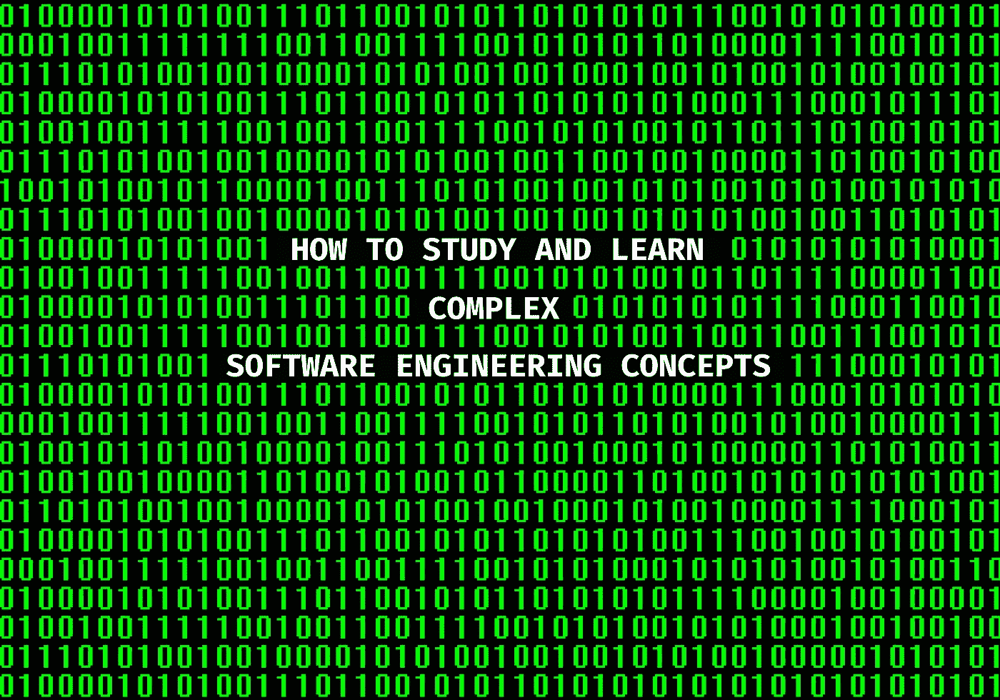

# 如何研究和学习复杂的软件工程概念

> 原文：<https://towardsdatascience.com/how-to-study-and-learn-complex-software-engineering-concepts-997d85399aec>

## 帮助你在任何计算机学科中茁壮成长的 5 个策略



作者图片

[伟大的开发者从不停止学习](/great-developers-never-stop-learning-77b9ce867eac)！虽然有几乎无穷无尽的学习策略，但在这篇文章中，我分享了一些帮助我学习和掌握我在学术和职业生涯中选择的科目的策略。

# 1⃣——写下来

写下你想学的东西会使用你大脑中与阅读不同的部分。尽管我已经试着用我的笔记本电脑记笔记来提高效率，但使用老式的**纸笔**方式被证明在较低层次上保留信息更有效。写作这一行为促进理解和记忆，因为各种各样的机制在起作用:重复、强化和对新材料的批判性思考。

做笔记有多种技巧，这完全取决于你的学习方式。我是一个视觉学习者，所以我喜欢创建图表、思维导图、概念图、流程图、汇总表、公式等等。每个人处理信息的方式都有一点不同，所以试着找到那些能帮助你更快吸收新概念的方式。

# 2⃣——解构它

**组块**是一种强大的技术，通过将大而复杂的主题分解成代表你需要掌握的核心概念的更小、更易管理的单元来学习新概念。假设您想要开始您的数据科学之旅。拿一本书或者找一个关于这个主题的全面的在线课程，从浏览目录开始，通过浏览标题、副标题和插图略读章节。这可以让你对你将要探索的材料有一个感觉，并对它是如何组织的进行心理观察，并开始欣赏大图是什么样子的，这样你就可以在以后补充细节。

在这个第一阶段之后，你需要开始学习单个词块的来龙去脉。它并不像你最初想的那样令人生畏，因为你已经形成了你将学习什么的想法。因此，继续我们之前的例子，你可以深入阅读书中的章节，然后通过查看维基百科、观看视频教程、查找在线资源以及沿途做大量笔记来补充你的知识。这种重复可能感觉是多余的，但这意味着你有更多的机会交叉参考你所学的，而不仅仅是记忆事实。

我喜欢这种策略，因为它是一种有效的**分而治之**的方法，可以一点一点地学习一门新学科，最后，当你把所有的东西放在一起时，你就能看到它们是如何协调工作的。它不仅适用于像从零开始数据科学这样的大主题，而且也有助于拓宽您对已经学习的复杂主题的理解。假设您想更深入地了解 Java 中垃圾收集的内部工作方式。你首先需要了解内存的类型，即堆和栈。一旦您对这些术语感到满意，您就可以继续进行对象分配，等等…

> 你重复这个过程，直到你完全理解了这些术语和它们所代表的含义，最后，你将完成整个九码。

# 3⃣ —简化它

作为大学新生，在我参加的第一次讲座中，我偶然发现了**费曼技术**。我当时的教授大声说，除非我们能向孩子解释清楚，否则我们永远也不会深刻理解任何概念。然后，他宣称，根据他的经验，许多软件工程专业人员都在使用行话和特定领域的词汇，但是当涉及到详细说明细节时，他们缺乏理解。然后他敦促我们用接下来的 30 分钟向一个假装的 10 岁小孩解释什么是递归。哇，太难了！

下面是该方法的工作原理:

1.  抓起一张纸，写下你想学习的概念的名称作为标题。研究主题并做大量笔记。
2.  当你准备好了，用你自己的话解释，或者就像你在教别人一样——特别是和你有不同背景的人，比如一个孩子。注重使用简单的语言。
3.  回顾你的解释，找出你学习中的差距。回到原始资料，以你的知识为基础。
4.  如果你的解释中有任何地方使用了大量复杂或专业术语，试着用更简单的词语重写，去掉混乱，使用例子和类比来强化你的解释。

这些年来，这种方法一直伴随着我，但由于我现在不得不兼顾我的全职工作和家庭责任，我选择了一条**捷径**(罪名成立)，只遵循上面的第 1 步和第 4 步。所以我实际上:

1.  学习。
2.  创建有根据的类比和视觉辅助工具来简化概念。

顺便提一下，我认为费曼技巧是进行面试时使用的有力武器:为了评估某人宣称的经历，我从问一些关于这个主题的基本问题开始。刁钻的问题可能会很快让候选人陷入困境，但当我从基础开始时，我可以了解他们的能力水平，以及他们是否知道某事或他们知道某事的名称。

# 4⃣——照做就是了

虽然学习新信息很重要，但将新知识投入到积极的实践中无疑是提高学习和吸收能力的最佳方式。这就是信息如何从工作记忆转移到无意识，让你前进到更高层次的思维，事实上把这种知识转化为新的技能。

你可以阅读十个关于如何设计 rest API 的编码教程，但是一旦你试图自己构建一个，你可能会以失败告终。我遇到过一些拥有博士学位的同事，他们对理论了如指掌，但他们(恭敬地)创造了一些我见过的最糟糕的应用程序！所以不要满足于看教程或者看视频；试着成为**亲力亲为的**，因为它允许自我纠正任何教育失误。

我在我选择的语言中准备了一个沙盒环境来尝试新事物和测试算法。我的实践不仅限于对框架、设计模式或尝试新语法进行概念验证，还包括:

> 我编码任何可以编码的东西，即使编码不是手边的任务！

最近的一个例子是，当我修改贝叶斯定理时:尽管我正在读的书主要涵盖了它的数学方面，但我通过创建一个程序来加强我的学习，该程序获取乳腺癌患者的数据集，绘制它并计算假阳性和假阴性测试的概率。

```
**💡 Top Tip:** **Embrace Struggle**
Practice makes perfect; we all know that! But all practice is not created equal. It is not the quantity but the quality of our practice that determines how well we will perform. There is comfort in practising what we are good at (e.g. always using the same tech stack), but it is only when we expose ourselves to the uncomfortable sensation of feeling incompetent that we grow.
That makes the so-called: [deliberate practice](https://en.wikipedia.org/wiki/Practice_(learning_method)#Deliberate_practice) by its very nature, quite hard.
```

# 5⃣——深潜和回填

到目前为止，我已经描述了自下而上的学习策略，即从基础概念到更高级的知识积累。当开始一门新学科时，这很好，因为我们可以依赖以前学习的信息块，但也有缺点，许多这些概念本身并不特别有趣。

因此，我所做的就是从结尾开始，通过根据需要填补我知识中的空白，以逆向工程的方式回到基础。这是一种**自上而下**的方法，这种方法非常完美，因为我明白为什么我要学习一个特定的概念，同时也为所需的技能设定了一条清晰的路径。一个明显的缺点是，我可能会在不稳定的基础上建立我的理解，但我可以通过自我评估我的知识，特别是通过应用费曼技术，很快回到正轨。

# 为成功而终身学习


总结:如何研究和学习复杂的软件工程概念

除非你想在你选择的领域成为世界级的成功者，否则你可能不需要记录这 10，000 小时的练习。对于你的职业发展来说，表现得足够好是获得技能的最有价值的目的。Josh Kaufman 是《[前 20 小时](https://first20hours.com)》一书的作者，也是《[如何学习任何东西](https://www.youtube.com/watch?v=5MgBikgcWnY)》TEDx 演讲的主讲人，他建议 20 小时可能是恰到好处的，因为它不会让你一开始就气馁，但也足够让你在你想学的技能上有显著的提高。

也就是说，学习没有开始、中间和结束——它是一个永无止境的过程！不可能对一个概念了如指掌，但你应该**拥抱不可能**并享受过程！你只需要可靠的教育资源和愿意冒险进行无限的学习探索。

感谢阅读！

*我定期在媒体上撰写关于领导力、技术&的数据——如果您想阅读我未来的帖子，请*[*‘关注’我*](https://medium.com/@semika)