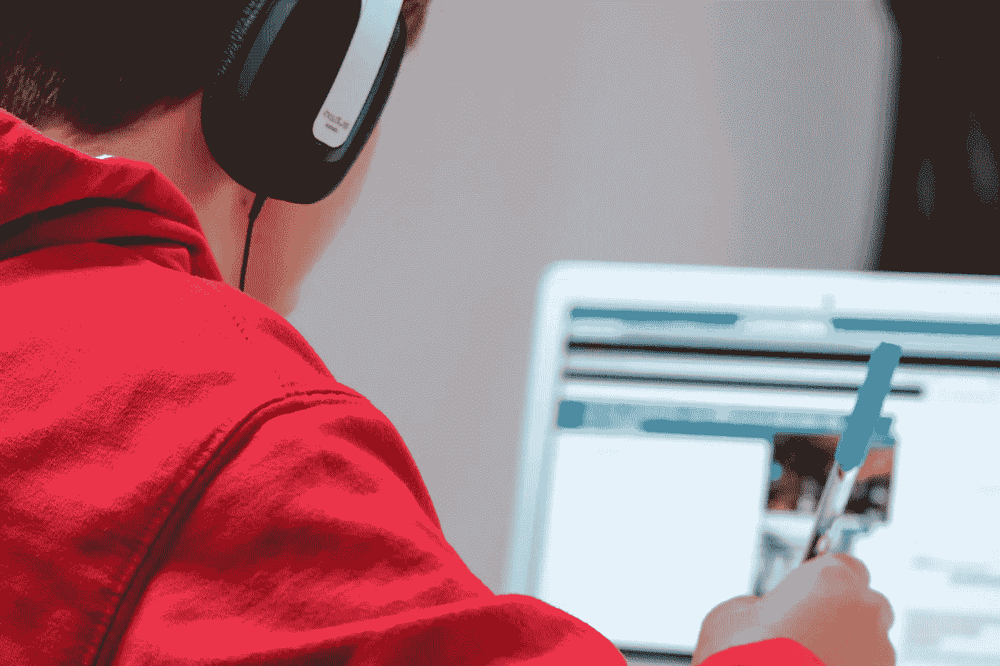

# 即使全职工作(或学习)如何学习数据科学

> 原文：<https://towardsdatascience.com/how-to-study-data-science-even-if-you-work-or-study-full-time-b52ace31edac>

## 在全职工作的同时学习和实践数据科学一年多之后，我的建议是

照片由[在](https://unsplash.com/@comparefibre?utm_source=unsplash&utm_medium=referral&utm_content=creditCopyText) [Unsplash](https://unsplash.com/s/photos/studying?utm_source=unsplash&utm_medium=referral&utm_content=creditCopyText) 上对比纤维

在这个世界上很少有确定的事情，但是有一点变得非常清楚:职业道路绝不是一条直线。忘掉“学习、找工作、结婚、退休”的方法吧:我们这一代人(也许还有未来的一代人)不会是那样的。这可能是由于快速增长的数字职业:许多人被困在他们的工作中，而他们已经看到了他们周围的世界在增长；也许是因为疫情，他们甚至开始考虑改变职业。

前几天写了一篇关于[数据科学如何学习 Python](/how-to-study-python-for-data-science-888a1ad649ae)的文章。现在，我想给你一些关于如何学习数据科学的建议，即使你是全职工作或学习。

如果你正在考虑数据科学，但你觉得你没有时间学习和实践，因为你全职工作或学习，那么这是适合你的文章:我已经开始在全职工作的同时学习和实践数据科学(和两个小女儿)，我想与你分享我对你如何也能做到这一点的建议。

# 找到你最有效率的时间

这是最难的部分，我想一开始就治疗。

如果你全职工作或学习，你没有太多时间花在其他事情上，但是，说实话，如果我们只是在智能手机上使用时间跟踪器作为应用程序，你会惊讶地发现我们一天浪费了多少时间。

不管怎样，我相信你只有两次机会为自己找到时间:

*   早上在你去工作/开始学习之前
*   晚上，下班后/大学

这里有一条我想给你的建议:你必须花一些时间(几天/几周)去了解什么时候你最有效率。例如，我发现自己在早上效率最高，所以我早上 5:30 起床，吃点早餐，冥想 5 分钟，然后开始学习和练习。

此外，我甚至在晚上晚饭后练习，但由于在这段时间里，我通常会因为一整天的工作而感到非常疲劳，所以我会做一些“不难”的任务；比如，开始写一篇这样的文章。

相反，在最高效的时间窗口中，你必须执行“复杂”的任务，比如学习(理解概念)或开发项目。

# 学会将任务细分成非常小的任务，并对它们进行规划

在我看来，议程必须成为你最好的朋友。

你要学会的最重要的事情是把每一项任务细分成更小的任务，并对它们进行规划。例如，我知道我每天早上在准备去上班之前有大约 40-50 分钟，我已经学会安排我的任务，这样我就知道我会忙大约 20-30 分钟；你的代码经常会有问题需要解决，而且有些概念可能比其他概念更难理解，所以，在我看来，**把你的时间安排得比你拥有的全部能力少是一个好习惯**。

这个想法就是安排你的时间，把要做的事情写在日程表上。我通常会在晚上花 5 分钟来安排第二天的时间。

从现在开始要明白的一件重要的事情是，你必须非常具体。你不能写:

> 我必须学习

这有几个原因:

*   如果你像我一样早上醒来很早，你的大脑会记得你写了“我必须学习”，因为我们的大脑不喜欢义务，而且，因为我们作为人类被设定为尽可能消耗更少的能量，你会立即在床上翻身，推迟闹钟。
*   你还没有设定一个具体的目标，这是跟踪你的进展的根本。

相反，你必须写这样的东西:

*   **理解 Python 中的列表**
*   做一个字典练习
*   **安装 skicit-learn**

随着时间的推移，你会明白你需要多少时间来完成事情，你会更具体地安排自己。例如，如果明天你想做一个关于字典的练习，你知道你有 20 分钟，但你认为你需要更多的时间，那么就这样安排它:

*   **早上**:开始字典练习(在你决定练习的前一天晚上，你在电脑上准备好)
*   **晚上**:结束字典练习

这样，在一天结束时，你会有一种成就感，这种成就感会让你在学习道路上取得进步，你会感到非常满足。

# 学习如何管理你的时间(和休息时间)

当你的一天被工作/学习和其他事情(家庭、朋友、购物等等)填满时，时间管理是你最好的朋友。你不能再浪费时间了。

请不要读了。我说“你不能再浪费时间了”；我没有说:不要休息(我们将在下一节讨论)。

例如，如果你要在早上起床时学习**，你不能打开你的脸书应用**“就一秒钟”，因为你会进入一个兔子洞……告别你 40-50 分钟的学习时间！

另外，我想再给你几条建议:

*   重要的是**提前准备和决定一切**。把你的明天安排在今天晚上，这样明天你就不会浪费时间决定做什么(甚至花费精神资源)。(至少)在前一天做好一切准备和决定，你会发现事情会变得很容易:试着去相信。
*   **明智地利用你的休息时间。每个人在工作或学习时都会休息；这里的区别在于你如何使用它们。如果你对数据科学和机器学习充满好奇和热情，你会提出很多问题，你会寻找答案。我在这里的建议是**在你休息的时候**(可能的话)离开在互联网上搜索的阶段，否则，如果你在你应该学习和练习的时候(例如，一大早)在互联网上搜索，你最终会浪费你的时间；此外，一天中没有完成某件事(如前一节所述)可能是停止这个奇妙旅程的起点。如果你的脑海中出现了一个问题，激起了你的好奇心，把它写在你的智能手机上，并在你工作/学习的休息时间在互联网上寻找答案。**

# 学会变通(如果需要的话)

我们并不都是一样的；有些人觉得自己被困在有利的一天里；此外，有时如果你错过了你的一些目标(因为各种原因:也许你得了流感，你根本不能学习！)在接下来的几天里，你可能会停止拖延，最终，你会结束你的数据科学之旅。

所以，我学到的最重要的事情之一是**灵活安排我的日程**。有些晚上，我的女儿们就是不让我睡觉，我也不能在早上 5:30 醒来学习；因此，我简单地重新安排我必须在早上、晚上或第二天完成的任务。

就这么简单。

当你学会变通时，变通是你的王牌。**和自己在一起不会饿；你不会因为起不来**(或者看了一晚上电视节目而自责！).

还有，最重要的是要学会**倾听自己**。如果你因为花了几天时间工作、学习、和孩子玩耍等等而感到疲倦，你的身体会要求你休息，你必须听从它。否则，你将支付一大笔账单；相信我。

如果你的身体需要休息时不休息，它最终会崩溃，迫使你休息更长时间；例如，当我在大学时，我从我的皮肤上了解到，如果我的身体需要休息时，我不休息，我会发烧；这样，我的身体需要休息 2-3 天:比我躺在床上的几个早上要长得多，因为我(真的)累了！

我非常清楚这种心理对话:“如果你今天不学习，将需要更长的时间才能得到职业改变的结果”；但是，相信我:你的大脑在欺骗你。这是一场马拉松，你需要为长跑保存体力。当你累了的时候，放松一下，休息一下:你会感谢我的！

# 结论

这些是我对如何在全职工作或学习的同时发展你的数据科学职业生涯的建议。

灵活性对我来说是最重要的，因为你必须学会如何管理你的大脑；所以，这是一部作品《在你里面》；冥想可能会在这方面帮助你(正如它帮助我一样)。

*需要 Python 和数据科学方面的内容来开始或促进你的职业生涯吗？下面是我的一些文章，可以帮到你:*

**蟒蛇:**

*   [Python 中的循环和语句:深入理解(附示例)](/loops-and-statements-in-python-a-deep-understanding-with-examples-2099fc6e37d7?source=your_stories_page-------------------------------------)
*   [Python 循环:如何在 Python 中迭代的完整指南](/python-loops-a-complete-guide-on-how-to-iterate-in-python-b29e0d12211d)
*   [学习 5 个 Python 库，开始你的数据科学生涯](/5-python-libraries-to-learn-to-start-your-data-science-career-2cd24a223431)
*   [数据科学如何学习 Python](/how-to-study-python-for-data-science-888a1ad649ae)

**数据科学:**

*   [如何处理数据科学中的缺失值](/how-to-deal-with-missing-values-in-data-science-9e5a56fbe928)
*   [如何在数据科学项目中执行特征选择](/how-to-perform-feature-selection-in-a-data-science-project-591ba96f86eb)
*   [如何检测数据科学项目中的异常值](/how-to-detect-outliers-in-a-data-science-project-17f39653fb17?source=your_stories_page-------------------------------------)
*   [执行图形残差分析的两种方法](/two-methods-for-performing-graphical-residuals-analysis-6899fd4c78e5)
*   [如何利用学习曲线轻松验证您的 ML 模型](https://medium.com/mlearning-ai/how-to-easily-validate-your-ml-models-with-learning-curves-21cc01636083)
*   [柱状图和柱状图有什么区别？](/what-is-the-difference-between-a-barplot-and-a-histogram-e62d0e532e7d)
*   [相关和回归的区别](/the-difference-between-correlation-and-regression-134a5b367f7c?source=your_stories_page-------------------------------------)
*   [了解 l1 和 l2 正则化](/understanding-l1-and-l2-regularization-93918a5ac8d0?source=your_stories_page-------------------------------------)
*   [Logistic 回归:我们来清理一下！](https://medium.com/mlearning-ai/logistic-regression-lets-clear-it-up-8bf20e9b328a?source=your_stories_page-------------------------------------)
*   [什么是训练有素的模特？](/what-is-a-trained-model-5c872cfa8448?source=your_stories_page-------------------------------------)

考虑成为会员:你可以免费支持我和其他像我一样的作家。点击 [*这里的*](https://federicotrotta.medium.com/membership) *成为会员。*