# 如何像专业人士一样设计熊猫数据框

> 原文：<https://towardsdatascience.com/how-to-style-pandas-dataframes-like-a-pro-541c84142c17>

## **用这份完整的初学者指南让你的数据框架惊艳四座。**


文章缩略图(图片由作者提供)

Python 的 Pandas 库允许您以类似于 Excel 的方式呈现表格数据。不太相似的是样式功能。在 Excel 中，您可以利用一次单击着色或条件格式使您的表格引人注目。对熊猫来说，这就有点棘手了。

好消息是——**熊猫中的风格 API 可以帮助**。直到最近我才完全意识到这一点，这也是我希望能早点发现的事情之一。我花了太多时间在 Python 和 Pandas 中聚集数据，然后将结果复制到 Excel 中进行样式化。

听起来很熟悉？好，我们走吧！

# 数据集

在深入研究好的东西之前，我们必须关注数据集。您将在下面看到的代码片段为您创建了一个。它有四列，每列有 5 个任意值。一些值也丢失了，原因您将很快看到:

```
import numpy as np
import pandas as pd

df = pd.DataFrame({
    "A": [0, -5, 12, -4, 3],
    "B": [12.24, 3.14, 2.71, -3.14, np.nan],
    "C": [0.5, 1.2, 0.3, 1.9, 2.2],
    "D": [2000, np.nan, 1000, 7000, 5000]
})
df
```

数据集如下所示:

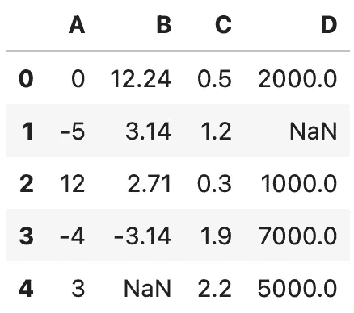

图片 1-虚构的数据集(图片由作者提供)

这是一个非常标准的熊猫输出，看起来很熟悉，让我们面对它，**无聊**。接下来，你将学习如何调味。

# 熊猫样式的基本格式

Pandas 提供了一个样式 API，允许你改变数据帧的显示方式。有许多内置的样式函数，但也有选择编写自己的。

大部分时间我觉得很烦的一件事就是索引栏。它只是一个序列，并没有为表格可视化提供真实的价值。使用`hide()`方法来摆脱它:

```
df.style.hide(axis="index")
```

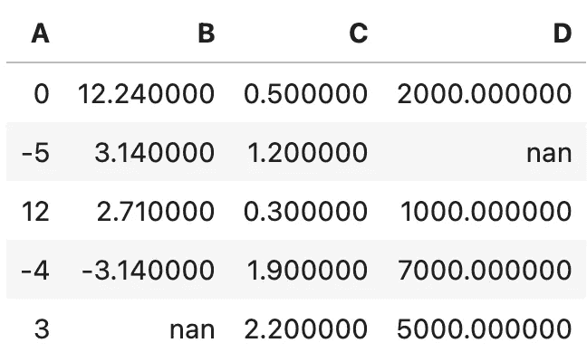

图 2 —隐藏数据帧索引(作者图片)

好多了！

还有其他事情让我们的数据框架看起来很痛苦。例如，这些十进制数的精度是不必要的。出于可视化的目的，大多数情况下两位小数就足够了:

```
df.style.format(precision=2)
```

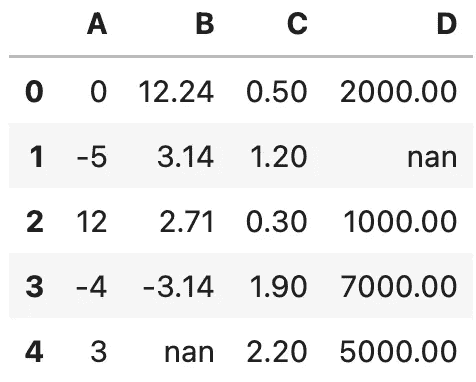

图 3-指定数值精度(作者图片)

您可以更进一步，指定自定义格式字符串。下面的示例将在每个值的前后添加一个减号，并将每个数字的格式设置为三位小数:

```
df.style.format("- {:.3f} -")
```

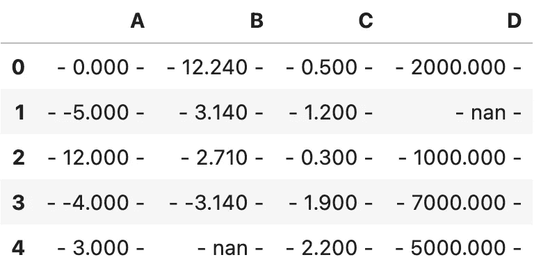

图 4-自定义值格式样式(作者图片)

事情不会就此结束。有时，您希望每列有不同的格式。将格式化字符串指定为键值对，这样就可以了:

```
df.style.format({
    "A": "{:.2f}",
    "B": "{:,.5f}",
    "C": "{:.1f}",
    "D": "$ {:,.2f}"
})
```

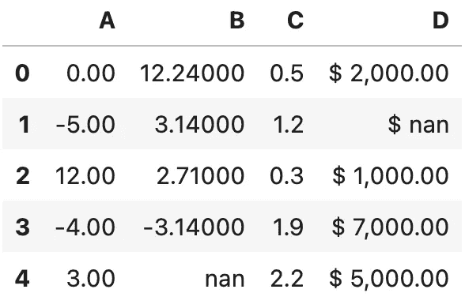

图 5-为每列指定格式样式(按作者分类的图像)

这是格式化的基础。接下来，我们将学习许多改变文本和背景颜色的方法——等等。

# 使用熊猫风格来改变文本和背景颜色

通常，突出显示您想要引起注意的数据点是一个好主意。方便的`highlight_max()`函数将数据帧中每个单元格的最大值指定为黄色:

```
df.style.highlight_max()
```

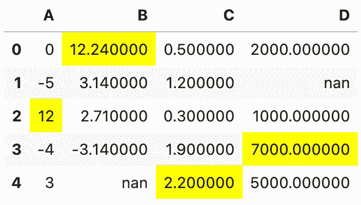

图 6-突出显示最大值(作者图片)

`highlight_min()`函数的作用正好相反:

```
df.style.highlight_min()
```

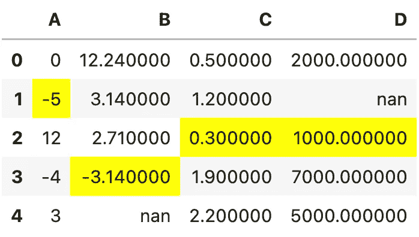

图 7-突出显示最小值(作者图片)

除了最小和最大数据点之外，您还可以突出显示缺少的值。以下示例显示了如何将没有值的单元格着色为红色:

```
df.style.highlight_null(null_color="red")
```

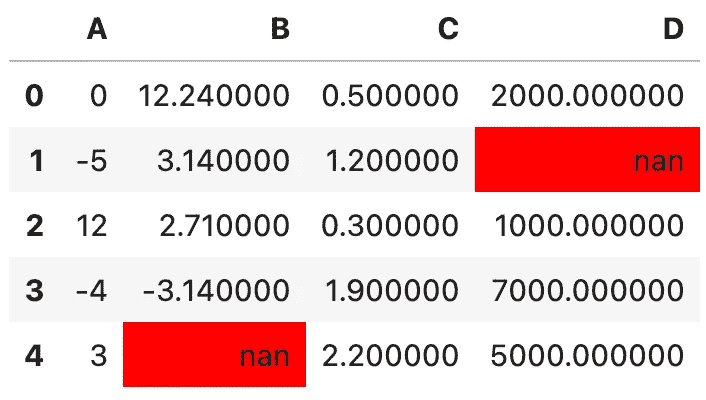

图 8-突出显示空值(作者图片)

如果您对默认打印的 *nan* 不满意，您还可以用自定义字符串格式化缺少的值:

```
df.style.format(na_rep="Missing").highlight_null(null_color="red")
```

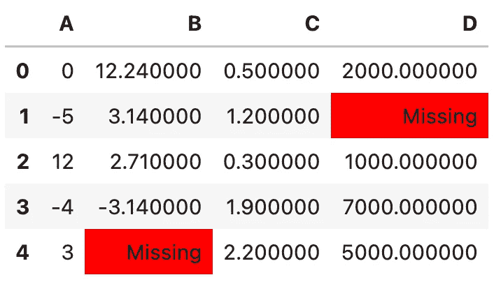

图 9-突出显示空值(2)(作者图片)

整洁！让我们探索一些其他的颜色选择。

例如，`background_gradient()`函数将使用渐变调色板为单个行的单元格着色。默认情况下使用蓝色调色板，值较高的单元格用较暗的颜色填充:

```
df.style.background_gradient()
```

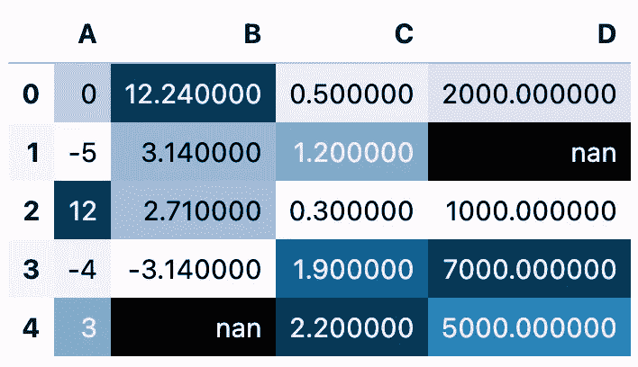

图 10 —使用渐变调色板突出显示(图片由作者提供)

您不必对整个数据集进行着色——`subset`参数允许您指定想要着色的列列表:

```
df.style.background_gradient(subset=["B", "D"])
```

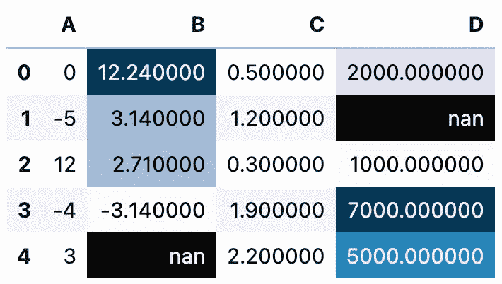

图 11 —使用渐变调色板突出显示(2)(图片由作者提供)

还有一种方法可以改变调色板，并明确设置最小值和最大值。这些参数在`background_gradient()`和`text_gradient()`功能中都可用。我们先来看看后一种是如何工作的:

```
df.style.text_gradient(subset=["C"], cmap="RdYlGn", vmin=0, vmax=2.5)
```

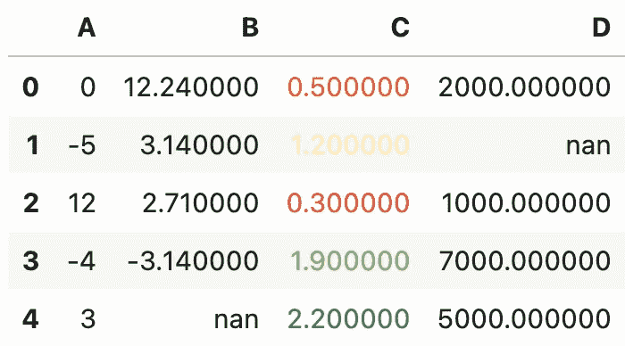

图 12 —使用自定义渐变调色板更改文本颜色(图片由作者提供)

不错，但是不太好看。第二个值有点难读。这就是为什么最好给整个单元格着色，而不仅仅是文本:

```
df.style.background_gradient(subset=["C"], cmap="RdYlGn", vmin=0, vmax=2.5)
```

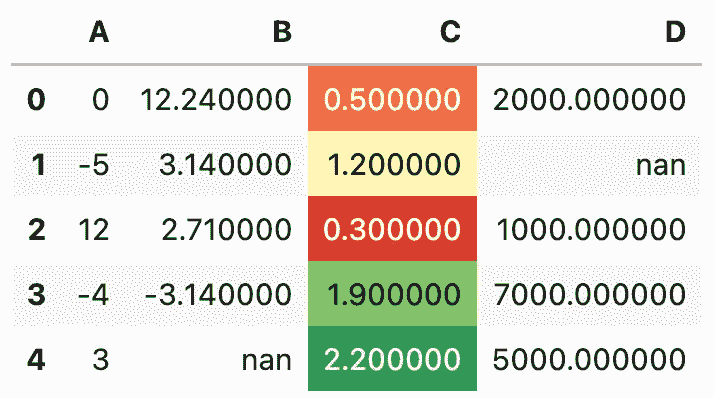

图 13 —使用自定义渐变调色板更改背景色(图片由作者提供)

现在让我们进入真正令人兴奋的东西。我们将以条形图的形式研究每个单元格的颜色。条形的“长度”由单元格的值表示，相对于列的其余部分，该值越高，单元格的颜色就越多。

要给数据帧添加条形颜色，只需调用`bar()`函数:

```
df.style.format(precision=2).bar(color="orange")
```

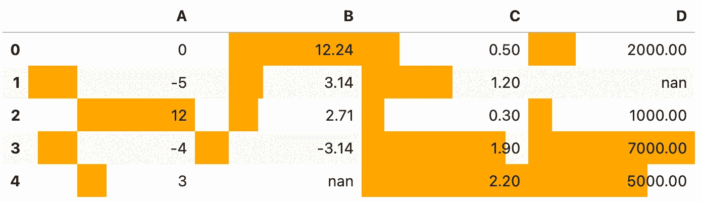

图 14-以条形图形式显示的值范围(作者图片)

默认不是最好看的桌子。有一些列是负值，所以该条是双向的，没有视觉上的区别。至少可以说，这是一个糟糕的设计实践。

此外，如果单元格之间有边界，也会有所帮助。否则，填充颜色会与周围的颜色融合:

```
df.style.format(precision=2).bar(align="mid", color=["red", "lightgreen"]).set_properties(**{"border": "1px solid black"})
```

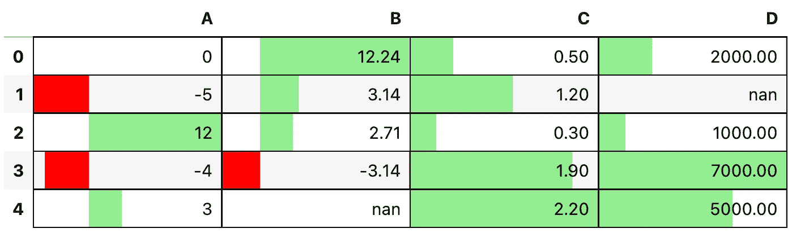

图 15-以条形图形式显示的值范围(2)(图片由作者提供)

好多了！

如果说许多熊猫用户有一个担心点，那就是文本大小。如果你在一个大显示器上工作，并且不想让一切都变得更大，那么它就太小了。

您可以使用`set_properties()`函数传入一个键值对字典。键和值都来自 CSS，如果你有任何网页设计的经验，你会有宾至如归的感觉。

下面的代码片段设置了较粗的灰色边框，将绿色应用于文本，并增加了文本的整体大小:

```
properties = {"border": "2px solid gray", "color": "green", "font-size": "16px"}
df.style.set_properties(**properties)
```

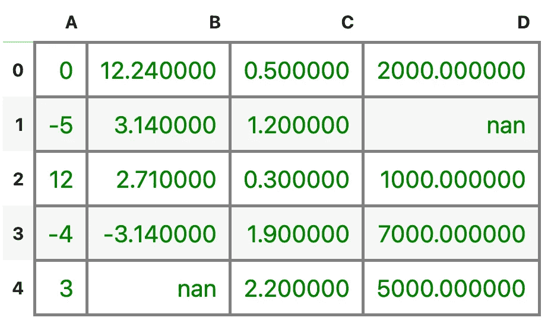

图 16 —更改文本颜色和大小(图片由作者提供)

这对于基本的造型来说已经足够了。接下来，我们将通过几个高级示例来突出这个表格。

# 高级:样式标题行和索引列

桌子设计，或者说一般意义上的设计，是高度主观的。但是所有好看的表格都有一个共同点——一个易于区分的标题行。在本节中，您将学习如何设计风格:

*   表格标题行
*   表索引列
*   处于悬停状态的表格单元格

我们开始吧！我们将声明三个字典——第一个用于悬停状态，第二个用于索引列，最后一个用于标题行。您可以使用`set_table_styles()`功能将它们全部应用于一个数据帧:

```
cell_hover = {
    "selector": "td:hover",
    "props": [("background-color", "#FFFFE0")]
}
index_names = {
    "selector": ".index_name",
    "props": "font-style: italic; color: darkgrey; font-weight:normal;"
}
headers = {
    "selector": "th:not(.index_name)",
    "props": "background-color: #800000; color: white;"
}

df.style.set_table_styles([cell_hover, index_names, headers])
```

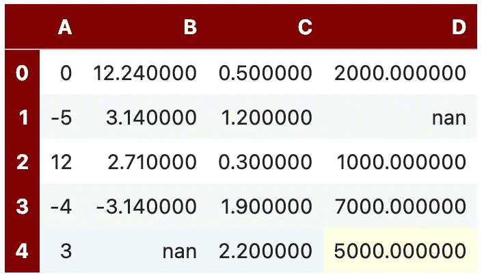

图 17 —带有样式化标题和索引行的表格(作者图片)

这与我们以前的情况有天壤之别，但我们可以做得更好。例如，我们可以使所有列具有相同的宽度，使单元格内容居中，并在它们之间添加 1 像素的黑色边框:

```
headers = {
    "selector": "th:not(.index_name)",
    "props": "background-color: #800000; color: white; text-align: center"
}
properties = {"border": "1px solid black", "width": "65px", "text-align": "center"}

df.style.format(precision=2).set_table_styles([cell_hover, index_names, headers]).set_properties(**properties)
```

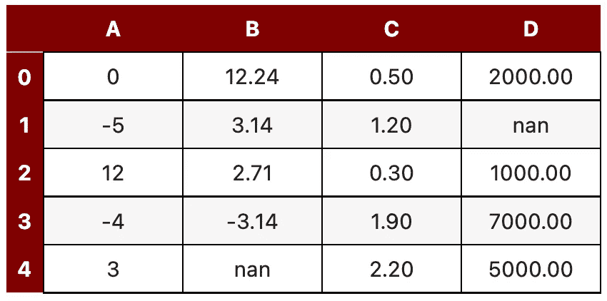

图 18-带有样式化标题和索引行的表格(2)(作者图片)

这张桌子真好看！

接下来，让我们看看如何根据 Python 函数的输出有条件地声明样式。

# 高级:用 Pandas Styler 声明自定义样式

有时内置的样式就是不能满足它。幸运的是，您可以应用自己的 Python 函数。

这里有一个例子:`mean_highlighter()`函数将:

*   如果值小于或等于平均值，则将单元格染成红色
*   如果值大于平均值，则将单元格涂成绿色
*   将文本设置为白色和粗体

一旦在 Python 函数之外，只需从 Pandas Styles API 调用`apply()`函数:

```
def mean_highlighter(x):
    style_lt = "background-color: #EE2E31; color: white; font-weight: bold;"
    style_gt = "background-color: #31D843; color: white; font-weight: bold;"
    gt_mean = x > x.mean()
    return [style_gt if i else style_lt for i in gt_mean]

df.style.apply(mean_highlighter)
```

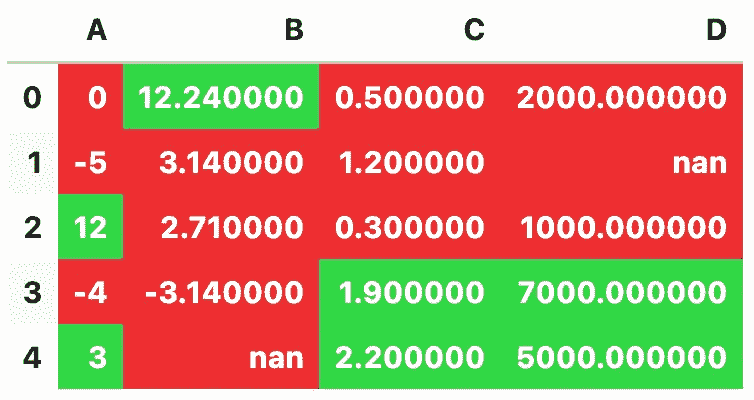

图 19 —使用均值高亮功能(图片由作者提供)

不是最漂亮的颜色，但绝对是在 Python 中设置条件格式的简单方法。

一个常见的用例是，如果值为负，则将单元格的文本颜色设置为红色。下面是您如何实现这一点:

```
def negative_highlighter(x):
    is_negative = x < 0
    return ["color: #EE2E31" if i else "color: #000000" for i in is_negative]

df.style.apply(negative_highlighter)
```

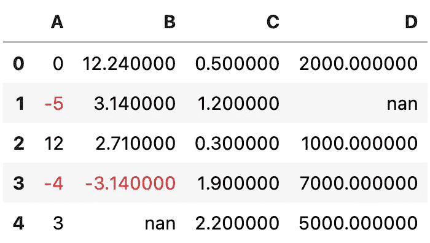

图 20 —使用负荧光笔功能(图片由作者提供)

有了这些知识，我们只剩下一件事要讨论——导出您的样式化表格。

# 如何将设计好的熊猫数据框导出到 Excel

所有熊猫风格 API 函数的结果是一个熊猫数据帧。因此，您可以调用`to_excel()`函数在本地保存数据帧。如果您要将此函数链接到一组样式调整，结果 Excel 文件也将包含这些样式。

下面是导出基于渐变的彩色表格的代码:

```
df.style.background_gradient(cmap="RdYlGn").to_excel("table.xlsx")
```

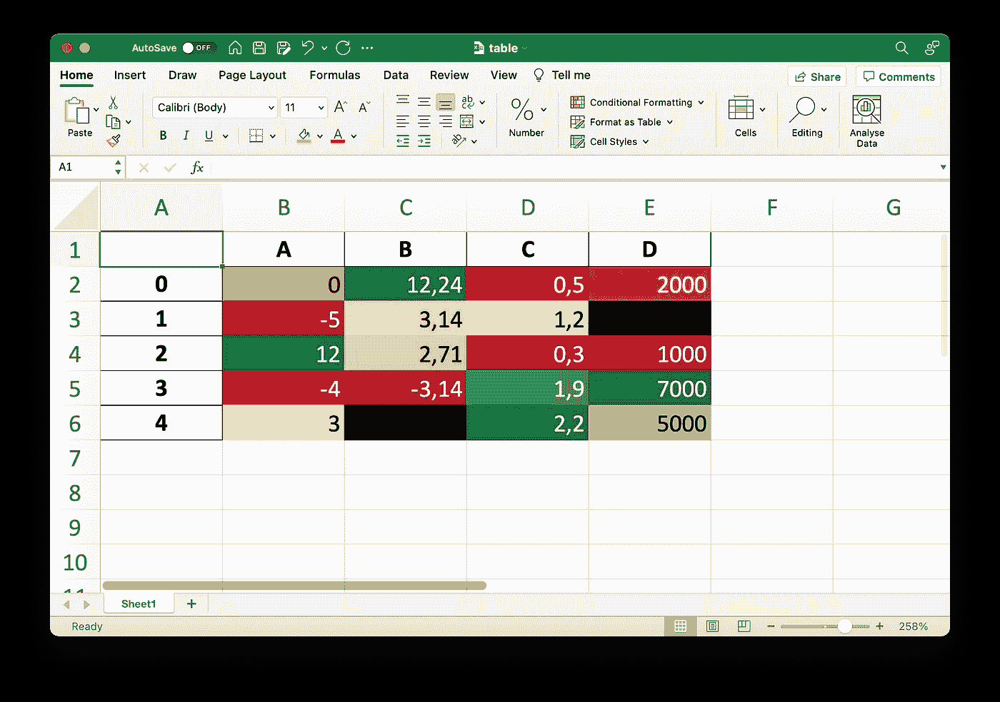

图 21 —导出的 Excel 文件(作者提供的图片)

这也可以在 Excel 中实现，但在 Pandas 中实现要简单得多。

# 熊猫风格 API 概述

今天，您已经了解了熊猫风格 API 的来龙去脉。正如我前面提到的，这是一个我希望能尽快学会的 API，因为它能为我在做演示和写论文时节省很多时间。

用你今天学到的工具和技巧，没有什么是你做不到的。当您想要应用多种样式时，可以将函数链接在一起，例如，更改小数位数和给单元格着色。排序很重要，所以请记住这一点。

你最喜欢用什么方式来设计熊猫数据框？请在下面的评论区告诉我。

*喜欢这篇文章吗？成为* [*中等会员*](https://medium.com/@radecicdario/membership) *继续无限制学习。如果你使用下面的链接，我会收到你的一部分会员费，不需要你额外付费。*

<https://medium.com/@radecicdario/membership>  

## 保持联系

*   雇用我作为一名技术作家
*   订阅 [YouTube](https://www.youtube.com/c/BetterDataScience)
*   在 [LinkedIn](https://www.linkedin.com/in/darioradecic/) 上连接

*原载于 2022 年 7 月 27 日*[*https://betterdatascience.com*](https://betterdatascience.com/style-pandas-dataframes/)T22。