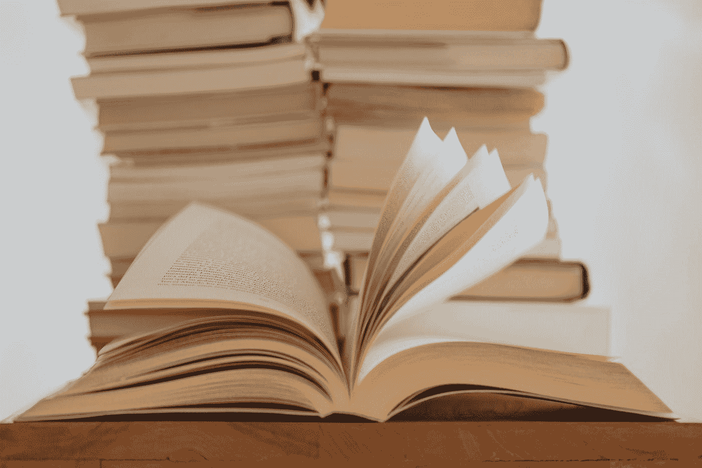

# 如何在 AI 全日制硕士中生存

> 原文：<https://towardsdatascience.com/how-to-survive-a-full-time-msc-in-ai-e51b7b7a82d5>

## 对有兴趣攻读人工智能全日制硕士学位的个人的生存指南

照片由 [Unsplash](https://unsplash.com?utm_source=medium&utm_medium=referral) 上的[伊莉莎·卡尔韦·b .](https://unsplash.com/@elisa_cb?utm_source=medium&utm_medium=referral)拍摄

我想大多数研究生都会同意这样的说法:完成硕士学位(成绩良好— 2:1 或优异)不是在公园里散步。特别是在人工智能领域，需要几门科学(如数学、计算机科学)的知识，学生们每天都要花几个小时才能弄清楚一个教授仅用 10 分钟就教完的机器学习算法的基本工作原理。最重要的是，他们必须满足苛刻的任务期限，找到一份工作(研究生计划，实习，兼职——对一些人来说),获得新技能，跟上该领域的最新发展。现在，当然，要应对由于新冠肺炎而产生的社交距离的负面感觉。

因此，学生的身心健康受到他们承受的大量压力的损害是很自然的。甚至在一些极端的情况下，让他们退出他们的课程。

事实上，我的个人经历(最近从伦敦大学玛丽皇后学院人工智能专业毕业)也属于这一类。虽然我没有辞职，但如果我说我没有想过，那我是在骗自己。我也承认，在我的第二个学期，我感到精神疲惫，以至于我无法集中精力阅读超过 5 分钟的科学论文。

幸运的是，这让我意识到我学习和计划一天/一周的方式有问题。

在与我的几个同学交谈并休息一周进一步研究这个问题后，我得出了这样的结论:通过培养一些好习惯，将我的心态转移到正确的方向，并设立现实可行的目标，我可以更有成效和效率，我可以坚持而不会筋疲力尽。

……五个月后(完成理学硕士学位后)，花了几个小时调整我的目标和习惯，我意识到如果我早点开始这段旅程，我的生活会轻松得多。之所以特意选择“旅程”这个词，是因为这个过程永无止境。

为此，这篇文章将简要概述这个旅程的“站”(在更高的抽象层次上)，并提出一些步骤，以便在获得人工智能硕士学位的同时享受这个过程。在这一点上，应该提到的是，本指南是从一个数据科学零初学者经验的学生的角度编写的，但它可以对有经验的专业人员有益，即使是在其他专业领域。

无论如何，没有进一步的到期让我们开始吧！！

# 开始攻读理学硕士学位前的准备工作

> 如果你不熟悉编码，我强烈建议你尽快开始编码

## **语言**

人工智能、数据科学、大数据、商业分析领域的大多数理学硕士课程更喜欢将 Python 作为他们授课模块的主要语言。 *Python* 是一种初学者友好的语言(例如，与 Java 或 C++相比)，坦率地说，是数据科学世界中最广泛使用的语言。

从我硕士期间和之后的个人经历来看，我认为事先掌握 Python 的基础知识是必须的，因为另一种选择是在学习过程中掌握这门语言，这意味着..你猜对了，额外的时间和工作！仅供参考，我做了大约 3 年的移动软件工程师，仍然花了一些时间来熟悉这种语言的语法和用法。

也就是说，有几个互联网资源，人们可以从那里开始学习 Python。我个人建议 [Kaggle 课程](https://www.kaggle.com/learn)快速入门这门语言以及它在人工智能领域的使用方式。当然，其他课程可以提供更全面的观点，但它们需要更多的时间来完成。

(可选)对于那些愿意付出额外努力的人(例如，在他们的理学硕士课程实际开始之前的假期期间)，另一种有用的语言是 *R* (主要用于学术目的，因为有许多专门用 R 编写的包和库)。最后，对于铁杆程序员和可能对更高级的主题(深度学习、计算机视觉等)感兴趣的人..)后来，C++成了首选语言，因为计算能力要求最高的任务需要访问低级接口。

## 数据结构

另一个建议是尽可能多地学习关于数据结构的知识。数据结构对于描述数据组织、处理和加工的方式非常有用。它们也是技术/编码面试的基础！

如果我能回到过去，我会从头开始编写一些代码，这会磨练我新获得的 Python 技能。另一种方法是浏览 Leetcode 的资料，参考和扩展我的知识。

## **SQL-NoSQL**

在人工智能领域工作意味着你将在某个时候被要求检索、处理和预处理大量数据。为此，在开始攻读理学硕士学位之前，具备 SQL 数据库(例如 MariaDB 或 PostgreSQL 或 SQL server)的基础知识，或许还有 MongoDB 和 Cassandra 等 NoSQL 数据库/工具，会有所帮助。

## **数学**

数据科学的支柱是数学。基本上，项目中的每个数据科学阶段都是由决定最合适的行动过程的基础数学决定的。

由于这是一个非常大的题目，我将省去你阅读五段为什么数学如此重要的麻烦。相反，你会在这本[指南](/mathematics-for-data-science-e53939ee8306)中找到一些令人惊叹的人工智能数学资源。

  

顺便说一句，我完全赞同他用自上而下的方式来认识数学对于人工智能的必要性。

# 在你攻读理学硕士学位期间

在这一部分，我将建议 **5 个支柱**，它们概括了我通过经验和对该主题的研究获得的知识。结合起来，这些支柱可以引导你建立习惯，并将心态转向正确的方向，这将极大地帮助你度过硕士学位的压力，同时保持你的理智。

## 明确你毕业后的最终目标

> 这是你在获得理学硕士学位的第二/第三个月必须做的事情。

有人会说，这一节的标题相对于文章的其余部分来说相当奇怪。事实上，乍一看，我会同意之前的说法，因为今年的重点是毕业，对不对？

实际上，我认为答案部分正确！我故意用了“部分”这个词，因为有更大的行动在起作用。为了让你不那么神秘，这一幕分为*两个* *类别*(职业路线)，我坚持在你获得理学硕士学位的第二到第三个月(最多)做出这一选择的原因是，你需要对你未来将成为的世界有一个基本的了解，这取决于你的选择。就我而言，做出一个决定性的决定并不是一件容易的事情，因为每一个选择都需要遵循一定的道路，并拥有不同的技能才能获得成功。

尽管如此，请放心，因为我将在下面分析性地描述这两条职业道路。

**商业生涯**

如果你有兴趣应用你的人工智能技能来解决/改善现实世界的情况，并为企业的增长做出贡献，那么这是你的正确选择。最有可能的是，你将是一名员工，为一家公司工作，你的工作将需要处理大量数据，创建终端管道，编写质量软件和单元/集成测试，以及建立/改进现有的机器学习模型。此外，被要求研究一个关于该领域最新趋势的话题并将其展示给你的团队也并不少见。当然，您对这些任务的熟悉程度会有所不同，这取决于您的组织和职位(机器学习工程师、数据科学家和工程师)。

话虽如此，如果你想最大限度地提高被公司录用的概率，并省去硕士毕业后找工作的麻烦(相信我是很多的)，你应该遵循以下步骤:

*   首先专注于获得一个研究生项目(或者理想的初级职位)。

不要误解我的意思，你仍然希望以优异的成绩毕业(或 2:1)，但我希望你明白的是，申请工作和准备每次面试是这里的优先事项。例如，你仍然应该在你的机器学习作业中获得高分，但只是在完成了你的找工作待办事项列表之后。

*   *获得找工作所需的技能和知识*

我相信这是一个反复的过程，因为你的个人经历最终会揭示你所缺乏的技能。这些“不足”可能与你的人际交往能力或技术知识有关。出于这个原因，我个人的建议是，从第一次和第二次面试开始，首先发展你的沟通技巧，然后，转移到与招聘过程后期相关的更多技术问题上。

*   *练习，练习！*

在面试过程的各个阶段尽早开始练习，利用大学的职业服务。为面试做额外的准备总比准备不足好。相信我，你不会想成为后者，因为很少有公司会给你打电话进行初次面试。想象一下，仅仅因为你不知道这个问题的答案就失去了你梦想中的工作:“你如何想象 5 年后的自己？”

*   做好心理准备

在两个半月的时间里，我一共申请了 238 个职位，才成功地找到一个职位。你可以想象有多少次我当场或一周后被拒绝，没有进入下一阶段的面试，甚至更糟的是在面试过程的最后阶段被拒绝。请注意，对于每个职位，我都做了功课，修改了求职信，并遵循了适当的指导原则(或者至少我认为我做到了)。所以，当你早上醒来只是为了看到五个拒绝，不要气馁。坚持下去，提高你的技能。

**学术界职业**

第二条职业路线与你是一名人工智能教授或杰出的研究人员，受雇于一所受人尊敬的大学或研究机构有关。和以前一样，有一定的步骤，可以提高你获得梦想位置的几率。这些将是:

*   *获得尽可能高的分数*

与之前相反，你的主要目标实际上应该是在学习期间出类拔萃。这是因为你想在毕业完成博士学位后被顶尖大学录取(最好是有奖学金)。自然，你最近的学术成就，应该是你在理学硕士中非常高的总成绩，应该会敲定这笔交易。

*   成为数学专家

不管你未来的职业选择如何，理解多元微积分、线性代数、统计学和概率是你能拥有的最有用的知识。然而，成为一名成功的研究人员所需的数学知识水平远远高于在企业工作所需的水平。首先，我同意这听起来很可怕，所以我的建议是慢慢地向上爬。从基础开始，解决相关的练习，研究它们在人工智能领域的应用，然后继续前进。如果我是你，我会努力每天学一小时数学。

*   *找到你感兴趣的话题并了解更多信息*

由于你刚刚开始你的人工智能之旅，大多数科目看起来都很有趣。话虽如此，试着找出一个真正能引起你共鸣的 AI 话题。例如，与语言(NLP)相比，我更喜欢处理图像/视频(计算机视觉)。这种早期的区分会节省你大量的时间，因为你已经知道你的硕士论文的主题是什么，也可能是你的博士论文的主题。

*   *注意你的理学硕士论文*

不像现在的你，我不知道这最后一步有多重要。一篇好的理学硕士论文展示了你在你选择的主题上完成高质量工作的长度，展示了你的研究能力，创造力和对特定任务的奉献精神。此外，这可能是一个非常有说服力的关于你工作的故事，也可能是被名牌大学录取(或被你梦想中的工作录用)或不被录取的区别。就我而言，我足够幸运，因为我的作品被提议出版，但它是意想不到的，而不是有意的。尽管如此，当有人问我关于我在数据科学方面的项目时，我的硕士论文是我在采访中谈论的第一件事。

## 创建一个计划和健康的习惯

> 有规律的一天的价值在于更有动力，更有效率，更有纪律。

因为有太多的博客、YouTube 视频是关于如何让你的日常生活变得更好的，所以我只简单地提几个对我有用的。

*早上的例行公事*

在每天的同一时间(早上 8 点)设置一个闹钟，不要拿着我的手机查看我的社交媒体账户和电子邮件。相反，起床，喝水，做一些伸展运动或温和的核心运动，然后吃早餐。我练习斋戒，所以我跳过了最后一部分。冲完黑咖啡后，我会完成一天中第一个也是最重要的任务，没有任何其他干扰。那时，也只有那时，我才会查看我的社交媒体。这当然是我早上的例行公事。你可以根据你的标准和日常计划来调整或改变它。

*每周锻炼 3-4 次&健康饮食*

根据您当前的情况(设备、费用、时间)和偏好，创建适合您个人需求的锻炼计划。无论你的情绪波动如何，都要努力坚持锻炼，尤其是在最初几周。在这种情况下，健康饮食也至关重要。有几项研究表明，除了明显的健康问题之外，吃垃圾食品与你的学业/职业表现下降有关。

*设定周目标和日目标*

对你一天和一周应该做什么有一个清晰的认识是非常重要的。正如我之前提到的，你应该优先完成最紧急/最重要的任务，这是一个需要时间的过程，因为有效管理时间本身就是一种技能。

*每周奖励自己一次*

为了成功完成每周任务清单，你至少可以奖励自己。总是对自己苛刻是你在理学硕士期间以及生活中最糟糕的行为，所以你必须找到你喜欢做的事情并去做。

## 记笔记，重复你所学的内容

> 忘记和复习过去的科目是学习旅程的一部分。

我花了一段时间才意识到保持清晰、简洁的笔记的力量，但当我这样做时，我意识到它节省了我很多麻烦和时间。现在，当我需要找到 SVM 是如何工作的，或者有什么数据规范化技术时，我不必在堆栈溢出或随机网站中搜索，这显然需要时间。创建这些笔记还磨练了我的分析技能，因为我必须从网站、书籍或博客帖子中辨别出真正有用的信息，并用自己的话写下来。最后，修改题目的过程，比如神经网络中的反向传播，有了自己的笔记会快很多，因为我知道所有东西的确切位置。

我用[观念](https://www.notion.so/)来记笔记(基本上是为了整理我生活中的一切)，用[安奇](https://apps.ankiweb.net/) 根据我在观念中创建的笔记来修改我想要的内容。例如，假设我想复习线性代数的基础知识。然后，我去 Anki，在那里我已经创建了一个与线性代数相关的问题和答案的甲板，并尝试回答它们。如果我不知道答案，我会首先在 Anki 中检查答案，然后在 concept 中打开相关注释，以获得整个主题的更广泛视图。

## 从第一天开始建立关系网

> 与你钦佩、尊重和敬仰的人交往是非常重要的。只是不要忘记这最终应该是一个双向的街道关系。

毫无疑问，我最大的错误是我在硕士期间没有建立足够的关系网。好吧，Covid 也在其中发挥了作用，但我肯定错过了很多机会，无法与我的同学、我喜欢听的教授以及来自我梦想成为其中一员的公司的年轻专业人士联系。事实上，我花了一整天的时间尽可能多地学习人工智能，并满足我苛刻的作业期限，同时我可以花一个小时与同学交谈，共同找到解决作业中困难部分的方法，而我通常会坚持三个小时。

另一种情况是，网络的价值得到了强调，那就是你想更多地了解人工智能中的一个特定主题/领域。你可以开始学习更多关于高级 NLP 主题的知识，例如，试图找到阅读的最佳资源，而你的 NLP 教授，顺便说一下，他在该领域有多年的经验，可以在几分钟内迅速为你提供解决方案。

如你所知，了解最适合这份工作的人，同时也是他们可以依赖的人，这是至关重要的。所以，不要害怕说出你的想法，要求并提供帮助，因为你最终会得到回报，即使你没有，你仍然会遇到另一个与你性格和心态不同的人。

## 接受你的人性和你的需求

> 你可以和你的朋友一起玩乐，建立长久的友谊，做一些疯狂的事情。

我注意到，在成年时期，我们很少有机会认识这么多新朋友，并和他们一起玩得开心。所以，利用这段时间，开放心态，结交新朋友。从我个人的经验来说，你肯定需要它，因为这种休息可以让你清醒头脑，为接下来的一周充电。

所以，这是我从伦敦玛丽女王大学获得的人工智能硕士学位的经验和我从艰难的道路中学到的教训的简要总结。我希望你从这个故事中得到一些有用的东西，并最终享受你自己的硕士学位。

我期待看到您的反馈和您的想法/改进。感谢您的阅读！！