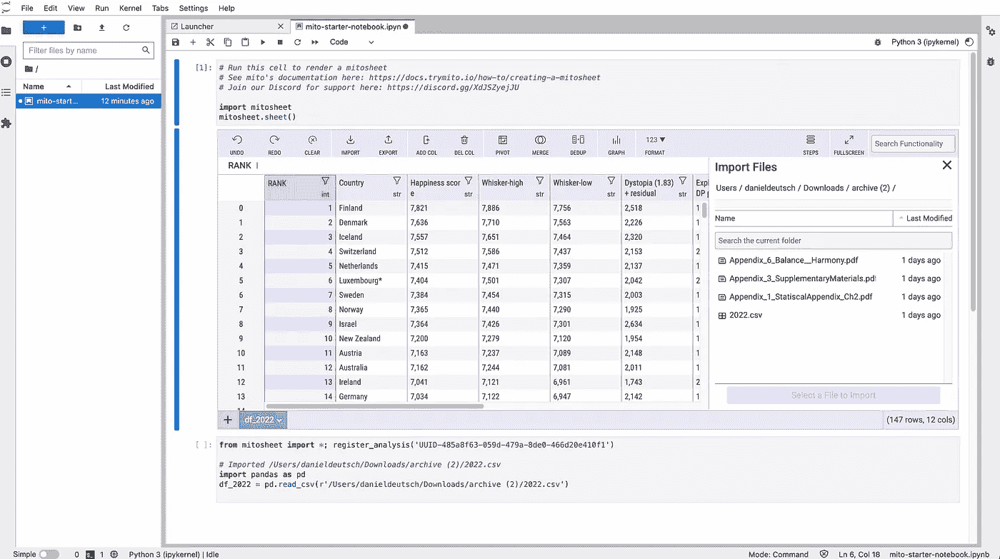
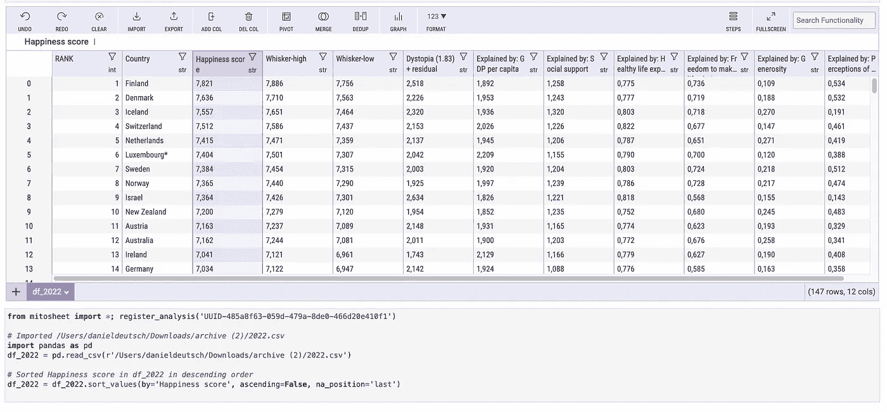
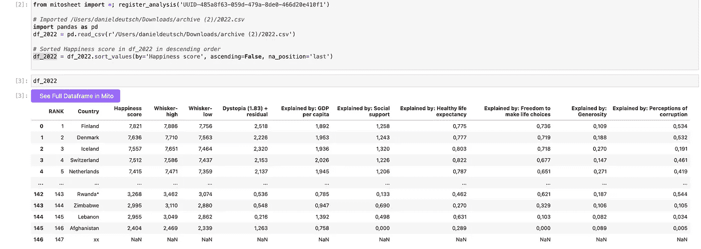
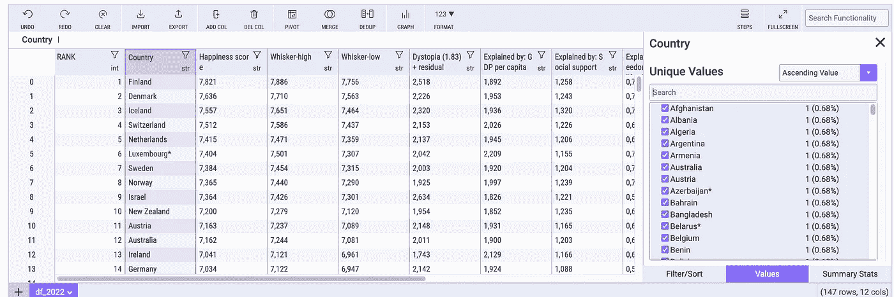
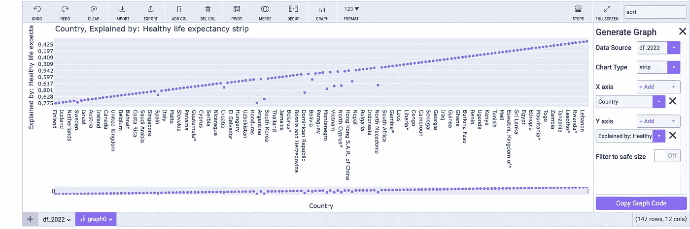
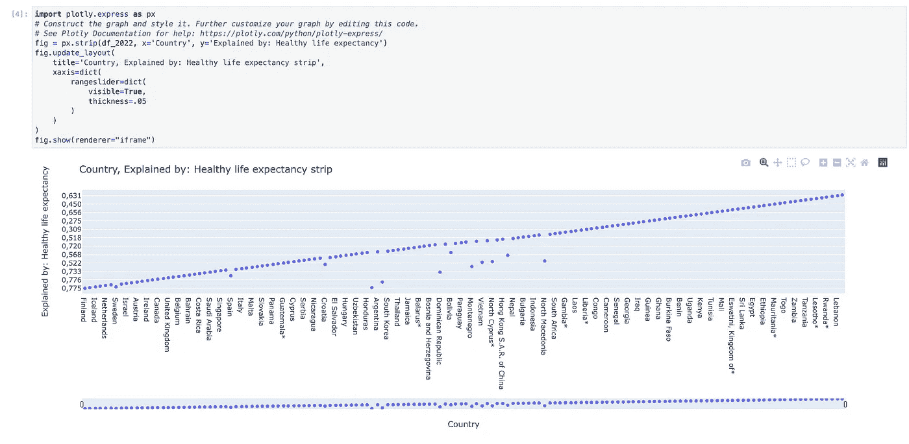
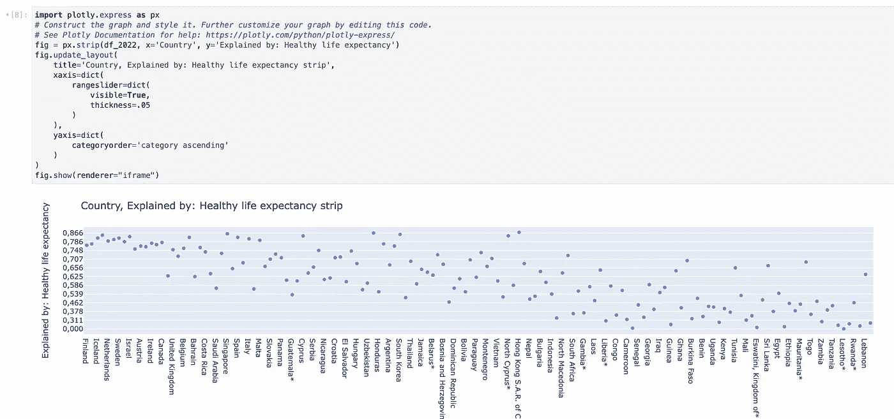
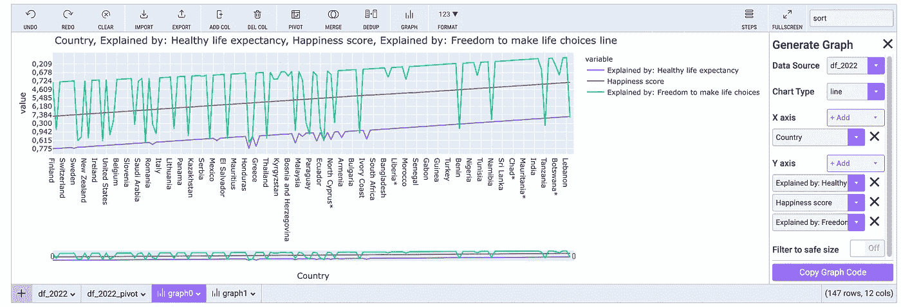
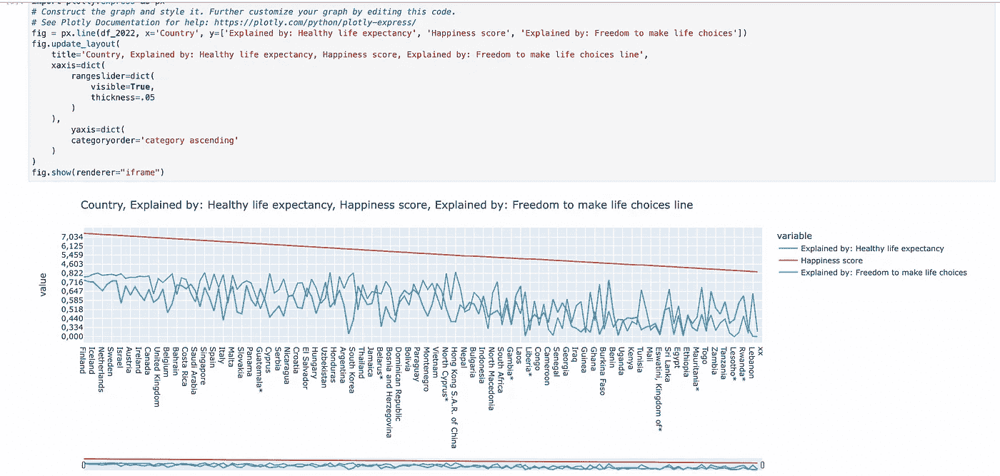
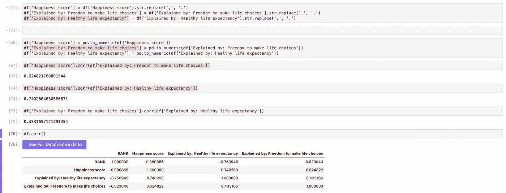

# 如何从 Excel 切换到 Python

> 原文：<https://towardsdatascience.com/how-to-switch-from-excel-to-python-20440824602e>

## 当你只知道 Excel，而你想从 Python 开始时，让自己轻松地编程


艾通过作者创造艺术。 [*参见 Opensea 上的【NFT】*](https://opensea.io/accounts/createdd?ref=0xc36b01231a8f857b8751431c8011b09130ef92ec)*受* [*西蒙李*](https://unsplash.com/@simonppt)

# 目录

*   [如何从 Excel 切换到 Python](https://github.com/Createdd/Writing/blob/master/2022/articles/mito.md#how-to-switch-from-excel-to-python)
*   [目录](https://github.com/Createdd/Writing/blob/master/2022/articles/mito.md#table-of-contents)
*   [简介](https://github.com/Createdd/Writing/blob/master/2022/articles/mito.md#intro)
*   [分析数据集](https://github.com/Createdd/Writing/blob/master/2022/articles/mito.md#analyze-a-data-set)
*   [1 安装库](https://github.com/Createdd/Writing/blob/master/2022/articles/mito.md#1-install-libraries)
*   [2 添加有丝分裂表](https://github.com/Createdd/Writing/blob/master/2022/articles/mito.md#2-add-mitosheet)
*   [3 获取并使用数据集](https://github.com/Createdd/Writing/blob/master/2022/articles/mito.md#3-get-and-work-with-dataset)
*   [这个为什么有价值？](https://github.com/Createdd/Writing/blob/master/2022/articles/mito.md#why-is-this-valuable)
*   [免责声明](https://github.com/Createdd/Writing/blob/master/2022/articles/mito.md#disclaimer)
*   [关于](https://github.com/Createdd/Writing/blob/master/2022/articles/mito.md#about)

# 介绍

在数据分析领域工作时，经常会遇到一个问题。那就是人们知道 Excel，但不会用 Python 编程。在某种程度上，有必要从 Excel 分析过渡到更具可伸缩性和灵活性的编程解决方案，如 Python。

你如何缩小这个差距？

慢慢地，一步一步地。

让我们来讨论一种当你所能做的就是 Excel 时轻松进入 python 编程的方法。

有一个图书馆试图缩小这个差距。[米托](https://docs.trymito.io/)允许你在 Python 中进行 Excel 计算，并为你生成[熊猫](https://pandas.pydata.org/)代码。本质上，它就像是 Python 编码的指南。

让我们看一个例子

# 分析数据集

# 1 安装库

这里我要用的关键库是美图:【https://github.com/mito-ds/monorepo】T4

通过终端输入以下命令:

```
conda create -n YOUR_ENV python=3.9
conda activate YOUR_ENV
pip install mitoinstaller
python -m mitoinstaller install
```

# 2 添加有丝分裂表

之后，将启动 Jupyter 实验室(python 环境)来分析数据集

把这个放在一个格子里，它会打开你的界面来工作

```
import mitosheet
mitosheet.sheet()
```

# 3 获取和使用数据集

我想快速浏览一下最新的幸福数据集[https://www . ka ggle . com/datasets/mathurinache/world-happiness-report-2022](https://www.kaggle.com/datasets/mathurinache/world-happiness-report-2022)(许可证是 [CC0: Public Domain](https://creativecommons.org/publicdomain/zero/1.0/) )看看现在哪里住的好。



作者截图

所以，首先我将幸福指数列按降序排列。这个我是从 Excel 上知道的。

紧接着，带有注释的 python 代码就生成了。



作者截图

```
df_2022 = df_2022.sort_values(by='Happiness score', ascending=False, na_position='last')
```

这太棒了。执行所提供的单元格并调用 DataFrame 会引导我显示 pandas 数据帧:



作者截图

看得出奥地利在幸福排名上还是挺靠前的，这在一定程度上满足了我。(因为我现在住在奥地利)我想搬到一个更温暖的国家，所以我需要寻找其他的东西。我想去特内里费岛。然而，它不在这里:



作者截图

所以我宁愿去找西班牙。它的排名是 29。所以，也不错。

我想仔细看看健康的生活预期，这对我很重要。所以我去做了一些策划



作者截图

这对我来说太多了。我现在想了解一些 python 代码。在复制了它的代码片段后，我可以很容易地做到这一点。当执行代码片段时，我得到



作者截图

我想对 y 轴重新排序。所以我查阅了相关文件。并且在[https://plotly . com/python/bar-charts/# bar-chart-with-sorted-or-ordered-categories](https://plotly.com/python/bar-charts/#bar-chart-with-sorted-or-ordered-categories)上看到我可以只传递一些参数。所以我补充说

```
# Construct the graph and style it. Further customize your graph by editing this code.
# See Plotly Documentation for help: https://plotly.com/python/plotly-express/
fig = px.strip(df_2022, x='Country', y='Explained by: Healthy life expectancy')
fig.update_layout(
 title='Country, Explained by: Healthy life expectancy strip',
 xaxis=dict(
 rangeslider=dict(
 visible=True,
 thickness=.05
 )
 ),
 yaxis=dict(
 categoryorder='category ascending'
 )
)
fig.show(renderer="iframe")
```

这导致了我想要的排序:



作者截图

我可以看到奥地利的表现仍然很好。我看到北方的“冷”国在这方面做的极好。看看西班牙，我能看出这也不错。我还有其他选择，比如马耳他、意大利、哥斯达黎加。这激励我去那些国家中的一个。

现在，让我们以折线图的形式添加更多信息。



作者截图

然后导出 y 轴排序的代码:



作者截图

我想知道这些数字是如何关联的。我现在想深入了解更多的熊猫。我重新格式化了数字，因为数据集没有将它们作为数字提供。并用熊猫函数计算皮尔逊相关系数。



作者截图

我们可以清楚地看到，健康预期寿命和选择自由与幸福指数密切相关，但这两者的相关性只有 43%左右。从图表中我们可以看出，在排名较高的国家，这两个值都很高，而在排名较低的国家，这两个变量有时似乎相互抵消。这很有意思，也值得更详细地阐述。

这就是开始。如您所见，将 Excel 与 Python 结合起来非常容易。

# 这为什么有价值？

找到合格的开发人员和能够处理代码的人是一个挑战。你可以雇佣有经验的人，这通常是非常困难和昂贵的，或者你可以尝试民主化处理数据的过程，并允许非编码人员进入编码。

正如我经常经历的那样，许多人认为自己不是程序员就是非程序员。我经常听到“我不是开发人员，我不能这样做”。然而，只要稍加介绍，任何人都能够使用代码语法。循序渐进。一次一次。像这样的图书馆在这个过程中发挥了作用。它们允许人们利用他们已经拥有的技能，扩展他们，并获得新的技能来改进他们的工作。

我很高兴有这样一个强大的开源社区，让日常生活变得更容易。我认为，在一个公司/项目中，协调人员能力的最佳方式之一就是像这个例子中那样分享优势。总是需要很强的专业知识。传播专业知识是团队成长和让项目产生杰出成果的关键之一。

# 放弃

这个库的创建者之一找到了我，我们开始讨论如何让人们更容易地学习 Python。这个图书馆是他的项目，他想让我写一写。我很清楚这个库的目的，所以这就是为什么我认为我应该详细说明一下。

我不认为自己是专家。除了做其他事情，我只是记录事情。因此，内容并不代表我的任何专业工作的质量，也不完全反映我对事物的看法。如果你觉得我错过了重要的步骤或者忽略了什么，可以考虑在评论区指出来或者联系我。

这是 2022 年 3 月 20 日写的。我无法监控我的所有文章。当你阅读这篇文章时，提示很可能已经过时，过程已经改变。

我总是乐于听取建设性的意见以及如何改进。

# 关于

丹尼尔是一名艺术家、企业家、软件开发人员和商业法毕业生。他的知识和兴趣目前围绕着编程机器学习应用程序及其所有相关方面。从本质上说，他认为自己是复杂环境的问题解决者，这在他的各种项目中都有所体现。


作者照片

->在[https://medium.com/subscribe/@createdd](https://medium.com/subscribe/@createdd)订阅此处或在 medium->https://medium.com/@createdd/membershipT2 阅读更多内容

连接到:

*   [Allmylinks](https://allmylinks.com/createdd)

直接:

*   [领英](https://www.linkedin.com/in/createdd)
*   [Github](https://github.com/Createdd)
*   [中等](https://medium.com/@createdd)
*   [推特](https://twitter.com/_createdd)
*   [Instagram](https://www.instagram.com/create.dd/)
*   [createdd.com](https://www.createdd.com/)

艺术相关:

*   [公海](https://opensea.io/accounts/createdd?ref=0xc36b01231a8f857b8751431c8011b09130ef92ec)
*   [Instagram/art_and_ai](https://www.instagram.com/art_and_ai/)
*   [稀有的](https://app.rarible.com/createdd/collectibles)
*   [已知产地](https://knownorigin.io/profile/0xC36b01231a8F857B8751431c8011b09130ef92eC)
*   中等/最先进的
*   [魔鬼艺术](https://www.deviantart.com/createdd1010/)