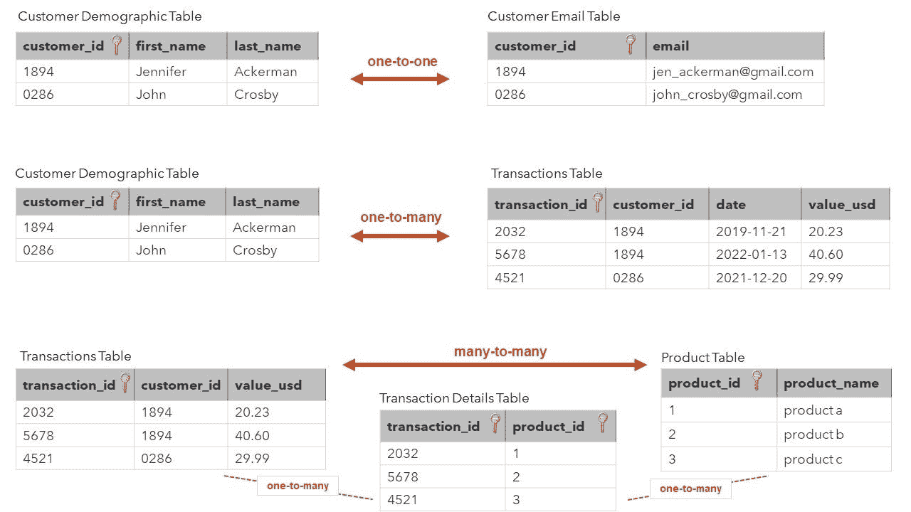
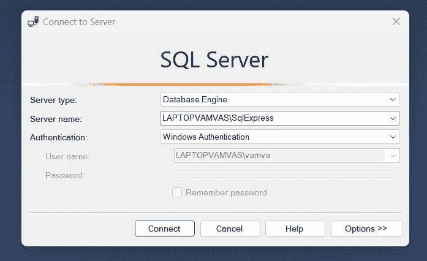
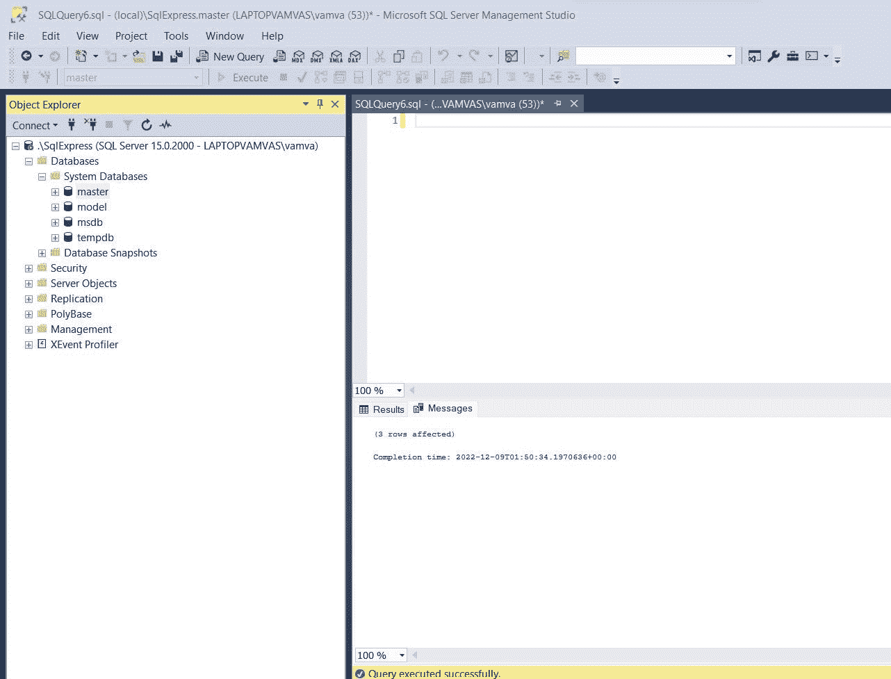
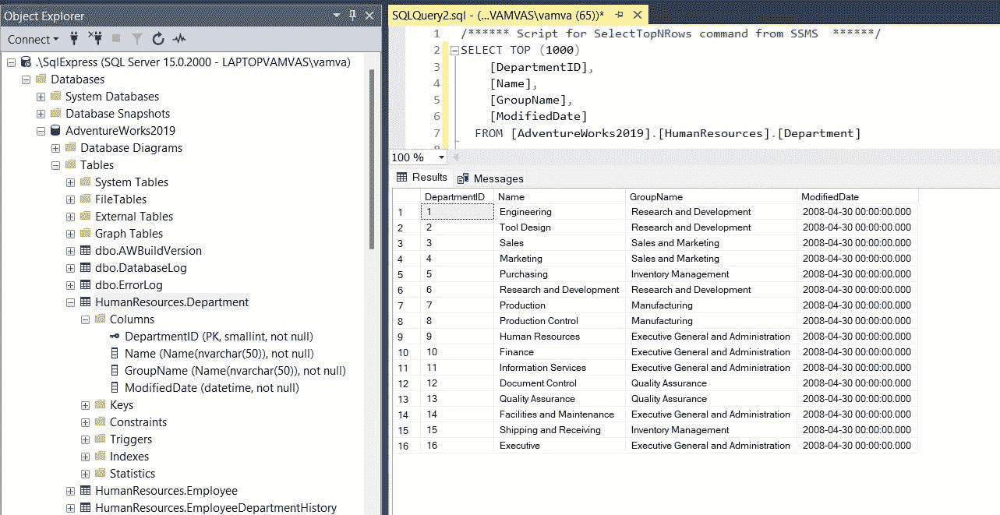

# 如何将您的 SQL 从零提高到数据科学家级别—第 1/3 部分

> 原文：<https://towardsdatascience.com/how-to-take-your-sql-from-zero-to-data-scientist-level-part-1-3-d7225d2d89ad>

## 设置 SQL 并执行您的第一个选择查询


张秀坤·马丁在 [Unsplash](https://unsplash.com/s/photos/step?utm_source=unsplash&utm_medium=referral&utm_content=creditCopyText) 上的照片

尽管 **SQL** 已经有 50 多年的历史，但它仍然是大多数数据科学团队从数据库中检索(大)数据的主要语言。查看 [Stack Overflow 2022 开发者调查](https://survey.stackoverflow.co/2022/#most-popular-technologies-language-prof)，有 3424 名专业人士目前的工作是数据科学家或机器学习专家。其中，58%的人在过去一年中使用过 SQL。相比之下，70%的人使用过 R，87%的人使用过 Python，40%的人在过去的一年中使用过这三种语言。换句话说，10 个数据科学团队中有 6 个会希望你在你的角色中使用 SQL。

在这个由三部分组成的系列文章中，我为希望按照优秀数据科学团队的标准学习 SQL 的有抱负的数据科学家创建了一个指南。该指南的结构如下:

## **第一部分:**

*   SQL 简介
*   安装 SQL 并加载您的第一个演示数据库
*   运行您的第一个选择查询！

## [第二部分 **:**](/how-to-take-your-sql-from-zero-to-data-scientist-level-part-2-3-bc1cbb48299e)

*   SQL 列表的终极指南:了解数据科学家经常使用的基本和高级 SQL 查询

## [**第三部分:**](https://medium.com/towards-data-science/how-to-take-your-sql-from-zero-to-data-scientist-level-part-3-3-fe3996059577)

*   查询优化、测试代码、数据科学编码最佳实践和培训计划

# **1。SQL 简介**


[剂量媒体](https://unsplash.com/@dose?utm_source=unsplash&utm_medium=referral&utm_content=creditCopyText)在 [Unsplash](https://unsplash.com/s/photos/study?utm_source=unsplash&utm_medium=referral&utm_content=creditCopyText) 上拍照

## **1.1。什么是 SQL？**

SQL 代表结构化查询语言，用于在关系数据库中操作数据(您经常会听到“我写了一个查询”这个术语指的是 SQL 代码)。

## **1.2。什么是关系数据库？**

从本质上讲，关系数据库只是表的集合(在计算机科学中，表被称为**关系**，因此得名关系数据库)。还有其他数据库对象，但是作为一名数据科学家，您 90%以上的时间将用于表。

*   在一个表中，每一行都必须是唯一的。换句话说，给定行的列值组合在任何其他行中都找不到。为此，我们通常为每个表行创建一个唯一的代理列。该列被称为表的**主键**
*   在表格中，每个单元格只能包含一个值。所以在一个单元格中不能有客户的名字和地址。这些必须分成不同的列

## **1.3。关系数据库中的表有哪些例子？**

根据我在一家电子商务/零售咨询公司担任高级分析师和移动游戏数据科学家的经验，您会发现几乎任何关系数据库中都有三个主要的表。

*   **客户**或**用户**表(客户 id、名字、姓氏、账户创建日期、地址等。)
*   **交易**表(transaction_id，购买时间戳，交易值等。)
*   **产品**表(产品 id、产品名称、产品部门等。)

## **1.4。作为一名数据科学家，我将编写哪些类型的 SQL 语句？**

作为一名数据科学家，您将主要使用 SQL 从数据库中提取数据(使用 **SELECT** 语句)。然后，数据将被加载到 R、Python 或 Excel 中，以执行您的分析。通常，您会想要组合来自多个表的信息。因此，您可能希望找到去年购买了产品 A 的客户。有时，尽管很少，您可能会改变或创建数据库中的表(如带有模型分数的表)。

## **1.5。表格是如何相互链接的？**

任何关系数据库的一个基本概念是表如何相互关联。有三种类型的关联或**关系**，如下所示(主键列旁边有一个钥匙图标)。为了链接这些表，我们使用共享列。



关系数据库中的关系类型[图片由作者提供]

## **一对一:**

*   ***客户人口统计*** 和 ***客户电子邮件*** 表具有一对一的关系，因为它们在 customer_id 列中都是唯一的
*   共享的 **customer_id** 列将用于链接表

## **一对多:**

*   ***客户人口统计*** 和 ***交易*** 表具有一对多关系，因为一个客户(customer_id)可以进行多个交易(transaction_id)，但是每个交易只能由一个客户进行
*   共享的 **customer_id** 列将用于链接表

## **多对多:**

*   **事务**和**产品**表具有多对多关系，因为每个事务可以有多个产品，并且每个产品可以在多个事务中
*   关系数据库只直接支持一对多关系。多对多关系是通过在第一个和第二个表之间添加第三个表来创建两个一对多关系而实现的。为此添加了**事务细节**表(主键是 transaction_id 和 product_id 列的组合)

# **2。安装 SQL 并运行您的第一个选择查询！**


照片由[阿毛里·梅希亚](https://unsplash.com/@amavcinema?utm_source=unsplash&utm_medium=referral&utm_content=creditCopyText)在 [Unsplash](https://unsplash.com/s/photos/create?utm_source=unsplash&utm_medium=referral&utm_content=creditCopyText) 上拍摄

到目前为止，我们已经介绍了关系数据库和 SQL 的基础知识。接下来，看看所有这些是如何与 RDBMSs(关系数据库管理系统)的使用结合在一起的将会很有用。有很多不同的**RDBMS**、比如 PostgreSQL、SQLite、MongoDB、MySQL、微软 SQL Server(或者只是 SQL Server)。有趣的是，尽管关系模型和 SQL 是 IBM 发明的，但其他公司立即将其视为游戏规则的改变者，导致 Oracle 通过首先在市场上提供 RDBMS 而击败了他们。但是即使有很多，所有的 RDBMSs 都有一个单一的主要价值点，它们提供了一个支持 SQL 和关系数据库的环境。

出于本指南的目的，我们将使用 SQL Server。为了可视化数据库和表并编写 SQL 查询，我们将使用**SSMS**(SQL Server Management Studio)。与 R 使用 RStudio 或 Python 使用 Spyder 的方式类似，SQL Server 使用 SSMS。

## **2.1 安装 SQL Server(速成版)**

*   转到[微软的下载页面](https://www.microsoft.com/en-gb/sql-server/sql-server-downloads)并下载 **SQL Server Express**
*   下载后，打开 SQL Server Express 安装程序
*   选择**基本**作为安装类型
*   选择安装路径(我建议保留默认值)
*   遵循安装程序的说明，直到完成安装

## **2.2 安装 SSMS**

*   SQL Server Express Edition 安装完成后，将提示您安装 SSMS
*   遵循默认步骤，直到完成
*   打开“SSMS ”,等待“连接到服务器”弹出式窗口出现
*   如下图所示，填写弹出窗口
*   如果服务器名**。\SqlExpress** 不起作用，使用**设备名称\SqlExpress** (谷歌查询如何在你的操作系统中找到你的计算机的设备名称会给你结果。例如，在我的例子中，它是 **LAPTOPVAMVAS\SqlExpress**



SSMS 连接到服务器[图片由作者提供]

完成后，您应该在 SSMS 看到三个面板，如下所示。在左侧面板中，您可以看到对象资源管理器。我们将连接到 SQL Server 的本地实例，即充当服务器的计算机(如果存在的话，这也可以是云服务器或物理服务器)。您还可以看到默认情况下在服务器中创建的四个系统数据库(通过安装)。右上面板是您将编写和执行 SQL 查询的区域，在右下面板，您还可以看到查询的结果。



安装后的 SSMS 快照[图片由作者提供]

## **2.3 加载 AdventureWorks 演示数据库(最后一步！)**

*   下载冒险作品**。从[下载备份文件部分](https://learn.microsoft.com/en-us/sql/samples/adventureworks-install-configure?view=sql-server-ver16&tabs=ssms#download-backup-files)提供的链接之一 bak** 文件(我建议选择 2019 OLTP 文件)
*   移动**。将 T17 文件备份到您的 SQL Server 备份位置。这取决于您的安装位置、实例名称和 SQL Server 版本。例如，SQL Server 2019 的默认实例的默认位置是*“C:\ Program Files \ Microsoft SQL Server \ MSSQL 15。SQLEXPRESS\MSSQL\Backup"***
*   在 SSMS，右键单击对象资源管理器中的**数据库**和**恢复数据库**以启动恢复数据库向导
*   选择**设备**，然后选择省略号(…)来选择设备。
*   选择**添加**然后选择。您最近移动到备份位置的 bak 文件
*   选择**确定**确认您的数据库备份选择并关闭选择备份设备窗口
*   选择**确定**恢复您的数据库
*   请访问微软的此[页面](https://learn.microsoft.com/en-us/sql/samples/adventureworks-install-configure?view=sql-server-ver16&tabs=ssms)获取最新的分步指南

完成最后一步后，您现在自豪地拥有了一个托管在您计算机上的演示关系数据库(见下图)。这是一个重要的里程碑，因为现在您已经创建了一项资产—随时使用实际数据练习 SQL 查询的能力！



加载了 AdventureWorks 演示数据库的 SSMS[图片由作者提供]

左侧面板是我们的演示数据库( **AdventureWorks2019** )。如您所见，我已经将其展开以查看数据库中的所有表，并且我还展开了**人力资源。Department** 表来检查其中的列(我还可以看到 **DepartmentID** 列旁边的键，表明它是该表的主键)。

我还在 SSMS 的右上角写了一个简单的 **SELECT** 语句(如下面的代码块所示),从 HumanResources 中提取前 1000 行。部门表。在右下角的面板上，您可以看到该查询的结果。该表有 16 行和 4 列。

```
SELECT TOP (1000) 
  [DepartmentID],
  [Name],
  [GroupName],
  [ModifiedDate]
FROM [AdventureWorks2019].[HumanResources].[Department]

--- or use the simpler

SELECT *
FROM [AdventureWorks2019].[HumanResources].[Department]
```

在本系列的下一篇文章中，我们将深入学习数据科学团队中使用的所有基本和高级 SQL 查询，并使用 SSMS 和我们的演示数据库练习它们。

我还推荐以下练习来探索 SSMS 和新加载的数据库中的一些功能:

*   通过从工具栏中选择**“新查询”**创建一个新的查询窗口，并将数据库从 master 更改为 **AdventureWorks2019** (工具栏左下角)
*   编写一个查询，从销售中选择 CustomerID 和 TerritoryID。客户表并执行它
*   使用对象资源管理器(左面板)在数据库中导航不同的表、列和主键
*   将您的 sql 查询保存在您的计算机中(作为. SQL 文件),并使用 SSMS 加载它
*   将查询结果保存为. csv 文件(通过右键单击右下角面板的结果选项卡)

我希望这篇文章对你有所帮助，并祝你在查询中愉快！

# **敬请期待第二部！**

如果你喜欢阅读这篇文章，并想了解更多，不要忘记 [**订阅**](https://medium.com/@alex.vamvakaris.ds/subscribe) 将我的故事直接发送到你的收件箱。

在下面的链接中，您还可以找到一个免费的 PDF 演示，介绍如何使用 r。

[](https://www.aspiringdatascientist.net/community) 