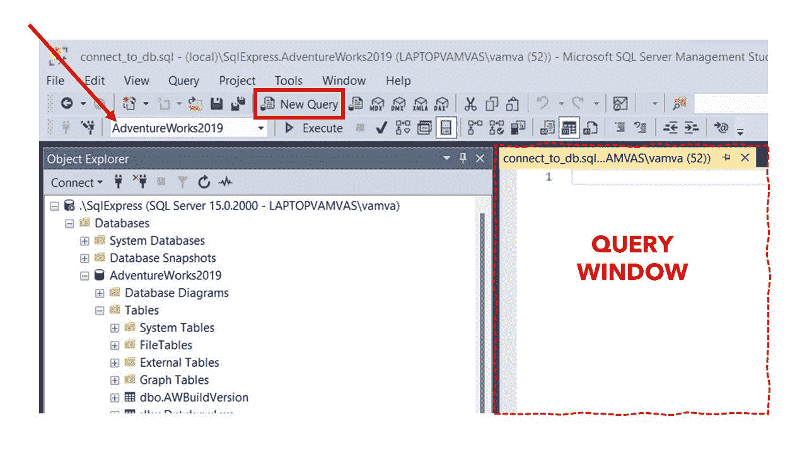
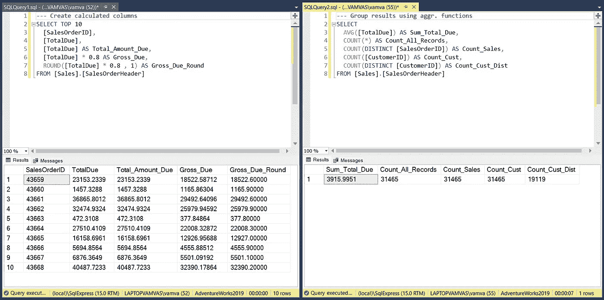
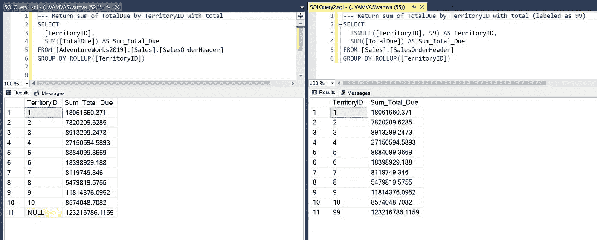
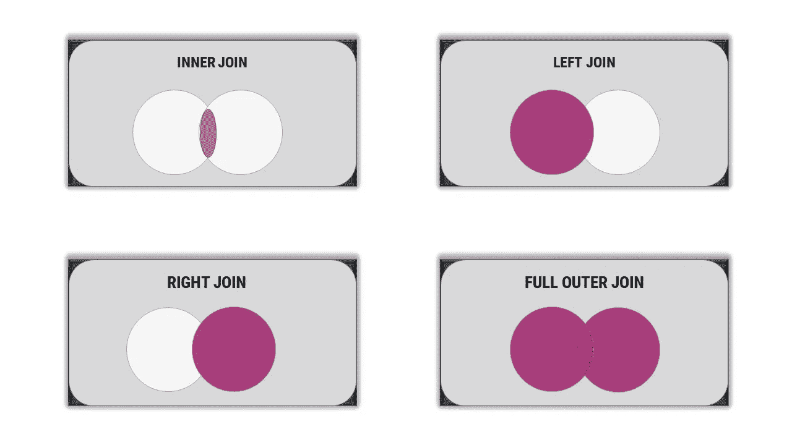
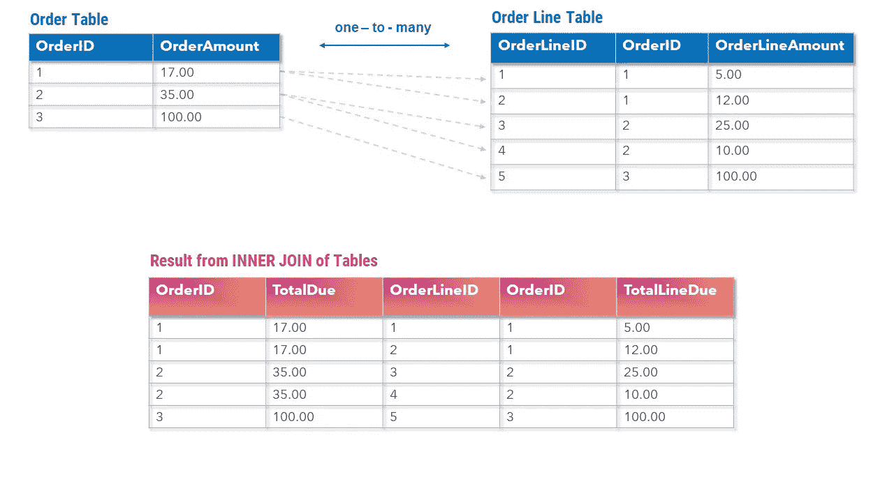
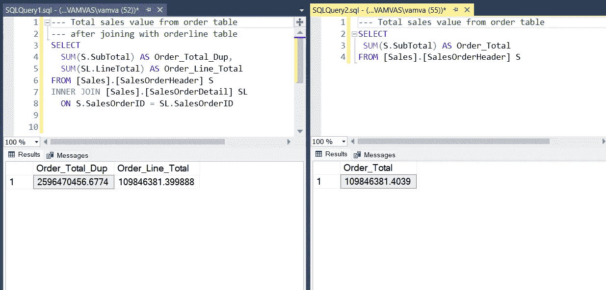
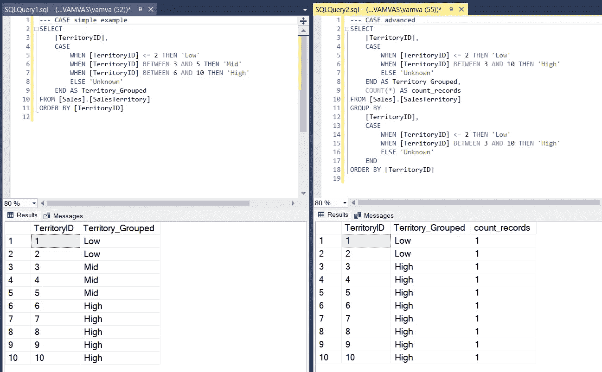
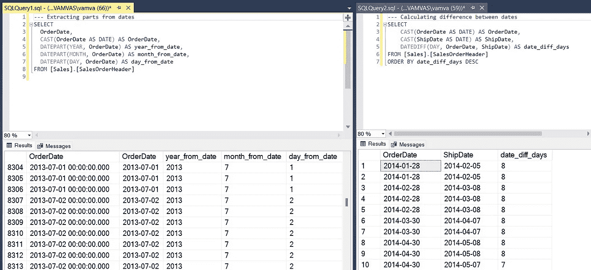
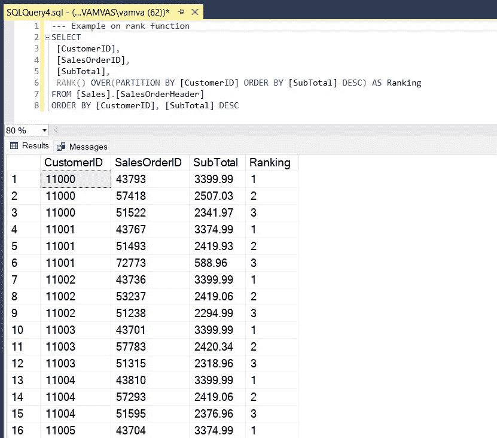
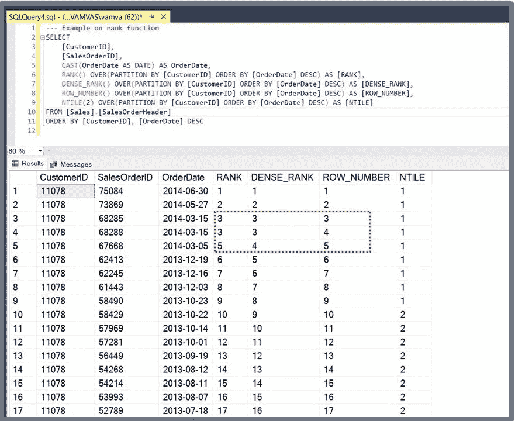

# 如何将您的 SQL 从零提高到数据科学家级别—第 2/3 部分

> 原文：<https://towardsdatascience.com/how-to-take-your-sql-from-zero-to-data-scientist-level-part-2-3-bc1cbb48299e>

## SQL 列表的终极指南:了解数据科学家经常使用的基本和高级 SQL 查询


[Samule 孙](https://unsplash.com/@samule?utm_source=unsplash&utm_medium=referral&utm_content=creditCopyText)在 [Unsplash](https://unsplash.com/?utm_source=unsplash&utm_medium=referral&utm_content=creditCopyText) 上的照片

## **简介**

您是否希望按照优秀数据科学团队的标准学习 SQL？如果是这样，那你来对地方了！在 [**第 1 部分**](https://medium.com/@alex.vamvakaris.ds/how-to-take-your-sql-from-zero-to-data-scientist-level-part-1-3-d7225d2d89ad) 中，我们设置了 SQL，并在 AdventureWorks2019 演示数据库上执行了一个简单的 SELECT 查询(涉及到 SQL 和关系数据库的理论)。在本系列的这一部分中，我们将更深入地研究 SQL，从一个简单的两行 SELECT 语句开始，一直到更复杂的查询。

## **第二部分**

*   用 SELECT 语句提取数据
*   如何连接数据库中的不同表
*   高级 SQL 语句:CASE 表达式，处理日期、cte、子查询和排名函数

## [第三部分](/how-to-take-your-sql-from-zero-to-data-scientist-level-part-3-3-fe3996059577)

*   查询优化、测试代码、数据科学编码最佳实践和培训计划

## 开始之前

**这些步骤不是遵循指南的强制要求，但是它们将允许您自己执行查询和练习 SQL*

*   打开 SSMS 并连接到 SQL server
*   从工具栏中选择“新建查询”，查询窗口将在右侧面板打开
*   最后，将数据库从 master 更改为 AdventureWorks2019，以将查询窗口连接到演示数据库，这样就可以开始了



连接 SSMS 的一个数据库，打开一个新的查询窗口[图片由作者提供]

*👉如果你需要以上任何方面的帮助，在* [***第一部分***](https://medium.com/@alex.vamvakaris.ds/how-to-take-your-sql-from-zero-to-data-scientist-level-part-1-3-d7225d2d89ad) 中有一个分步指南

# **1。在 SQL 领域，SELECT 语句是王道**


Rafael Rex Felisilda 在 [Unsplash](https://unsplash.com/s/photos/king-chess?utm_source=unsplash&utm_medium=referral&utm_content=creditCopyText) 上拍摄的照片

作为一名数据科学家，您使用 SQL 的主要目的是从数据库表中提取数据。对于每个这样的查询，将使用 SELECT 语句。SELECT 语句的语法由以下六个子句组成，每个子句都旨在优化查询，以便只返回所需的数据。

> **选择** ( *列列表)*
> 
> **出自** ( *表参考)*
> 
> **其中** ( *过滤条件)*
> 
> **分组依据** ( *分组规范)*
> 
> **有**(后分组*过滤条件)*
> 
> **订单由** ( *订单条件)*

# 1.1 评估顺序

当执行 SELECT 语句时，每个子句都按特定的顺序进行计算。这与 SQL 的编写顺序不同(语法如上所示)。评估的顺序是引擎盖下发生的事情。您可以把它想象成一个虚拟表，随着我们从一个子句前进到下一个子句，它会不断变化，直到返回结果。对求值顺序的良好理解不仅有助于您编写更高效的查询，还能帮助初学者更快地进步。

1.  条款中的**是强制性的，首先执行。它用于在数据库中选择我们想要从中提取数据的表**
2.  然后在 **WHERE** 子句(如果指定了)中使用这些结果，根据某些条件过滤表中的行
3.  然后在 **GROUP BY** 子句(如果指定了一个)中使用结果对表进行分组
4.  然后，分组的结果在 **HAVING** 子句中使用(如果指定了一个子句，它也需要 GROUP BY)来过滤分组的行
5.  执行完上面的最后一个子句后，结果被传递到(强制的) **SELECT** 子句，在那里选择列
6.  最后，对 **ORDER BY** 子句进行求值(如果指定了一个子句)以对结果中的列进行排序

还值得一提的是，在 SQL 访谈中最常见的两个问题是解释 GROUP BY 和 HAVING(稍后将详细介绍)之间的区别，以及遍历 SELECT 语句的求值顺序。

# **1.2 从**中选择&

让我们从最简单的 SELECT 语句开始，只使用两个强制子句 SELECT 和 FROM:

*   FROM 子句中的表引用采用[database]的形式。[模式]。[表格]。我们可以省略[database]部分，因为我们将在示例中仅使用 AdventureWorks2019 数据库，并且我们已经连接(您可以将模式视为“相似”表的容器)
*   DISTINCT 和 TOP 关键字的开销很大(就内存而言)，所以要小心有选择地使用它们

```
---=================================
--- Select all columns and rows
---=================================
SELECT *
FROM [AdventureWorks2019].[Sales].[SalesOrderHeader]

---=================================
--- Return the top 10 rows and all columns
---=================================
SELECT TOP 10 *
FROM [Sales].[SalesOrderHeader]

---=================================
--- Select all rows for specified columns
---=================================
SELECT
  [SalesOrderID],
  [OrderDate],
  [TotalDue]
FROM [Sales].[SalesOrderHeader]

---=================================
--- Select distinct rows for specified columns
---=================================
SELECT DISTINCT
  [SalesOrderID],
  [OrderDate],
  [TotalDue]
FROM [Sales].[SalesOrderHeader]
```

## 计算列

您可以使用算术运算符或函数**创建计算列**。我们可以使用**作为**关键字来命名一个计算列或重命名结果中的现有列。

```
---=================================
--- Create calculated columns
---=================================
SELECT TOP 10
  [SalesOrderID],
  [TotalDue],
  [TotalDue] AS Total_Amount_Due,
  [TotalDue] * 0.8 AS Gross_Due,
  ROUND([TotalDue] * 0.8 , 1) AS Gross_Due_Round
FROM [Sales].[SalesOrderHeader]
```

## 空值

SQL 中的一个关键概念是空值。空值用于标记缺少的数据(没有对该单元格进行任何输入)。这不同于包含空格或零值的单元格。把它们想象成 SQL 的 NA。

## 聚集

您也可以使用函数创建聚合结果，如下例所示:

*   **COUNT(*):** 返回表格中所有行的计数
*   **COUNT( *列* ):** 返回该列所有非空记录的计数
*   **COUNT(DISTINCT *列* ):** 返回该列的非重复值的计数。NULL 也将被计为值之一
*   **COUNT(*)= COUNT(*SalesOrderID*)=****COUNT(DISTINCT*SalesOrderID*):**SalesOrderID 列是表的主键，因此对于行是唯一的
*   **COUNT(DISTINCT*CustomerID*)**<**COUNT(*CustomerID*):**CustomerID 列有重复值(一个客户可以有多个订单)
*   您可以在此 处找到 SQL Server [**聚合函数的完整列表**](https://learn.microsoft.com/en-us/sql/t-sql/functions/aggregate-functions-transact-sql?view=sql-server-ver16)

```
---=================================
--- Group results using aggr. functions
---=================================
SELECT
  AVG([TotalDue]) AS Sum_Total_Due,
  COUNT(*) AS Count_All_Records,
  COUNT(DISTINCT [SalesOrderID]) AS Count_Sales,
  COUNT([CustomerID]) AS Count_Cust,
  COUNT(DISTINCT [CustomerID]) AS Count_Cust_Dist
FROM [Sales].[SalesOrderHeader]
```



来自示例选择查询的 SSMS 结果[图片由作者提供]

我建议您练习对不同的列(有和没有 NULL)使用 COUNT 和其他聚合函数，以便更好地理解 SQL 的行为。还值得一提的是，SQL 中的语法不区分大小写。所以我们可以写 SeLeCt 或者 SELECT，coUnt 或者 COUNT，查询还是会执行。当需要提高代码可读性时，我们将使用 capital(我们将在本系列的第 3 部分中介绍编码最佳实践)。

# 1.3 哪里

WHERE 子句获取 FROM 子句选择的数据，并根据某种筛选条件对每一行进行评估:

*   评估为 TRUE 的那些行将作为查询结果的一部分返回
*   评估为未知或假的那些不包括在结果中(对于空值返回未知)

为了评估过滤条件，我们将使用**谓词**。还有很多，就一个一个来说吧。

## **比较谓词**

这些是你在数学中用来比较的常用符号。

```
---=================================
--- Equal 
---=================================
SELECT *
FROM [Sales].[SalesOrderHeader]
WHERE [TerritoryID] = 6

---=================================
--- Not Equal
---=================================
SELECT
  [SalesOrderID],
  [TerritoryID]
FROM [Sales].[SalesOrderHeader]
WHERE [TerritoryID] <> 6

---=================================
--- Greater or equal
---=================================
SELECT
  [SalesOrderID],
  [TerritoryID]
FROM [Sales].[SalesOrderHeader]
WHERE [TerritoryID] >= 6
```

## BETWEEN 谓词

BETWEEN 谓词与 AND 关键字结合使用，用于标识可作为搜索条件包含的值范围。

```
---=================================
--- Filter by numerical range
---=================================
SELECT
  [SalesOrderID],
  [TerritoryID]
FROM [Sales].[SalesOrderHeader]
WHERE [TerritoryID] BETWEEN 2 AND 6

---=================================
--- Filter by date range
---=================================
SELECT COUNT(*)
FROM [Sales].[SalesOrderHeader]
WHERE [OrderDate] BETWEEN '2013-06-01' AND '2013-06-30'
```

## 在谓词中

确定列值是否与列表中的任何值匹配。

```
---=================================
--- Filter by values in a list
---=================================
SELECT
  [SalesOrderID],
  [TerritoryID]
FROM [Sales].[SalesOrderHeader]
WHERE [TerritoryID] IN (2, 3, 6)
```

## LIKE 谓词

如果说有哪个谓词可以好玩，那就是 LIKE 谓词。使用 LIKE 谓词，您可以指定仅与存储在数据库中的值相似的值(以下示例中使用的通配符%，因供应商而异)。

```
---=================================
--- Values that start with 43
---=================================
SELECT TOP 5
  [SalesOrderID]
FROM [Sales].[SalesOrderHeader]
WHERE [SalesOrderID] LIKE '43%'

---=================================
--- Values that contain 43
---=================================
SELECT 
  COUNT(DISTINCT [CustomerID])
FROM [Sales].[SalesOrderHeader]
WHERE [SalesOrderID] LIKE '%43%'
```

## 为空

正如我们之前所讨论的，使用普通谓词，空值将总是被评估为未知，因此不会返回任何内容。所以我们需要另一个返回 true 或 false 的谓词。因此，SQL 提供了 IS NULL 条件。

```
---=================================
--- Select only values with NULL
---=================================
SELECT 
  [SalesOrderID],
  [CurrencyRateID]
FROM [Sales].[SalesOrderHeader]
WHERE [CurrencyRateID] IS NULL
```

## 多重比较

如果存在多个搜索条件，则使用逻辑运算符(OR、AND、NOT)将它们组合起来。执行优先级的规则是，括号> NOT > AND > OR。注意抽查多重比较的结果(在下面的例子中，版本 1 将通过改变括号给出与版本 2 不同的结果)。

```
---=================================
--- Version 1
---=================================
SELECT *
FROM   [Sales].[SalesOrderHeader]
WHERE 
[totaldue] < 3000 AND ([TerritoryID] < 2 OR [TerritoryID] > 7) 

---=================================
--- Version 2
---=================================
SELECT *
FROM   [Sales].[SalesOrderHeader]
WHERE 
([totaldue] < 3000 AND [TerritoryID] < 2) OR [TerritoryID] > 7
```

# 1.4 分组依据

GROUP BY 子句用于对数据(从 from 或 WHERE 传递)进行分组，其方式与您在 excel 中使用透视表或在 r 中使用 dplyr 中的 group_by()的方式相同，使用不带聚合的 GROUP BY 将返回所选列的值的不同组合(与使用 distinct 的结果相同)。

```
---=================================
--- Return distinct values in TerritoryID
---=================================
SELECT
  [TerritoryID]
FROM [AdventureWorks2019].[Sales].[SalesOrderHeader]
GROUP BY [TerritoryID]

---=================================
--- Return sum of TotalDue by TerritoryID
---=================================
SELECT
  [TerritoryID],
  SUM([TotalDue]) AS Sum_Total_Due
FROM [AdventureWorks2019].[Sales].[SalesOrderHeader]
GROUP BY [TerritoryID]
```

## 总计和小计

我们还可以使用 **ROLLUP** 操作符获得总计或小计(占用大量内存)。正如您在下面的示例(左图)中所看到的，总数表示为 NULL。我们可以通过使用 **ISNULL** 函数将它替换为一个新值来解决这个问题。

```
---=================================
--- Return sum of TotalDue by TerritoryID with total
---=================================
SELECT
  [TerritoryID],
  SUM([TotalDue]) AS Sum_Total_Due
FROM [AdventureWorks2019].[Sales].[SalesOrderHeader]
GROUP BY ROLLUP([TerritoryID])

---=================================
--- Return sum of TotalDue by TerritoryID with total (labeled as 99)
---=================================
SELECT
  ISNULL([TerritoryID], 99) AS TerritoryID,
  SUM([TotalDue]) AS Sum_Total_Due
FROM [Sales].[SalesOrderHeader]
GROUP BY ROLLUP([TerritoryID])
```



在 SSMS 使用 GROUP BY with ROLLUP 得到的结果[图片由作者提供]

# 1.5 拥有

HAVING 子句与 WHERE 完全相同，但只能应用于 GROUP BY 之后。换句话说，WHERE 用于筛选 FROM 的结果，而 HAVING 用于筛选 GROUP BY 的结果。记住虚拟表从一个子句传递到下一个子句的类比。

```
---=================================
--- Filter using column
---=================================
SELECT
  [TerritoryID],
  SUM([TotalDue]) AS Sum_Total_Due
FROM [Sales].[SalesOrderHeader]
GROUP BY [TerritoryID]
HAVING [TerritoryID] = 1

---=================================
--- Filter using aggregate
---=================================
SELECT
  [TerritoryID],
  SUM([TotalDue]) AS Sum_Total_Due
FROM [Sales].[SalesOrderHeader]
GROUP BY [TerritoryID]
HAVING SUM([TotalDue]) >= 15000000
```

# 1.6 订购依据

好了，还有最后一个条款，幸运的是这是最简单的。我们可以使用 ORDER by 子句按升序(大多数供应商的默认设置)或降序对 SELECT 结果进行排序。

```
---=================================
--- Sort by ascending order
---=================================
SELECT
  [TerritoryID],
  SUM([TotalDue]) AS Sum_Total_Due
FROM [Sales].[SalesOrderHeader]
GROUP BY [TerritoryID]
ORDER BY SUM([TotalDue])

---=================================
--- Combine all clauses and sort by descending order
---=================================
SELECT
  [TerritoryID],
  SUM([TotalDue]) AS Sum_Total_Due
FROM [Sales].[SalesOrderHeader]
WHERE [TerritoryID] >= 3
GROUP BY [TerritoryID]
HAVING SUM([TotalDue])  >= 15000000
ORDER BY [TerritoryID] DESC 
```

# 2.**如何连接不同的表**


马特·科菲尔在 [Unsplash](https://unsplash.com/s/photos/bridge?utm_source=unsplash&utm_medium=referral&utm_content=creditCopyText) 上拍摄的照片

通常，您需要在查询中从多个表中检索信息。有四种主要类型的连接子句(尽管实际上只有 INNER 和 LEFT 连接经常使用):

*   **内部连接:**只返回两个表中都存在的记录
*   **左连接:**只返回左表中存在的记录
*   **右连接:**只返回右表中存在的记录
*   **完全外部连接:**返回两个表中的所有记录



使用维恩图可视化连接[图片由作者提供]

好的，所以连接的类型决定了从表中保留哪些记录(行)。然后，我们可以使用一个或多个共享列将表链接在一起:

*   选择连接的类型
*   给表取别名(在我们的例子中是 S 和 T)
*   使用 ON 关键字指定用于连接表的共享列

```
---=================================
--- Inner join the sales and territory tables
---=================================
SELECT
  S.[TerritoryID],
  T.[Name]
FROM [Sales].[SalesOrderHeader] S
INNER JOIN [Sales].[SalesTerritory] T 
  ON S.TerritoryID = T.TerritoryID

---=================================
--- Left join the sales and customer tables (more complex)
---=================================
SELECT
  S.[TerritoryID],
  T.[Name],
  SUM([TotalDue]) AS Sum_Total_Due
FROM [Sales].[SalesOrderHeader] S
LEFT JOIN [Sales].[SalesTerritory] T
  ON S.TerritoryID = T.TerritoryID
GROUP BY 
  S.[TerritoryID],
  T.[Name]
HAVING T.[Name] IN ('Australia','United Kingdom')
```

## 处理重复

连接表时有一个主要考虑事项。当两个表之间的关系是一对多时，联接的结果将有重复项。



用一对多关系连接表[图片由作者提供]

这可能具有挑战性，并会导致错误，尤其是在涉及聚合时。我建议始终如一地验证柱子所处的水平。在上面的例子中，OrderAmount 值在订单级别(OrderID)是唯一的，但是连接的表将有重复的，并且不应该在聚合中使用(我们将在第 3 部分中讨论重复和如何对代码进行 QA 测试)。

```
---=================================
--- Total sales value from order table
---=================================
SELECT
 SUM(S.SubTotal) AS Order_Total --- correct
FROM [Sales].[SalesOrderHeader] S

---=================================
--- Total sales value from order table
--- after joining with orderline table
---=================================
SELECT
  SUM(S.SubTotal) AS Order_Total_Dup, --- duplicates
  SUM(SL.LineTotal) AS Order_Line_Total --- correct
FROM [Sales].[SalesOrderHeader] S
INNER JOIN [Sales].[SalesOrderDetail] SL
  ON S.SalesOrderID = SL.SalesOrderID
```



SSMS 一对多关系中的重复示例[图片由作者提供]

# 3.高级 SQL 查询(我的英雄)


Erik Mclean 在 [Unsplash](https://unsplash.com/s/photos/COMIC-BOOKS?utm_source=unsplash&utm_medium=referral&utm_content=creditCopyText) 上拍摄的照片

最后，我还想向您展示一些作为数据科学家需要的更高级的工具。在过去的六年里，我用 SQL 编写了 1500 多个小时的代码，这些工具是我的英雄！

# 3.1 案例

CASE 语句允许您基于多个条件创建计算字段:

*   语法以关键字 **CASE** 开始，后跟一系列 **WHEN** 子句，并以 **END** 关键字结束
*   每个 **WHEN** 子句由一个条件和一个结果(如果该条件评估为真)组成(子句按照它们出现的顺序进行评估)
*   如果这些条件都不满足，将执行 **ELSE** 子句(如果不使用，不匹配的值将为空)
*   **ELSE** 子句是可选的，但是我强烈建议您使用它来确保您的代码按预期工作

```
---=================================
--- CASE simple example
---=================================
SELECT
  [TerritoryID],
  CASE 
    WHEN [TerritoryID] <= 2 THEN 'Low'
    WHEN [TerritoryID] BETWEEN 3 AND 5 THEN 'Mid'
    WHEN [TerritoryID] BETWEEN 6 AND 10 THEN 'High'
    ELSE 'Unknown'
  END AS Territory_Grouped
FROM [Sales].[SalesTerritory]
ORDER BY [TerritoryID]

---=================================
--- CASE advanced
---=================================
SELECT
  [TerritoryID],
  CASE 
    WHEN [TerritoryID] <= 2 THEN 'Low'
    WHEN [TerritoryID] BETWEEN 3 AND 10 THEN 'High'
    ELSE 'Unknown'
  END AS Territory_Grouped,
 COUNT(*) AS count_records
FROM [Sales].[SalesTerritory]
GROUP BY
  [TerritoryID],
  CASE 
    WHEN [TerritoryID] <= 2 THEN 'Low'
    WHEN [TerritoryID] BETWEEN 3 AND 10 THEN 'High'
    ELSE 'Unknown'
  END
ORDER BY [TerritoryID]
```



使用案例陈述[图片由作者提供]

# 3.2 日期

作为一名数据科学家，您需要经常处理数据中的日期。这通常包括使用以下两个函数。

## 日期部分()

用于提取日期的特定部分，如年、周、小时等。它接受两个参数作为输入；用于提取日期部分和日期本身的度量单位。我们还可以使用 **CAST** 函数来更改日期列的数据类型(在下面的示例中，我们将其从 datetime 更改为 date)。

```
---=================================
--- Extracting parts from dates
---=================================
SELECT
  CAST(OrderDate AS DATE) AS OrderDate,
  DATEPART(YEAR, OrderDate) AS year_from_date,
  DATEPART(QUARTER, OrderDate) AS quarter_from_date,
  DATEPART(MONTH, OrderDate) AS month_from_date
FROM [Sales].[SalesOrderHeader]
```

## DATEDIFF()

用于计算两个日期之间的差异。它接受三个参数作为输入；度量单位、开始日期和结束日期(从左到右)。

```
---=================================
--- Calculating difference between dates
---=================================
SELECT
  CAST(OrderDate AS DATE) AS OrderDate,
  CAST(ShipDate AS DATE) AS ShipDate,
  DATEDIFF(DAY, OrderDate, ShipDate) AS date_diff_days
FROM [Sales].[SalesOrderHeader]
ORDER BY date_diff_days DESC
```



在 SSMS 处理日期[图片由作者提供]

# 3.3 CTE 和子查询

您会在大多数讲授 SQL 的教科书中找到子查询，但这不是我在本节中添加它们的原因。我的理由是，我想展示它们的缺点，以及使用 cte(公共表表达式)如何会更好。

## 子查询

子查询是嵌套在另一个 SELECT 语句中的 SELECT 语句。它们也可以用在 SELECT 语句的 FROM 子句中。无论哪种方式，子查询的结果都将在主 SELECT 语句中使用。让我们来看一些例子。

```
---=================================
--- Using nested subqueries
---=================================
SELECT 
  COUNT([CustomerID])
FROM [Sales].[SalesOrderHeader]
WHERE [CustomerID] IN ( --- nested subquery starts here
 SELECT [CustomerID]
 FROM [Sales].[Customer]
 WHERE [TerritoryID] = 4
)

---=================================
--- Using subqueries in the FROM
---=================================
SELECT 
  COUNT(a.[CustomerID]) AS Count_Cust
FROM ( --- subquery starts here
 SELECT *
 FROM [Sales].[SalesOrderHeader]
 WHERE [TerritoryID] = 4
) a -- you need to add an alias at the end
```

## **CTEs**

尽管 cte 具有与子查询相同的功能(创建一个临时结果，然后可以在主选择中使用)，但它们还有三个主要优点:

*   可在查询的不同部分重用
*   易于验证和理解(可读性更强)
*   cte 通常比子查询更有效

```
---======================
--- Using a single CTE
---======================
WITH 
select_customers AS (
  SELECT *
  FROM [Sales].[SalesOrderHeader]
  WHERE [TerritoryID] = 4
)
SELECT 
  COUNT([CustomerID])
FROM select_customers

---======================
--- Using multiple CTEs
---======================
WITH 
select_customers AS (
  SELECT 
    [CustomerID]
  FROM [Sales].[Customer]
  WHERE [TerritoryID] = 4
),
select_orders AS (
  SELECT 
    CAST(OrderDate AS DATE) AS OrderDate,
    [SalesOrderID],
    [CustomerID],
    [SubTotal]
  FROM [Sales].[SalesOrderHeader]
  WHERE [SubTotal] >= 2000
)
SELECT
  c.[CustomerID],
  SUM([SubTotal]) AS Sum_Total_Due
FROM select_customers c
INNER JOIN select_orders o
  ON c.[CustomerID] = o.[CustomerID]
GROUP BY c.[CustomerID]
ORDER BY Sum_Total_Due
```

在决定是使用 CTE 还是子查询时，考虑查询的复杂性、性能要求和查询的可读性非常重要。通常，cte 是多次使用的复杂查询的好选择，而子查询是只使用一次的简单查询的好选择。

# 3.4 排名功能

排名(窗口)函数是文章中最复杂的部分。然而，你将需要在你的数据科学查询中使用它们，另外，这些经常在面试中被问到。

顾名思义，它们是用来对行进行排序的，但是每种方法都略有不同。但是我想得太多了。让我们首先用下面的例子来检查语法:

*   我们将使用 **RANK()** 作为 SalesOrderHeader 表中的排名函数
*   我们希望对数据进行分区，这样 RANK()每次都不会应用于整个数据集，而是应用于行的子集。在我们的例子中，我们使用了由 CustomerID 划分的**分区，因此排名被分别应用于每个客户**
*   最后，我们希望根据 SubTotal 列(即订单的价值)对每个客户的订单进行排序，从 1 开始表示最高支出，依此类推。这就是人们熟悉的的**命令发挥作用的地方**

```
---=================================
--- Using the rank function
---=================================
SELECT 
  [CustomerID],
  [SalesOrderID],
  [SubTotal],
  RANK() OVER(PARTITION BY [CustomerID] ORDER BY [SubTotal] DESC) AS Ranking
FROM [Sales].[SalesOrderHeader]
ORDER BY [CustomerID], [SubTotal] DESC
```



SQL 中 RANK()如何工作的示例[图片由作者提供]

作为一名数据科学家，您将经常使用 SQL 中的四个排名函数。让我们使用来自 **SalesOrderHeader** 表的数据来看看它们之间的区别。

```
---=================================
--- Example using all ranking functions
---=================================
SELECT 
  [CustomerID],
  [SalesOrderID],
  CAST(OrderDate AS DATE) AS OrderDate,
  RANK() OVER(PARTITION BY [CustomerID] ORDER BY [OrderDate] DESC) AS [RΑΝΚ],
  DENSE_RANK() OVER(PARTITION BY [CustomerID] ORDER BY [OrderDate] DESC) AS [DENSE_RANK],
  ROW_NUMBER() OVER(PARTITION BY [CustomerID] ORDER BY [OrderDate] DESC) AS [ROW_NUMBER],
  NTILE(2) OVER(PARTITION BY [CustomerID] ORDER BY [OrderDate] DESC) AS [NTILE]
FROM [Sales].[SalesOrderHeader]
WHERE [CustomerID] = 11078
ORDER BY [CustomerID], [OrderDate] DESC
```



排名函数如何不同的示例[图片由作者提供]

*   **ROW_NUMBER()** :为结果集中的每一行分配一个唯一的序列号
*   **RANK():** 返回结果集分区中每行的排名。在平局的情况下，特定行的等级是 1 加上它前面的等级值的数量
*   **DENSE_RANK()** :返回结果集分区中每行的排名。在出现平局的情况下，特定行的排名是 1 加上在它之前的不同排名值的数量
*   **NTILE(n):** 将结果集中的行分成 n 个相等的组(或平铺块)，并根据每一行所属的组为每一行指定一个等级。该函数可用于计算中位数和其他百分位数

就这样，我们结束了。我们已经谈了很多，所以我相信**祝贺**已经准备好了！🚀🚀🚀

**我还提供了一些练习来帮助你提高 SQL 技能。**

1.  查找到期总金额(SalesOrderHeader。TotalDue)，按月份和年份分组(SalesOrderHeader。订单日期)。然后过滤行，只保留一月到三月。最后，重命名列，并按年份和月份对结果进行排序(降序)
2.  求平均金额(SalesOrderDetail **)。** LineTotal)，按年份分组(SalesOrderHeader。订单日期)和产品名称(产品。姓名)
3.  尝试练习 2，使用 cte
4.  在练习 2 中，使用 ROW_NUMBER()只保留每月表现最好的前 5 个产品(LineTotal aggregate)。使用 cte
5.  使用 CASE 语句创建一个新的计算字段，该字段拆分到期总金额(SalesOrderHeader。TotalDue)分成五个桶(低、中等。)，然后对于每个桶，求平均运费成本(SalesOrderHeader。运费)

我希望这篇文章对你有所帮助，并祝你在查询中愉快！

# 请继续关注第 3 部分！

如果你喜欢阅读这篇文章，并想了解更多，别忘了订阅[](https://medium.com/@alex.vamvakaris.ds/subscribe)**，让我的故事直接发送到你的收件箱。**

**在下面的链接中，您还可以找到一个免费的 PDF 演示，介绍如何使用 r。**

**[](https://www.aspiringdatascientist.net/community) [## 数据科学项目清单-有抱负的数据科学家

### 我是一名拥有 7 年以上分析经验的数据科学家，目前在英国伦敦的一家游戏公司工作。我的…

www.aspiringdatascientist.net](https://www.aspiringdatascientist.net/community)**