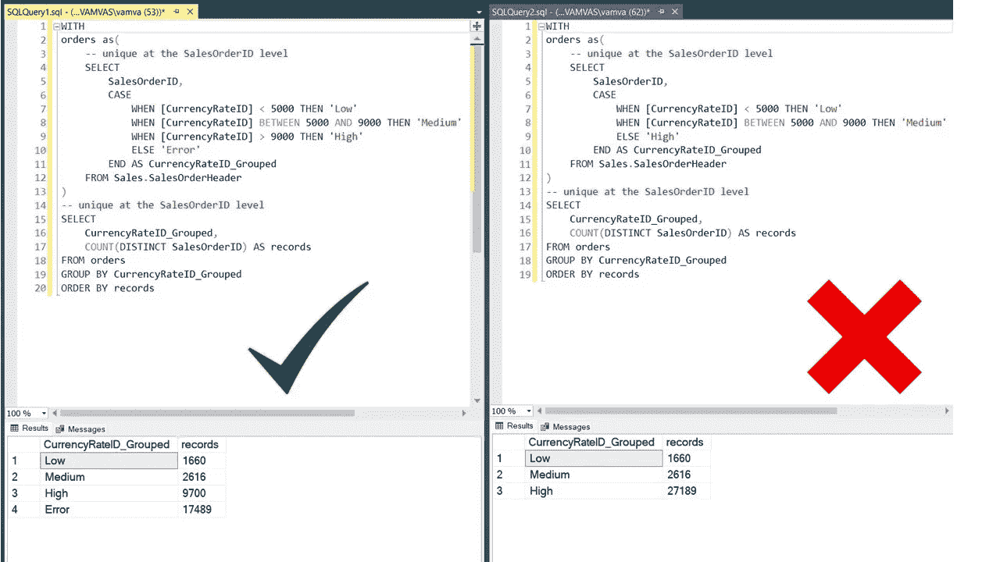
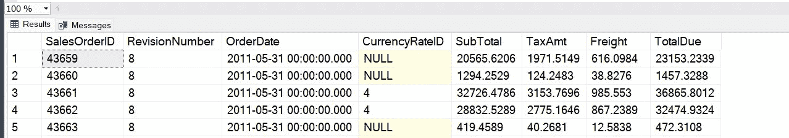
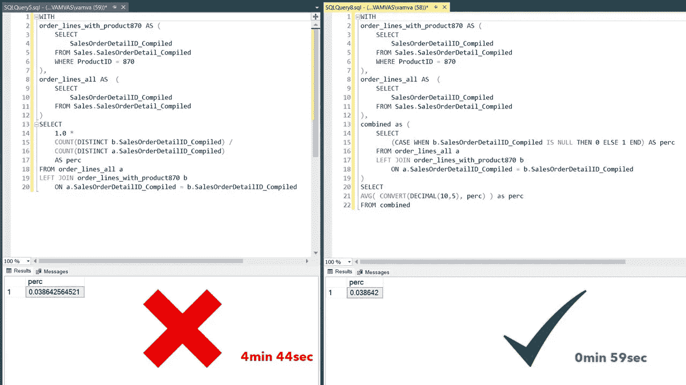
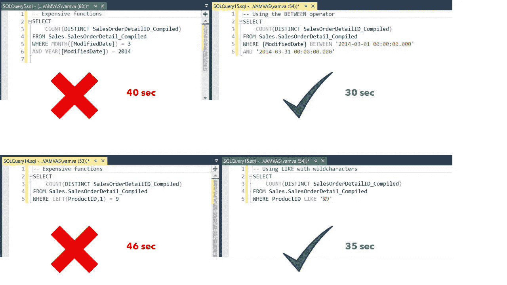
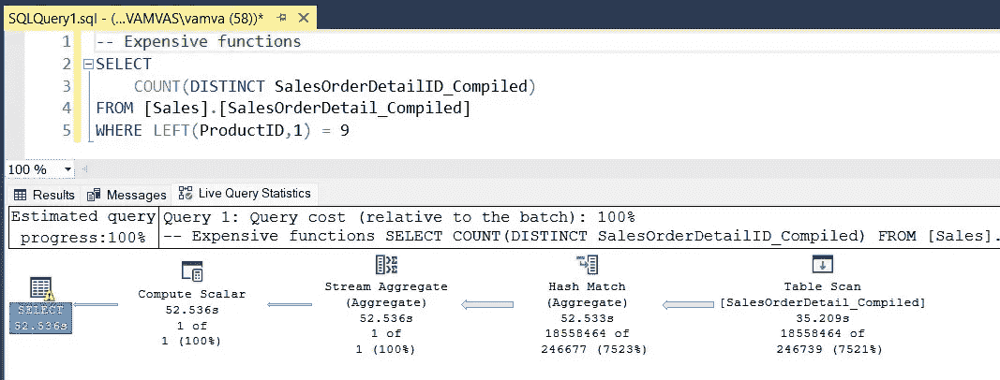
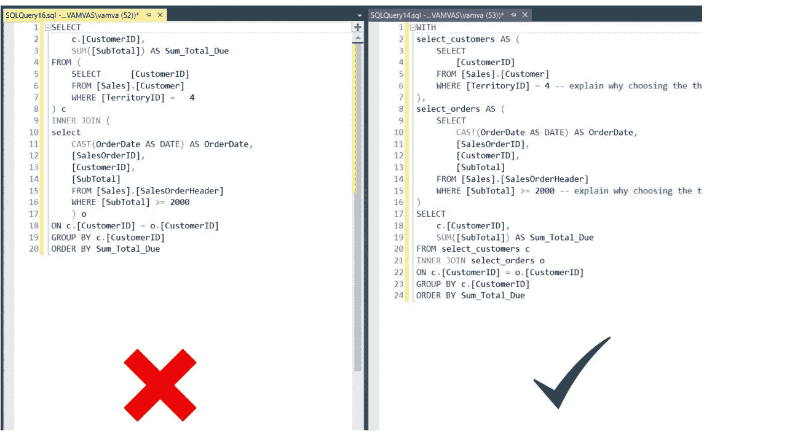

# 如何将您的 SQL 从零提高到数据科学家级别—第 3/3 部分

> 原文：<https://towardsdatascience.com/how-to-take-your-sql-from-zero-to-data-scientist-level-part-3-3-fe3996059577>

## 通过这三个简单的技巧，将您的 SQL 编码技能提升到一个新的水平


洛伦佐·埃雷拉在 [Unsplash](https://unsplash.com/?utm_source=unsplash&utm_medium=referral&utm_content=creditCopyText) 上的照片

## 介绍

欢迎来到本系列的最后一部分。在前两部分中，我们建立了基本和高级 SQL 查询的坚实基础，并使用 **SSMS** 和演示数据库 **AdventureWorks** 来执行它们。在这最后一部分中，我们将介绍将您的 SQL 提升到下一个级别的一系列技能。这些都是同等重要的，如果不是更重要的话，比简单地知道如何写 SQL，因为它们将把你的查询变成一个准确的，易读的可复制的资产！

## 第三部分

*   QA 测试您的 SQL 查询
*   SQL 查询的优化
*   数据科学编码标准和最佳实践
*   培训计划

## 👇链接到第 1 和第 2 部分

[](/how-to-take-your-sql-from-zero-to-data-scientist-level-part-1-3-d7225d2d89ad) [## 如何将您的 SQL 从零提高到数据科学家级别—第 1/3 部分

### 设置 SQL 并执行您的第一个选择查询

towardsdatascience.com](/how-to-take-your-sql-from-zero-to-data-scientist-level-part-1-3-d7225d2d89ad) [](/how-to-take-your-sql-from-zero-to-data-scientist-level-part-2-3-bc1cbb48299e) [## 如何将您的 SQL 从零提高到数据科学家级别—第 2/3 部分

### SQL 列表的终极指南:了解数据科学家经常使用的基本和高级 SQL 查询

towardsdatascience.com](/how-to-take-your-sql-from-zero-to-data-scientist-level-part-2-3-bc1cbb48299e) 

# 1.QA 测试您的 SQL 查询


照片由 [DeepMind](https://unsplash.com/@deepmind?utm_source=unsplash&utm_medium=referral&utm_content=creditCopyText) 在 [Unsplash](https://unsplash.com/s/photos/safety-net?utm_source=unsplash&utm_medium=referral&utm_content=creditCopyText) 上拍摄

一个常见的误解是，优秀的数据科学家对 SQL 编码的熟练程度如此之高，以至于他们从不出错，这也是我在职业生涯开始时强烈持有的观点。事实上，每个人都会犯错。即使是外科医生和飞行员也容易犯错误。根据不同的经验，错误率会有所不同，但最终，每个人都会有一天或几天不在状态。

幸运的是，有对策可以最小化这种错误。它们被称为**清单**！这不是一个新想法，也不是数据科学家独有的。在航空公司，每个飞行员在飞机起飞前或降落时都要进行一套相同的基本测试。类似地，您可以采取一些步骤来测试您的 SQL 查询没有返回不正确的结果(即，可以安全离开)。我在下面强调了三个主要问题。

## 1.1 结果的唯一性

SQL 清单中的第一项是结果的唯一性。在大多数查询中，作为一名数据科学家，您将不得不联接多个表以获得期望的结果。当两个表之间的关系是一对多时，连接的表将有重复的表。因此，在您运行的每个查询中，确保您已经检查了生成的连接表是唯一的级别(即列)。

```
WITH
orders as(
  -- unique at the SalesOrderID level
  SELECT *
  FROM Sales.SalesOrderHeader
),
orders_detail as (
  -- unique at the SalesOrderDetailID level
  SELECT *
  FROM Sales.SalesOrderDetail
)
-- unique at the SalesOrderDetailID level
SELECT *
/* SELECT COUNT(*), COUNT(DISTINCT SalesOrderDetailID)*/
FROM orders o
INNER JOIN orders_detail ol ON o.SalesOrderID = ol.SalesOrderID
```

在上面的例子中，你可以看到我注释掉了第 14 行，我用它来检查我的结果的级别。这个简单的查询将 COUNT(*)的结果与 COUNT(DISTINCT *列*)进行比较，如果它们匹配，它将验证该表在该级别上是惟一的。如您所见，我添加了一个注释，指出结果和 cte 中的表的唯一性。这种做法还会使在正确的级别上连接表变得更加容易！

## 1.2 计算列

查询中最棘手的部分之一是计算列。这些容易出现逻辑和计算错误。有时，问题可能是该列有空值，或者您选择的排名函数没有按预期工作。其他时候，您的一些条件可能会在 CASE 语句中重叠，从而导致不正确的结果。

*   使用几个随机挑选的记录抽查结果(特别是对于棘手的情况)
*   始终在 CASE 语句中使用 ELSE 子句来标记不匹配的记录



正确和不正确地使用 ELSE 子句的并排查询[图片由作者提供]



CurrencyRateID 列的空记录示例[图片由作者提供]

在上面的示例中，问题是 CurrencyRateID 列的数据中存在空值。这些被错误地添加到右面板查询中的“高”组，但在左面板中使用 ELSE 语句对不匹配的条件进行了正确标记。

## 1.3 与基线数字的比较

最后，将查询的顶级结果与公司仪表板进行比较总是很有帮助的。这很简单，只需过滤特定日期的结果，并将其与仪表板中的结果进行比较(例如，订单数量、总支出等)。).这一部分尤其有助于仔细检查您是否遗漏了所需的健全性过滤器，例如从机器人中排除测试人员帐户或活动。

# 2.**SQL 查询的优化**


照片由[马丁·杰恩伯格](https://unsplash.com/@martinjernberg?utm_source=unsplash&utm_medium=referral&utm_content=creditCopyText)在 [Unsplash](https://unsplash.com/photos/oBX-b6ltYts?utm_source=unsplash&utm_medium=referral&utm_content=creditCopyText) 拍摄

出于本节的目的，我通过多次联合 SalesOrderHeader 表创建了一个新表。新表名为 SalesOrderDetail_Compiled，有 6500 万行。

## 2.1 限制 cte 中的记录数量

尽管这看起来非常简单明了，但在我培训分析师的经验中，这是最常被忽略的步骤。查看下面的示例，您可以看到，通过在 cte 中聚合结果，然后连接它们(右图),而不是获取所有行，连接，然后聚合(左图),我们的运行时间大大减少了。


通过首先在 CTEs 内聚合来提高性能[图片由作者提供]

## 2.2 避免使用非重复计数

DISTINCT 关键字是 SQL 中开销最大的关键字之一。这是有意义的，因为为了得到不同的结果，SQL 必须扫描列的每一行。当然，在某些情况下，COUNT( *列*)和 COUNT(DISTINCT *列*)会给出相同的结果(例如，当列是主键时)。在这种情况下，明显的建议是省略 DISTINCT 关键字。

但是对于有重复项的列该怎么办呢？在下面的示例中，我们在右侧面板中创建了一个新的二进制列。左连接中不匹配的记录将具有空值，并标记为 0，非空值标记为 1。然后我们可以取那一列的平均值。因为我们将匹配记录标记为 1，其余记录标记为 0，所以它们的平均值将给出与左侧面板中不同计数的比率相同的结果。这将有望变得更加清晰，看看下面的快照。



使用 COUNT DISTINCT 的替代方法[图片由作者提供]

在 SQL Server 中，还可以使用索引对某些列进行预扫描，从而在使用 DISTINCT 关键字时提高性能。

## 2.3 包装在连接和 WHERE 子句周围的函数

当面对 WHERE 子句或联接中的列包装的函数时，考虑重写查询，以便列可以保持干净。这增加处理时间的原因是 SQL 必须为列的每个值计算函数，然后过滤结果。



比较包装和不包装在列中的函数的性能[图片由作者提供]

## 2.4 使用 SSMS 现场查询统计

SSMS 还提供了一个非常好的工具，“实时查询统计”。您可以在工具栏上找到它，如果选择它，它将在您的结果中创建一个新的选项卡，在查询执行时实时展示您的查询，并为您提供每个节点的统计数据，以确定您代码中的瓶颈。



SSMS 直播查询统计[图片由作者提供]

# 3.数据科学编码标准和最佳实践


[摄火热的一月](https://unsplash.com/@ferventjan?utm_source=unsplash&utm_medium=referral&utm_content=creditCopyText)在 [Unsplash](https://unsplash.com/photos/kKLEgX-Z_O4?utm_source=unsplash&utm_medium=referral&utm_content=creditCopyText)

每当您编写一段保存在代码库中的 SQL 代码(以及其他 SQL 脚本)时，您要么创建一项资产，要么创建一项负债。资产是一个易于理解和重新运行的脚本。相比之下，负债将是一个需要太多时间才能理解的剧本；你会迫不及待地完成它，然后转向其他东西，有时你甚至会把它扔进垃圾箱，然后从头开始(因为这比处理现有的脚本更容易)。

这就是可再生代码的意义所在。有一个我们只要有空闲时间就可以使用的附加组件不是一件好事。它是关于以一种使代码成为可再生资产的方式编写代码。这是一项资产，将增加你现在和将来的工作价值；为你自己，也为其他团队成员！那么我们能做些什么来创造资产而不是负债呢？

## 3.1 评论

注释是为了帮助你现在和将来的自己(以及其他任何将为你的代码工作的人)快速理解它:

*   在大多数 DBMSs 中，可以使用双破折号开始单行注释
*   评论你的 cte 和主要结果的独特之处
*   添加注释以解释复杂的计算字段
*   添加注释来解释您的查询中将来可能需要澄清的任何逻辑(过滤条件等)。)

## 3.2 格式

与测试你的代码相反，在格式化中，没有每个人都必须采取的必要步骤。目标是简化您的代码，使其易于阅读和理解。只要保持一致，任何能达到这一目的的格式都是可以接受的。下面你可以看到我使用的格式。

*   关键字和子句(WHERE、DISTINCT 等)使用大写。)
*   对列使用单制表符缩进，并在 CTE 内选择
*   使用 cte 代替子查询
*   使用空格来分隔查询中的子句、谓词和表达式等元素

## 3.3 模块化(cte)

使用 cte 代替子查询也是提高代码可重复性的一个好步骤。下面的示例在左侧面板上显示了代码(使用子查询，没有注释，没有格式化)，在右侧面板上显示了它的可复制副本。



编写可重现 SQL 代码的示例[图片由作者提供]

# 4.培训计划


照片由[你好我是尼克](https://unsplash.com/@helloimnik?utm_source=unsplash&utm_medium=referral&utm_content=creditCopyText)在 [Unsplash](https://unsplash.com/photos/MAgPyHRO0AA?utm_source=unsplash&utm_medium=referral&utm_content=creditCopyText)

至此，我们进入了三部分系列的最后一部分！🚀🚀

在我的 SQL 之旅中，最大的困难是找到我需要知道的东西并实践它。我让这个系列自我维持，因为你将会有你需要的所有弹药来开始练习。这并不是说我们涵盖了 SQL 中的所有函数或所有子句和功能，而是说我们涵盖了开始您的旅程所需的所有内容。如果在你的道路上，你需要找到一个不同的功能，我们还没有涵盖，我相信，现在，你已经有了一个坚实的基础，可以自己抓住那条鱼。网上也有很多免费资源可以满足你的特殊需求，但我个人最喜欢的是 [W3schools](https://www.w3schools.com/sql/default.asp) 和【SQLServerTutorial.Net T3。

**对于你的练习课，我也推荐以下:**

*   在线搜索 SQL 面试问题，并尝试使用 AdventureWorks2019 和 SSMS 解决这些问题
*   一两个月内，每周至少练习几个小时的 SQL，这样你就可以下意识地开始考虑用 SQL 写作了

我希望这篇文章对你有所帮助，并祝你在查询中愉快！

如果您有任何问题或需要进一步的帮助，请随时在下面评论，我会及时回答。

# 保持联系

如果你喜欢阅读这篇文章并想了解更多，别忘了订阅[](https://medium.com/@alex.vamvakaris.ds/subscribe)**将我的故事直接发送到你的收件箱。**

**在下面的链接中，您还可以找到一个免费的 PDF 演示，介绍如何使用 r。**

**[](https://www.aspiringdatascientist.net/community) [## 数据科学项目清单-有抱负的数据科学家

### 我是一名拥有 7 年以上分析经验的数据科学家，目前在英国伦敦的一家游戏公司工作。我的…

www.aspiringdatascientist.net](https://www.aspiringdatascientist.net/community)**