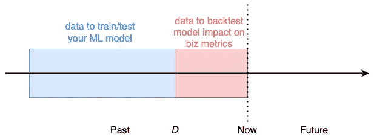
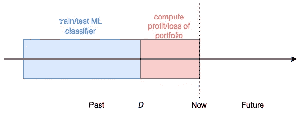
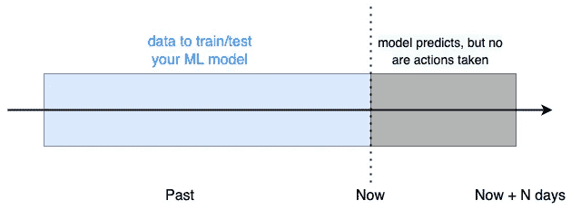
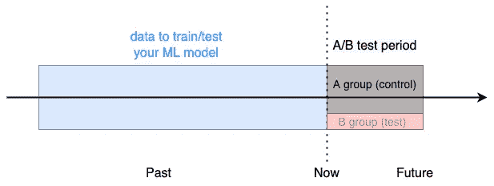

# 如何在现实世界中测试 ML 模型

> 原文：<https://towardsdatascience.com/how-to-test-ml-models-in-the-real-world-e83bf223d340>

## 从标准 ML 度量到生产

墨西哥城圣Á天使(图片作者)

你多久在 Jupyter 笔记本上测试一次 ML 模型，得到好的结果，但是仍然不能说服你的老板立即使用这个模型？

或者，也许你设法说服了她，并把模型投入生产，但你没有看到对业务指标的任何影响？

幸运的是，有更好的方法在现实世界中测试 ML 模型，并让每个人(包括你)相信它们为企业增加了价值。

在本文中，您将了解这些评估方法是什么，如何实现它们，以及何时应该使用每种方法。

# 标准 ML 评估指标的问题

我们，数据科学家和 ML 工程师，在我们的本地开发环境中开发和测试 ML 模型，例如，Jupyter 笔记本。

根据我们试图解决的问题类型，我们使用标准的 ML 评估指标:

*   如果这是一个回归问题，我们打印的东西，如均方差，胡伯损失等。
*   如果是分类问题，我们打印混淆矩阵、准确度、精确度、召回率等。

我们将数据拆分为一个训练集和一个测试集，其中前者用于训练模型(即找到模型参数)，后者用于评估其性能。训练集和测试集是不相交的，以保证我们的评估指标不会有偏差和过于乐观。

问题是，这些数字对我们周围的非 ML 人员几乎没有意义，包括那些最终发号施令并优先考虑哪些软件进入生产的人，包括我们的 ML 模型。

换句话说，这不是测试 ML 模型并让其他人相信它们有效的最佳方式。

## 为什么会这样呢？

因为两个原因:

1.  这些指标不是业务指标，而是抽象的。
2.  不能保证一旦部署，您的 ML 将根据您的标准度量按预期工作，因为在生产中许多事情可能出错。

最终，为了测试 ML 模型，您需要在生产中运行它们并监控它们的性能。然而，遵循将模型直接从 Jupyter 笔记本转移到生产的策略远非最佳。

这个原则适用于任何软件，但是对于 ML 模型尤其重要，因为它们非常脆弱。

接下来的问题是，我们如何安全地走从本地标准度量到生产的道路？

在直接投入生产之前，你至少可以做三件事:

*   回溯测试您的模型
*   影子部署您的模型
*   A/B 测试您的模型

它们代表了对模型进行正确评估的渐进步骤，可以帮助您和团队安全地部署 ML 模型，并为业务增加增值。

让我们用一个例子来看看这些评估方法是如何工作的。

# 方法 1:回溯测试您的 ML 模型

回溯测试是一种评估 ML 模型的廉价方法，可以在开发环境中实现。

为什么便宜？

因为

*   您只使用历史数据，因此您不需要比现有数据更多的数据。
*   您不需要经历一个部署过程，这可能需要时间和多次迭代才能正确完成。

回溯测试背后的想法非常简单:

你选择一个过去的日期 **D** ,作为你用来训练/测试你的 ML 模型的数据和你用来估计假设模型如果被用来采取行动会对业务指标产生的影响的数据之间的截止日期。

回测你的 ML 模型(图片由作者提供)

例如，假设您在一家金融贸易公司担任 ML 开发人员。

该公司管理不同资产(股票、债券、密码、商品……)的投资组合。给定所有这些资产的大量价格数据，你认为你可以建立一个 ML 模型，该模型可以很好地预测价格变化，即每种资产的价格在第二天是上涨还是下跌。

使用这种预测 ML 模型，公司可以调整其投资组合头寸，并最终提高其盈利能力。

你想要建立的模型本质上是一个三类分类器，其中

*   如果第二天的价格高于今天，目标是`***up***`，如果价格保持不变(或非常接近)，目标是`***same***` ，如果价格下跌，目标是`***down***`。
*   这些特征是静态变量，如资产类型，以及行为变量，如过去 N 天的历史波动性、价格趋势和相关性。

您在本地环境中开发模型，并打印标准分类指标，例如准确性。

为了简单起见，让我们假设这 3 个类在您的测试集中完全平衡，这意味着每个类`up`、`same`、`down`都占 33.333%。

而你的测试精度是`34%`。

预测金融市场的变动是极其困难的，如果你总是预测相同的类别，我们的模型精度高于你得到的基准精度。

事情看起来很有希望，我们告诉我们的经理，我们应该马上开始使用这个模型。

我们经理，一个非 ML 的人，在这个行业已经有一段时间了，看着数字问:

*“你确定模型管用吗？它会比目前的策略赚更多的钱吗？”*

这可能不是你所期望的答案，但对你来说很遗憾，这是最常见的答案之一。当你向公司里发号施令的非 ML 人员展示这些指标时，你通常会得到一个否定的答案。因此，你需要更进一步，证明你的模型会产生更多利润。

你可以通过回溯测试做到这一点。

您选择截止日期 *D，*例如，两周前，并且

*   使用到第 d 天的数据训练您的 ML 分类器。
*   如果我们使用模型预测来决定是否买入、持有或卖出我们的每一个头寸，计算从 D 日到今天投资组合的每日损益。

回溯测试你基于 ML 的交易策略(图片由作者提供)

如果你的回溯测试显示负的结果，意味着你的投资组合会产生亏损，你回到起点。相反，如果投资组合在回溯测试期间的利润是正的，你回到你的经理那里:

*“回溯测试显示结果为正，让我们开始使用模型”*

她回答道

*“我们一步一步来。让我们首先部署它，并确保它在我们的生产环境中实际工作。”*

这就引出了我们的下一步评估。

# 方法 2:生产中的影子部署

对于用于训练 ML 模型的数据和在推理时发送给模型的数据之间的微小差异，ML 模型非常脆弱。

例如，如果模型中有一个特征:

*   在你的训练数据中几乎没有缺失值，但是
*   在推理时几乎总是不可用的(因此会丢失)

您的模型在推理时的性能将会下降，并且比您预期的更差。换句话说，标准评估指标和回溯测试结果几乎总是模型真实性能的上限。

因此，您需要更进一步，在模型实际用于生产时对其进行测试。

一种安全的方法是使用**影子部署，**部署模型并用于预测(在这种情况下是资产价格变化)，但其输出不用于采取行动(即重新平衡投资组合)。

模型的影子部署

N 天后，我们查看模型预测，以及如果我们使用模型采取行动，投资组合的利润会如何。

如果假设的业绩是负面的(即亏损)，我们需要回到我们的模型，并试图了解哪里出了问题，例如

*   发送给模型的数据与训练数据中的数据有很大不同吗？比如缺少参数？还是不同的范畴特征？
*   回溯测试时期是一个非常平静和可预测的时期吗，而今天的市场条件非常不同？
*   我们之前运行的回溯测试中有错误吗？
*   …

如果假设利润为正，我们得到另一个信号，表明我们的模型在起作用。所以你周五回去对你的老板说:

*“如果我们一直在使用这个模型的话，这个星期就会产生利润。让我们开始使用它，来吧”。*

她回答说，

*“你没看到我们投资组合本周的表现吗？非常好。你的模型更好还是更差？”*

你花了整整一周的时间专注于现场测试，甚至忘记了检查实际表现。

现在，你看这两个数字:

*   本周的实际投资组合表现
*   你的模型的假设性能

而你的结论是你的数字略高于实际表现。这对你来说是个好消息！所以你跑回去告诉你的经理这个好消息。

她是这样回答的:

*“让我们下周进行一次 A/B 测试，以确保这个 ML 模型比我们现在拥有的更好”*

你现在处于爆发的边缘。所以你会问:

*“您还需要看到什么才能相信这个 ML 模型更好？”*

她说:

*【实际货币】*

你休假一周，休息两天，这是你应得的。

# 方法 3: A/B 测试您的模型

到目前为止，我们所有的评估要么

*   太抽象了，就像`34%`一样精确
*   或者假设。回溯测试和影子部署都没有产生实际的金钱。我们估算了利润。

我们需要比较实际成本和实际成本，以决定我们是否应该使用我们新的基于 ML 的策略。这是测试 ML 模型的最终方法，没有人可以反驳。

为此，我们决定从周一到周五进行一次 **A/B 测试**。

下周一，我们将资产组合随机分为:

*   一个对照组(A ),例如 90%的市场价值
*   测试组(B)，例如剩余 10%的市场价值

控制组 A 将根据公司当前使用的策略进行再平衡。测试组 B 将使用我们基于 ML 的策略重新平衡。

测试我们的 ML 模型(图片由作者提供)

每天我们监控 2 个子投资组合的实际利润，周五我们停止测试。

当我们将基于 ML 的系统的总利润与现状进行比较时，可能会发生 3 种情况。也

*   现状比你的 ML 系统表现好太多了。在这种情况下，你将很难说服你的经理，你的战略应该保持活力。
*   两个子投资组合的表现非常相似，这可能会让你的经理将测试延长一周，看看是否有任何显著差异。
*   或者，你的 ML 系统明显超出了现状。在这种情况下，你有一切优势来说服公司的每个人，你的模式比现状更好，至少应该用于总资产的 10%，如果不是更多的话。在这种情况下，谨慎的做法是逐步增加这种基于 ML 的策略下管理的资产的百分比，每周监控业绩。

经过 3 周漫长的起伏，你终于得到了一个评估指标，可以让每个人(包括你)相信你的模型为企业增加了价值。

# 包装它

下次你发现很难让你周围的人相信你的 ML 模型是有效的，记住你可以用来测试 ML 模型的 3 个策略，从不太有说服力到更有说服力，

*   回溯测试
*   生产中的影子部署
*   A/B 测试

从 ML 开发到生产的道路可能是艰难和令人沮丧的，尤其是在没有可靠的 A/B 测试系统的小公司和初创公司。

测试 ML 模型有时很繁琐，但这是值得的。

相信我，如果你使用真实世界的评估指标来测试 ML 模型，你会成功的。

# 想支持我吗？

你喜欢阅读和学习现实世界中的 ML、数据科学和自由职业吗？

无限制地访问我在 Medium 上发布的所有内容，并支持我的写作。

👉🏽今天使用我的 [**推荐链接**](https://pau-labarta-bajo.medium.com/membership) 成为会员。

<https://pau-labarta-bajo.medium.com/membership>  

👉🏽订阅 [***datamachines* 简讯**](https://datamachines.xyz/subscribe/) **。**

👉🏽关注我 [**中**](https://pau-labarta-bajo.medium.com/) 、 [**推特**](https://twitter.com/paulabartabajo_) 、 [**LinkedIn**](https://www.linkedin.com/in/pau-labarta-bajo-4432074b/) 。

祝你愉快🤗

避寒胜地